# 分析レポートの使用{#processing-a-report}

## 分析レポートの保存 {#saving-an-analysis-report}

適切な権限がある場合は、テンプレートから作成した分析レポートを保存できます。また、Excel、PDF、OpenOffice のいずれかのフォーマットでレポートをエクスポートすることもできます。

レポートを保存するには、「**[!UICONTROL 保存]**」をクリックし、レポートにラベルを設定します。

レポートの履歴を作成して保存時にレポートの値を確認する場合は、「**[!UICONTROL データも保存]**」を選択します。詳しくは、[分析レポートのアーカイブ](#archiving-analysis-reports)を参照してください。

「**[!UICONTROL このレポートの共有]**」オプションを選択すると、他のオペレーターがレポートにアクセスできるようになります。

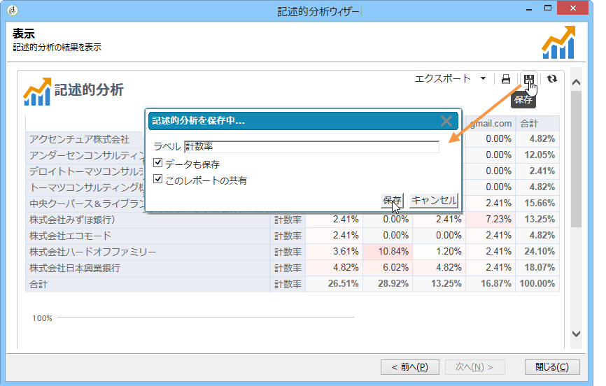

保存後は、このレポートを再利用して、他の分析レポートを生成できます。

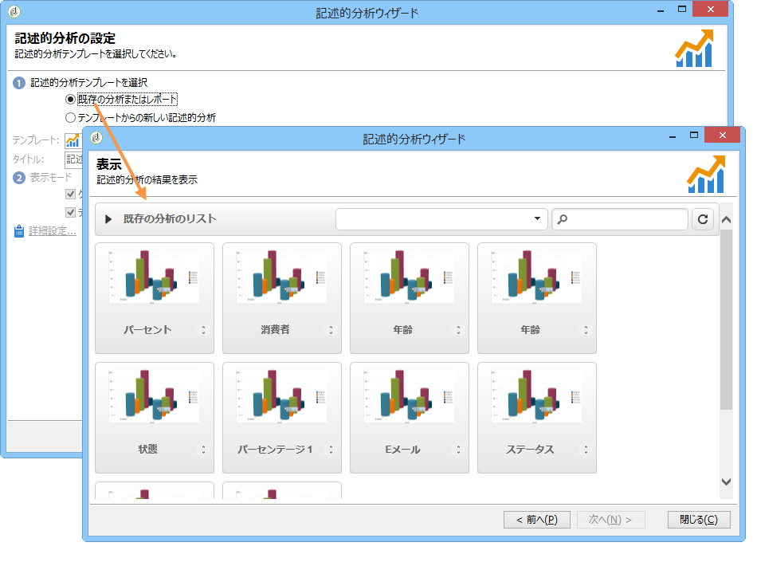

このレポートに変更を加えるには、Adobe Campaign ツリーの&#x200B;**[!UICONTROL 管理／設定／レポート]**&#x200B;ノード（オペレーターに編集権限がある最初の「レポート」タイプフォルダー）を編集します。詳しくは、[記述的分析レポートのレイアウトの設定](#configuring-the-layout-of-a-descriptive-analysis-report)を参照してください。

## 分析レポートの追加設定 {#analysis-report-additional-settings}

記述的分析レポートをいったん保存したら、そのレポートのプロパティを編集したり、追加オプションにアクセスしたりできます。

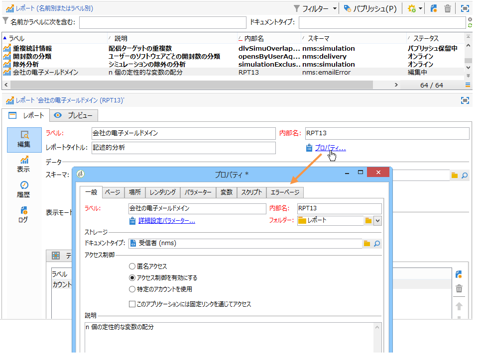

これらのオプションは標準レポートの場合と同じです。詳しくは、[このページ](../../reporting/using/properties-of-the-report.md)を参照してください。

## 記述的分析レポートのレイアウトの設定 {#configuring-the-layout-of-a-descriptive-analysis-report}

記述的分析のグラフやテーブルにおけるデータの表示やレイアウトをパーソナライズできます。すべてのオプションには、Adobe Campaign ツリーを通じて、各レポートの「**[!UICONTROL 編集]**」タブでアクセスします。

### 分析レポートの表示モード {#analysis-report-display-mode}

**[!UICONTROL 定性配分]**&#x200B;テンプレートを使用してレポートを作成する場合、テーブルとグラフの表示モードがデフォルトで選択されています。1 つの表示モードだけでよい場合は、それ以外のボックスのチェックをオフにします。つまり、チェックを入れた表示モードのタブだけが使用可能になります。

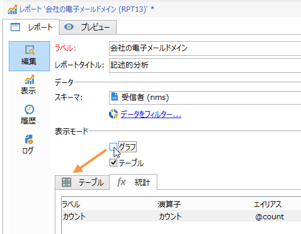

レポートのスキーマを変更するには、「**[!UICONTROL リンクを選択]**」をクリックし、データベースの別のテーブルを選択します。

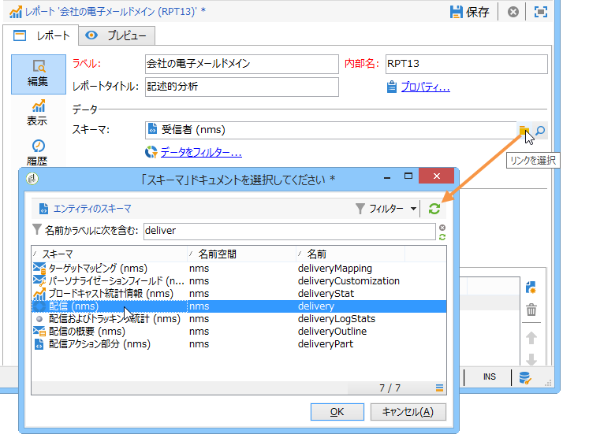

### 分析レポートの表示設定 {#analysis-report-display-settings}

統計や小計の表示／非表示を切り替えたり、統計の方向を選択したりできます。

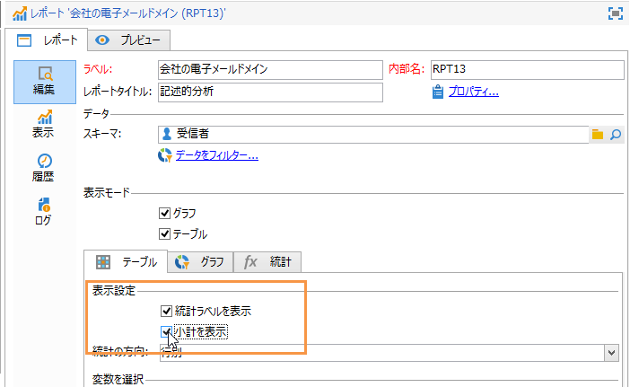

統計を作成するときに、そのラベルをパーソナライズできます。

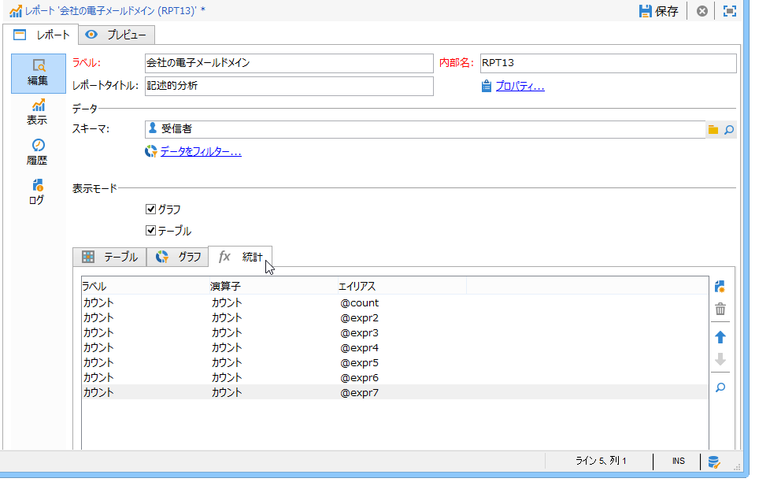

その名前はレポートに表示されます。

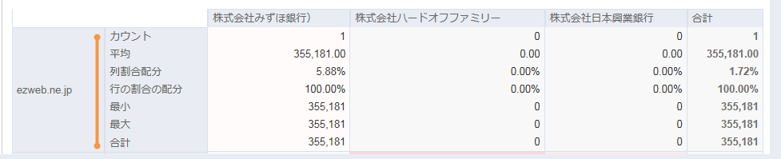

ただし、ラベルと小計の表示オプションのチェックをオフにした場合、それらはレポートには表示されません。テーブルのセルの上にマウスポインターを置くと、統計の名前がツールチップに表示されます。

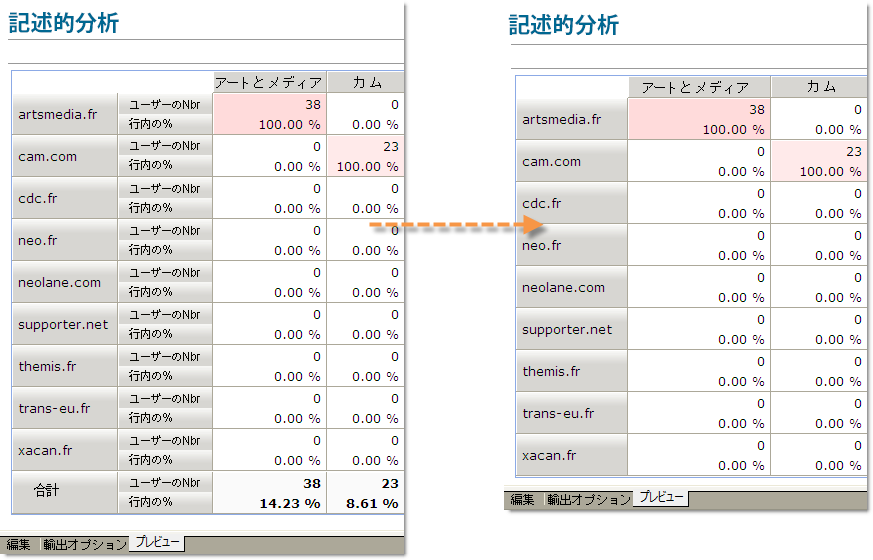

デフォルトでは、統計はオンラインで表示されます。統計の方向を変更するには、ドロップダウンリストから適切なオプションを選択します。

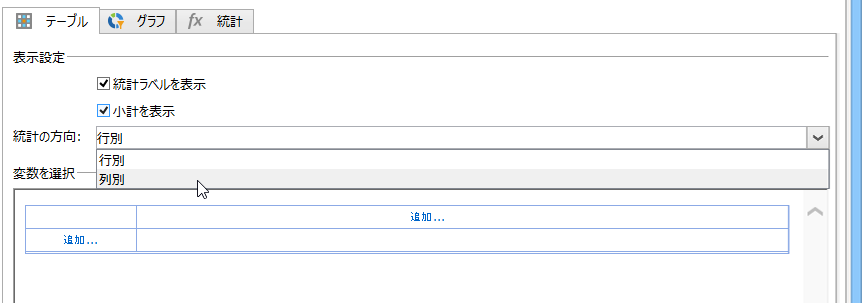

次の例では、統計が各列に表示されています。

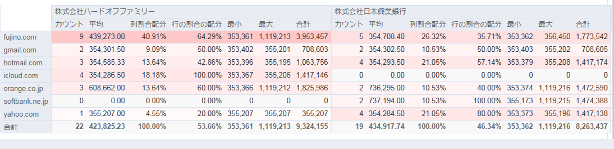

### 分析レポートのデータレイアウト {#analysis-report-data-layout}

記述的分析テーブルで直接データのレイアウトをパーソナライズできます。それには、対象となる変数を右クリックします。以下のうち、使用可能なオプションをドロップダウンメニューから選択します。

* 「**[!UICONTROL ピボット]**」：変数の軸を変更します。
* 「**[!UICONTROL 上]**」／「**[!UICONTROL 下]**」：異なる行の変数を交換します。
* 「**[!UICONTROL 右へ移動]**」／「**[!UICONTROL 左へ移動]**」：異なる列の変数を交換します。
* 「**[!UICONTROL 回転]**」：変数の軸を反転させます。
* 「**[!UICONTROL A から Z の順に並べ替え]**」：変数値を昇順に並べ替えます。
* 「**[!UICONTROL Z から A の順に並べ替え]**」：変数値を降順に並べ替えます。

   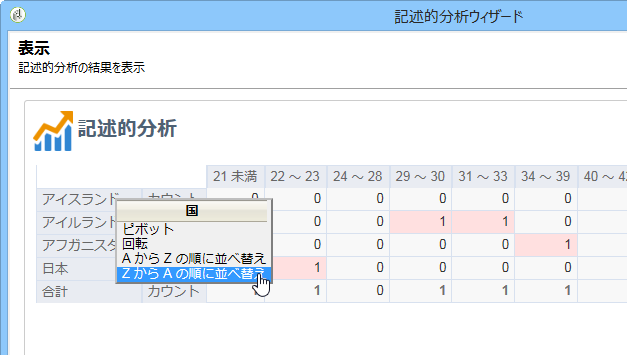

初期の表示に戻すには、表示を更新します。

### 分析レポートのグラフオプション {#analysis-report-chart-options}

グラフにおけるデータの表示をパーソナライズできます。それには、グラフタイプの選択段階で使用可能な「**[!UICONTROL バリエーション]**」リンクをクリックします。

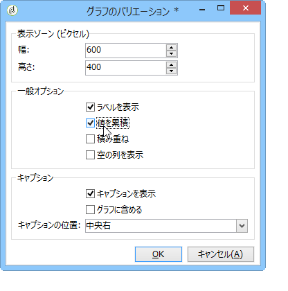

次のオプションを使用できます。

* ウィンドウの上部のセクションでグラフの表示領域を変更できます。
* デフォルトでは、グラフにラベルが表示されます。「**[!UICONTROL ラベルを表示]**」オプションのチェックをオフにすることで、ラベルを非表示にすることができます。
* 「**[!UICONTROL 値を累積]**」オプションでは、系列間で値を合計できます。
* グラフの凡例を表示するかどうかを決めることができます。凡例を非表示にするには、該当するオプションのチェックをオフにします。デフォルトでは、凡例はグラフの外側の右上隅に表示されます。

   表示スペースの節約のために、凡例をグラフの上部に表示することもできます。それには、「**[!UICONTROL グラフに含める]**」オプションを選択します。

   **[!UICONTROL キャプションの位置]**&#x200B;ドロップダウンリストで垂直および水平方向の整列を選択します。

   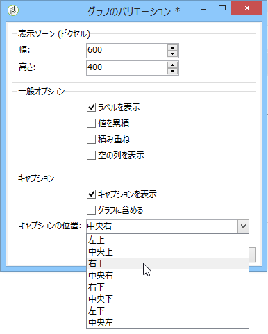

## 分析レポートのエクスポート {#exporting-an-analysis-report}

分析レポートのデータをエクスポートするには、ドロップダウンリストをクリックし、希望する出力フォーマットを選択します。

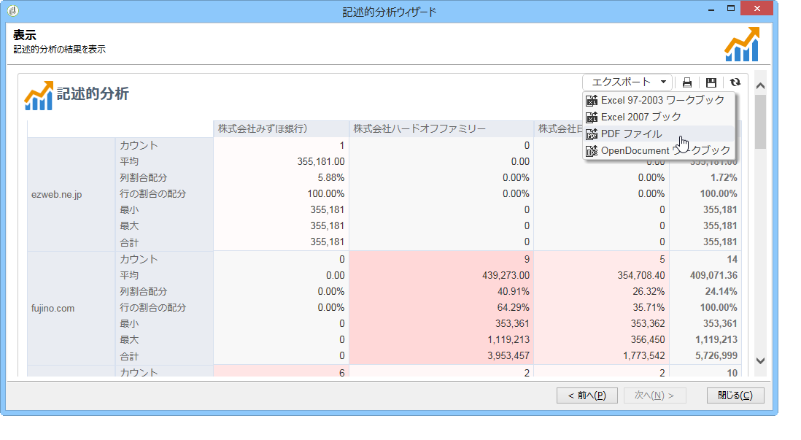

詳しくは、[このページ](../../reporting/using/actions-on-reports.md)を参照してください。

## 既存のレポートおよび分析の再利用 {#re-using-existing-reports-and-analyses}

Adobe Campaign に既に格納されている既存のレポートを使用して、データに関する記述的分析レポートを作成できます。このモードが可能なのは、分析が既に保存されている場合か、レポートが既に作成されて記述的分析ウィザードでアクセスできるように設定されている場合です。

記述的分析の保存方法については、[分析レポートの保存](#saving-an-analysis-report)を参照してください。

記述的分析レポートを作成するには、ワークフロートランジションか&#x200B;**[!UICONTROL ツール／記述的分析]**&#x200B;メニューを使用して、記述的分析ウィザードを実行する必要があります。

1. 「**[!UICONTROL 既存の分析またはレポート]**」を選択し、「**[!UICONTROL 次へ]**」をクリックします。
1. これで、使用可能なレポートのリストにアクセスできます。生成するレポートを選択します。

   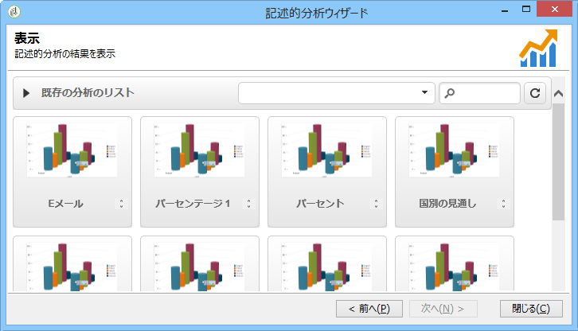

## 分析レポートのアーカイブ {#archiving-analysis-reports}

既存の分析に基づいて記述的分析を作成する場合は、アーカイブを作成してデータを格納したりレポートの結果を比較したりできます。

履歴を作成するには、次の手順に従います。

1. 既存の分析を開くか、新しい記述的分析ウィザードを作成します。
1. レポート表示ページで、次に示すように、ツールバーにある履歴作成ボタンをクリックして、確認します。

   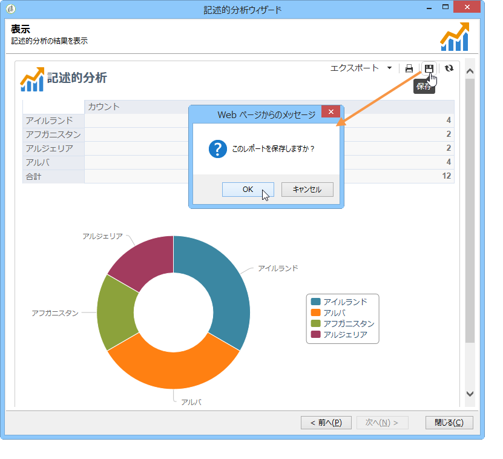

1. アーカイブアクセスボタンを使用すると、以前の分析を表示できます。

   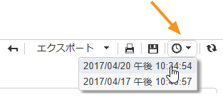

