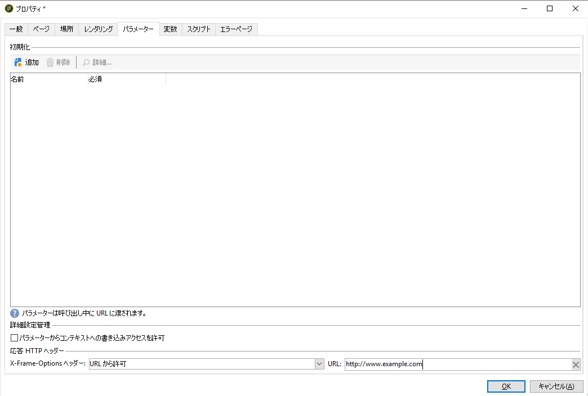

# レポートのプロパティ{#properties-of-the-report}

## 概要 {#overview}

必要に応じて、レポートを完全にパーソナライズしたり、設定したりできます。それには、レポートのプロパティを編集します。レポートのプロパティには、アクティビティ順序チャートの上にある「プロパティ」ボタンをクリックしてアクセスします。

## 全般的なプロパティ {#overall-properties}

「**[!UICONTROL 一般]**」タブでは、レポートのラベルや関係するスキーマを表示または変更できます。これらの要素は、レポートの作成時に入力します。

レポートにアクセスするための URL で使用されるので、「**[!UICONTROL 内部名]**」の変更はお勧めしません。

レポートテンプレートは、レポートの作成時に選択し、後で変更することはできません。

レポートに関係するテーブルを変更するには、「**[!UICONTROL ドキュメントタイプ]**」フィールドの右にある「**[!UICONTROL リンクを選択]**」アイコンをクリックします。選択したテーブルで使用可能なフィールドを確認するには、**[!UICONTROL 拡大鏡]**&#x200B;アイコンをクリックします。

## レポートのアクセシビリティ {#report-accessibility}

レポートには、例えば、Web ブラウザーを使用して、Adobe Campaign コンソール以外からアクセスできます。その場合は、次に示すように、レポートへのアクセス制御の設定が必要になることがあります。

原則としては、次のようになります。

* 「**[!UICONTROL 匿名アクセス]**」オプションでは、レポートへの無制限アクセスが可能になります。ただし、操作はできません。

   デフォルトのレポートオペレーター（「webapp」）の権限がレポート要素の表示に使用されます。

* 「**[!UICONTROL アクセス制御]**」オプションでは、Adobe Campaign オペレーターがログオン後にレポートにアクセスできるようになります。
* 「**[!UICONTROL 特定のアカウントを使用]**」オプションでは、「**[!UICONTROL オペレーター]**」フィールドで選択したオペレーターの権限でレポートを実行できるようになります。

Web フォームプロパティについては、[このページ](../../web/using/about-web-forms.md)を参照してください。

## レポートのローカライゼーションの管理 {#managing-report-localization}

レポートの翻訳先の言語を設定できます。それには、「**[!UICONTROL ローカライゼーション]**」タブをクリックします。

編集言語は、書き込む際に使用する言語です。言語を追加すると、レポート編集ページにサブタブが表示されます。

>[!NOTE]
>
>詳しくは、[この節](../../web/using/translating-a-web-form.md)の該当する節を参照してください。

## HTML レンダリングのパーソナライズ {#personalizing-html-rendering}

「**[!UICONTROL レンダリング]**」タブでは、ページのデータ表示モードをパーソナライズできます。次の項目を選択できます。

* グラフレンダリングエンジン：Adobe Campaign には、グラフレンダリングを生成する 2 つの異なるモードが用意されています。デフォルトのレンダリングエンジンは HTML 5 です。必要に応じて、Flash レンダリングも選択できます。
* レポートでのナビゲーションタイプ（ボタンによるか、リンクによるか）。
* レポート要素のラベルのデフォルト位置。この位置は、要素ごとにオーバーロードできます。
* レポートページの生成に使用されるテンプレートまたはテーマ。

Web フォームプロパティについては、[このページ](../../web/using/about-web-forms.md)を参照してください。

## 追加設定の定義 {#defining-additional-settings}

「**[!UICONTROL パラメーター]**」タブでは、レポートの追加設定を作成できます。これらの設定は、レポートの呼び出し時に URL 内に渡されます。

Web フォームプロパティについては、[このページ](../../web/using/about-web-forms.md)を参照してください。

>[!CAUTION]
>
>セキュリティ上の理由から、これらのパラメーターは慎重に使用する必要があります。

新しい設定を作成するには

1. 「**[!UICONTROL 追加]**」ボタンをクリックし、設定の名前を入力します。

   

1. 必要に応じて、設定が必須かどうかを指定します。
1. 作成する設定の種類を選択します。選択できるのは、**[!UICONTROL フィルター]**&#x200B;または&#x200B;**[!UICONTROL 変数]**&#x200B;です。

   「**[!UICONTROL エンティティをフィルター]**」オプションでは、データベースのフィールドをパラメーターとして使用できます。

   

   データの復元は、エンティティレベル **ctx/recipient/@account** で直接おこなわれます。

   「**[!UICONTROL 変数]**」オプションでは、変数を作成または選択できます。変数は、URL のパラメーターとして渡されるほか、フィルターで使用することもできます。

**[!UICONTROL 応答 HTTP ヘッダー]**&#x200B;を使用すると、iframe を使用してレポートのページを HTML ページに含める際のクリックジャックを防ぐことができます。クリックジャックを避けるために、**[!UICONTROL X-Frame-options ヘッダー]**&#x200B;の動作を選択できます。

* **[!UICONTROL なし]**：レポートには **[!UICONTROL X-Frame-options ヘッダー]**&#x200B;は含まれません。
* **[!UICONTROL 同じ生成源]**：新しいレポートおよび再パブリッシュされたレポートに対してデフォルトで設定されます。ホスト名は、レポートの URL と同じになります。
* **[!UICONTROL 拒否]**：iframe を使用して HTML ページにレポートを含めることはできません。

## 変数の追加 {#adding-variables}

「**[!UICONTROL 変数]**」タブには、レポートに設定されている変数のリストが表示されます。これらの変数は、レポートのコンテキストで公開されており、計算で使用できます。

「**[!UICONTROL 追加]**」ボタンをクリックして、新しい変数を作成します。

変数の定義を表示するには、変数を選択し、「**[!UICONTROL 詳細]**」ボタンをクリックします。

## スクリプトの参照 {#referencing-scripts}

「**[!UICONTROL スクリプト]**」タブでは、レポートページの呼び出し時にクライアント側やサーバー側で実行される JavaScript コードを参照できます。

クライアント側での通常の実行の場合、参照されるスクリプトは JavaScript で記述されている必要があり、ほとんどのブラウザーとの互換性も必要です。詳しくは、[この節](../../web/using/web-forms-answers.md)を参照してください。

## エラーページのパーソナライズ {#personalizing-the-error-page}

「**[!UICONTROL エラーページ]**」タブでは、レポートの表示でエラーが発生した場合に出力されるメッセージを設定できます。

テキストを定義し、レポートのローカライゼーションを管理する特定の識別子にそれらのテキストをリンクできます。詳しくは、[ヘッダーやフッターの追加](../../reporting/using/element-layout.md#adding-a-header-and-a-footer)を参照してください。

