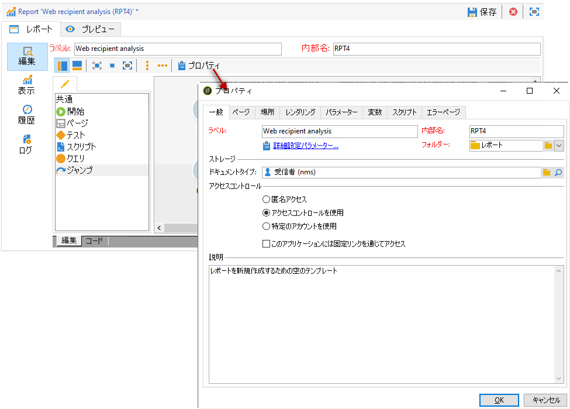
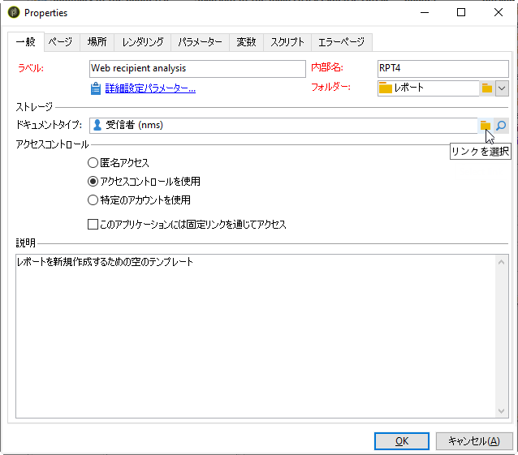
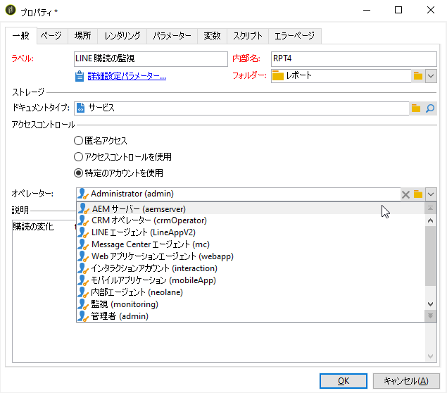
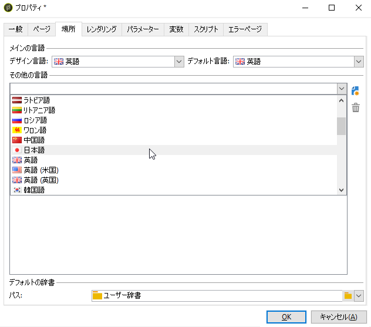
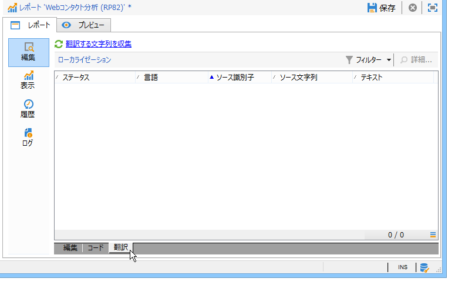
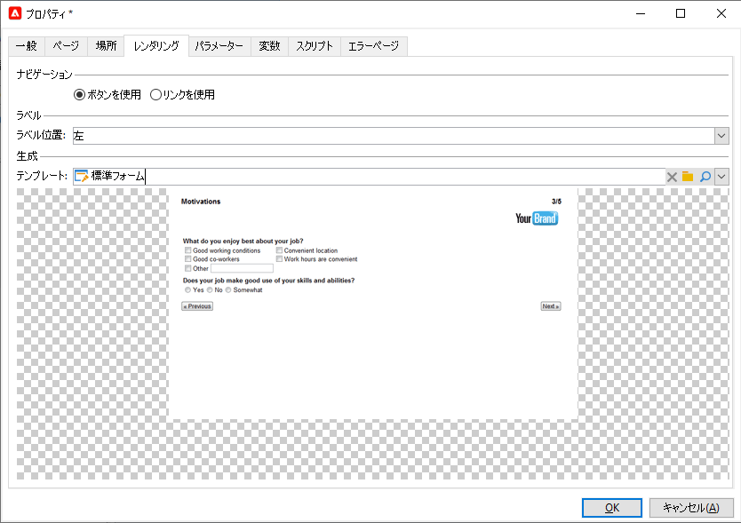
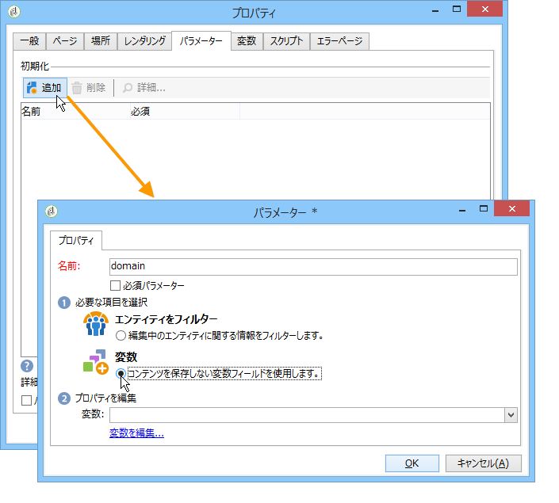
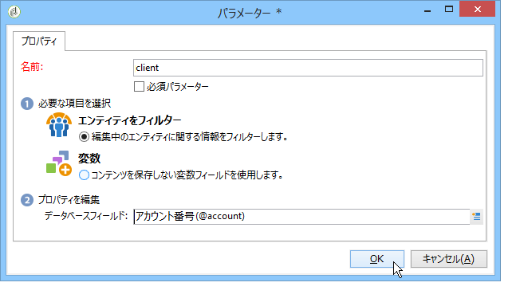
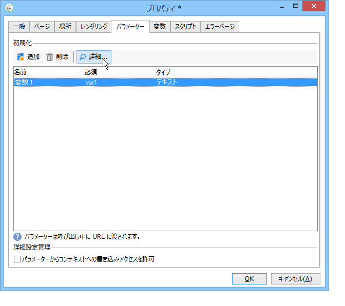
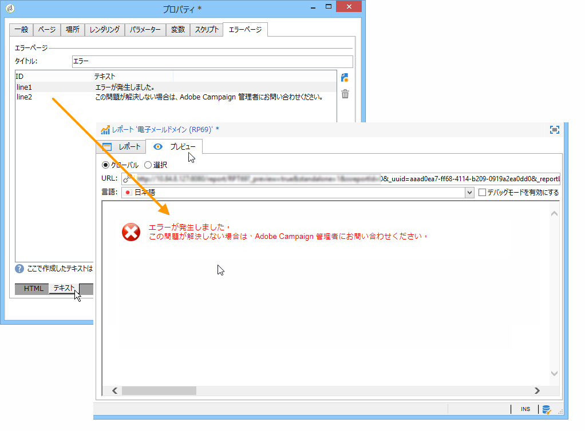

# レポートのプロパティ{#properties-of-the-report}

## 概要 {#overview}

必要に応じて、レポートを完全にパーソナライズしたり、設定したりできます。それには、レポートのプロパティを編集します。レポートのプロパティには、アクティビティ順序チャートの上にある「プロパティ」ボタンをクリックしてアクセスします。

## 全般的なプロパティ {#overall-properties}

The **[!UICONTROL General]** tab lets you view or alter the label and the schema which the report concerns. これらの要素は、レポートの作成時に入力します。

We do not recommend changing the **[!UICONTROL Internal name]** : this is used in the report access URL.

レポートテンプレートは、レポートの作成時に選択し、後で変更することはできません。

To change the table which the report concerns, click the **[!UICONTROL Select link]** icon to the right of the **[!UICONTROL Document type]** field. To view the available fields in the selected table, click the **[!UICONTROL Magnifier]** icon.

## レポートのアクセシビリティ {#report-accessibility}

レポートには、例えば、Web ブラウザーを使用して、Adobe Campaign コンソール以外からアクセスできます。その場合は、次に示すように、レポートへのアクセス制御の設定が必要になることがあります。

原則としては、次のようになります。

* The **[!UICONTROL Anonymous access]** option enables unrestricted access to the report. ただし、操作はできません。

   デフォルトのレポートオペレーター（「webapp」）の権限がレポート要素の表示に使用されます。

* The **[!UICONTROL Access control]** option enables Adobe Campaign operators to access it once they are logged on.
* The **[!UICONTROL Specific account]** option lets you execute the report with the rights of the operator selected in the **[!UICONTROL Operator]** field.

Web フォームプロパティについては、[このページ](../../web/using/about-web-forms.md)を参照してください。

## レポートのローカライゼーションの管理 {#managing-report-localization}

レポートの翻訳先の言語を設定できます。To do this, click the **[!UICONTROL Localization]** tab.

編集言語は、書き込む際に使用する言語です。言語を追加すると、レポート編集ページにサブタブが表示されます。

>[!NOTE]
>
>詳しくは、[この節](../../web/using/translating-a-web-form.md)の該当する節を参照してください。

## HTML レンダリングのパーソナライズ {#personalizing-html-rendering}

In the **[!UICONTROL Rendering]** tab, you can personalize the data display mode for the page. 次の項目を選択できます。

* グラフレンダリングエンジン：Adobe Campaignには、グラフのレンダリングを生成する2つの異なるモードが用意されています。 デフォルトのレンダリングエンジンは HTML 5 です。必要に応じて、Flash レンダリングも選択できます。
* レポートでのナビゲーションタイプ（ボタンによるか、リンクによるか）。
* レポート要素のラベルのデフォルト位置。この位置は、要素ごとにオーバーロードできます。
* レポートページの生成に使用されるテンプレートまたはテーマ。

Web フォームプロパティについては、[このページ](../../web/using/about-web-forms.md)を参照してください。

## 追加設定の定義 {#defining-additional-settings}

The **[!UICONTROL Settings]** tab lets you create additional settings for the report: these settings will be passed into the URL during the call up.

Web フォームプロパティについては、[このページ](../../web/using/about-web-forms.md)を参照してください。

>[!CAUTION]
>
>セキュリティ上の理由から、これらのパラメーターは慎重に使用する必要があります。

新しい設定を作成するには

1. Click the **[!UICONTROL Add]** button and enter the name of the setting.

   

1. 必要に応じて、設定が必須かどうかを指定します。
1. Select the type of setting you want to create: **[!UICONTROL Filter]** or **[!UICONTROL Variable]**.

   The **[!UICONTROL Filter entities]** option lets you use a field of the database as a parameter.

   

   データは、エンティティレベルで直接リカバリされます。 **ctx/recipient/@account**.

   The **[!UICONTROL Variable]** option lets you create or select a variable which will be passed as a parameter of the URL and can be used in the filters.

## 変数の追加 {#adding-variables}

The **[!UICONTROL Variables]** tab contains the list of variables configured in the report. これらの変数は、レポートのコンテキストで公開されており、計算で使用できます。

Click the **[!UICONTROL Add]** button to create a new variable.

To view the definition of a variable, select it and click the **[!UICONTROL Detail...]** button.

## スクリプトの参照 {#referencing-scripts}

The **[!UICONTROL Scripts]** tab lets you reference JavaScript codes that will be executed on the client and/or server side when the report page is called up.

クライアント側での通常の実行の場合、参照されるスクリプトは JavaScript で記述されている必要があり、ほとんどのブラウザーとの互換性も必要です。詳しくは、[この節](../../web/using/web-forms-answers.md)を参照してください。

## エラーページのパーソナライズ {#personalizing-the-error-page}

The **[!UICONTROL Error page]** tab lets you configure the message that will come up in case of an error in the report display.

テキストを定義し、レポートのローカライゼーションを管理する特定の識別子にそれらのテキストをリンクできます。詳しくは、ヘッダーとフッターの [追加を参照してください](../../reporting/using/element-layout.md#adding-a-header-and-a-footer)。

