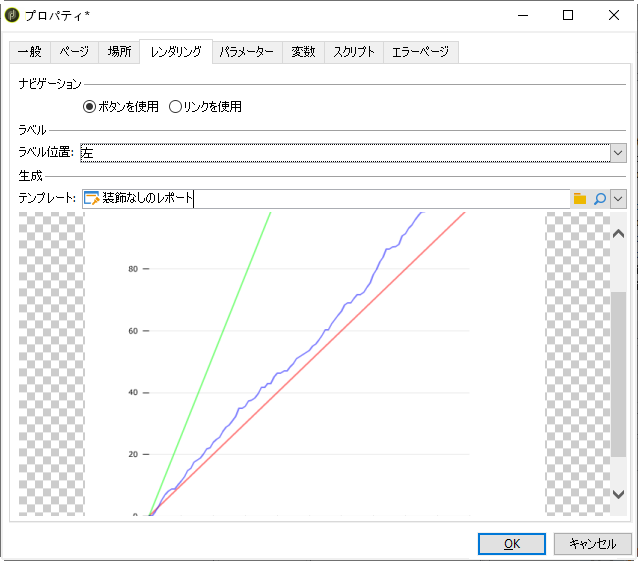

# レポートのプロパティ{#properties-of-the-report}

必要に応じて、レポートを完全にパーソナライズしたり、設定したりできます。それには、レポートのプロパティを編集します。Report properties are accessed via the **[!UICONTROL Properties]** button above the activity sequence chart.

一般的なプロパティについては、以下に説明します。 「 **[!UICONTROL パラメーター]**」、「 **[!UICONTROL スクリプト]** 」 **[!UICONTROL タブおよび「スクリプト]** 」タブで設定される高度な機能については、この節で説明 します。

## Generalプロパティ {#overall-properties}

レポートプロパティの **[!UICONTROL 「一般]** 」タブで、次に示す設定を編集できます。

* レポートのラベルと内部名。 内部 **[!UICONTROL 名は]** 、レポートの最終URLに使用されます。 レポートの作成後は変更しないでください。

* レポートの作成時に、レポート **フォルダ** (Folder)が選択されます。 ベストプラクティスは、カスタムレポートに [組み込まれているレポートと混在しないように、カスタムレポート専用のフォルダーを作成すること](../../reporting/using/about-campaign-built-in-reports.md)。

* レポートの作成時に **ストレージ** が選択されます。 To change the data table of the report, click the **[!UICONTROL Select link]** icon to the right of the **[!UICONTROL Document type]** field.

   

* **アクセス制御** 。 これらの設定については、以下で説明します。

## Controlling access to the report {#report-accessibility}

レポートは、Adobe CampaignコンソールまたはWebブラウザーからアクセスできます。 その場合は、次に示すように、レポートへのアクセス制御の設定が必要になることがあります。

選択できるオプションは次のとおりです。

* **[!UICONTROL 匿名アクセス]**:このオプションを選択すると、レポートへの無制限のアクセスが有効になります。 ただし、操作はできません。

   「webapp」技術演算子の権限は、レポート要素の表示に使用されます。 詳しくは、[この節](../../platform/using/access-management.md#default-operators)を参照してください。

* **[!UICONTROL アクセス制御]**:このオプションを選択すると、Adobe Campaign演算子はログオン後にアクセスできます。
* **[!UICONTROL 特定のアカウント]**:このオプションを使用すると、「 **[!UICONTROL 演算子]** 」フィールドで選択した演算子の権限でレポートを実行できます。

## レポートのローカライゼーションの管理 {#managing-report-localization}

レポートの翻訳先の言語を設定できます。それには、「**[!UICONTROL ローカライゼーション]**」タブをクリックします。

編集言語は、書き込む際に使用する言語です。言語を追加すると、レポート編集ページにサブタブが表示されます。

>[!NOTE]
>
>キャンペーンでのWebページのローカライゼーションについて詳しくは、 [この節を参照してください](../../web/using/translating-a-web-form.md)。

## HTML レンダリングのパーソナライズ {#personalizing-html-rendering}

「**[!UICONTROL レンダリング]**」タブでは、ページのデータ表示モードをパーソナライズできます。次の項目を選択できます。

* グラフレンダリングエンジン：Adobe Campaign には、グラフレンダリングを生成する 2 つの異なるモードが用意されています。デフォルトのレンダリングエンジンは HTML 5 です。必要に応じて、Flash レンダリングも選択できます。
* レポートでのナビゲーションタイプ（ボタンによるか、リンクによるか）。
* レポート要素のラベルのデフォルト位置。この位置は、要素ごとにオーバーロードできます。
* レポートページの生成に使用されるテンプレートまたはテーマ。

## エラーページのパーソナライズ {#personalizing-the-error-page}

「**[!UICONTROL エラーページ]**」タブでは、レポートの表示でエラーが発生した場合に出力されるメッセージを設定できます。

テキストを定義し、レポートのローカライゼーションを管理する特定の識別子にそれらのテキストをリンクできます。詳しくは、[ヘッダーやフッターの追加](../../reporting/using/element-layout.md#adding-a-header-and-a-footer)を参照してください。

