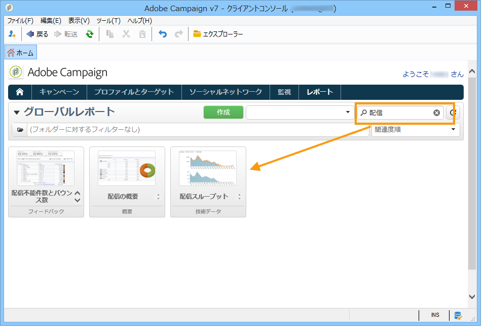

# 配信に関するレポートについて{#reports-on-deliveries}

Adobe Campaign は、お客様のコンソールまたはインターネットブラウザー経由でアクセス可能な、いくつかのタイプのレポートを提供しています。

使用可能なレポートのタイプは次のとおりです。

* プラットフォーム全体のレポートについては、[グローバルレポート](../../reporting/using/global-reports.md)を参照してください。
* 配信レポートについては、[配信レポート](../../reporting/using/delivery-reports.md)を参照してください。
* 累積レポートについては、[累積レポート](../../reporting/using/cumulative-reports.md)を参照してください。

レポートには、クライアントコンソールのホームページ、レポートダッシュボードまたは配信リストからアクセスできます。レポートの表示モードはそのコンテキストに依存します。メインレポートのリストはホームページで使用でき、配信データにすばやくアクセスできます。このリストは、ニーズに合わせて変更可能です。詳しくは、[この節](../../reporting/using/about-reports-creation-in-campaign.md)を参照してください。

レポートダッシュボードで検索フィールドを使用でき、リスト上の目的のレポートにすばやくアクセスできます。

レポートが生成されると、レポートウィンドウの右側にあるツールバーのアイコンを使用して様々なアクションを実行できます。

次の操作をおこなうことができます。

* Excel、PDF または Open Document にレポートをエクスポートする。
* レポートを印刷する。
* レポート履歴を作成する。
* 様々なレポート履歴を表示する。
* レポートのデータを更新する。

>[!NOTE]
>
>一部のレポートではグラフ（曲線、棒、ファネルなど）が使用されています。その値を表示するには、グラフの上にカーソルを移動してください。

これらのオプションについて詳しくは、[この節](../../reporting/using/about-adobe-campaign-reporting-tools.md)を参照してください。
