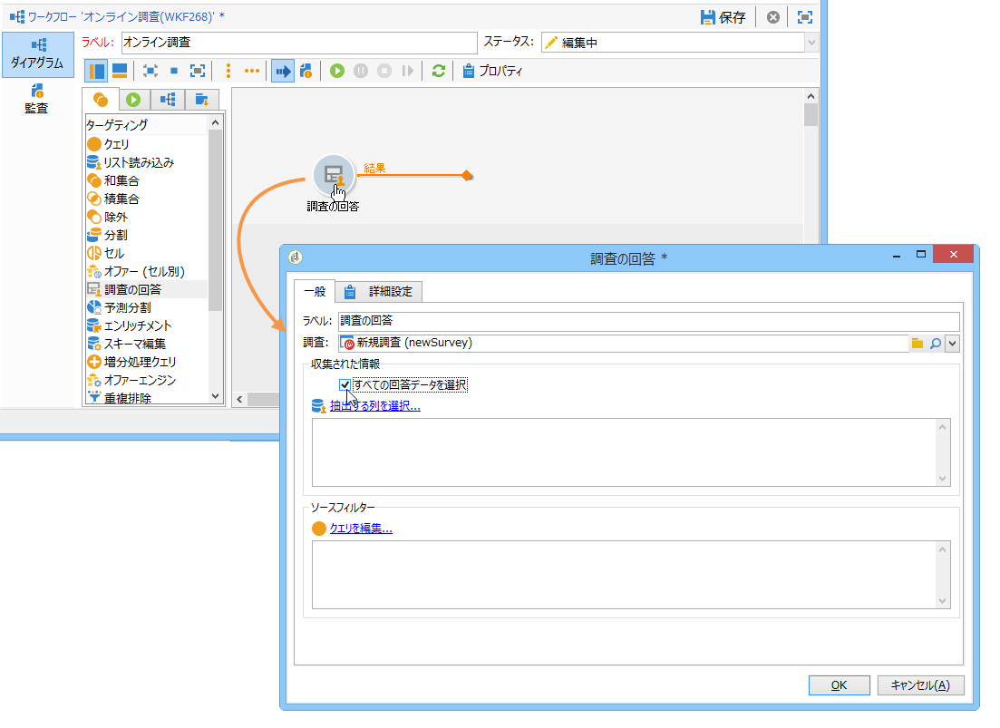
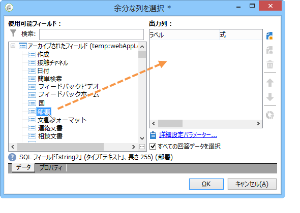
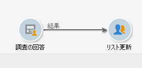
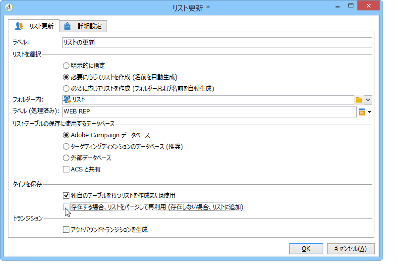
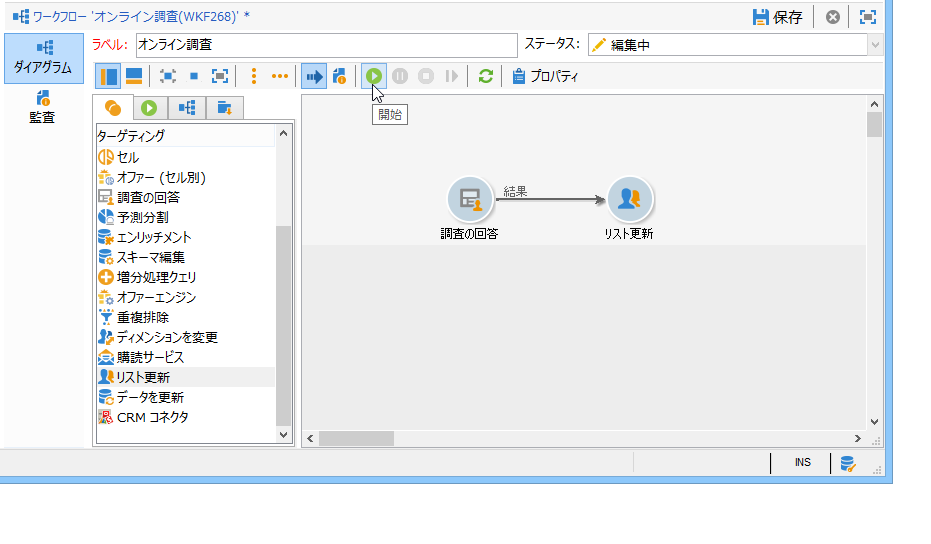
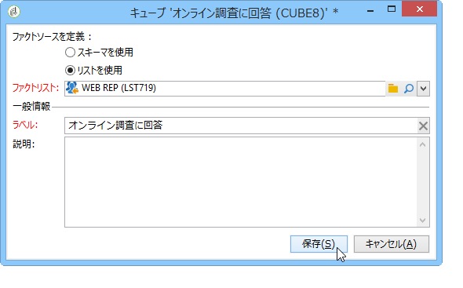
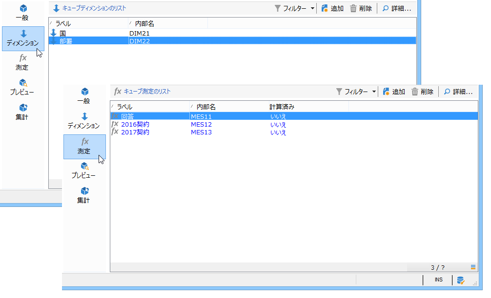
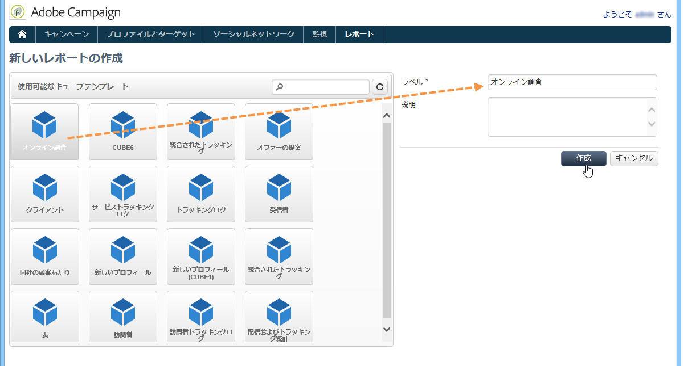
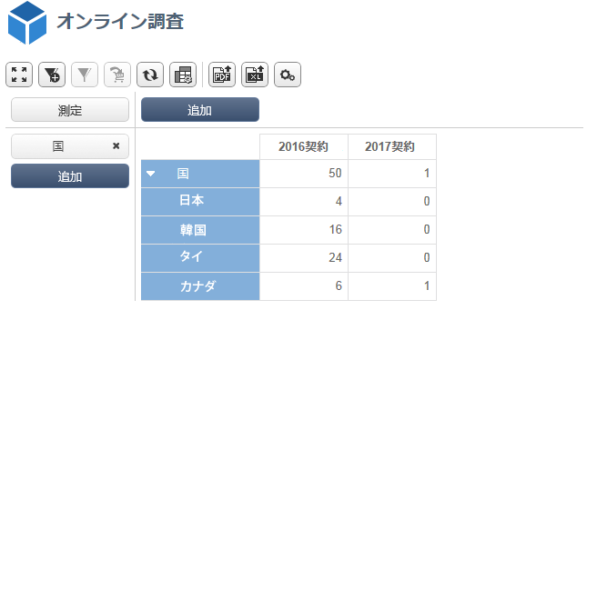

# ユースケース：オンライン調査への回答に関するレポートの表示{#use-case-displaying-report-on-answers-to-an-online-survey}

専用レポートを使用して、Adobe Campaign の調査に対する回答を収集して分析できます。

次の例では、オンライン調査への回答を収集してピボットテーブルに表示します。

次の手順に従います。

1. 調査への回答を復元するワークフローを作成し、回答をリストに格納します。
1. リスト内のデータを使用してキューブを作成します。
1. ピボットテーブルを含んだレポートを作成し、回答の分類を表示します。

このユースケースに取りかかる前に、調査と分析可能な一連の回答にアクセスできる必要があります。

>[!NOTE]
>
>このユースケースは、**調査マネージャー**&#x200B;オプションを入手した場合にのみ、実行できます。使用許諾契約書を確認してください。

## 手順 1 - データ収集および格納ワークフローの作成 {#step-1---creating-the-data-collection-and-storage-workflow}

調査への回答を収集するには、次の手順に従います。

1. ワークフローを作成し、アクティビティを配 **[!UICONTROL Answers to a survey]** 置します。 このアクティビティの使用について詳しくは、[この節](../../web/using/publish--track-and-use-collected-data.md#using-the-collected-data)を参照してください。
1. このアクティビティを編集し、分析対象となる回答が得られた調査を選択します。
1. すべての情報を収 **[!UICONTROL Select all the answer data]** 集するには、このオプションを有効にします。

   

1. 抽出する列を選択します（この例では、アーカイブされたフィールドをすべて選択します）。これらが、回答が含まれるフィールドになります。

   

1. Once the answer collection box is configured, position a **[!UICONTROL List update]** type activity to save the data.

   

   このアクティビティで、更新するリストを指定し、オプションのチェックを解除 **[!UICONTROL Purge and re-use the list if it exists (otherwise add to the list)]** します。既存の表に回答が追加されます。 このオプションを選択すると、キューブ内のリストを参照できるようになります。このリストにリンクされたスキーマは、更新のたびに再生成されることはありません。これにより、このリストを使用しているキューブの整合性が保証されます。

   

1. ワークフローを開始して、その設定を確認します。

   

   指定されたリストが作成され、その中に、調査への回答のスキーマが格納されています。

1. スケジューラーを追加して、毎日の回答収集とリストの更新を自動化します。

   アクティビテ **[!UICONTROL List update]** ィとア **[!UICONTROL Scheduler]** クティビティの詳細については、を参照してください。

## 手順 2 - キューブおよびその測定と指標の作成 {#step-2---creating-the-cube--its-measures-and-its-indicators}

次に、キューブを作成し、その測定を設定できます。これらの測定は、レポートに表示される指標の作成に使用されます。For more on creating and configuring cubes, refer to [About cubes](../../reporting/using/about-cubes.md).

この例では、キューブは、先ほど作成したワークフローから提供されるリスト内のデータに基づいています。

ディメンションと、レポートに表示する測定を定義します。ここでは、回答者の契約日と国名を表示します。

The **[!UICONTROL Preview]** tab lets you control the rendering of the report.

## 手順 3 - レポートの作成とテーブル内のデータレイアウトの設定 {#step-3---creating-the-report-and-configuring-the-data-layout-within-the-table}

次に、このキューブに基づくレポートを作成し、データと情報を処理します。

表示する情報を必要に応じて調整します。

