# 使用例{#use-cases}

## 母集団の分析 {#analyzing-a-population}

次の例では、一連のニュースレターのターゲットとなる母集団を、記述的分析ウィザードを使用して調査できます。

実装手順についてはここで説明しますが、オプションの包括的なリストや説明については、この章の他の節を参照してください。

### 分析する母集団の特定 {#identifying-the-population-to-analyze}

この例では、**ニュースレター**&#x200B;フォルダーに含まれている配信のターゲット母集団を調査します。

それには、関係する配信を選択してから、右クリックして&#x200B;**[!UICONTROL アクション／ターゲットを参照]**&#x200B;を選択します。

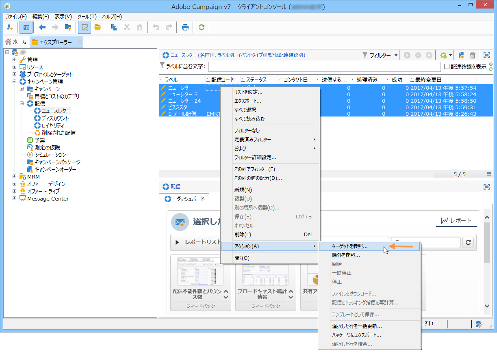

### 分析のタイプの選択 {#selecting-a-type-of-analysis}

ウィザードの最初の段階で、使用する記述的分析テンプレートを選択できます。Adobe Campaign には、デフォルトで、**[!UICONTROL 定性配分]**&#x200B;と&#x200B;**[!UICONTROL 定量配分]**&#x200B;の 2 つのテンプレートが用意されています。詳しくは、[定性配分テンプレートの設定](../../reporting/using/using-the-descriptive-analysis-wizard.md#configuring-the-qualitative-distribution-template)の節を参照してください。様々なレンダリングについて詳しくは、[記述的分析について](../../reporting/using/about-descriptive-analysis.md)で説明しています。

この例では、**[!UICONTROL 定性配分]**&#x200B;テンプレートを選択し、グラフとテーブル（配列）を伴う表示を選択します。レポートに名前（「Descriptive analysis」）を付け、「**[!UICONTROL 次へ]**」をクリックします。

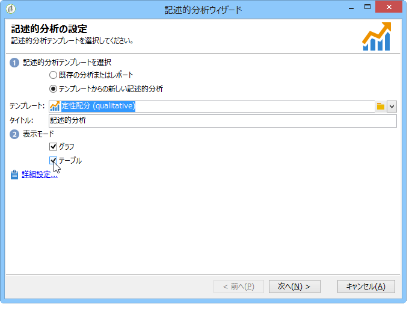

### 表示する変数の選択 {#selecting-the-variables-to-display}

次の段階では、テーブルに表示するデータを選択できます。

「**[!UICONTROL 追加]**」リンクをクリックして、表示するデータが格納されている変数を選択します。ここでは、配信受信者の市区町村を 1 行に表示します。

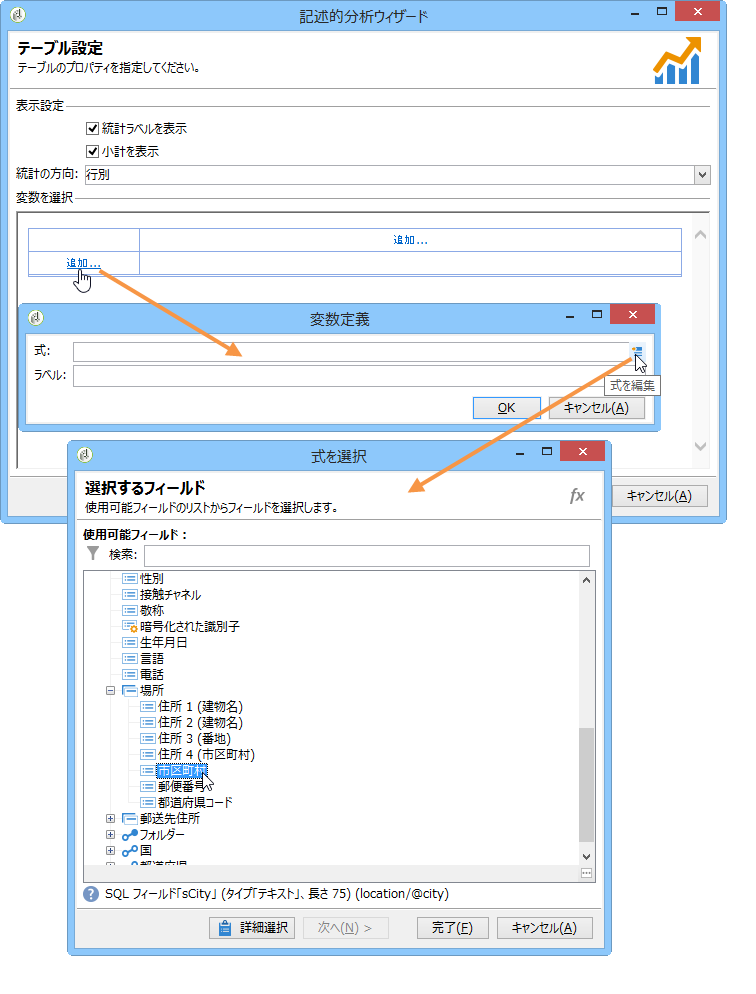

列には、会社ごとの購入回数を表示します。この例では、総数は&#x200B;**購入**&#x200B;フィールドに集計されます。

ここでは、結果のビニングを定義して、表示を明確にします。それには、ビニングの「**[!UICONTROL 手動]**」オプションを選択し、表示するセグメントの計算クラスを設定します。

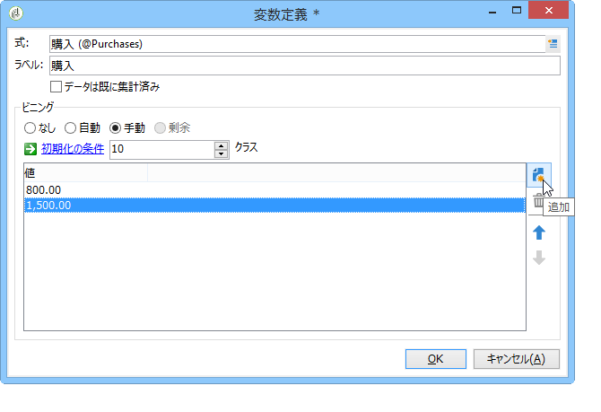

次に、「**[!UICONTROL OK]**」をクリックして、設定を承認します。

行と列を定義したら、ツールバーを使用して、それらの変更、移動または削除をおこなえます。

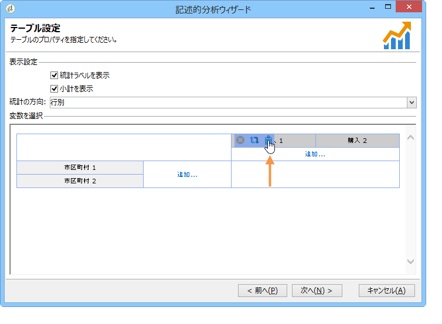

### 表示フォーマットの定義 {#defining-the-display-format}

ウィザードの次の段階では、生成するグラフのタイプを選択できます。

この例では、ヒストグラムを選択します。

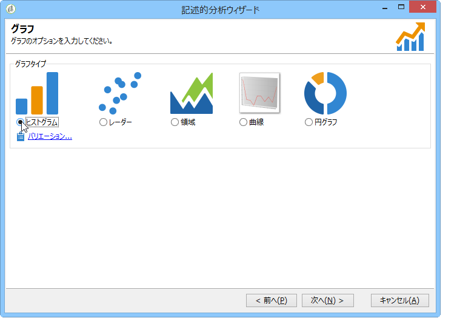

様々なグラフの可能な設定について詳しくは、[分析レポートのグラフオプション](../../reporting/using/processing-a-report.md#analysis-report-chart-options)の節を参照してください。

### 計算する統計の設定 {#configuring-the-statistic-to-calculate}

次に、収集したデータに適用する計算を指定します。デフォルトでは、記述的分析ウィザードは、値の単純カウントを実行します。

このウィンドウでは、計算する統計のリストを定義できます。

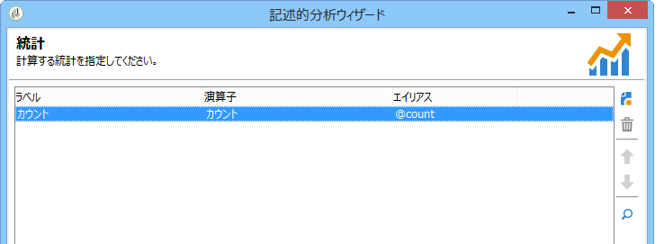

新しい統計を作成するには、**[!UICONTROL 追加]**&#x200B;ボタンをクリックします。詳しくは、[統計の計算](../../reporting/using/using-the-descriptive-analysis-wizard.md#statistics-calculation)を参照してください。

### レポートの表示と使用 {#viewing-and-using-the-report}

ウィザードの最後の段階では、テーブルとグラフが表示されます。

テーブルの上にあるツールバーを使用して、データの格納、エクスポートまたは印刷をおこなえます。詳しくは、[レポートの処理](../../reporting/using/processing-a-report.md)を参照してください。

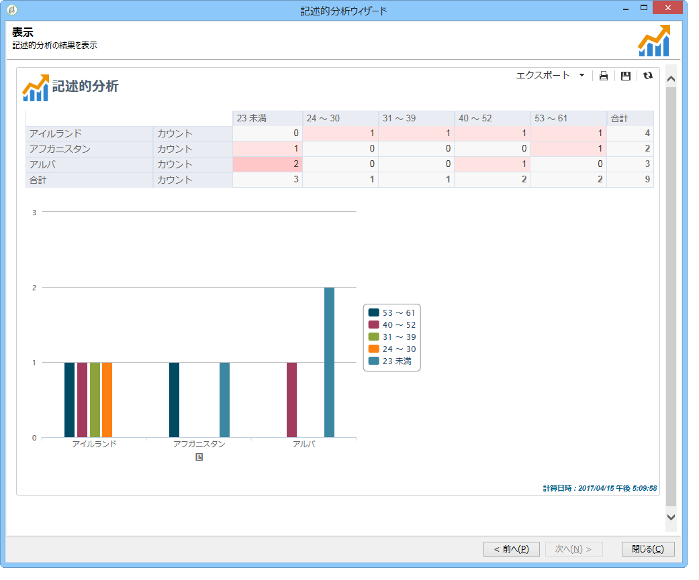

## 定性的データ分析 {#qualitative-data-analysis}

### グラフ表示の例 {#example-of-a-chart-display}

**目的**：見込み客や顧客の所在地に関する分析レポートの生成

1. 記述的分析ウィザードを開き、「**[!UICONTROL グラフ]**」のみを選択します。

   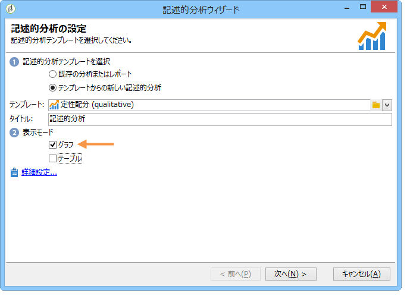

   「**[!UICONTROL 次へ]**」をクリックして、この段階の作業を承認します。

1. 次に、「**[!UICONTROL 2 つの変数]**」オプションを選択して、「**[!UICONTROL 最初の変数 (X 軸)]**」が受信者のステータス（見込み客／顧客）を参照し、2 番目の変数が国を参照していることを指定します。
1. タイプとして「**[!UICONTROL シリンダー]**」を選択します。

   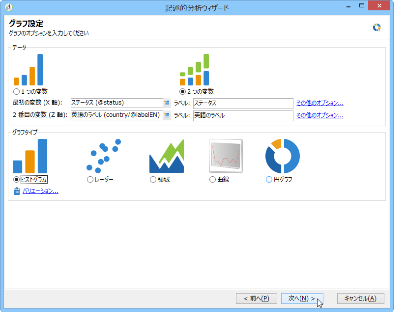

1. 「**[!UICONTROL 次へ]**」をクリックし、デフォルトの単純&#x200B;**[!UICONTROL カウント]**&#x200B;統計をそのまま使用します。
1. 「**[!UICONTROL 次へ]**」をクリックして、レポートを表示します。

   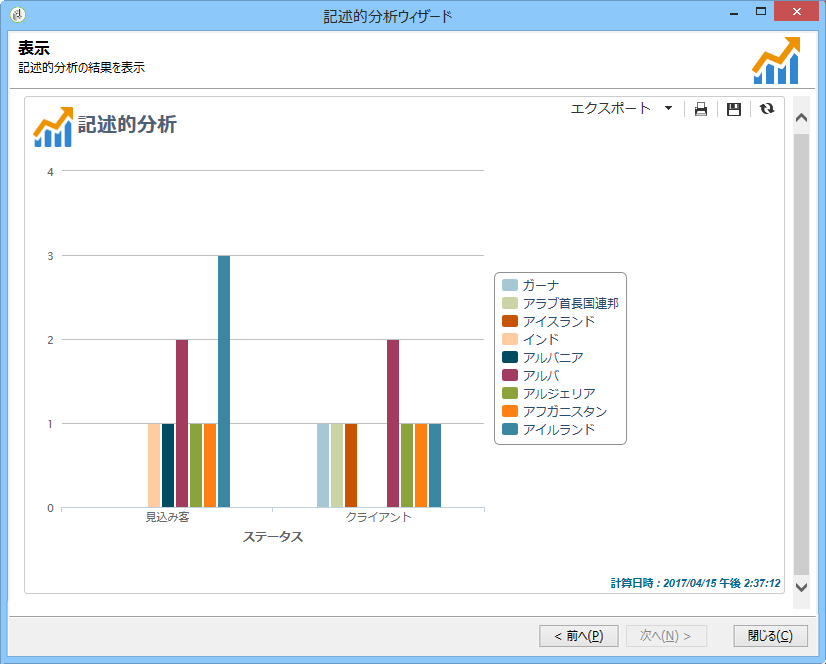

   バーの上にマウスポインターを置くと、この国の顧客または見込み客の正確な数が表示されます。

1. いずれか 1 つの国の表示を凡例を通じて有効または無効にします。

   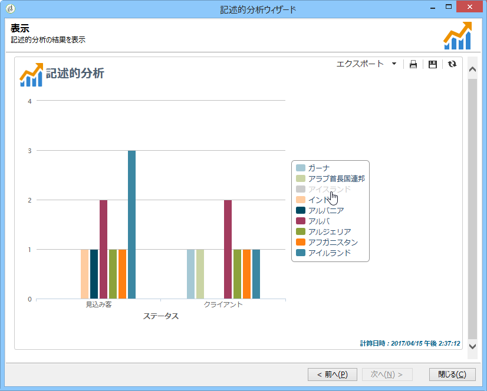

### テーブル表示の例 {#example-of-a-table-display}

**目的**：会社の E メールドメインの分析

1. 記述的分析ウィザードを開き、「**[!UICONTROL 配列]**」表示モードのみを選択します。

   

   「**[!UICONTROL 次へ]**」ボタンをクリックして、この段階の作業を承認します。

1. **[!UICONTROL 会社]**&#x200B;変数を列として、**[!UICONTROL E メールドメイン]**&#x200B;変数を行として、それぞれ選択します。
1. 統計の方向の「**[!UICONTROL 行別]**」オプションをそのまま使用します。統計の計算は **[!UICONTROL E メールドメイン]**&#x200B;変数の右に表示されます。

   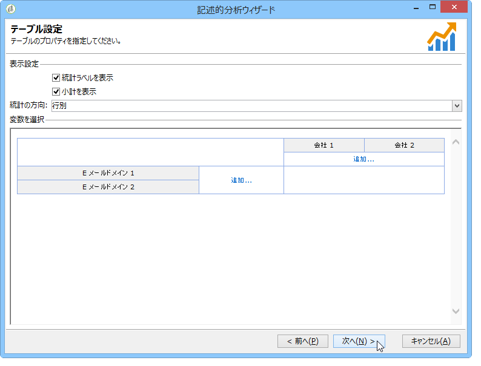

   「**[!UICONTROL 次へ]**」をクリックして、この段階の作業を承認します。

1. 次に、計算する統計を入力します。デフォルトのカウント統計をそのまま使用するほか、新しい統計を作成します。それには、「**[!UICONTROL 追加]**」をクリックし、演算子として「**[!UICONTROL 合計割合配分]**」を選択します。

   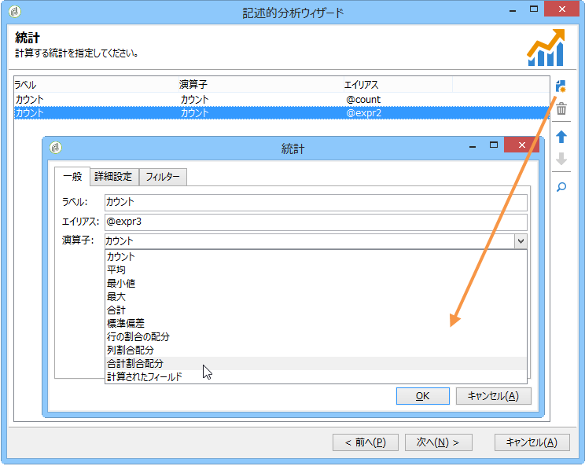

1. レポートが表示される際に空のフィールドがないように、この統計のラベルを入力します。

   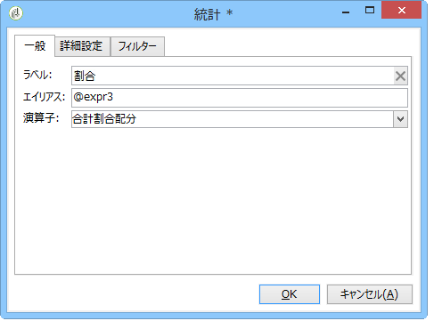

1. 「**[!UICONTROL 次へ]**」をクリックして、レポートを表示します。

   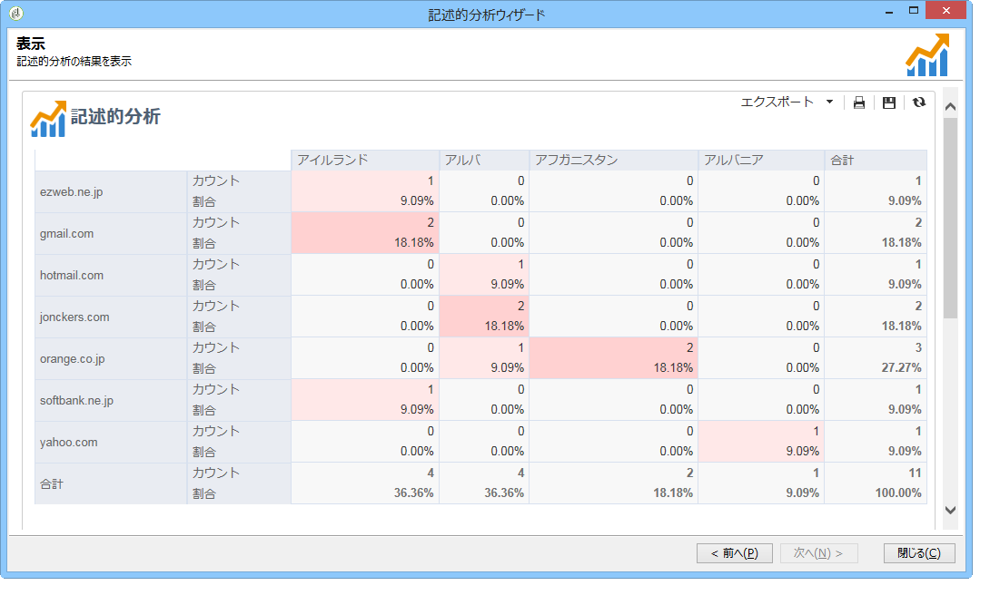

1. 分析レポートが生成されたら、設定を変更せずに、ニーズに合わせて表示を調整できます。例えば、軸を交換できます。それには、ドメイン名を右クリックし、ショートカットメニューから「**[!UICONTROL 回転]**」を選択します。

   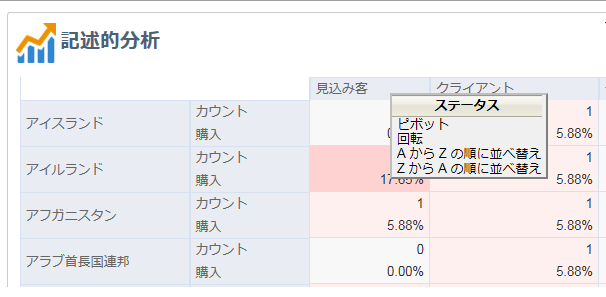

   テーブルには情報が次のように表示されます。

   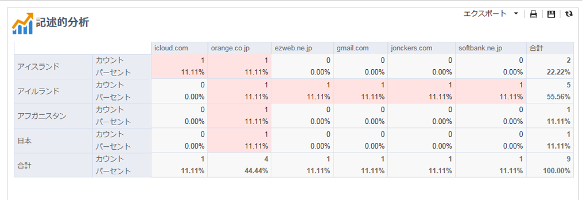

## 定量的データ分析 {#quantitative-data-analysis}

**目的**：受信者の年齢に関する定量的分析レポートの生成

1. 記述的分析ウィザードを開き、ドロップダウンリストから「**[!UICONTROL 定量配分]**」を選択します。

   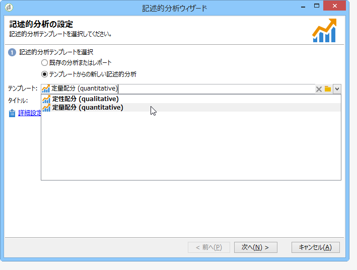

   「**[!UICONTROL 次へ]**」ボタンをクリックして、この段階の作業を承認します。

1. **[!UICONTROL 年齢]**&#x200B;変数を選択し、その変数のラベルを入力します。変数値が整数かどうかを指定した後、「**[!UICONTROL 次へ]**」をクリックします。

   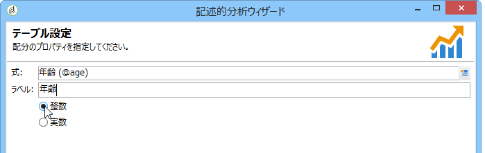

1. 「**[!UICONTROL デシル]**」、「**[!UICONTROL 配分]**」、「**[!UICONTROL 合計]**」の各統計を削除します。これらはここでは必要ありません。

   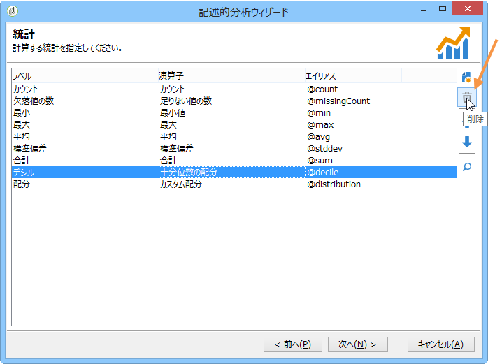

1. 「**[!UICONTROL 次へ]**」をクリックして、レポートを表示します。

   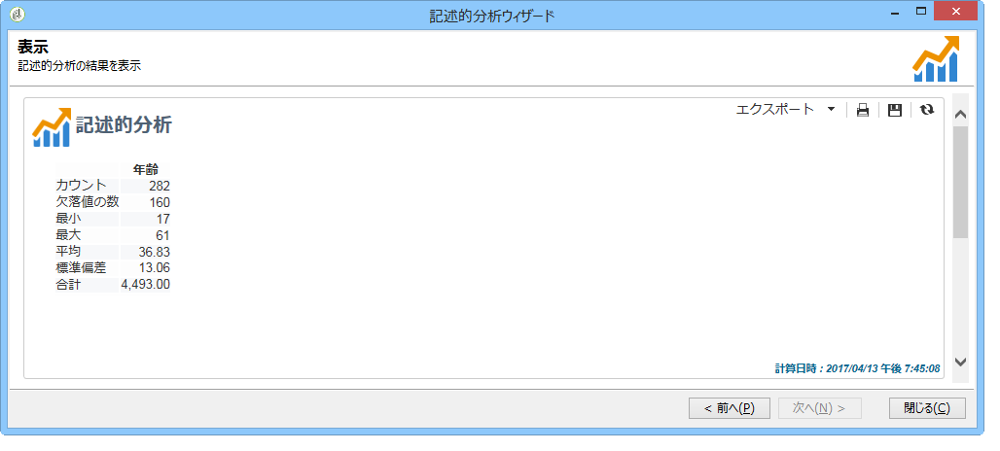

## ワークフローのトランジションターゲットの分析 {#analyzing-a-transition-target-in-a-workflow}

**目的**：ターゲティングワークフローの母集団に関するレポートの生成

1. 目的とするターゲティングワークフローを開きます。
1. 受信者テーブルを指すトランジションを右クリックします。
1. ドロップダウンメニューの「**[!UICONTROL ターゲットを分析]**」を選択して、記述的分析ウィンドウを開きます。

   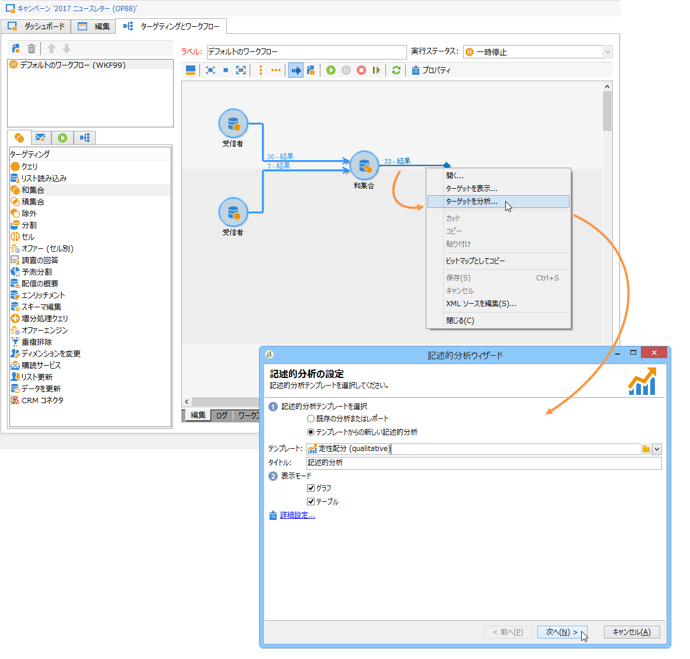

1. ここでは、「**[!UICONTROL 既存の分析またはレポート]**」オプションを選択して、先ほど作成したレポート（[既存のレポートおよび分析の再利用](../../reporting/using/processing-a-report.md#re-using-existing-reports-and-analyses)を参照）を使用することも、新しい記述的分析を作成することもできます。後者の場合は、デフォルトで選択されている「**[!UICONTROL テンプレートからの新しい記述的分析]**」オプションをそのまま使用します。

   残りの設定は、すべての記述的分析と同じです。

### ターゲット分析の推奨事項 {#target-analyze-recommendations}

ワークフローの母集団の分析では、その母集団がトランジションにまだ存在している必要があります。ワークフローが開始されると、母集団に関する結果はトランジションからパージされる可能性があります。分析を実行するには、次のいずれかをおこなうことができます。

* トランジションをその宛先アクティビティから切り離し、ワークフローを開始してアクティブにします。トランジションが点滅し始めたら、ウィザードを通常どおり起動します。

   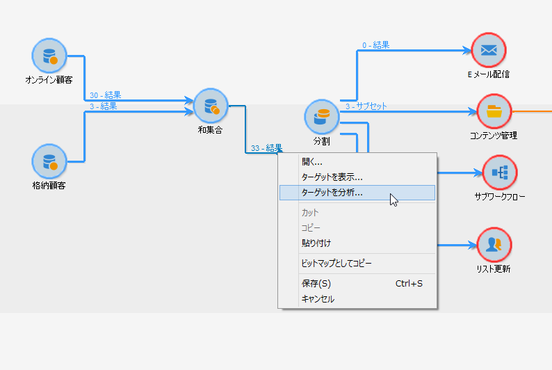

* 「**[!UICONTROL 2 つの実行間の中間母集団の結果を保持]**」オプションを選択することで、ワークフローのプロパティを変更します。これで、たとえワークフローが終了しても、目的とするトランジションの分析を開始できます。

   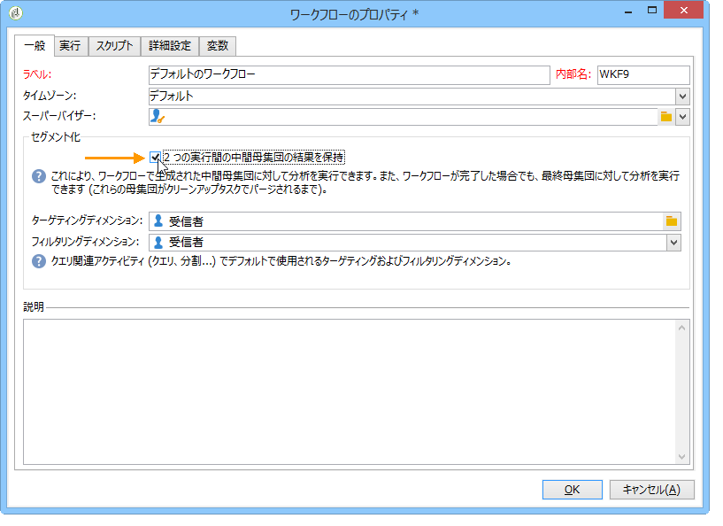

   母集団がトランジションからパージされた場合は、エラーメッセージが表示されて、記述的分析ウィザードを起動する前に、関係するオプションを選択するように求められます。

   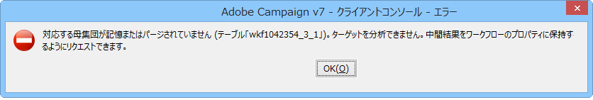

>[!CAUTION]
>
>「**[!UICONTROL 2 つの実行間の中間母集団の結果を保持]**」オプションは開発フェーズでのみ使用すべきもので、本番環境では使用しないでください。\
>中間母集団は、保持期限に達したら、自動的にパージされます。この期限は、ワークフロープロパティの「**[!UICONTROL 実行]**」タブで指定します。

## 受信者トラッキングログの分析 {#analyzing-recipient-tracking-logs}

記述的分析ウィザードでは、他の作業用テーブルに関するレポートを生成できます。つまり、専用レポートを作成することで、配信ログを分析できます。

この例では、ニュースレター受信者の反応率を分析します。

それには、次の手順に従います。

1. **[!UICONTROL ツール／記述的分析]**&#x200B;メニューから記述的分析ウィザードを開き、デフォルトの作業用テーブルを変更します。「**[!UICONTROL 受信者トラッキングログ]**」を選択し、配達確認を対象から除外してニュースレターを対象に含めるフィルターを追加します。

   

   テーブル表示を選択し、「**[!UICONTROL 次へ]**」をクリックします。

1. 次のウィンドウでは、配信に関係する分析であることを指定します。

   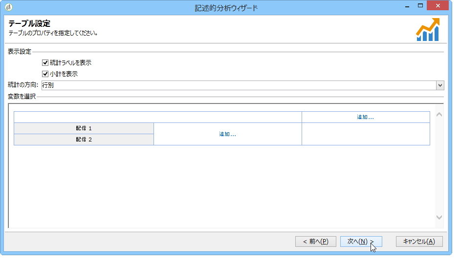

   ここでは、配信ラベルは最初の列に表示されます。

1. デフォルトのカウントを削除し、3 つの統計を作成してテーブルに表示されるよう設定します。

   ここでは、ニュースレターごとに、開封数、クリック数、反応率（パーセンテージ）がテーブルに表示されるようにします。

1. クリック数をカウントするための統計を追加します。「**[!UICONTROL フィルター]**」タブで適切なフィルターを定義します。

   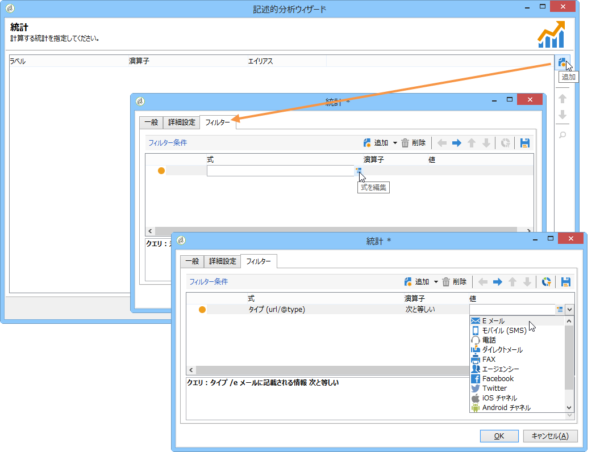

1. 次に、「**[!UICONTROL 一般]**」タブをクリックして、この統計のラベルとエイリアスを変更します。

   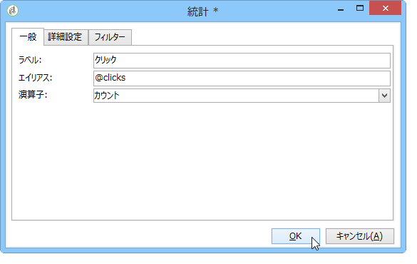

1. 開封数をカウントするための 2 番目の統計を追加します。

   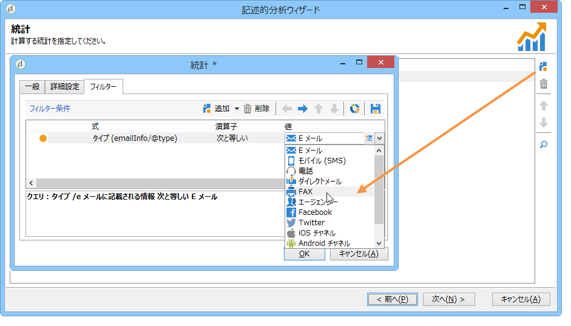

1. 次に、「**[!UICONTROL 一般]**」タブをクリックして、この統計のラベルとエイリアスを変更します。

   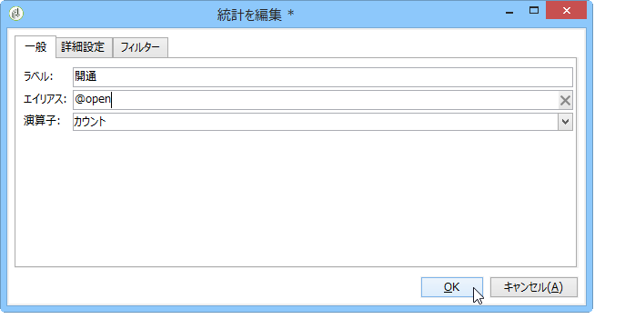

1. 3 番目の統計を追加し、反応率を測定するために「**[!UICONTROL 計算されたフィールド]**」演算子を選択します。

   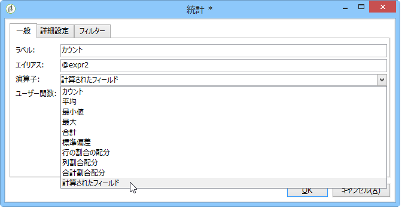

   「**[!UICONTROL ユーザー関数]**」フィールドに移動し、次の式を入力します。

   ```
   @clic / @open * 100
   ```

   次に示すように、この統計のラベルを調整します。

   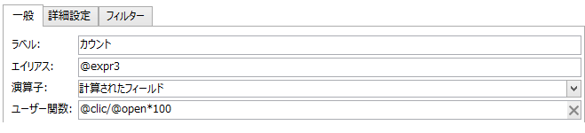

   最後に、値がパーセンテージで表示されるかどうかを指定します。それには、「**[!UICONTROL 詳細設定]**」タブの「**[!UICONTROL デフォルトのフォーマット]**」オプションのチェックをオフにして、「**[!UICONTROL 割合]**」（小数点以下なし）を選択します。

   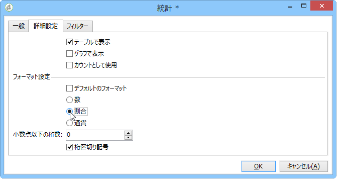

1. 「**[!UICONTROL 次へ]**」をクリックして、レポートを表示します。

   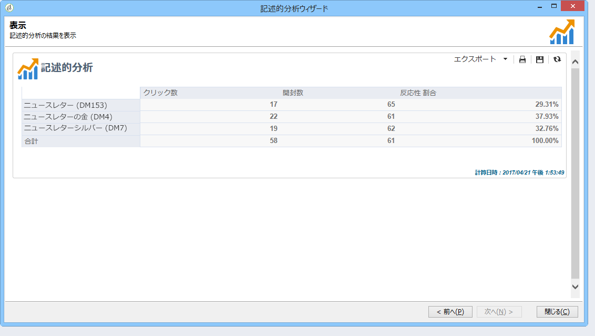

## 配信の除外ログの分析 {#analyzing-delivery-exclusion-logs}

分析が配信に関係する場合は、除外された母集団を分析できます。それには、分析対象となる配信を選択し、右クリックして&#x200B;**[!UICONTROL アクション／除外を参照]**&#x200B;メニューにアクセスします。

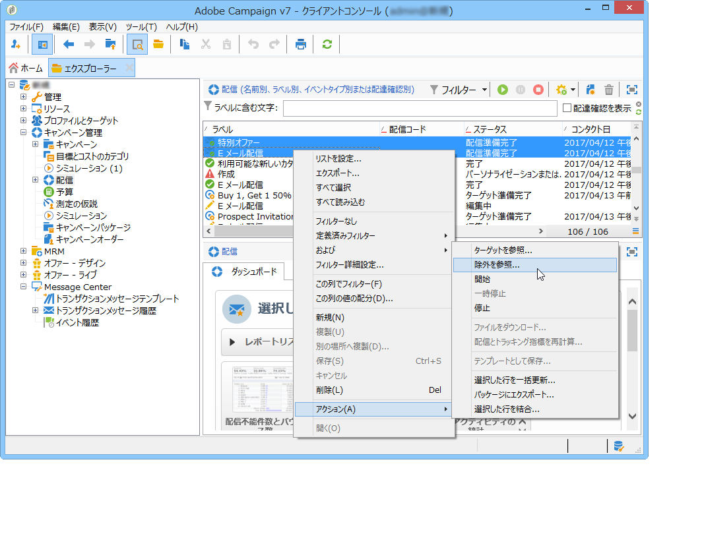

これによって、記述的分析ウィザードが開き、受信者除外ログに関係する分析になります。

例えば、除外されたすべてのアドレスのドメインを表示し、それらを除外の日付で分類するといったことができます。

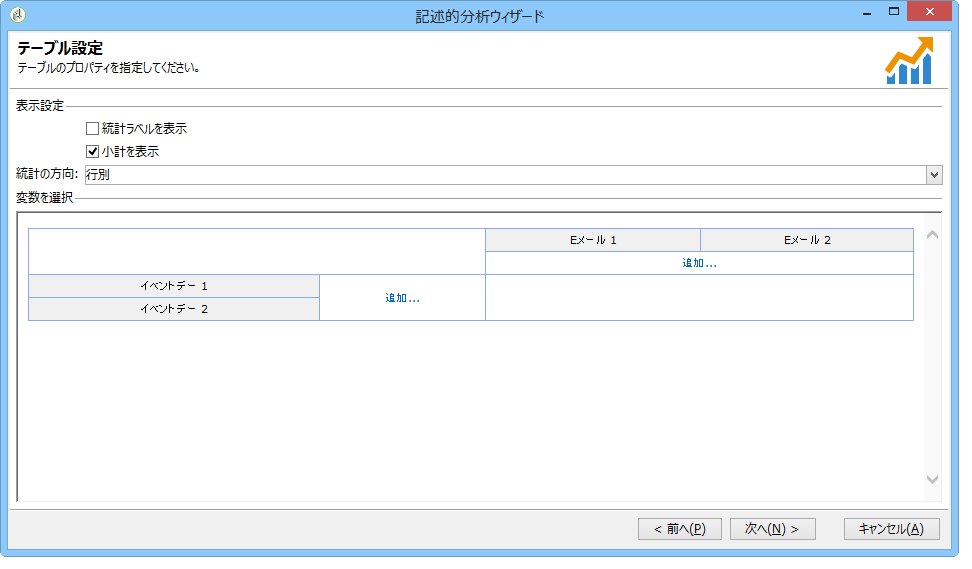

その結果、例えば、次のようなタイプのレポートが生成されます。

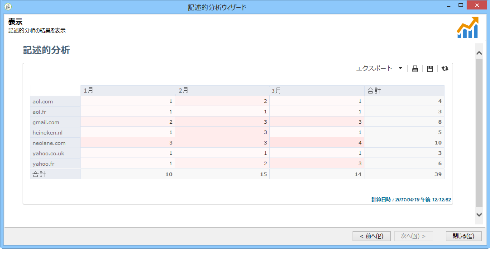

