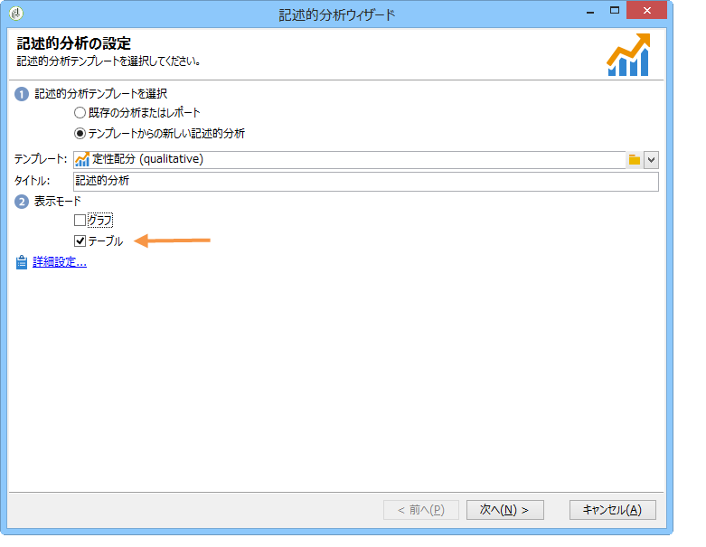
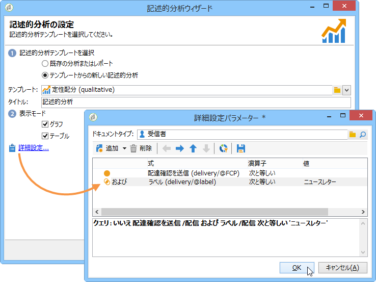

# 使用例{#use-cases}

## 母集団の分析 {#analyzing-a-population}

次の例では、一連のニュースレターのターゲットとなる母集団を、記述的分析ウィザードを使用して調査できます。

実装手順についてはここで説明しますが、オプションの包括的なリストや説明については、この章の他の節を参照してください。

### 分析する母集団の特定 {#identifying-the-population-to-analyze}

この例では、**ニュースレター**&#x200B;フォルダーに含まれている配信のターゲット母集団を調査します。

これを行うには、関連する配信を選択し、右クリックして選択しま **[!UICONTROL Action > Explore the target...]**&#x200B;す。


### 分析のタイプの選択 {#selecting-a-type-of-analysis}

ウィザードの最初の段階で、使用する記述的分析テンプレートを選択できます。By default, Adobe Campaign offers two templates: **[!UICONTROL Qualitative distribution]** and **[!UICONTROL Quantitative distribution]**. For more on this refer to the [Configuring the qualitative distribution template](../../reporting/using/using-the-descriptive-analysis-wizard.md#configuring-the-qualitative-distribution-template) section. 様々なレンダリングは、「分析の説明」セク [ションに表示されます](../../reporting/using/about-descriptive-analysis.md) 。

For this example, select the **[!UICONTROL Qualitative distribution]** template and choose a display with a chart and table (array). Give the report a name (&quot;Descriptive analysis&quot;) and click **[!UICONTROL Next]**.


### 表示する変数の選択 {#selecting-the-variables-to-display}

次の段階では、テーブルに表示するデータを選択できます。

Click the **[!UICONTROL Add...]** link to select the variable that contains the data to display. ここでは、配信受信者の市区町村を 1 行に表示します。


列には、会社ごとの購入回数を表示します。この例では、総数は&#x200B;**購入**&#x200B;フィールドに集計されます。

ここでは、結果のビニングを定義して、表示を明確にします。To do this, select the **[!UICONTROL Manual]** binning option and set the calculation classes for the segments to display:


次に、「**[!UICONTROL Ok]**」をクリックして、設定を承認します。

行と列を定義したら、ツールバーを使用して、それらの変更、移動または削除をおこなえます。


### 表示フォーマットの定義 {#defining-the-display-format}

ウィザードの次の段階では、生成するグラフのタイプを選択できます。

この例では、ヒストグラムを選択します。


様々なグラフィックの可能な設定について詳しくは、分析レポートのグラフ [オプションの節を参照してく](../../reporting/using/processing-a-report.md#analysis-report-chart-options) ださい。

### 計算する統計の設定 {#configuring-the-statistic-to-calculate}

次に、収集したデータに適用する計算を指定します。デフォルトでは、記述的分析ウィザードは、値の単純カウントを実行します。

このウィンドウでは、計算する統計のリストを定義できます。


To create a new statistic, click the **[!UICONTROL Add]** button. For more on this, refer to [Statistics calculation](../../reporting/using/using-the-descriptive-analysis-wizard.md#statistics-calculation).

### レポートの表示と使用 {#viewing-and-using-the-report}

ウィザードの最後の段階では、テーブルとグラフが表示されます。

テーブルの上にあるツールバーを使用して、データの格納、エクスポートまたは印刷をおこなえます。For more on this, refer to [Processing a report](../../reporting/using/processing-a-report.md).


## 定性的データ分析 {#qualitative-data-analysis}

### グラフ表示の例 {#example-of-a-chart-display}

**目的**：見込み客や顧客の所在地に関する分析レポートの生成

1. Open the descriptive analysis wizard and select **[!UICONTROL Chart]** only.

   

   Click **[!UICONTROL Next]** to approve this step.

1. Then select the **[!UICONTROL 2 variables]** option and specify that the **[!UICONTROL First variable (abscissa)]** will refer to recipient status (prospects/customers) and the second variable will refer to the country.
1. Select **[!UICONTROL Cylinders]** as a type.

   

1. をクリッ **[!UICONTROL Next]** クし、デフォルトの統計をそのまま **[!UICONTROL Simple count]** にします。
1. Click **[!UICONTROL Next]** to display the report.

   

   バーの上にマウスポインターを置くと、この国の顧客または見込み客の正確な数が表示されます。

1. いずれか 1 つの国の表示を凡例を通じて有効または無効にします。

   

### テーブル表示の例 {#example-of-a-table-display}

**目的**：会社の E メールドメインの分析

1. Open the descriptive analysis wizard and select the **[!UICONTROL Array]** display mode only.

   

   Click the **[!UICONTROL Next]** button to approve this step.

1. Select the **[!UICONTROL Company]** variable as a column and the **[!UICONTROL Email domain]** variable as a row.
1. Keep the **[!UICONTROL By rows]** option for statistics orientation: the statistic calculation will be displayed to the right of the **[!UICONTROL Email domain]** variable.

   

   Click **[!UICONTROL Next]** to approve this step.

1. 次に、計算する統計を入力します。デフォルトのカウント統計をそのまま使用するほか、新しい統計を作成します。これを行うには、をクリックし、 **[!UICONTROL Add]** 演算子とし **[!UICONTROL Total percentage distribution]** てを選択します。

   

1. レポートが表示される際に空のフィールドがないように、この統計のラベルを入力します。

   

1. Click **[!UICONTROL Next]** to display the report.

   

1. 分析レポートが生成されたら、設定を変更せずに、ニーズに合わせて表示を調整できます。For instance, you can switch the axes: right-click the domain names and select **[!UICONTROL Turn]** on the shortcut menu.

   

   テーブルには情報が次のように表示されます。

   

## 定量的データ分析 {#quantitative-data-analysis}

**目的**：受信者の年齢に関する定量的分析レポートの生成

1. Open the descriptive analysis wizard and select **[!UICONTROL Quantitative distribution]** from the drop-down list.

   

   Click the **[!UICONTROL Next]** button to approve this step.

1. Select the **[!UICONTROL Age]** variable and enter its label. Specify whether or not it&#39;s an integer, then click **[!UICONTROL Next]**.

   

1. 、統計を **[!UICONTROL Deciles]**&#x200B;削 **[!UICONTROL Distribution]** 除し **[!UICONTROL Sum]** ます。ここでは必要ない。

   

1. Click **[!UICONTROL Next]** to display the report.

   

## ワークフローのトランジションターゲットの分析 {#analyzing-a-transition-target-in-a-workflow}

**目的**：ターゲティングワークフローの母集団に関するレポートの生成

1. 目的とするターゲティングワークフローを開きます。
1. 受信者テーブルを指すトランジションを右クリックします。
1. Select **[!UICONTROL Analyze target]** in the drop-down menu to open the descriptive analysis window.

   

1. この時点で、このオプションを選択して、以前に作 **[!UICONTROL Existing analyses and reports]** 成したレポートを使用するか(「既存のレポートおよび分析の再使用 [](../../reporting/using/processing-a-report.md#re-using-existing-reports-and-analyses)」を参照)、新しい説明的分析を作成できます。 これを行うには、デフォルトでこのオプシ **[!UICONTROL New descriptive analysis from a template]** ョンを選択したままにします。

   残りの設定は、すべての記述的分析と同じです。

### ターゲット分析の推奨事項 {#target-analyze-recommendations}

ワークフローの母集団の分析では、その母集団がトランジションにまだ存在している必要があります。ワークフローが開始されると、母集団に関する結果はトランジションからパージされる可能性があります。分析を実行するには、次のいずれかをおこなうことができます。

* トランジションをその宛先アクティビティから切り離し、ワークフローを開始してアクティブにします。トランジションが点滅し始めたら、ウィザードを通常どおり起動します。

   

* オプションを選択して、ワークフローのプロパティを変更 **[!UICONTROL Keep the result of interim populations between two executions]** します。 これで、たとえワークフローが終了しても、目的とするトランジションの分析を開始できます。

   

   母集団がトランジションからパージされた場合は、エラーメッセージが表示されて、記述的分析ウィザードを起動する前に、関係するオプションを選択するように求められます。

   

>[!CAUTION]
>
>このオ **[!UICONTROL Keep the result of interim populations between two executions]** プションは、開発段階でのみ使用する必要がありますが、実稼働環境では使用しないでください。\
>中間母集団は、保持期限に達したら、自動的にパージされます。This deadline is specified in the workflow properties **[!UICONTROL Execution]** tab.

## 受信者トラッキングログの分析 {#analyzing-recipient-tracking-logs}

記述的分析ウィザードでは、他の作業用テーブルに関するレポートを生成できます。つまり、専用レポートを作成することで、配信ログを分析できます。

この例では、ニュースレター受信者の反応率を分析します。

それには、次の手順に従います。

1. Open the descriptive analysis wizard via the **[!UICONTROL Tools > Descriptive analysis]** menu and change the default work table. Select **[!UICONTROL Recipient tracking log]** and add a filter to exclude Proofs and include newsletters.

   

   Select a table display and click **[!UICONTROL Next]**.

1. 次のウィンドウでは、配信に関係する分析であることを指定します。

   

   ここでは、配信ラベルは最初の列に表示されます。

1. デフォルトのカウントを削除し、3 つの統計を作成してテーブルに表示されるよう設定します。

   ここでは、ニュースレターごとに、開封数、クリック数、反応率（パーセンテージ）がテーブルに表示されるようにします。

1. Add a statistic for counting the number of clicks: define the relevant filter in the **[!UICONTROL Filter]** tab.

   

1. Then click the **[!UICONTROL General]** tab to rename the statistics label and alias:

   

1. 開封数をカウントするための 2 番目の統計を追加します。

   

1. Then click the **[!UICONTROL General]** tab to rename the statistics label and its alias:

   

1. Add the third statistic and select the **[!UICONTROL Calculated field]** operator to measure the reactivity rate.

   

   Go to the **[!UICONTROL User function]** field and enter the following formula:

   ```
   @clic / @open * 100
   ```

   次に示すように、この統計のラベルを調整します。

   

   Finally, specify whether the values are shown as a percentage: to do this, uncheck the **[!UICONTROL Default formatting]** option in the **[!UICONTROL Advanced]** tab and select **[!UICONTROL Percentage]** without a decimal point.

   

1. Click **[!UICONTROL Next]** to display the report.

   

## 配信の除外ログの分析 {#analyzing-delivery-exclusion-logs}

分析が配信に関係する場合は、除外された母集団を分析できます。To do this, select the deliveries to be analyzed and right-click to access the **[!UICONTROL Action > Explore exclusions]** menu.


これによって、記述的分析ウィザードが開き、受信者除外ログに関係する分析になります。

例えば、除外されたすべてのアドレスのドメインを表示し、それらを除外の日付で分類するといったことができます。


その結果、例えば、次のようなタイプのレポートが生成されます。


