# キューブを使用したデータ調査{#using-cubes-to-explore-data}

マーケティング分析を使用すると、レポートの作成と、キューブを介したデータベースからのデータの特定および選択が容易になります。これにより、以下が可能になります。

* キューブに基づくレポートの作成。手順について詳しくは、[レポートのデータの調査](#exploring-the-data-in-a-report)を参照してください。
* データベース内のデータの収集とリストへのグループ化（それにより、例えば、ターゲットと配信の特定と作成が可能）。詳しくは、[ターゲット母集団の作成](#building-a-target-population)を参照してください。
* レポートへのピボットテーブルの挿入とピボットテーブルでの既存キューブの参照。詳しくは、[レポートへのピボットテーブルの挿入](#inserting-a-pivot-table-into-a-report)を参照してください。

>[!NOTE]
>
>キューブを作成または変更するには、マーケティング分析が必要です。詳しくは、[キューブについて](../../reporting/using/about-cubes.md)を参照してください。

## レポートのデータの調査 {#exploring-the-data-in-a-report}

### 手順 1 - キューブに基づくレポートの作成 {#step-1---creating-a-report-based-on-a-cube}

To create a report based on a cube, click the **[!UICONTROL Create]** button in the **[!UICONTROL Reports]** universe and select the cube you want to use.

手順について詳しくは、[キューブに基づくレポートの作成 ](../../reporting/using/creating-indicators.md#creating-a-report-based-on-a-cube)を参照してください。

### 手順 2 - 行と列の選択 {#step-2---selecting-lines-and-columns}

デフォルトでは、キューブの最初の 2 つのディメンション（この例では年齢と市区町村）が表示されます。

The **[!UICONTROL Add]** buttons on each axis enable you to add dimensions.

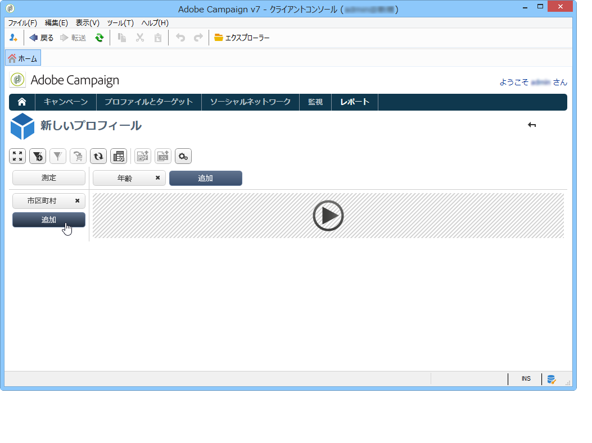

1. テーブルの行と列に表示するディメンションを選択します。それには、次のように使用可能なディメンションをドラッグ＆ドロップします。
1. テーブルに追加するディメンションをリストから選択します。

   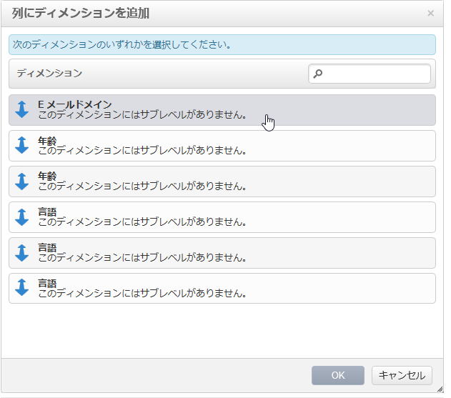

1. 次に、このディメンションのパラメーターを選択します。

   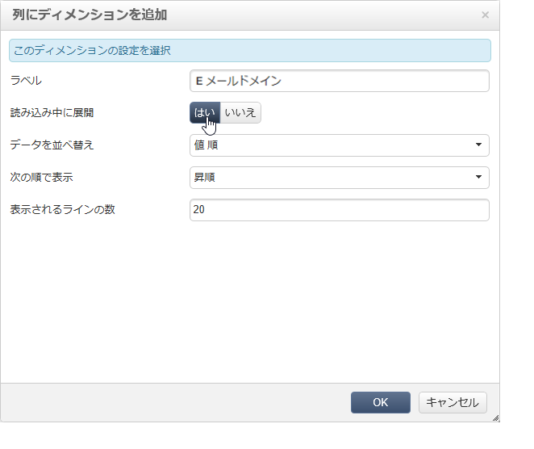

   パラメーターは、選択したディメンションのデータタイプによって異なります。

   例えば、日付の場合は、複数のレベルが使用可能です。詳しくは、[測定の表示](../../reporting/using/concepts-and-methodology.md#displaying-measures)を参照してください。

   この場合は、次のようなオプションが用意されています。

   

   次のいずれかが可能です。

   * 読み込み時のデータの展開：レポートが更新されるたびに値がデフォルトで表示されます（デフォルト設定は「いいえ」）。
   * 行末への合計の表示：データが列に表示される場合は、追加オプションを選択することで、行末に合計を表示できます。テーブルに列が追加されます（デフォルト設定は「はい」）。
   * 並べ替えの適用：列の値を値、ラベル、測定のいずれかで並べ替えることができます（デフォルト設定は「値順」）。
   * 昇順（a～z、0～9）または降順（z～a、9～0）での値の表示。
   * 読み込み時に表示される列の数の変更（デフォルト設定は 200）。

1. 「**[!UICONTROL Ok]**」をクリックして確定します。このディメンションが既存のディメンションに追加されます。

   The yellow banner above the table shows that you have made changes: click the **[!UICONTROL Save]** button to save them.

   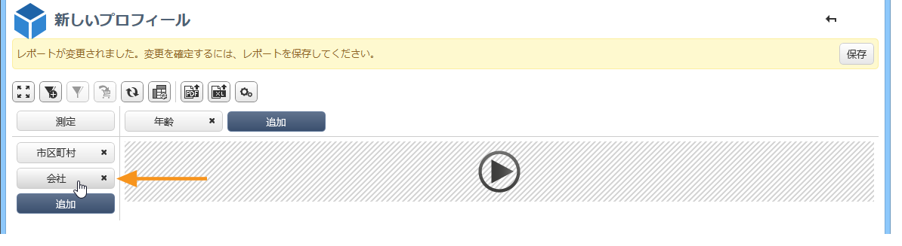

### 手順 3 - 表示する測定の設定 {#step-3---configuring-the-measures-to-display}

行と列を適切に配置したら、表示する測定とそれらの表示モードを指定します。

デフォルトでは、1 つの測定のみ表示されます。測定を追加または設定するには、次の手順に従います。

1. ボタンをクリッ **[!UICONTROL Measures]** クします。

   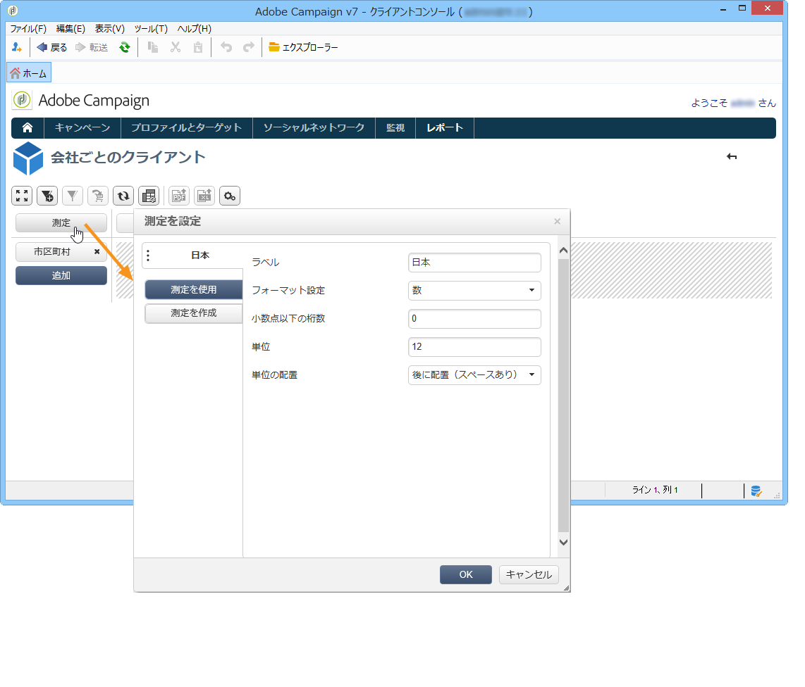

1. The **[!UICONTROL Use a measure]** button enables you to select one of the existing measures.

   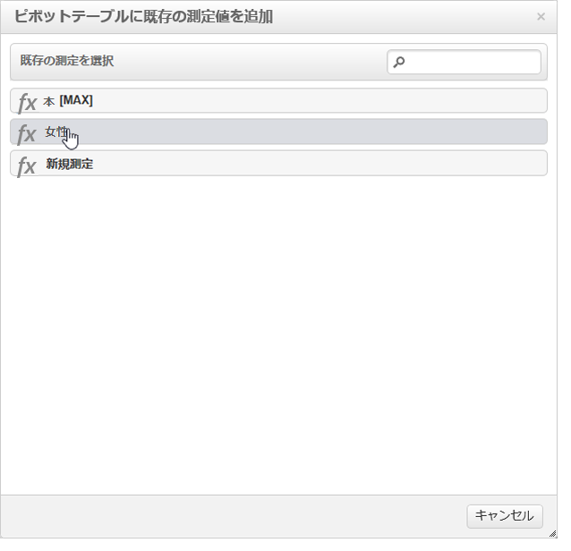

   表示する情報とフォーマット設定のタイプを選択します。オプションのリストは、既に設定されている測定のタイプによって異なります。

   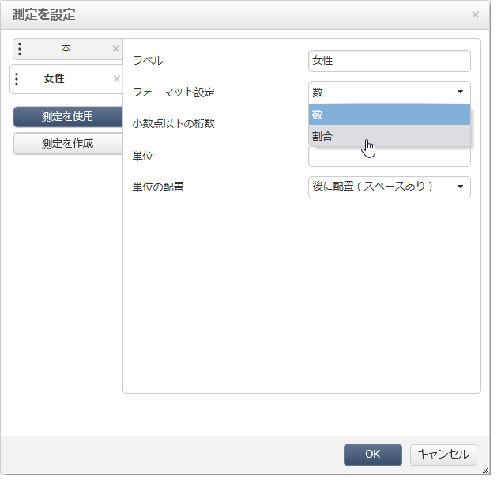

   全体的なメジャー構成は、ヘッダーのアイコンを **[!UICONTROL Edit the configuration of the pivot table]** 使用しても使用できます。

   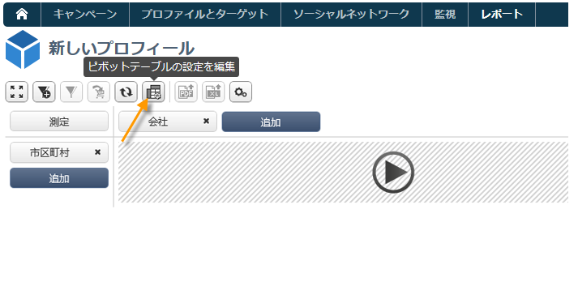

   次に、測定のラベルを表示するかどうかを選択できます。詳しくは、[表示の設定](../../reporting/using/concepts-and-methodology.md#configuring-the-display)を参照してください。

1. 既存の測定を使用して新しい測定を作成できます。これを行うには、をクリックし **[!UICONTROL Create a measure]** て設定します。

   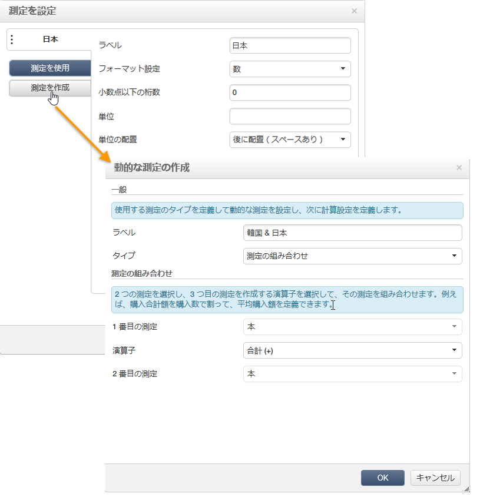

   使用可能な測定のタイプは次のとおりです。

   * 測定の組み合わせ：このタイプの測定の場合は、既存の測定を使用して新しい測定を作成できます。

      使用可能な演算子は、合計、差分、乗算および率です。

   * 割合：このタイプの測定の場合は、指定されたディメンションの測定済みレコードの数を計算できます。ディメンションまたはサブディメンションに基づいて比率を計算できます。
   * バリエーション：このタイプの測定の場合は、あるレベルの値の変化を計算できます。
   * 標準偏差：このタイプの測定の場合は、平均値と比べた各セルグループ内の偏差を計算できます。例えば、既存のすべてのセグメントの購入量を比較できます。
   作成した測定をレポートに追加します。

   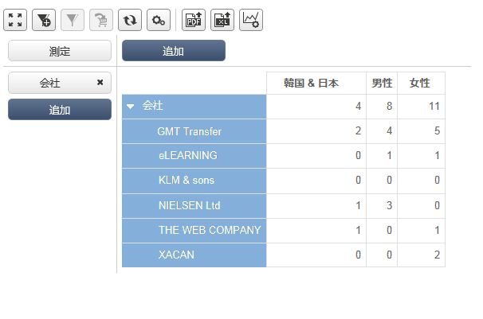

   測定を作成したら、それを編集し、必要に応じて設定を変更できます。To do this, click the **[!UICONTROL Measures]** button, then go to the tab of the measure you want to edit.

   次に、をクリッ **[!UICONTROL Edit the dynamic measure]** クして設定メニューにアクセスします。

## ターゲット母集団の作成 {#building-a-target-population}

キューブを使用して作成したレポートでは、テーブルからデータを収集し、リストに保存できます。

それには、データをカートに追加し、カートの内容を処理します。

母集団をリストにグループ化するには、次の手順に従います。

1. Click the cells that contain the population to be collected to select them, then click the **[!UICONTROL Add to cart]** icon.

   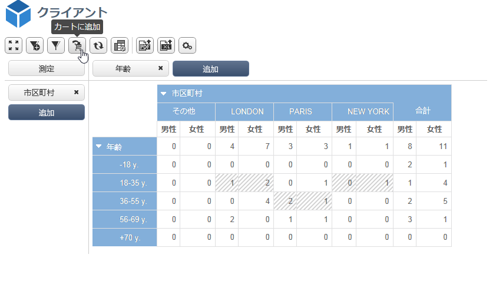

   これを必要な回数だけ繰り返して、様々なプロファイルを収集します。

1. Click the **[!UICONTROL Show cart]** button to view its content before running the export.

   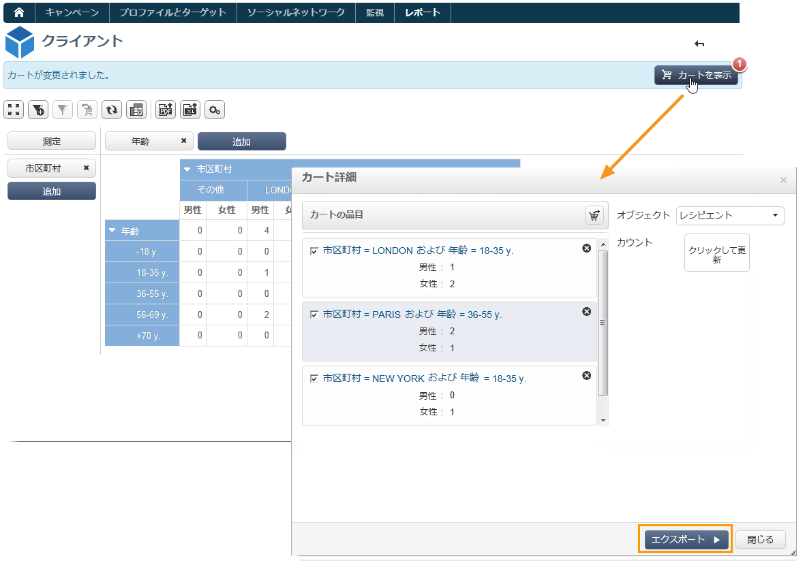

1. The **[!UICONTROL Export]** button lets you group the items in the cart into a list.

   リストの名前と実行するエクスポートのタイプを指定する必要があります。

   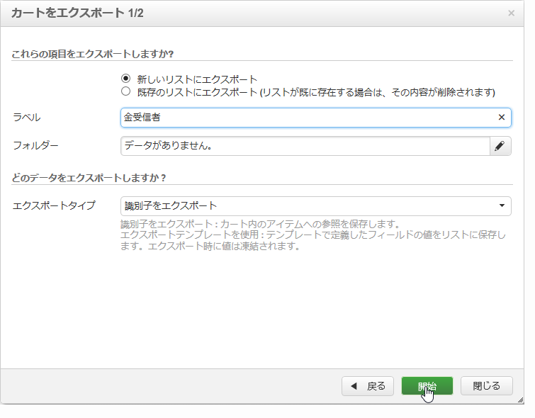

   Click **[!UICONTROL Start]** to run the export.

1. エクスポートが完了したら、実行を確認するメッセージおよび処理されたレコードの数が表示されます。

   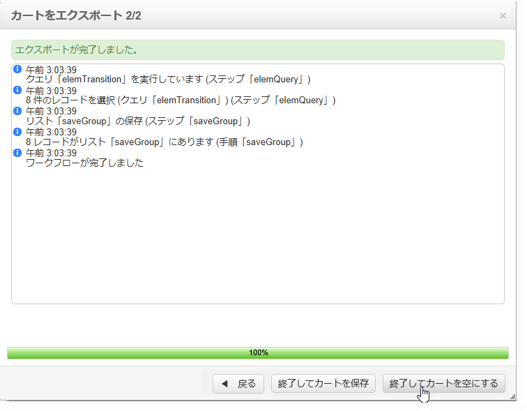

   カートの内容は、保存することも空にすることもできます。

   関連リストは宇宙を通じてアクセスさ **[!UICONTROL Profiles and targets]** れます。

   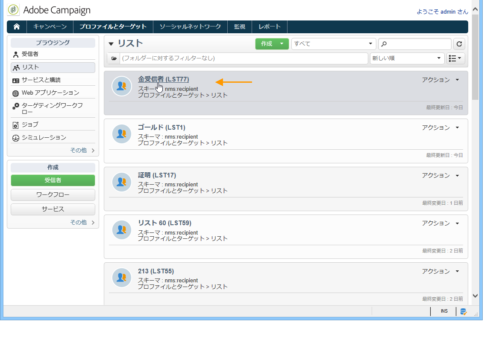

## レポートへのピボットテーブルの挿入 {#inserting-a-pivot-table-into-a-report}

テーブルを作成し、キューブ内のデータを調査するには、次の手順に従います。

1. 1 ページだけのレポートを新しく作成し、そこにピボットテーブルを挿入します。詳しくは、[このページ](../../reporting/using/creating-a-table.md#creating-a-breakdown-or-pivot-table)を参照してください。

   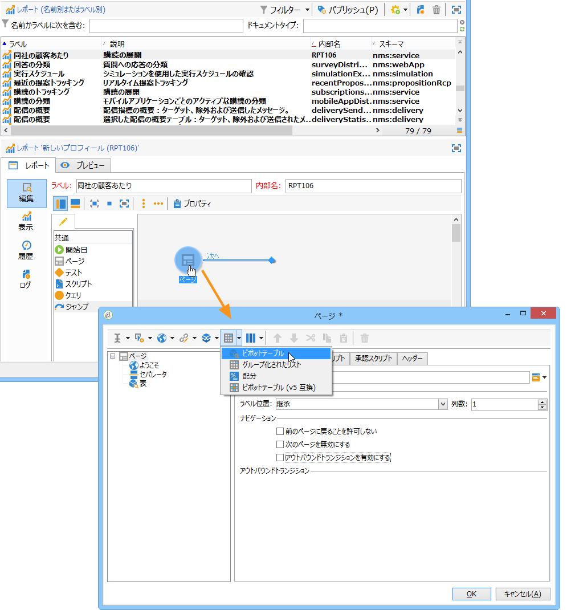

1. In the **[!UICONTROL Data]** tab of the page, select a cube to process the dimensions it contains and display calculated measures.

   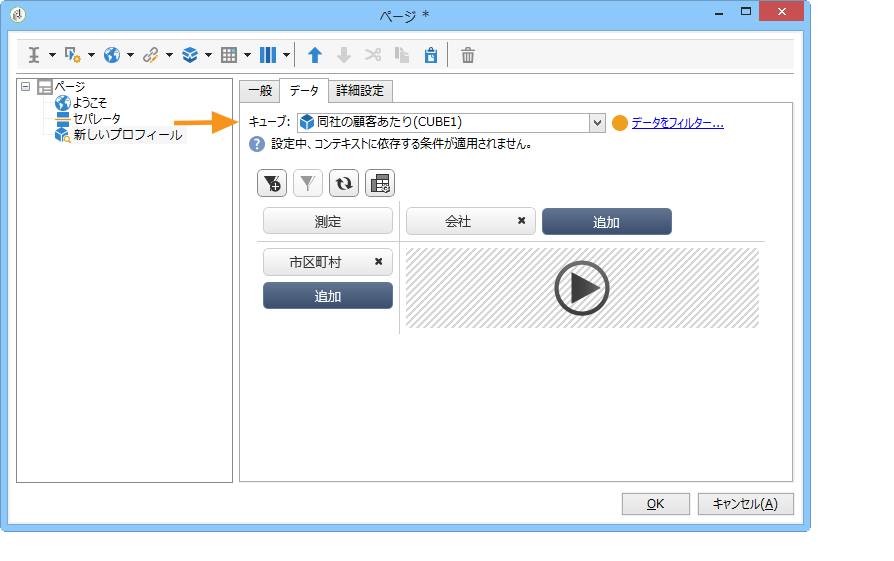

   これで、表示するレポートを作成できます。詳しくは、[手順 2 - 行と列の選択](#step-2---selecting-lines-and-columns)を参照してください。

