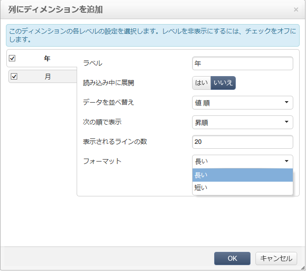

# キューブを使用したデータ調査{#using-cubes-to-explore-data}

マーケティング分析を使用すると、レポートの作成と、キューブを介したデータベースからのデータの特定および選択が容易になります。これにより、以下が可能になります。

* キューブに基づくレポートの作成。手順について詳しくは、[レポートのデータの調査](#exploring-the-data-in-a-report)を参照してください。
* データベース内のデータの収集とリストへのグループ化（それにより、例えば、ターゲットと配信の特定と作成が可能）。詳しくは、[ターゲット母集団の作成](#building-a-target-population)を参照してください。
* レポートへのピボットテーブルの挿入とピボットテーブルでの既存キューブの参照。詳しくは、[レポートへのピボットテーブルの挿入](#inserting-a-pivot-table-into-a-report)を参照してください。

>[!NOTE]
>
>キューブを作成または変更するには、マーケティング分析が必要です。詳しくは、[キューブについて](../../reporting/using/about-cubes.md)を参照してください。

## レポートのデータの調査 {#exploring-the-data-in-a-report}

### 手順 1 - キューブに基づくレポートの作成 {#step-1---creating-a-report-based-on-a-cube}

キューブに基づくレポートを作成するには、**[!UICONTROL レポート]**&#x200B;ウィンドウの「**[!UICONTROL 作成]**」ボタンをクリックし、使用するキューブを選択します。

手順について詳しくは、[キューブに基づくレポートの作成 ](../../reporting/using/creating-indicators.md#creating-a-report-based-on-a-cube)を参照してください。

### 手順 2 - 行と列の選択 {#step-2---selecting-lines-and-columns}

デフォルトでは、キューブの最初の 2 つのディメンション（この例では年齢と市区町村）が表示されます。

各軸の「**[!UICONTROL 追加]**」ボタンを使用すると、ディメンションを追加できます。

1. テーブルの行と列に表示するディメンションを選択します。それには、次のように使用可能なディメンションをドラッグ＆ドロップします。
1. テーブルに追加するディメンションをリストから選択します。

   

1. 次に、このディメンションのパラメーターを選択します。

   

   パラメーターは、選択したディメンションのデータタイプによって異なります。

   例えば、日付の場合は、複数のレベルが使用可能です。詳しくは、[測定の表示](../../reporting/using/concepts-and-methodology.md#displaying-measures)を参照してください。

   この場合は、次のようなオプションが用意されています。

   

   次のいずれかが可能です。

   * 読み込み時のデータの展開：レポートが更新されるたびに値がデフォルトで表示されます（デフォルト設定は「いいえ」）。
   * 行末への合計の表示：データが列に表示される場合は、追加オプションを選択することで、行末に合計を表示できます。テーブルに列が追加されます（デフォルト設定は「はい」）。
   * 並べ替えの適用：列の値を値、ラベル、測定のいずれかで並べ替えることができます（デフォルト設定は「値順」）。
   * 昇順（a～z、0～9）または降順（z～a、9～0）での値の表示。
   * 読み込み時に表示される列の数の変更（デフォルト設定は 200）。

1. 「**[!UICONTROL OK]**」をクリックして確定します。このディメンションが既存のディメンションに追加されます。

   テーブルの上の黄色いバナーは、変更がおこなわれたことを示しています。「**[!UICONTROL 保存]**」ボタンをクリックして、変更内容を保存します。

   

### 手順 3 - 表示する測定の設定 {#step-3---configuring-the-measures-to-display}

行と列を適切に配置したら、表示する測定とそれらの表示モードを指定します。

デフォルトでは、1 つの測定のみ表示されます。測定を追加または設定するには、次の手順に従います。

1. 「**[!UICONTROL 測定]**」ボタンをクリックします。

   

1. 「**[!UICONTROL 測定を使用]**」ボタンをクリックすると、既存の測定のいずれかを選択できます。

   

   表示する情報とフォーマット設定のタイプを選択します。オプションのリストは、既に設定されている測定のタイプによって異なります。

   

   測定の全般的な設定は、ヘッダーの「**[!UICONTROL ピボットテーブルの設定を編集]**」アイコンによっても使用できます。

   

   次に、測定のラベルを表示するかどうかを選択できます。詳しくは、[表示の設定](../../reporting/using/concepts-and-methodology.md#configuring-the-display)を参照してください。

1. 既存の測定を使用して新しい測定を作成できます。それには、「**[!UICONTROL 測定を作成]**」をクリックし、測定を設定します。

   

   使用可能な測定のタイプは次のとおりです。

   * 測定の組み合わせ：このタイプの測定の場合は、既存の測定を使用して新しい測定を作成できます。

      使用可能な演算子は、合計、差分、乗算および率です。

   * 割合：このタイプの測定の場合は、指定されたディメンションの測定済みレコードの数を計算できます。ディメンションまたはサブディメンションに基づいて比率を計算できます。
   * バリエーション：このタイプの測定の場合は、あるレベルの値の変化を計算できます。
   * 標準偏差：このタイプの測定の場合は、平均値と比べた各セルグループ内の偏差を計算できます。例えば、既存のすべてのセグメントの購入量を比較できます。
   作成した測定をレポートに追加します。

   

   測定を作成したら、それを編集し、必要に応じて設定を変更できます。それには、「**[!UICONTROL 測定]**」ボタンをクリックした後、編集する測定のタブに移動します。

   次に、「**[!UICONTROL 動的な測定を編集]**」をクリックして、設定メニューにアクセスします。

## ターゲット母集団の作成 {#building-a-target-population}

キューブを使用して作成したレポートでは、テーブルからデータを収集し、リストに保存できます。

それには、データをカートに追加し、カートの内容を処理します。

母集団をリストにグループ化するには、次の手順に従います。

1. 収集する母集団が格納されているセルをクリックして選択してから、「**[!UICONTROL カートに追加]**」アイコンをクリックします。

   

   これを必要な回数だけ繰り返して、様々なプロファイルを収集します。

1. エクスポートを実行する前に、「**[!UICONTROL カートを表示]**」ボタンをクリックして、カートの内容を確認します。

   

1. 「**[!UICONTROL エクスポート]**」ボタンを使用すると、カート内の項目をリストにグループ化できます。

   リストの名前と実行するエクスポートのタイプを指定する必要があります。

   

   「**[!UICONTROL 開始]**」をクリックして、エクスポートを実行します。

1. エクスポートが完了したら、実行を確認するメッセージおよび処理されたレコードの数が表示されます。

   

   カートの内容は、保存することも空にすることもできます。

   関連するリストには、**[!UICONTROL プロファイルとターゲット]**&#x200B;ウィンドウでアクセスします。

   

## レポートへのピボットテーブルの挿入 {#inserting-a-pivot-table-into-a-report}

テーブルを作成し、キューブ内のデータを調査するには、次の手順に従います。

1. 1 ページだけのレポートを新しく作成し、そこにピボットテーブルを挿入します。詳しくは、[このページ](../../reporting/using/creating-a-table.md#creating-a-breakdown-or-pivot-table)を参照してください。

   

1. ページの「**[!UICONTROL データ]**」タブでキューブを選択して、そこに格納されているディメンションを処理し、計算された測定を表示します。

   

   これで、表示するレポートを作成できます。詳しくは、[手順 2 - 行と列の選択](#step-2---selecting-lines-and-columns)を参照してください。

