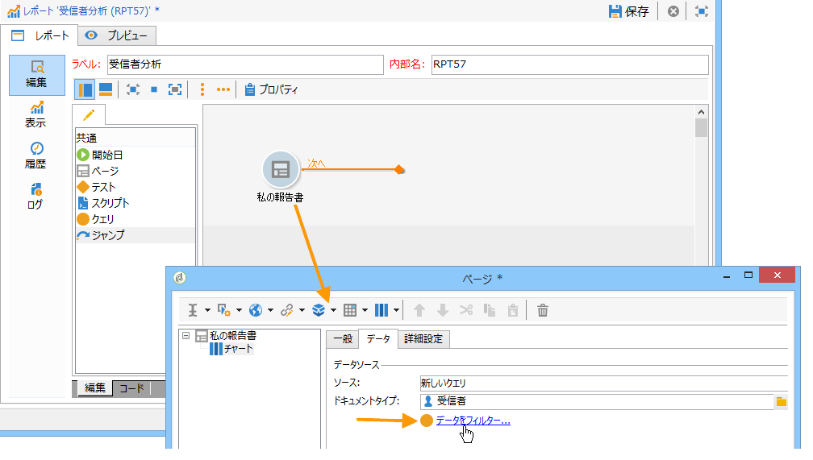
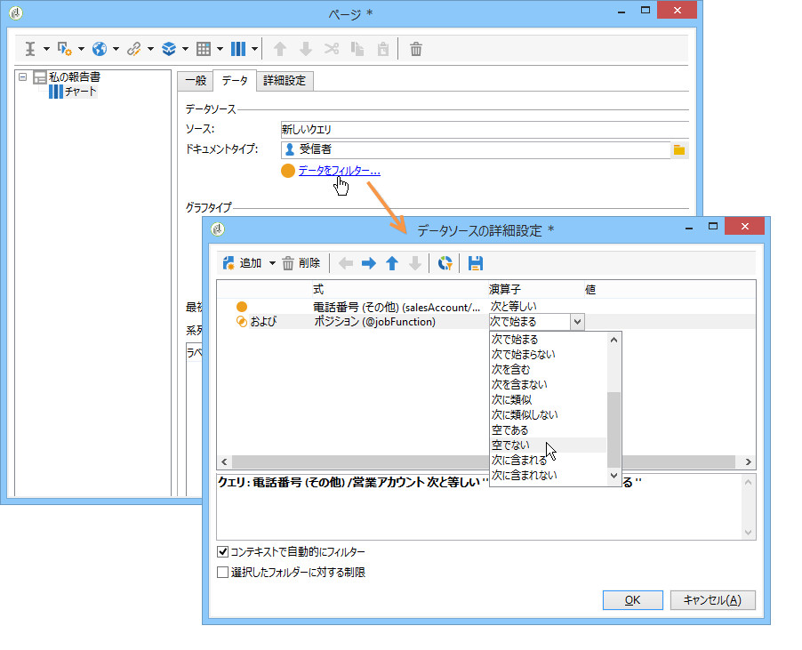
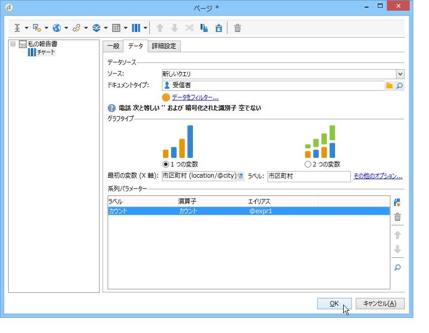
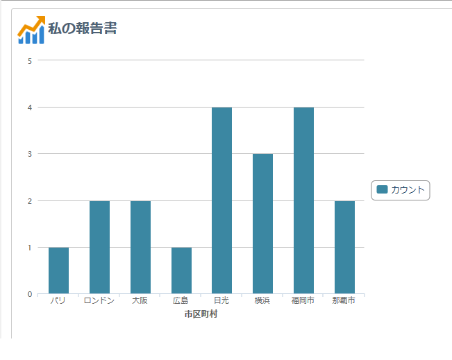
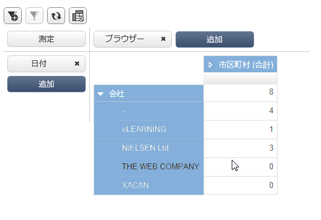
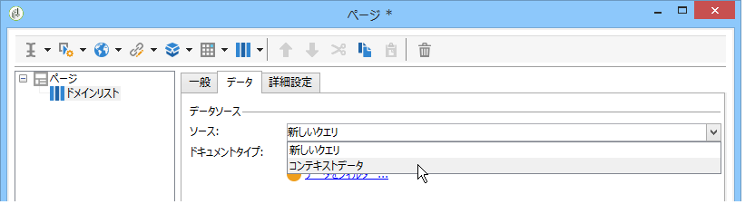
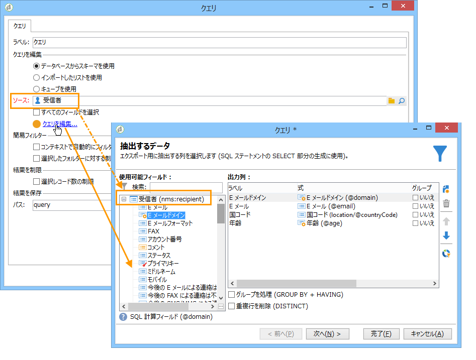
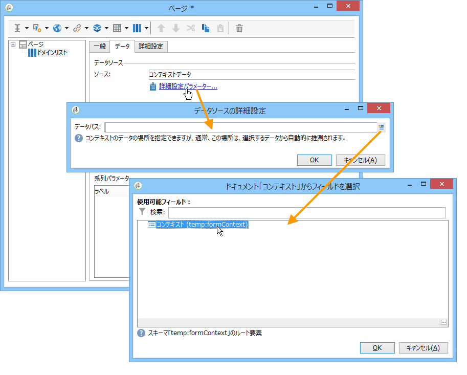
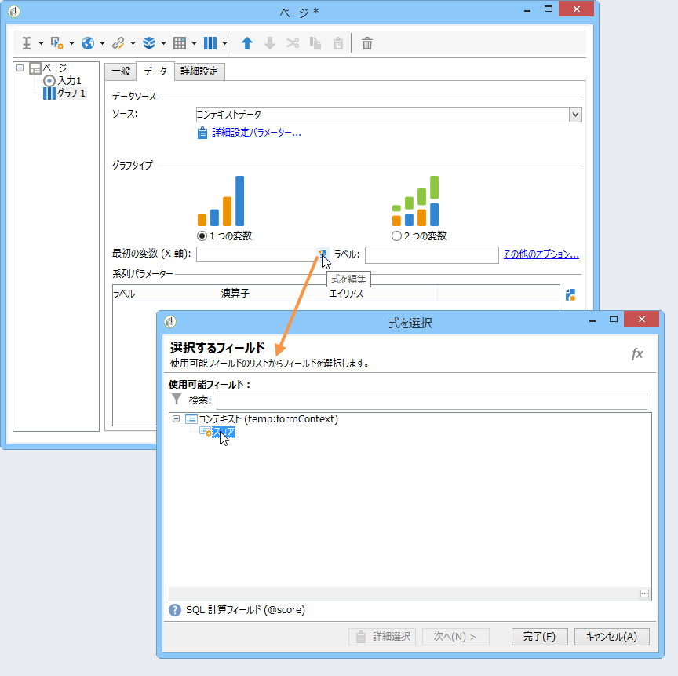

# コンテキストの使用{#using-the-context}

またはの形式でデータを表す場合、2つ **[!UICONTROL tables]** のソ **[!UICONTROL charts]**&#x200B;ースからデータを取得できます。新しいクエリー(「データに対する直接 [フィルターの定義](#defining-a-direct-filter-on-data)」を参照)またはレポートコンテキスト [(「コンテキストデータの使用](#using-context-data)」を参照)。

## データに対する直接フィルターの定義 {#defining-a-direct-filter-on-data}

### データのフィルター {#filtering-data}

Using a **[!UICONTROL Query]** type activity isn&#39;t mandatory when building a report. レポートを構成するテーブルやグラフで、データを直接フィルターできます。

This enables you to select the data to display in the report directly via the **[!UICONTROL Page]** activity of the report.

To do this, click the **[!UICONTROL Filter data...]** link in the **[!UICONTROL Data]** tab: this link lets you access the expressions editor to define a query on the data to be analyzed.

### 例：グラフでフィルターを使用する {#example--use-a-filter-in-a-chart}

次の例では、フランスに居住し、この 1 年間に買い物をした受信者のプロファイルのみを表示するグラフを作成します。

このフィルターを定義するには、チャートにページアクティビティを追加し、それを編集します。Click the **[!UICONTROL Filter data]** link and create the filter that matches the data you want to display. Adobe Campaign でのクエリの作成について詳しくは、[この節](../../platform/using/about-queries-in-campaign.md)を参照してください。

ここでは、選択した受信者の市区町村別の分類を表示します。

レンダリングは、次のようになります。

### 例：ピボットテーブルでフィルターを使用する {#example--use-a-filter-in-a-pivot-table}

この例では、フィルターを使用することで、パリ以外に居住している顧客のみをピボットテーブルに表示できます。事前に別のクエリを使用する必要はありません。

次の手順に従います。

1. チャートにページアクティビティを追加し、編集します。
1. ピボットテーブルを作成します。
1. Go to the **[!UICONTROL Data]** tab and select the cube to be used.
1. Click the **[!UICONTROL Filter data...]** link and define the following query to remove Adobe from the list of companies.

   

フィルター条件を満たす受信者のみレポートに表示されます。

## コンテキストデータの使用 {#using-context-data}

To represent data in the form of a **[!UICONTROL table]** or a **[!UICONTROL chart]**, the data can come from the report context.

In the page that contains the table or the chart, the **[!UICONTROL Data]** tab lets you select the data source.

* The **[!UICONTROL New query]** option lets you build a query to collect data. 詳しくは、「データに対する直接フィ [ルターの定義」を参照してください](#defining-a-direct-filter-on-data)。
* The **[!UICONTROL Context data]** option lets you use the input data: the context of the report coincides with the information contained in the inbound transition of the page that contains the chart or the table. This context may, for instance, contain data collected via a **[!UICONTROL Query]** activity placed before the **[!UICONTROL Page]** activity and for which you need to specify the table and the fields that the report concerns.

例えば、クエリボックスで、受信者に次のようなクエリを作成します。

Then indicate the source of the data in your report, in this case: **[!UICONTROL Data from the context]**.

データの場所は自動的に推測されます。必要に応じて、データパスを指定できます。

統計に関係のあるデータを選択する場合、使用可能なフィールドは、クエリで指定されたデータと一致します。

