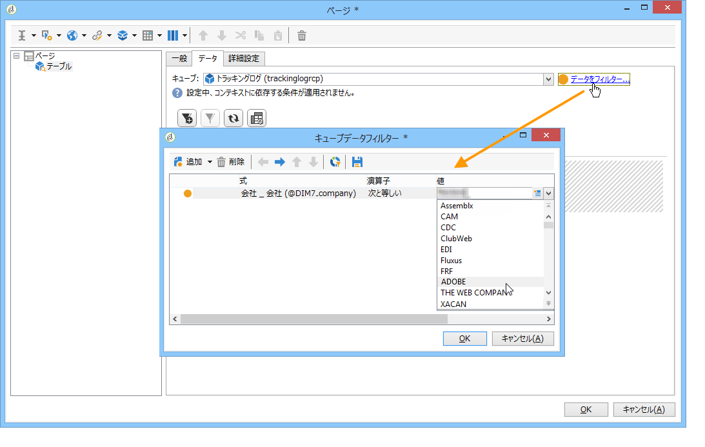

# コンテキストの使用{#using-the-context}

データを&#x200B;**[!UICONTROL テーブル]**&#x200B;や&#x200B;**[!UICONTROL グラフ]**&#x200B;の形式で表す場合は、新しいクエリ（[データに対する直接フィルターの定義](#defining-a-direct-filter-on-data)を参照）またはレポートコンテキスト（[コンテキストデータの使用](#using-context-data)を参照）の 2 つのソースからデータを取得できます。

## データに対する直接フィルターの定義 {#defining-a-direct-filter-on-data}

### データのフィルター {#filtering-data}

レポートを作成する際、**[!UICONTROL クエリ]**&#x200B;タイプのアクティビティの使用は、必須ではありません。レポートを構成するテーブルやグラフで、データを直接フィルターできます。

これによって、レポートに表示するデータを、レポートの&#x200B;**[!UICONTROL ページ]**&#x200B;アクティビティを通じて直接選択できます。

それには、「**[!UICONTROL データ]**」タブの「**[!UICONTROL データをフィルター]**」リンクをクリックします。式エディターが開き、分析対象となるデータに対するクエリを定義できます。

### 例：グラフでフィルターを使用する {#example--use-a-filter-in-a-chart}

次の例では、フランスに居住し、この 1 年間に買い物をした受信者のプロファイルのみを表示するグラフを作成します。

このフィルターを定義するには、チャートにページアクティビティを追加し、それを編集します。「**[!UICONTROL データをフィルター]**」リンクをクリックし、表示するデータに合致するフィルターを作成します。Adobe Campaign でのクエリの作成について詳しくは、[この節](../../platform/using/about-queries-in-campaign.md)を参照してください。

ここでは、選択した受信者の市区町村別の分類を表示します。

レンダリングは、次のようになります。

### 例：ピボットテーブルでフィルターを使用する {#example--use-a-filter-in-a-pivot-table}

この例では、フィルターを使用することで、パリ以外に居住している顧客のみをピボットテーブルに表示できます。事前に別のクエリを使用する必要はありません。

次の手順に従います。

1. チャートにページアクティビティを追加し、編集します。
1. ピボットテーブルを作成します。
1. 「**[!UICONTROL データ]**」タブに移動し、使用するキューブを選択します。
1. 「**[!UICONTROL データをフィルター]**」リンクをクリックし、会社のリストから ADOBE を削除するように次のようなクエリを定義します。

   

フィルター条件を満たす受信者のみレポートに表示されます。

## コンテキストデータの使用 {#using-context-data}

データを&#x200B;**[!UICONTROL テーブル]**&#x200B;や&#x200B;**[!UICONTROL グラフ]**&#x200B;の形式で表す場合は、そのデータをレポートコンテキストから取得できます。

テーブルやグラフを含んだページでは、「**[!UICONTROL データ]**」タブでデータソースを選択できます。

* 「**[!UICONTROL 新しいクエリ]**」オプションを選択すると、データを収集するためのクエリを作成できます。詳しくは、[データに対する直接フィルターの定義](#defining-a-direct-filter-on-data)を参照してください。
* 「**[!UICONTROL コンテキストデータ]**」オプションを選択すると、入力データを使用できます。レポートのコンテキストは、グラフやテーブルを含むページのインバウンドトランジションに含まれる情報と一致します。このコンテキストには、例えば、**[!UICONTROL ページ]**&#x200B;アクティビティの前に配置された&#x200B;**[!UICONTROL クエリ]**&#x200B;アクティビティで収集されたデータが含まれている可能性があります。その場合、レポートに関係のあるテーブルやフィールドを指定する必要があります。

例えば、クエリボックスで、受信者に次のようなクエリを作成します。

次に、レポートのデータソースを指定します。ここでは、「**[!UICONTROL コンテキストのデータ]**」とします。

データの場所は自動的に推測されます。必要に応じて、データパスを指定できます。

統計に関係のあるデータを選択する場合、使用可能なフィールドは、クエリで指定されたデータと一致します。

