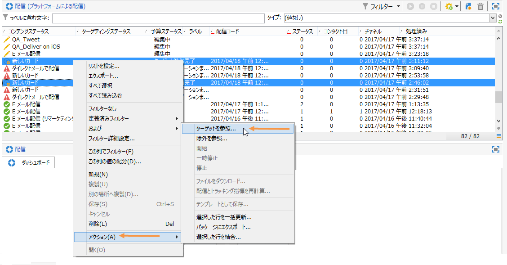

# 記述的分析ウィザードの使用{#using-the-descriptive-analysis-wizard}

記述的分析レポートを作成するには、専用のウィザードを使用します。設定は、分析するデータおよび希望するレンダリングによって異なります。

## データベース内のデータの分析 {#analyzing-data-in-the-database}

The descriptive analysis wizard can be launched via the **[!UICONTROL Tools > Descriptive analysis]** menu: in this case, the analysis concerns recipients by default (**nms:recipient**). 分析は、Adobe Campaign データベース内のすべてのデータに適用されます。

To analyze a table other than the standard recipients one (**nms:recipient**), click the **[!UICONTROL Advanced settings...]** link in the last stage of the wizard and select the table that matches your settings, in this case **cus:individual**:

If you want to produce statistics on part of the data, you can define a filter: to do this, click the **[!UICONTROL Advanced settings...]** link and define the filter to apply, as shown below:

この分析では、データベースに格納されている受信者のうち、16 歳以上でロンドンに住んでいる人だけを対象にします。

## データセットの分析 {#analyzing-a-set-of-data}

記述的分析ウィザードは、リスト、ワークフロートランザクション、1 つ以上の配信、選択した一部の受信者などの様々なコンテキストで使用できます。

受信者テーブルを指す Adobe Campaign ツリーの複数のノードからアクセスできます。

項目を選択して右クリックすることで、記述的分析ウィザードを開きます。選択したデータのみ分析されます。

* For a set of **recipients**, select the recipients to be analyzed, then right-click and select **[!UICONTROL Actions > Explore...]**, as shown above. 受信者のリストにフィルターを適用する場合は、その内容のみ分析されます。

   フォルダーまたは現在のフィルター内のすべての受信者を選択するには、Ctrl + A キーを使用します。つまり、表示されていない受信者でも選択されます。

   For an example of the descriptive analysis of recipients, refer to: [Qualitative data analysis](../../reporting/using/use-cases.md#qualitative-data-analysis).

* In the context of a **workflow**, place the cursor on a transition that points towards the recipients table, right-click and select **[!UICONTROL Analyze target]**. 詳しくは、「ワークフローでの移行ターゲットの分析」 [の例を参照してください](../../reporting/using/use-cases.md#analyzing-a-transition-target-in-a-workflow)。
* **リスト**&#x200B;の場合は、1 つ以上のリストを選択し、受信者の場合と同じ手順を適用します。
* In the context of a **delivery**, select the deliveries whose target you want to analyze, right-click and select **[!UICONTROL Actions > Explore the target]**, as shown below:

   

   配信の詳細分析の例を次に示します。母 [集団の分析](../../reporting/using/use-cases.md#analyzing-a-population) :受信者 [追跡ログを分析しています](../../reporting/using/use-cases.md#analyzing-recipient-tracking-logs)。

## 定性配分テンプレートの設定 {#configuring-the-qualitative-distribution-template}

The **[!UICONTROL Qualitative distribution]** template lets you create statistics on all types of data (e.g. company name, email domain).

テンプレートを使用して作成されたレポートに使用できる設定オ **[!UICONTROL Qualitative distribution]** プションについて詳しくは、 [表にデータを表示するを参照してくださ](#displaying-data-in-the-table)い。 完全な例は、「母集団の分析」 [で説明します](../../reporting/using/use-cases.md#analyzing-a-population)。

記述的分析ウィザードを使用してデータを分析する場合、使用可能なオプションは、選択した設定によって異なります。次に、それらについて説明します。

### データビニング {#data-binning}

表示する変数を選択する場合は、データビニングを定義できます。つまり、選択したデータのグループ化条件を設定できます。

>[!NOTE]
>
>When the field concerned by the calculation is computed using an aggregate, check **[!UICONTROL The data is already aggregated]** to improve performances.

オプションはフィールドの内容によって異なります。

* **[!UICONTROL None]** :このオプションを使用すると、バインニングを行わずに、変数で使用可能なすべての値を表示できます。

   >[!CAUTION]
   >
   >このオプションは慎重に使用してください。レポートおよびマシンのパフォーマンスに重大な影響を及ぼすおそれがあります。

* **[!UICONTROL Auto]** :このオプションを使用すると、最も頻繁に表示される値をn個表示できます。 これらは自動的に計算され、それぞれ、bin の数と比べた変数の割合を表します。数値の場合は、データを分類する n 個のクラスが Adobe Campaign によって自動的に生成されます。
* **[!UICONTROL Manual]** :このオプションは、手動で **[!UICONTROL Auto]** これらの値を設定できる点を除いて、オプションと同様に機能します。 To do this, click the **[!UICONTROL Add]** button to the right of the value table.

   Values can be initialized automatically by Adobe Campaign before personalization: to do this, enter the number of bins you want to generate and click the **[!UICONTROL Initialize with]** link, as shown below:

   

   次に、必要に応じて内容を調整します。

   

   希望する精度に応じて、日付を格納するフィールドを時間、日、月、年などでグループ化できます。

   

* **[!UICONTROL Modulo]** :数値の場合に値のグループを作成できます。 例えば、剰余の値が 10 の場合は、10 ずつ変わる値の区間を作成できます。

   

   次の例では、受信者の年齢別分類が表示されています。

   

### テーブルでのデータ表示 {#displaying-data-in-the-table}

ツールバーを使用すると、列の削除、列ではなく行でのデータ表示、列の左または右への移動、値の計算の表示または変更など、テーブルでの変数の表示をパーソナライズできます。

ウィンドウの上部のセクションで表示設定を選択できます。

統計の名前や小計の表示／非表示を切り替えたり、統計の方向を選択したりできます。詳しくは、分析レポートの表示設 [定を参照してください](../../reporting/using/processing-a-report.md#analysis-report-display-settings)。

### グラフでのデータ表示 {#displaying-data-in-the-chart}

記述的分析ウィザードの最初の段階では、テーブルを使用せずにグラフ形式のみでデータを表示することを選択できます。その場合は、グラフを設定する際に変数選択をおこなう必要があります。まず、表示する変数の数を選択し、関連するデータベースのフィールドを選択します。

その後、希望するグラフタイプを選択します。

>[!NOTE]
>
>変数をグラフとテーブルに同時に表示できます。To do this, enter the variables in the **[!UICONTROL Table configuration]** window. Click **[!UICONTROL Next]** and select the type of chart in the chart configuration window. テーブルにサブディメンションが定義されている場合、それらはグラフには表示されません。

Click the **[!UICONTROL Variants]** link to modify the chart properties.

提供されるオプションは、選択したグラフのタイプによって異なります。詳しくは、[このページ](../../reporting/using/creating-a-chart.md#chart-types-and-variants)を参照してください。

### 統計の計算 {#statistics-calculation}

記述的分析ウィザードでは、データに関する複数のタイプの統計を計算できます。デフォルトでは、単純カウントのみ設定されています。

Click **[!UICONTROL Add]** to create a new statistic.

次の演算が可能です。

* **[!UICONTROL Count]** （集計フィールドの）重複する値を含む、集計するフィールドのnull以外の値をすべてカウントするには、
* **[!UICONTROL Average]** 数値フィールドの値の平均を計算するには
* **[!UICONTROL Minimum]** 数値フィールドの値の最小値を計算するには、
* **[!UICONTROL Maximum]** 数値フィールドの値の最大値を計算するには、
* **[!UICONTROL Sum]** 数値フィールドの値の合計を計算するには、
* **[!UICONTROL Standard deviation]** を使用して、返される値が平均の周りにどのように分散されるかを計算します。
* **[!UICONTROL Row percentage distribution]** 列内の値と行内の値の比率を計算するには（テーブルに対してのみ使用可能）、
* **[!UICONTROL Column percentage distribution]** 行内の値と列内の値の比率を計算するには（テーブルにのみ使用可能）、
* **[!UICONTROL Total percentage distribution]** を使用して、関連する受信者の配分を値で計算します。

   

* **[!UICONTROL Calculated field]** パーソナライズされた演算子を作成する場合（表に対してのみ使用可能）。 The **[!UICONTROL User function]** field lets you enter the calculation to be applied to the data.

   例：国と出発地に基づく顧客ごとの平均購入金額の計算

   

   上記の情報をテーブルに表示するには、顧客ごとの平均購入額を格納するための計算フィールドを作成する必要があります。

   手順は次のとおりです。

   1. 購入合計額を計算します。

      

   1. この統計はテーブルには表示されません。タブのオプションをオフに **[!UICONTROL Display in the table]** する必要があ **[!UICONTROL Advanced]** ります。

      

   1. 新しいタイプの統 **[!UICONTROL Calculated field]** 計を作成し、次の数式をフィールドに入力 **[!UICONTROL User function]** します。 **@purchases/@count**.

      

### レポートの表示 {#displaying-the-report}

ウィザードの最後の段階では、レポート（つまり、テーブルやグラフ）を設定どおりに表示できます。

レポートにテーブルが含まれている場合、計算結果のセルには色が付きます。結果の値が大きくなるほど、色が濃くなります。

結果のレイアウトを変更できます。それには、関係する変数を右クリックし、ショートカットメニューから入力を選択します。

レポートにグラフが含まれている場合は、表示される情報を凡例のラベルを使用してフィルターできます。つまり、ラベルをクリックすると、グラフ内の表示を有効または無効にすることができます。

## 定量配分テンプレートの設定 {#configuring-the-quantitative-distribution-template}

記述的分析を手動で生成するには、「**テンプレートからの新しい記述的分析**」オプションを選択します（デフォルトで設定されていない場合）。

The **[!UICONTROL Quantitative distribution]** template that lets you generate statistics on data which can be measured or counted (e.g. invoice amount, age of recipients).

The configuration mode of an analysis report created via the **[!UICONTROL Quantitative distribution]** template is detailed in an implementation example [Quantitative data analysis](../../reporting/using/use-cases.md#quantitative-data-analysis).

次に、記述的分析ウィザードを使用して定量的なレポートを作成する際に使用可能なオプションについて説明します。

最初に、計算に関係する変数を選択します。

Adobe Campaign には、デフォルトで、選択されたデータを計算するための一連の統計が用意されています。必要に応じて、このリストを変更して、統計を追加したり、削除したりできます。

次の演算が可能です。

* **[!UICONTROL Count]** （集計フィールドの）重複する値を含む、集計するフィールドのnull以外の値をすべてカウントするには、
* **[!UICONTROL Average]** 数値フィールドの値の平均を計算するには
* **[!UICONTROL Minimum]** 数値フィールドの値の最小値を計算するには、
* **[!UICONTROL Maximum]** を使用して、数値フィールドの値の最大値を計算します。
* **[!UICONTROL Sum]** 数値フィールドの値の合計を計算するには、
* **[!UICONTROL Standard deviation]** を使用して、平均を基準にして戻り値の分布を計算します。
* **[!UICONTROL Number of missing values]** を使用して、値が定義されていない数値フィールドの数を計算します。
* **[!UICONTROL Decile distribution]** を指定します。
* **[!UICONTROL Custom distribution]** を使用して、ユーザー定義のしきい値に基づいて返される値を配分します。

   The **[!UICONTROL Detail...]** button lets you edit a statistic and, if needed, personalize its calculation or its display:

   

   ウィザードの最後の段階では、定量分析レポートが表示されます。

   

   レポートを変更するには、「レポートの処理」を [参照してください](../../reporting/using/processing-a-report.md)。

