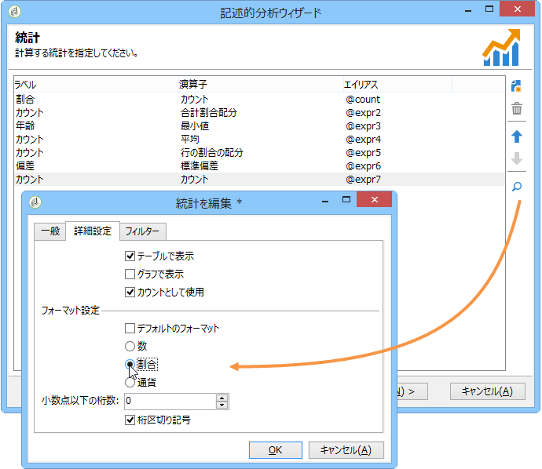

# 記述的分析ウィザードの使用{#using-the-descriptive-analysis-wizard}

記述的分析レポートを作成するには、専用のウィザードを使用します。設定は、分析するデータおよび希望するレンダリングによって異なります。

## データベース内のデータの分析 {#analyzing-data-in-the-database}

記述的分析ウィザードは、**[!UICONTROL ツール／記述的分析]**&#x200B;メニューで起動できます。その場合は、デフォルトで、受信者に関係する分析になります（**nms:recipient**）。分析は、Adobe Campaign データベース内のすべてのデータに適用されます。

標準の受信者テーブル（**nms:recipient**）以外のテーブルを分析するには、ウィザードの最後の段階で「**[!UICONTROL 詳細設定]**」リンクをクリックし、設定に一致するテーブル（この場合は **cus:individual**）を選択します。

データの一部に関する統計を生成する場合は、フィルターを定義できます。それには、次のように、「**[!UICONTROL 詳細設定]**」リンクをクリックし、適用するフィルターを定義します。

この分析では、データベースに格納されている受信者のうち、16 歳以上でロンドンに住んでいる人だけを対象にします。

## データセットの分析 {#analyzing-a-set-of-data}

記述的分析ウィザードは、リスト、ワークフロートランザクション、1 つ以上の配信、選択した一部の受信者などの様々なコンテキストで使用できます。

受信者テーブルを指す Adobe Campaign ツリーの複数のノードからアクセスできます。

項目を選択して右クリックすることで、記述的分析ウィザードを開きます。選択したデータのみ分析されます。

* 一連の&#x200B;**受信者**&#x200B;の場合は、上に示すように、分析対象となる受信者を選択し、右クリックして&#x200B;**[!UICONTROL アクション／参照]**&#x200B;を選択します。受信者のリストにフィルターを適用する場合は、その内容のみ分析されます。

   フォルダーまたは現在のフィルター内のすべての受信者を選択するには、Ctrl + A キーを使用します。つまり、表示されていない受信者でも選択されます。

   受信者の記述的分析の例については、[定性的データ分析](../../reporting/using/use-cases.md#qualitative-data-analysis)を参照してください。

* **ワークフロー**&#x200B;のコンテキストでは、受信者テーブルを指すトランザクションにカーソルを置き、右クリックして「**[!UICONTROL ターゲットを分析]**」を選択します。詳しくは、[ワークフローのトランジションターゲットの分析](../../reporting/using/use-cases.md#analyzing-a-transition-target-in-a-workflow)の例を参照してください。
* **リスト**&#x200B;の場合は、1 つ以上のリストを選択し、受信者の場合と同じ手順を適用します。
* **配信**&#x200B;の場合は、次に示すように、分析対象をターゲットとする配信を選択し、右クリックして&#x200B;**[!UICONTROL アクション／ターゲットを参照]**&#x200B;を選択します。

   

   配信の記述的分析の例については、[母集団の分析](../../reporting/using/use-cases.md#analyzing-a-population)および[受信者トラッキングログの分析](../../reporting/using/use-cases.md#analyzing-recipient-tracking-logs)を参照してください。

## 定性配分テンプレートの設定 {#configuring-the-qualitative-distribution-template}

**[!UICONTROL 定性配分]**&#x200B;テンプレートでは、あらゆるタイプのデータ（会社名、E メールドメインなど）に関する統計を作成できます。

**[!UICONTROL 定性配分]**&#x200B;テンプレートを基に作成したレポートに使用可能な設定オプションについて詳しくは、[テーブルでのデータ表示](#displaying-data-in-the-table)を参照してください。完全な例の詳細は、[母集団の分析](../../reporting/using/use-cases.md#analyzing-a-population)で説明しています。

記述的分析ウィザードを使用してデータを分析する場合、使用可能なオプションは、選択した設定によって異なります。次に、それらについて説明します。

### データビニング {#data-binning}

表示する変数を選択する場合は、データビニングを定義できます。つまり、選択したデータのグループ化条件を設定できます。

>[!NOTE]
>
>計算に関係するフィールドを集計を使用して計算する場合は、パフォーマンスを向上させるために「**[!UICONTROL データは既に集計済み]**」をチェックします。

オプションはフィールドの内容によって異なります。

* 「**[!UICONTROL なし]**」オプション：変数に割り当て可能なすべての値をビニングなしで表示できます。

   >[!CAUTION]
   >
   >このオプションは慎重に使用してください。レポートおよびマシンのパフォーマンスに重大な影響を及ぼすおそれがあります。

* 「**[!UICONTROL 自動]**」オプション：最も頻繁に表された n 個の値を表示できます。これらは自動的に計算され、それぞれ、bin の数と比べた変数の割合を表します。数値の場合は、データを分類する n 個のクラスが Adobe Campaign によって自動的に生成されます。
* 「**[!UICONTROL 手動]**」オプション：「**[!UICONTROL 自動]**」オプションと似た動作をしますが、これらの値を手動で設定できる点が異なります。それには、値テーブルの右にある「**[!UICONTROL 追加]**」ボタンをクリックします。

   値は、パーソナライゼーションの前に Adobe Campaign によって自動的に初期化できます。それには、次に示すように、生成する bin の数を入力し、「**[!UICONTROL 初期化の条件]**」リンクをクリックします。

   

   次に、必要に応じて内容を調整します。

   

   希望する精度に応じて、日付を格納するフィールドを時間、日、月、年などでグループ化できます。

   

* 「**[!UICONTROL 剰余]**」オプション：数値の場合に値のグループを作成できます。例えば、剰余の値が 10 の場合は、10 ずつ変わる値の区間を作成できます。

   

   次の例では、受信者の年齢別分類が表示されています。

   

### テーブルでのデータ表示 {#displaying-data-in-the-table}

ツールバーを使用すると、列の削除、列ではなく行でのデータ表示、列の左または右への移動、値の計算の表示または変更など、テーブルでの変数の表示をパーソナライズできます。

ウィンドウの上部のセクションで表示設定を選択できます。

統計の名前や小計の表示／非表示を切り替えたり、統計の方向を選択したりできます。詳しくは、[分析レポートの表示設定](../../reporting/using/processing-a-report.md#analysis-report-display-settings)を参照してください。

### グラフでのデータ表示 {#displaying-data-in-the-chart}

記述的分析ウィザードの最初の段階では、テーブルを使用せずにグラフ形式のみでデータを表示することを選択できます。その場合は、グラフを設定する際に変数選択をおこなう必要があります。まず、表示する変数の数を選択し、関連するデータベースのフィールドを選択します。

その後、希望するグラフタイプを選択します。

>[!NOTE]
>
>変数をグラフとテーブルに同時に表示できます。それには、**[!UICONTROL テーブル設定]**&#x200B;ウィンドウに変数を入力します。「**[!UICONTROL 次へ]**」をクリックし、グラフ設定ウィンドウでグラフのタイプを選択します。テーブルにサブディメンションが定義されている場合、それらはグラフには表示されません。

「**[!UICONTROL バリエーション]**」リンクをクリックすると、グラフのプロパティを変更できます。

提供されるオプションは、選択したグラフのタイプによって異なります。詳しくは、[このページ](../../reporting/using/creating-a-chart.md#chart-types-and-variants)を参照してください。

### 統計の計算 {#statistics-calculation}

記述的分析ウィザードでは、データに関する複数のタイプの統計を計算できます。デフォルトでは、単純カウントのみ設定されています。

「**[!UICONTROL 追加]**」をクリックすると、新しい統計を作成できます。

次の演算が可能です。

* **[!UICONTROL カウント]**：フィールドの null でない値をすべて数えて集計します。（集計フィールドの）重複値を含めます。
* **[!UICONTROL 平均]**：数値フィールドの値の平均を計算します。
* **[!UICONTROL 最小]**：数値フィールドの値の最小値を計算します。
* **[!UICONTROL 最大]**：数値フィールドの値の最大値を計算します。
* **[!UICONTROL 合計]**：数値フィールドの値の合計を計算します。
* **[!UICONTROL 標準偏差]**：返された値が平均値からどれだけばらついているかを計算します。
* **[!UICONTROL 行の割合の配分]**：列の値の行の値に対する比を計算します（テーブルの場合のみ使用可能）。
* **[!UICONTROL 列割合配分]**：行の値の列の値に対する比を計算します（テーブルの場合のみ使用可能）。
* **[!UICONTROL 合計割合配分]**：関係する受信者の値別の配分を計算します。

   

* **[!UICONTROL 計算されたフィールド]**：パーソナライズした演算子を作成します（テーブルの場合のみ使用可能）。「**[!UICONTROL ユーザー関数]**」フィールドでは、データに適用する計算を入力できます。

   例：国別および部門別に顧客ごとの平均購入額を計算

   

   上記の情報をテーブルに表示するには、顧客ごとの平均購入額を格納するための計算フィールドを作成する必要があります。

   手順は次のとおりです。

   1. 購入合計額を計算します。

      

   1. この統計はテーブルには表示されません。「**[!UICONTROL 詳細設定]**」タブの「**[!UICONTROL テーブルで表示]**」オプションのチェックをオフにする必要があります。

      

   1. **[!UICONTROL 計算されたフィールド]**&#x200B;タイプの統計を新しく作成し、「**[!UICONTROL ユーザー関数]**」フィールドに数式、**@purchases/@count** を入力します。

      

### レポートの表示 {#displaying-the-report}

ウィザードの最後の段階では、レポート（つまり、テーブルやグラフ）を設定どおりに表示できます。

レポートにテーブルが含まれている場合、計算結果のセルには色が付きます。結果の値が大きくなるほど、色が濃くなります。

結果のレイアウトを変更できます。それには、関係する変数を右クリックし、ショートカットメニューから入力を選択します。

レポートにグラフが含まれている場合は、表示される情報を凡例のラベルを使用してフィルターできます。つまり、ラベルをクリックすると、グラフ内の表示を有効または無効にすることができます。

## 定量配分テンプレートの設定 {#configuring-the-quantitative-distribution-template}

記述的分析を手動で生成するには、「**テンプレートからの新しい記述的分析**」オプションを選択します（デフォルトで設定されていない場合）。

**[!UICONTROL 定量配分]**&#x200B;テンプレートでは、測定可能またはカウント可能なデータ（請求書の金額、受信者の年齢など）に関する統計を生成できます。

**[!UICONTROL 定量配分]**&#x200B;テンプレートを基に作成した分析レポートの設定モードについて詳しくは、[定量的データ分析](../../reporting/using/use-cases.md#quantitative-data-analysis)の実装例を参照してください。

次に、記述的分析ウィザードを使用して定量的なレポートを作成する際に使用可能なオプションについて説明します。

最初に、計算に関係する変数を選択します。

Adobe Campaign には、デフォルトで、選択されたデータを計算するための一連の統計が用意されています。必要に応じて、このリストを変更して、統計を追加したり、削除したりできます。

次の演算が可能です。

* **[!UICONTROL カウント]**：フィールドの null でない値をすべて数えて集計します。（集計フィールドの）重複値を含めます。
* **[!UICONTROL 平均]**：数値フィールドの値の平均を計算します。
* **[!UICONTROL 最小]**：数値フィールドの値の最小値を計算します。
* **[!UICONTROL 最大]**：数値フィールドの値の最大値を計算します。
* **[!UICONTROL 合計]**：数値フィールドの値の合計を計算します。
* **[!UICONTROL 標準偏差]**：返された値が平均値からどれだけばらついているかを計算します。
* **[!UICONTROL 足りない値の数]**：値が確定していない数値フィールドの数を計算します。
* **[!UICONTROL 十分位数の配分]**：返された値を、それぞれが数値フィールドの値の 1/10 を表すように配分します。
* **[!UICONTROL カスタム配分]**：返された値をユーザー定義のしきい値に基づいて配分します。

   次に示すように、**[!UICONTROL 詳細]**&#x200B;ボタンをクリックすると、統計を編集でき、必要に応じて統計の計算や表示をパーソナライズできます。

   

   ウィザードの最後の段階では、定量分析レポートが表示されます。

   

   レポートを変更するには、[レポートの処理](../../reporting/using/processing-a-report.md)を参照してください。

