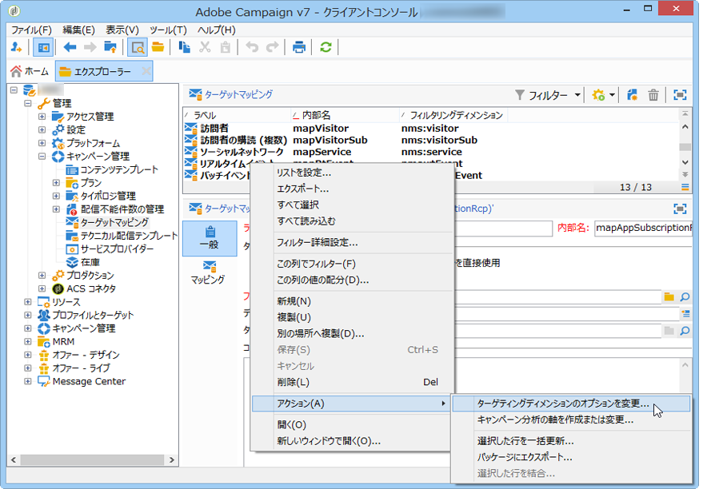
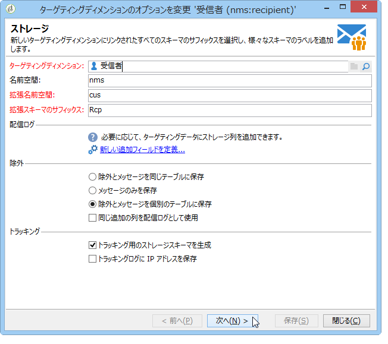
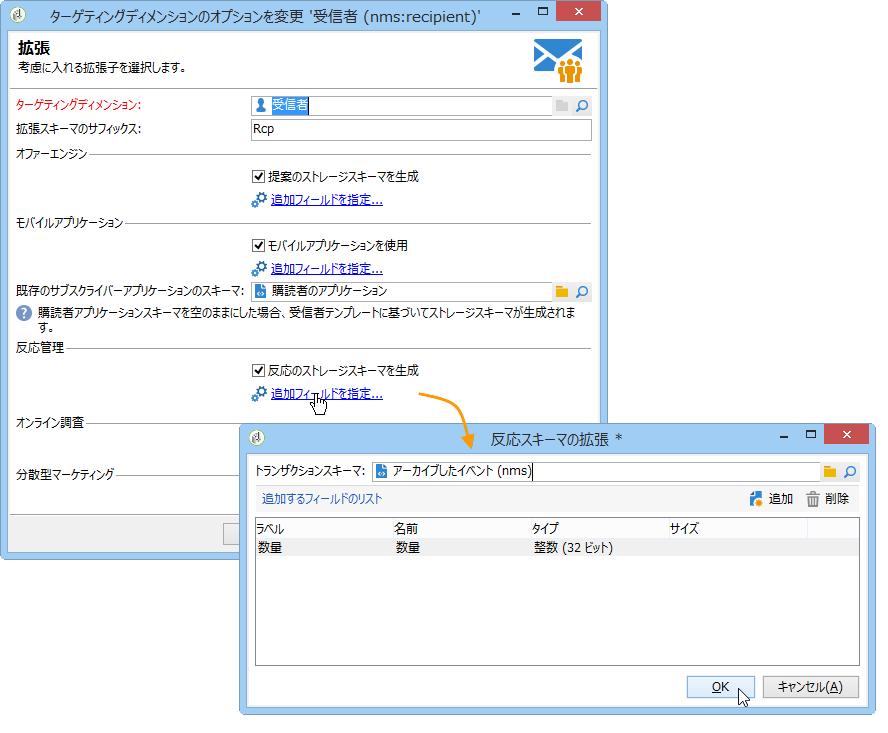

# Campaign Response Manager の設定{#configuration}


この節は反応管理の設定担当者向けです。スキーマの拡張、ワークフローの定義および SQL プログラミングについて、ある程度の知識があることを前提としています。

個人のテーブルを使用して、標準データモデルを Adobe Campaign 外のトランザクションテーブルの特定の特性に合わせて調整する方法を説明します。この個人のテーブルは、Adobe Campaign 内の使用可能な個人のテーブルや他のテーブルと一致する場合があります。

測定の仮説は、オペレーションプロセスワークフロー（**[!UICONTROL operationMgt]**）により開始します。各仮説は、特定の実行ステータス（編集中、保留中、完了、失敗など）で非同期的に実行される個々のプロセスを表します。プロセスは、優先度の制約、シミュレーションプロセス数の制限、低アクティビティページおよび頻繁な自動実行を管理するスケジューラーによりコントロールされます。


## スキーマの設定 {#configuring-schemas}

>[!CAUTION]
>
>アプリケーションの組み込みスキーマは変更しないでください。その代わりに、スキーマ拡張メカニズムを使用します。標準スキーマを変更すると、今後アプリケーションのアップグレード時にスキーマが更新されなくなり、Adobe Campaign の使用中に誤作動が生じる可能性があります。

測定する様々なテーブル（トランザクション、トランザクションの詳細）に加え、テーブルと配信、オファーおよび個人間の関係を定義するには、反応モジュールを使用する前にアプリケーションを統合する必要があります。

### 標準スキーマ {#standard-schemas}

組み込みの **[!UICONTROL nms:remaMatch]** スキーマには、個人、仮説およびトランザクションテーブル間の関係を表す反応ログテーブルが含まれています。このスキーマは、反応ログの最終的な宛先テーブルの継承済みスキーマとして使用します。

**[!UICONTROL nms:remaMatchRcp]** スキーマも標準スキーマで、Adobe Campaign の受信者（**[!UICONTROL nms:recipient]**）用反応ログのストレージを含みます。このスキーマを使用するには、拡張してトランザクションテーブル（購入などを含む）にマップする必要があります。

### トランザクションテーブルとトランザクションの詳細 {#transaction-tables-and-transaction-details}

トランザクションテーブルには、個人への直接リンクを含める必要があります。

必要に応じて、トランザクションの詳細を含むテーブルを追加することもできます。このテーブルは個人に直接リンクしません。

領収書を例にすると、トランザクションテーブルはコンタクト先（領収書テーブル）にリンクし、領収書ラインテーブルは領収書テーブル（詳細テーブル）にのみリンクします。この後、領収書ラインテーブルが領収書テーブルにリンクされているレベルで、仮説を直接設定できます。

>[!NOTE]
>
>仮説で予想される行動を表す領収書識別子を保持したい場合は、nms:remaMatchRcp テーブルテンプレートを拡張し、識別子を追加できます（この場合、これらのフィールドに ROI の計算はリンクされません）。

イベントの日付を追加することを強くお勧めします。

以下のスキーマは、設定完了後の複数テーブル間の結合を表します。


### 応答管理と受信者 {#response-management-with-adobe-campaign-recipients}

この例では、Adobe Campaign に組み込まれている受信者テーブル **[!UICONTROL nms:recipient]** を使用して、応答管理モジュールに購入テーブルを統合します。

購入テーブルスキーマへのリンクを追加するために、**[!UICONTROL nms:remaMatchRcp]** 受信者の反応ログのテーブルを拡張します。以下の例では、購入テーブルを **demo:purchase** と呼びます。

1. Adobe Campaign エクスプローラーで、**[!UICONTROL 管理]**／**[!UICONTROL キャンペーン管理]**／**[!UICONTROL ターゲットマッピング]**&#x200B;を選択します。
1. **受信者**&#x200B;を右クリックし、**[!UICONTROL アクション]**／**[!UICONTROL ターゲティングディメンションのオプションを変更]**&#x200B;を選択します。

   

1. 次のウィンドウで「**[!UICONTROL 拡張名前空間]**」をパーソナライズできます。パーソナライズしたら、「**[!UICONTROL 次へ]**」をクリックします。

   

1. 「**[!UICONTROL 反応管理]**」カテゴリで、「**[!UICONTROL 反応のストレージスキーマを生成]**」ボックスがオンになっていることを確認します。

   その後、「**[!UICONTROL 追加フィールドを指定...]**」をクリックし、関連するトランザクションテーブルを選択して、nms:remaMatchRcp スキーマの拡張にフィールドを追加します。

   

作成したスキーマは以下のようになります。

```
<srcSchema _cs="Reactions (Recipients) (cus)" entitySchema="xtk:srcSchema" extendedSchema="nms:remaMatchRcp" 
img="nms:remaMatch.png" implements="xtk:persist" label="Reactions (Recipients)" mappingType="sql"
name="remaMatchRcp" namespace="cus">  
 <element label="Reactions (Recipients)" name="remaMatchRcp">    
  <key internal="true" name="match">      
   <keyfield xlink="hypothesis"/>      
   <keyfield xlink="broadLog"/>      
   <keyfield xlink="proposition"/>    
  </key>    
  <attribute label="Quantity" name="quantity" type="long"/>    
  <element name="purchase" target="demo:purchase" type="link"/>    
  <element name="hypothesis" revLabel="Reactions (Recipients)" revLink="remaMatchRcp"/>    
  <element applicableIf="HasPackage('nms:coreInteraction')" label="Proposition" name="proposition" target="nms:propositionRcp" type="link"/>   
  <element desc="Message (Delivery log)" label="Message" name="broadLog" target="nms:broadLogRcp" type="link"/>    
  <element label="Respondent" name="responder" target="nms:recipient" type="link"/>  
 </element>  
 <createdBy _cs="Administrator (admin)"/>  
 <modifiedBy _cs="Administrator (admin)"/>
</srcSchema>
```

### パーソナライズした受信者テーブルを使用した応答管理 {#response-management-with-a-personalized-recipient-table}

この例では、Adobe Campaign で使用可能な受信者テーブル以外の個人のテーブルを使用して、購入テーブルを応答管理モジュールに統合します。

* **[!UICONTROL nms:remaMatch]** スキーマから派生した新しい応答ログスキーマを作成します。

  個人のテーブルは Adobe Campaign の受信者テーブルとは異なるので、**[!UICONTROL nms:remaMatch]** スキーマを基に、反応ログの新しいスキーマを作成する必要があります。このスキーマに配信ログと購入テーブルへのリンクを入力します。

  以下の例では、**demo:broadLogPers** スキーマと **demo:purchase** トランザクションテーブルを使用します。

  ```
  <srcSchema desc="Linking of a recipient transaction to a hypothesis"    
  img="nms:remaMatch.png" label="Responses on persons" labelSingular="Responses on a person" name="remaMatchPers" namespace="nms">
    <element name="remaMatchPers" template="nms:remaMatch">
      <key internal="true" name="match">
        <keyfield xlink="hypothesis"/>
       <keyfield xlink="purchase"/>
      </key>
  
      <element name="hypothesis" revLabel="Response logs for persons" revLink="remaMatchPers"/>
      <element applicableIf="HasPackage('nms:interaction')" label="Proposition" name="proposition"
               target="demo:propositionPers" type="link"/>
      <element label="Delivery log" name="broadLog" target="demo:broadLogPers" type="link"/>
    </element>
  </srcSchema>
  ```

* **[!UICONTROL nms:remaHypothesis]** スキーマの仮説フォームを修正します。

  デフォルトでは、反応ログのリストは受信者ログに表示されます。上述の手順で作成した新しい反応ログを表示するには、仮説フォームを修正する必要があります。

  次に例を示します。

  ```
   <container type="visibleGroup" visibleIf="[context/@remaMatchStorage]= 'demo:remaMatchPers'">
                <input hideEditButtons="true" img="nms:remaMatch.png" nolabel="true" refresh="true"
                 toolbarCaption="Responses generated by the hypothesis" type="linklist"
                 xpath="remaMatchPers">
            <input xpath="[.]"/>
            <input xpath="@controlGroup"/>
          </input>
     </container> 
  ```

## 指標の管理 {#managing-indicators}

Response Manager モジュールには、事前定義済みの指標のリストが用意されていますが、この他にパーソナライズした測定指標を追加することもできます。

追加するには、新しい指標それぞれに 2 つのフィールドを挿入して仮説テーブルを拡張する必要があります。

* 1 つ目のフィールドはターゲット母集団用、
* 2 つ目はコントロール母集団用です。

次に例を示します。

```
<srcSchema entitySchema="xtk:srcSchema" extendedSchema="nms:remaHypothesis" label="Measurement hypothesis" 
md5="1D4DED54FF8EC2432AED6736EDE6F547" name="remaHypothesis" namespace="demo" xtkschema="xtk:srcSchema">  
    <element name="remaHypothesis">    
        <element name="indicators">      
            <!-- Quantity -->      
            <attribute label="Total contacted" name="contactReactedTotalQuantity" type="long"/>
            <attribute label="Total number of people in the control group" name="proofReactedTotalquantity" type="long"/> 
        </element> 
    </element>
</srcSchema>
```
