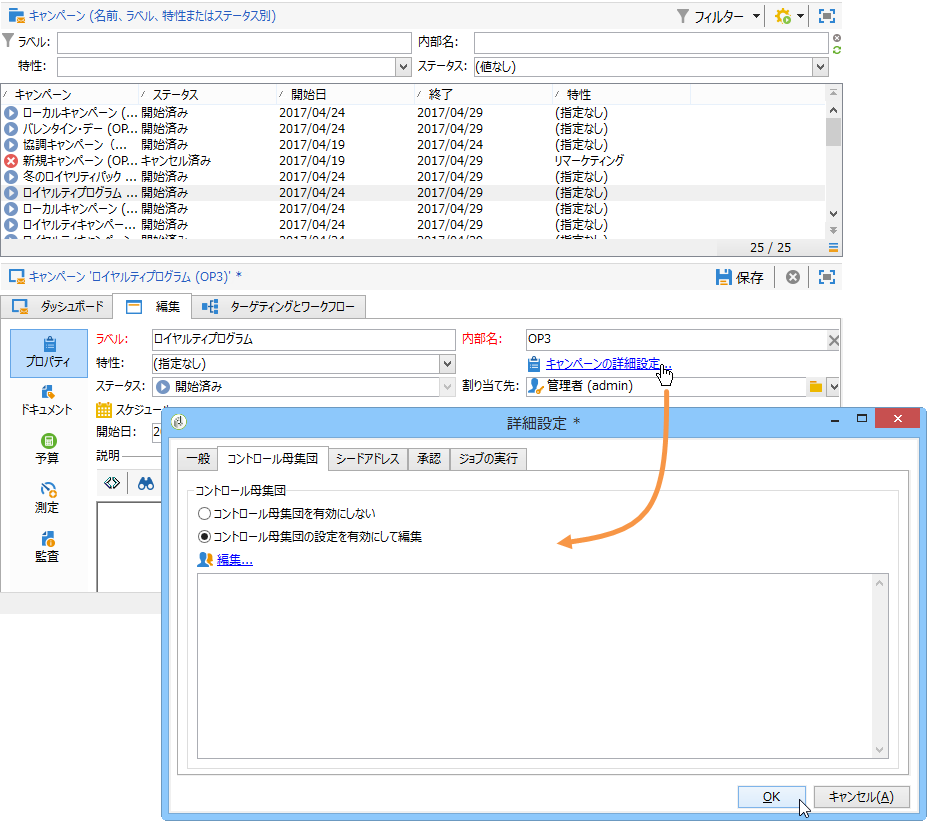

# 仮説の作成{#creating-hypotheses}

キャンペーンのオファーや配信に仮説を作成、リンクする方法はいくつかあります。

* **[!UICONTROL 測定の仮説]**&#x200B;フォルダーで、既存のテンプレートを基に新しい仮説を作成し、既存の配信にリンクする。
* キャンペーンの「**[!UICONTROL 編集]**／**[!UICONTROL 測定]**」タブを使用する。
* キャンペーンから作成した配信の「**[!UICONTROL 測定]**」オプションを使用する。

仮説を計算できるのは、マーケティングキャンペーンが開始され、受信者に配信が届いた後です。仮説がオファーの提案に基づく場合、オファーの提案は少なくとも提示済みでアクティブである必要があります。オファーと配信の仮説は、**[!UICONTROL 測定の仮説]**&#x200B;フォルダーで、仮説テンプレートをもとに作成します。ただし、キャンペーンの開始前に配信またはキャンペーンで直接仮説を参照することもできます。この場合、仮説はマーケティングキャンペーンの開始後、実行設定に基づいて自動的に計算されます。[詳細情報](hypothesis-templates.md#hypothesis-template-execution-settings)

## 配信に関する仮説のオンザフライ作成 {#creating-a-hypothesis-on-the-fly-on-a-delivery}

既存の配信の仮説を作成するには、以下の手順を実行します。

>[!NOTE]
>
>この操作は保留中の配信にのみ実行できます。

1. Adobe Campaign ツリーで、**[!UICONTROL キャンペーン管理／測定の仮説]**&#x200B;に移動します。
1. **[!UICONTROL 新規]**&#x200B;ボタンをクリックするか、仮説のリストを右クリックし、ドロップダウンリストで「**[!UICONTROL 新規]**」を選択します。

   

1. 仮説ウィンドウで、前に作成したテンプレートを選択します。[詳細情報](hypothesis-templates.md)

   

   選択したモデルで定義した仮説のコンテキストがウィンドウに表示されます。

   >[!NOTE]
   >
   >この段階で表示されていなくても、テンプレートで定義した設定はメモリに保存され、処理中の仮説に再度割り当てられます。

   

1. 仮説を作成する配信を選択します。

   

1. 仮説をパーソナライズするには、「**[!UICONTROL 一般]**」、「**[!UICONTROL トランザクション]**」および「**[!UICONTROL スコープ]**」タブを編集します。[詳細情報](hypothesis-templates.md#creating-a-hypothesis-model)
1. 「**[!UICONTROL 開始]**」をクリックして仮説を開始します。

   ワークフローが自動的に作成され、測定が実行されます。名前は仮説の設定に基づいて自動的に定義されます。

   >[!CAUTION]
   >
   >このワークフローにアクセスできるのは、「**[!UICONTROL 実行ワークフローを保持]**」ボックスを有効にしてある場合のみです。\
   >このオプションは、仮説の実行時にエラーが発生する場合のデバッグ目的でのみ有効にします。自動的に生成されたワークフローは、Adobe Campaign エクスプローラーの&#x200B;**[!UICONTROL 管理]**／**[!UICONTROL プロダクション]**／**[!UICONTROL 自動作成されたオブジェクト]**／**[!UICONTROL キャンペーンワークフロー]**&#x200B;フォルダーに保存されます。
   > 
   >また、自動的に生成されたワークフローは編集しないでください。変更を加えても、その後の計算で考慮されることはありません。
   >
   >このオプションを有効にしている場合は、実行後にワークフローを削除してください。

   

   計算が完了すると、測定指標が自動的に更新されます。

   

1. 必要に応じ、設定を変更して仮説を再度開始します。

## キャンペーン配信での仮説の参照 {#referencing-a-hypothesis-in-a-campaign-delivery}

キャンペーンの開始前に、マーケティングキャンペーンで仮説を参照できます。この場合、仮説は配信の送信後、仮説テンプレートで定義した実行設定に基づいて自動的に開始されます。配信で仮説を作成するには、次の手順に従います。

1. 必要に応じて、**[!UICONTROL 配信]**&#x200B;タイプのテンプレートを 1 つ以上作成できます（[この節](hypothesis-templates.md#creating-a-hypothesis-model)を参照）。
1. マーケティングキャンペーンとターゲティングワークフローを作成します。
1. 配信ウィンドウで、「**[!UICONTROL 配信測定]**」アイコンをクリックします。
1. 仮説テンプレートを選択します（モデルで定義したクエリが仮説ウィンドウに表示されます）。

   キャンペーンの終了後、モデルで設定した日付に基づいて、仮説が自動的に計算されます。[詳細情報](hypothesis-templates.md#hypothesis-template-execution-settings)

   

## キャンペーンの配信に対するデフォルト仮説の追加 {#adding-a-default-hypothesis-to-deliveries-for-a-campaign}

仮説はキャンペーンレベルで直接参照することができます。この場合、仮説はキャンペーンで作成したすべての配信に自動的にリンクされます。手順は次のとおりです。

1. キャンペーンの「**[!UICONTROL 編集]**」タブに移動します。
1. 「測定」セクションで「**[!UICONTROL デフォルトの仮説]**」タブをクリックします。

   

1. 「**[!UICONTROL 追加]**」をクリックして仮説テンプレートを選択します。

   

   キャンペーンの新しい配信それぞれで、このテンプレートに基づく仮説がデフォルトで参照されるようになります。

   

仮説の結果は、仮説の「**[!UICONTROL 一般]**」タブと「**[!UICONTROL 反応]**」タブで確認できます。[詳細情報](hypothesis-tracking.md)

詳細については、[このサンプル](#example--creating-a-hypothesis-linked-to-a-delivery)も参照してください。

## オファーに関する仮説の作成 {#creating-a-hypothesis-on-an-offer}

オファーの提案の仮説を作成する方法は、オンザフライ配信の仮説の場合と同様です。仮説を実行できるのは、オファーがアクティブな間です。計算期間は、オファーの提案の日付に基づきます。仮説で受信者を購入にリンクできる場合、承認される可能性が高いオファーの提案のステータスを自動的に変更することができます。[詳細情報](hypothesis-templates.md#transactions)

1. [この節](hypothesis-templates.md#creating-a-hypothesis-model)の説明に従って、**[!UICONTROL オファー]**&#x200B;タイプのモデルを 1 つ以上作成します。
1. **[!UICONTROL キャンペーン管理／測定の仮説]**&#x200B;ノードに移動します。
1. 前に作成したモデルを選択し、「**[!UICONTROL オファー]**」タイプの仮説を作成します。

   

   モデルで作成されたクエリがウィンドウに表示されます。

   

1. 仮説を作成するオファーを選択します。

   

1. 必要に応じてクエリを調整します。
1. 「**[!UICONTROL 開始]**」をクリックして仮説を実行します。
1. 仮説の結果は、「**[!UICONTROL 一般]**」タブと「**[!UICONTROL 反応]**」タブで確認できます。[詳細情報](hypothesis-tracking.md)

   オファーで作成した仮説は、「**[!UICONTROL 測定]**」タブで確認できます。

   

   仮説テンプレートで「**[!UICONTROL オファーの提案ステータスを更新]**」オプションを有効にしてある場合は、オファーの提案ステータスが自動的に変更されるので、キャンペーンの効果についてフィードバックを得ることができます（詳しくは、[トランザクション](hypothesis-templates.md#transactions)を参照）。

## 例：配信にリンクした仮説の作成 {#example--creating-a-hypothesis-linked-to-a-delivery}

この例では、配信にリンクした仮説を作成します。 この仮説は、前に作成したモデルに基づきます。[詳細情報](hypothesis-templates.md#example--creating-a-hypothesis-template-on-a-delivery)

次に、モデルから継承されたクエリを調整して、購入テーブルの特定の品目に関する仮説を立てます。

1. キャンペーンと配信を作成します。 [詳細情報](../../campaign/using/setting-up-marketing-campaigns.md#creating-a-campaign)

   この例では、ダイレクトメールタイプの配信を使用します。

1. シードアドレスを設定します。前に作成した仮説テンプレートは、反応の結果にコントロール母集団を考慮に入れるよう設定されています。

   

   >[!NOTE]
   >
   >詳しくは、[この節](../../campaign/using/marketing-campaign-deliveries.md#defining-a-control-group)を参照してください。

1. 「**[!UICONTROL ダイレクトメール配信]**」を開き、**[!UICONTROL 配信測定]**&#x200B;アイコンをクリックしてから、「**[!UICONTROL 追加]**」をクリックします。

   

1. ドロップダウンリストから、前に作成した仮説テンプレートを選択します。

   

   モデルで作成されたクエリが表示されます。

   

1. 「**[!UICONTROL クエリを編集...]**」をクリックし、仮説で使用する製品を入力してクエリを編集します。

   

   仮説が配信にリンクされていることを確認するには、キャンペーンの「**[!UICONTROL 編集]**／**[!UICONTROL 測定]**」タブを使用します。

   

1. ターゲティングワークフローを開始し、キャンペーンが終了するまで必要なチェックを実行します。 [詳細情報](../../campaign/using/marketing-campaign-deliveries.md#starting-a-delivery)

   

1. Adobe Campaign ツリーで、**[!UICONTROL キャンペーン管理／測定の仮説]**&#x200B;ノードに移動して、仮説によって計算された指標を確認します。

   
