# 仮説テンプレート{#hypothesis-templates}

## 仮説モデルの作成 {#creating-a-hypothesis-model}

仮説テンプレートを設定すると、配信やオファーの反応測定のコンテキストを定義することができます。仮説テンプレートでは、個人、仮説およびトランザクションテーブル間の関係を定義するテーブルなど、様々な測定テーブルが参照されます。

仮説テンプレートを作成するには、次の手順に従います。

1. Adobe Campaign エクスプローラーで、**[!UICONTROL リソース／テンプレート／仮説テンプレート]**&#x200B;をクリックします。

   

1. **[!UICONTROL 新規]**&#x200B;をクリックするか、テンプレートのリストを右クリックし、ドロップダウンリストで「**[!UICONTROL 新規]**」を選択します。
1. 仮説ラベルを入力します。
1. 「**[!UICONTROL 仮説タイプ]**」で、テンプレートをオファーと配信どちらの仮説用にするかを指定します。
1. **[!UICONTROL 配信]**&#x200B;タイプのテンプレートの場合は、測定の実行にコントロール母集団を使用するかどうかを指定します。 [詳細情報](#properties-of-a-hypothesis-template)
1. **[!UICONTROL 配信]**&#x200B;タイプのテンプレートの場合は、「**[!UICONTROL チャネル]**」ドロップダウンリストを使用して、特定のチャネルを選択することも、Adobe Campaign で使用可能なすべてのチャネルにテンプレートを適用することも可能です。[詳細情報](#properties-of-a-hypothesis-template)
1. このテンプレートを基に仮説を作成して自動的に実行するフォルダーを「**[!UICONTROL 実行フォルダー]**」で選択します。
1. 実行設定を選択します。 [詳細情報](#hypothesis-template-execution-settings)
1. 仮説の計算期間を指定します。 [詳細情報](#hypothesis-template-execution-settings)

   >[!CAUTION]
   >
   >この期間は、連絡日を基に決定されます。

1. 「**[!UICONTROL トランザクション]**」タブで、仮説の計算に必要なテーブルとフィールドを指定します。 [詳細情報](#transactions)
1. テンプレートを&#x200B;**[!UICONTROL オファー]**&#x200B;タイプの仮説用に設定する場合は、「**[!UICONTROL オファーの提案ステータスを更新]**」オプションを有効にできます。有効にする場合は、変更したいオファーの提案ステータスを選択します。
1. 仮説を適用する範囲を指定します。 [詳細情報](#hypothesis-perimeter)
1. 必要に応じて、スクリプトを使用してフィルターを完了します。 [詳細情報](#hypothesis-perimeter)

### 仮説テンプレートのプロパティ {#properties-of-a-hypothesis-template}

テンプレートの「**[!UICONTROL 一般]**」タブでは、テンプレートの一般的なオプションを指定できます。以下のフィールドを使用できます。

* **[!UICONTROL 仮説タイプ]**：配信とオファーどちらの仮説に適用するかを指定します。

  配信とオファー両方に適用する仮説を作成することもできます。

  >[!NOTE]
  >
  >テンプレートをオファーに適用する場合は、「**[!UICONTROL トランザクション]**」タブで「**[!UICONTROL オファーの提案ステータスを更新]**」オプションを使用できます。

* **[!UICONTROL コントロール母集団による測定]**：配信またはキャンペーンにコントロール母集団を定義しているかどうかを選択し、コントロール母集団を測定指標に含めることができます。コントロール母集団を使用すると、配信を受信しないコントロール母集団と、配信を受信したターゲット母集団とを比較することにより、配信後のキャンペーンの影響を測定できます。

  >[!NOTE]
  >
  >コントロール母集団を考慮するようテンプレートを設定していても、仮説を適用する配信でグループを定義していない場合、結果はターゲット母集団のみに基づいて測定されます。

  コントロール母集団の定義と設定について詳しくは、[Campaign v8 ドキュメント &#x200B;](https://experienceleague.adobe.com/docs/campaign/automation/campaign-orchestration/marketing-campaign-target.html#add-a-control-group){target=_blank} を参照してください。

* **[!UICONTROL チャネル]**：ドロップダウンリストで特定のチャネルを選択するか、「**[!UICONTROL すべてのチャネル]**」を選択して仮説テンプレートを Adobe Campaign コンソールのすべてのチャネルで使用できるようにします。テンプレートを特定のチャネル用に設定すると、仮説の作成時に配信がチャネルごとに自動的にフィルターされます。[詳細情報](creating-hypotheses.md)

  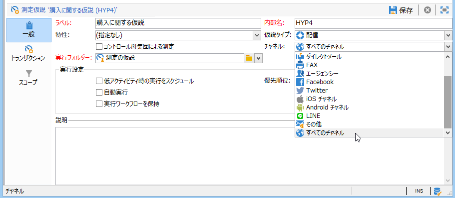

* **[!UICONTROL 実行フォルダー]**：仮説の実行フォルダーを指定します。
* **[!UICONTROL キャンペーンの ROI の計算で考慮]**：関連するキャンペーンの ROI 計算で仮説の結果を考慮します。

### 仮説テンプレートの実行設定 {#hypothesis-template-execution-settings}

テンプレートの「**[!UICONTROL 一般]**」タブでは、仮説実行パラメーターも指定できます。以下のオプションを使用できます。

* **[!UICONTROL 低アクティビティ時の実行をスケジュール]**：仮説の開始をスケジュールして、Adobe Campaign のパフォーマンスを最適化できます。このオプションをオンにすると、キャンペーンの処理ワークフローにより、仮説の計算がダウンタイム中に実行されます。

  

* **[!UICONTROL 優先順位]**：同時に実行される仮説の計算がある場合に計算間隔を開けるために、仮説にレベルを適用します。

  

* **[!UICONTROL 自動実行]**：必要に応じて仮説の計算をスケジュールできます（配信が終了するまで指標を定期的に更新したい場合など）。

  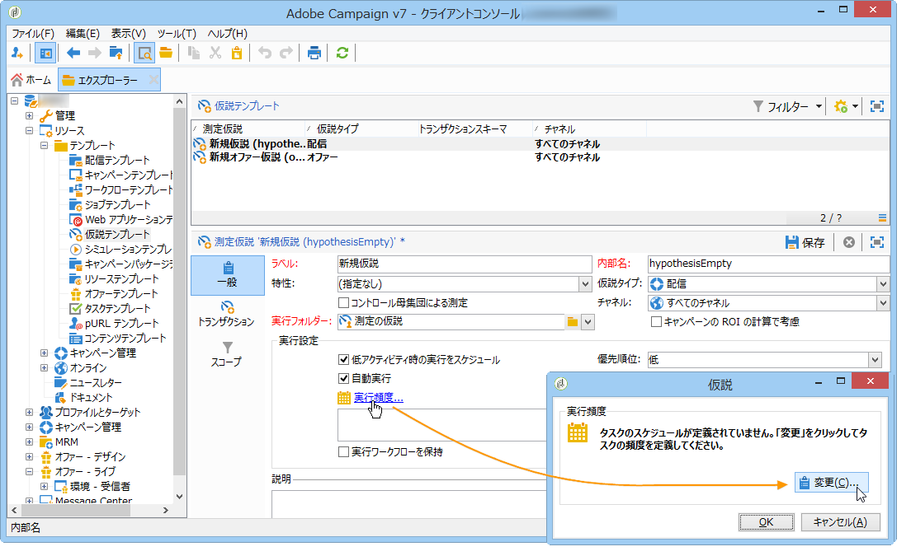

  スケジュールを指定するには、次の手順に従います。

   1. 「**[!UICONTROL 実行頻度...]**」リンクをクリックし、「**[!UICONTROL 変更...]**」ボタンをクリックします。

      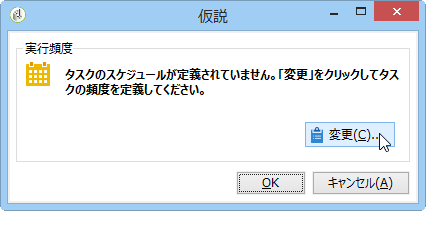

   1. 頻度、関連するイベントおよび有効期間を設定します。

      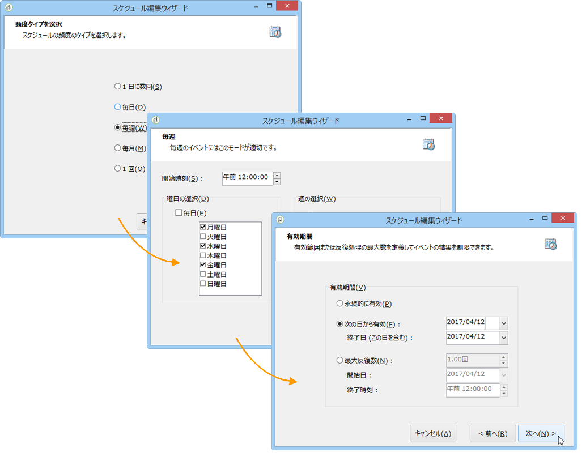

   1. 「**[!UICONTROL 完了]**」をクリックしてスケジュールを保存します。

      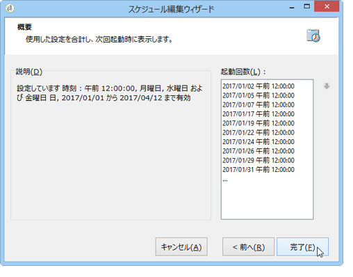

* **[!UICONTROL SQL クエリをログに記録]**：この機能は、エキスパートユーザー向けです。SQL クエリを表示するために、測定の仮説の監査にタブを追加することができます。これにより、シミュレーションでエラーが発生した場合に誤作動を検知することができます。
* **[!UICONTROL 実行ワークフローを保持]**：仮説の計算の開始時に自動的に生成されたワークフローを保持できます。このオプションがオンになっているテンプレートをもとに作成した仮説では、生成されたワークフローを使用してプロセスを確認することができます。

  >[!CAUTION]
  >
  >このオプションは、仮説の実行時にエラーが発生する場合のデバッグ目的でのみ有効にします。\
  >また、自動的に生成されたワークフローは編集しないでください。変更を加えても、その後の計算で考慮されることはありません。\
  >このオプションを有効にしている場合は、実行後にワークフローを削除してください。

### トランザクション {#transactions}

このタブには、トランザクションの観点から受信者の反応の履歴を保存できる様々なフィールドとテーブルが含まれています。応答管理専用のテーブルについて詳しくは、[この節](../../configuration/using/about-schema-reference.md)を参照してください。

* **[!UICONTROL スキーマ（反応ログストレージ）]**：受信者の反応テーブルを選択します。Adobe Campaign の組み込みテーブルは、**NmsRemaMatchRcp** です。
* **[!UICONTROL トランザクションスキーマ]**：仮説で使用するテーブル（トランザクションまたは購入テーブル）を選択します。
* **[!UICONTROL 条件スキーマ]**：仮説のフィルターに使用する条件を選択します。
* **[!UICONTROL 個人へのリンク]**：トランザクションスキーマとして使用するテーブルと個人との間のリンクを選択します。
* **[!UICONTROL 世帯へのリンク]**：世帯のすべてのメンバーを仮説に含める場合に、トランザクションスキーマの世帯へのリンクを選択します。このフィールドはオプションです。
* **[!UICONTROL トランザクション日]**：このフィールドはオプションですが、仮説の計算の範囲を定義できるので、指定することをお勧めします。
* **[!UICONTROL 測定期間]**：仮説を実行して購入ラインを収集する期間の開始日と終了日を設定します。

  仮説を配信にリンクしている場合、ダイレクトメール配信の連絡日の数日後か、メールまたは SMS 配信の配信日後に測定が自動的に開始します。

  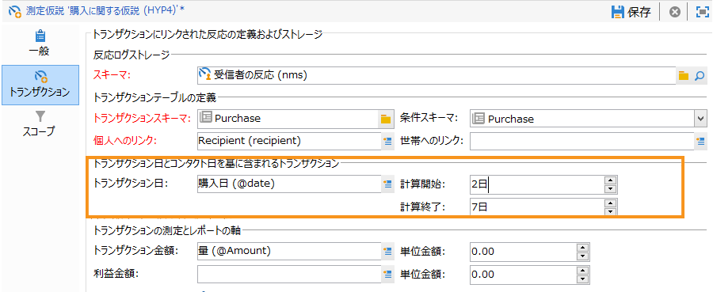

  仮説はオンザフライで開始します。すぐにトリガーしたい場合は、強制的に開始することもできます。そうでない場合は、仮説の作成日に基づいて設定された計算終了日に基づいて、自動的にトリガーされます。[詳細情報](creating-hypotheses.md#creating-a-hypothesis-on-the-fly-on-a-delivery)）。

* **[!UICONTROL トランザクション／利益金額]**：これらのフィールドはオプションで、売上高指標の自動計算に使用できます。[詳細情報](hypothesis-tracking.md#indicators)
* **[!UICONTROL 単位金額]**：売上高を計算するための金額を設定できます。[詳細情報](hypothesis-tracking.md#indicators)

  

* **[!UICONTROL 追加の測定とデータ]**：追加のレポート測定または複数のテーブル内のフィールドの軸を指定できます。
* **[!UICONTROL オファーの提案ステータスを更新]**：仮説でオファーの受信者が特定される場合に、オファーの提案のステータスを変更できます。

  

### 仮説境界 {#hypothesis-perimeter}

仮説で使用するトランザクションテーブルとフィールドを定義し終えたら、フィルターを使用してターゲットのトランザクションと配信を指定し、仮説のスコープをより詳細に設定できます。JavaScript スクリプトを使用してトランザクションテーブルで参照する製品を明示的に指定することもできます。

* **トランザクションのフィルター**：「**[!UICONTROL スコープ]**」タブで仮説のフィルターを設定できます。手順は次のとおりです。

   1. 「**[!UICONTROL クエリを編集]**」リンクをクリックします。

      

   1. フィルター条件を指定します。

      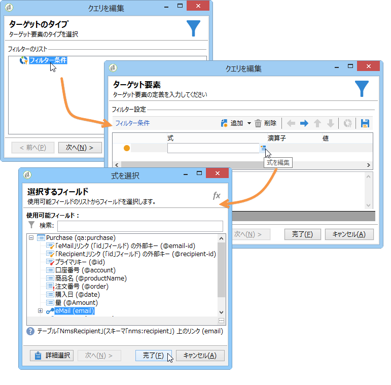

   1. 仮説で使用するトランザクションを選択します。

      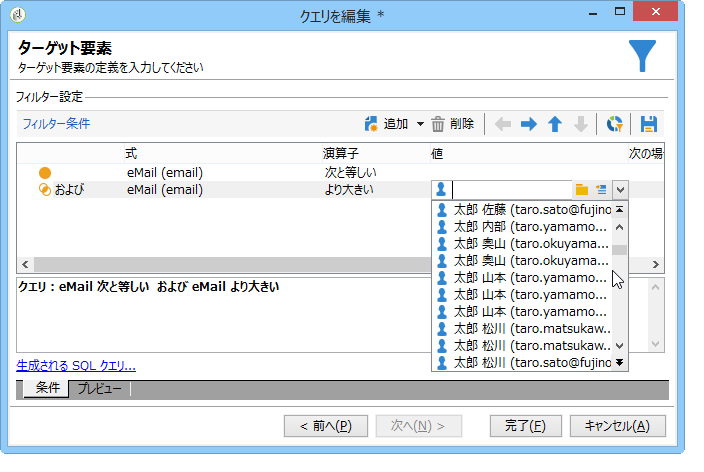

* **受信者をフィルターする場合**：「**[!UICONTROL スコープ]**」タブで、仮説のスコープをメッセージにリンクされた情報のみに制限できます（配信、受信者、メールアドレス、サービスなど）。

   1. 「**[!UICONTROL フィルターを追加]**」リンク、「**[!UICONTROL クエリを編集]**」を順にクリックします。

      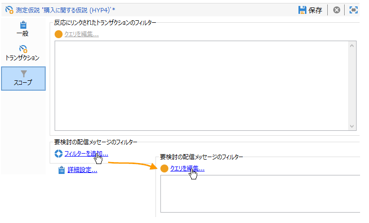

   1. フィルター条件を指定します。

      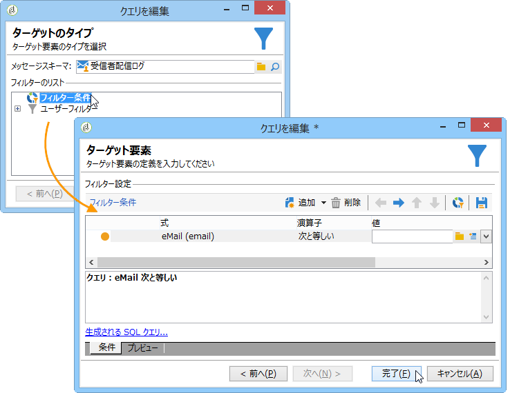

   1. 「**[!UICONTROL 完了]**」をクリックしてクエリを保存します。

      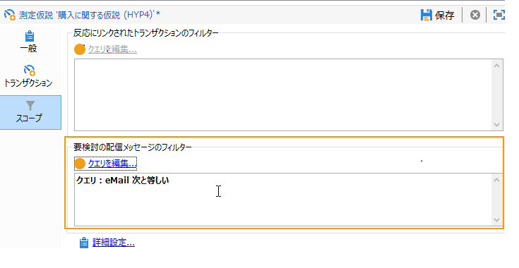

* **スクリプトを使用する場合**：JavaScript スクリプトを使用すると、仮説の実行中に仮説の設定を動的に多重定義できます。

  多重定義するには、「**[!UICONTROL 詳細設定]**」リンクをクリックし、スクリプトを入力します。

  >[!NOTE]
  >
  >このオプションはエキスパートユーザー向けです。

  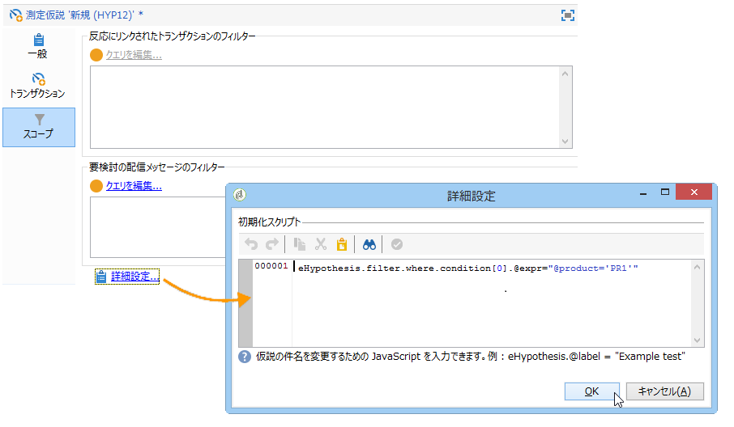

## 例：配信の仮説テンプレートの作成 {#example--creating-a-hypothesis-template-on-a-delivery}

この例では、ダイレクトメールタイプの配信に仮説テンプレートを作成します。仮説が基にするトランザクションテーブル（この例では&#x200B;**購入**）は、記事または製品にリンクされた購入ラインを含みます。モデルを設定し、購入テーブルで記事または製品の仮説を作成します。

1. Adobe Campaign のエクスプローラーで、**[!UICONTROL リソース／テンプレート／仮説テンプレート]**&#x200B;ノードに移動します。
1. 「**[!UICONTROL 新規]**」をクリックしてテンプレートを作成します。

   

1. テンプレートラベルを変更します。

   

1. 仮説タイプに「**[!UICONTROL 配信]**」を選択します。
1. 配信にコントロール母集団を含めるためのボックスをオンにします。
1. 「**[!UICONTROL ダイレクトメール]**」チャネルを選択します。

   >[!NOTE]
   >
   >このテンプレートはダイレクトメール配信用なので、このモデルを使用して作成する仮説をその他の配信タイプにリンクすることはできません。

1. 「**[!UICONTROL トランザクション]**」タブで、受信者の反応テーブルを選択します。

   

1. 「**[!UICONTROL トランザクションスキーマ]**」フィールドで、購入テーブルを選択します。

   

1. 「**[!UICONTROL 条件スキーマ]**」フィールドで購入ラインを選択します。

   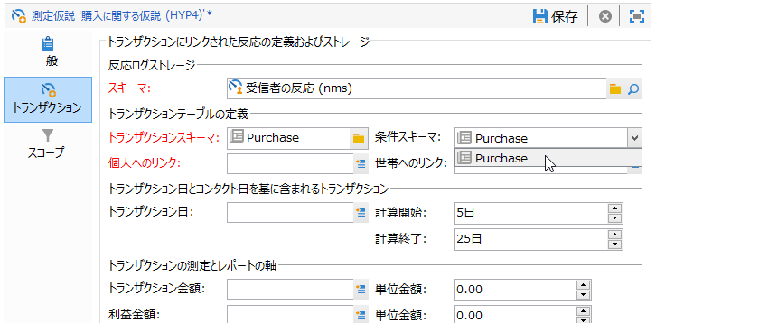

1. 購入テーブルにリンクする受信者を選択します。

   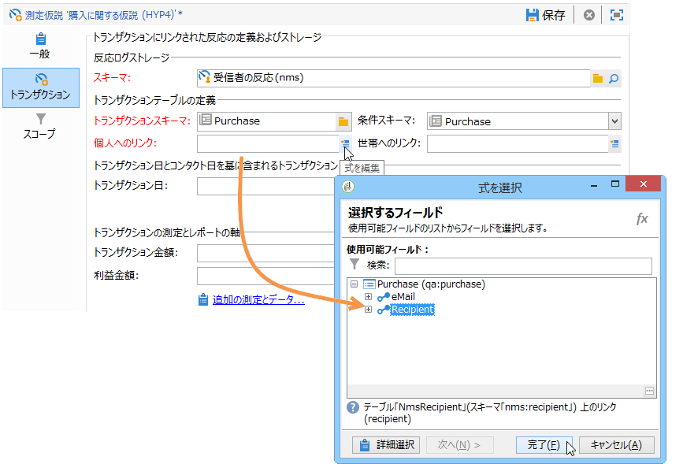

1. 購入日にリンクするフィールドを選択します。

   これにより、仮説の時間枠を定義できます。この手順は必須ではありませんが、実行することをお勧めします。

   

1. 計算期間を 5 日から 25 日に設定します。

   

1. 「**[!UICONTROL スコープ]**」タブで、「**[!UICONTROL クエリを編集]**」をクリックして仮説のフィルターを作成します。

   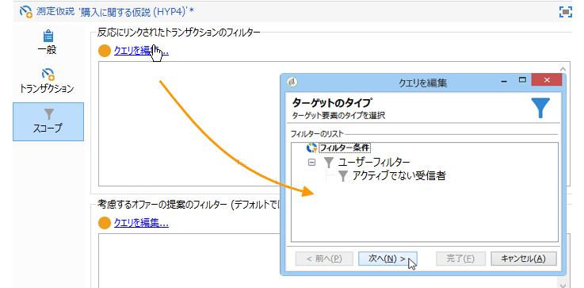

   作成したテンプレートを使用して、購入テーブルで製品または記事の仮説を実行できます。

1. 「**[!UICONTROL 保存]**」をクリックしてテンプレートを記録します。
