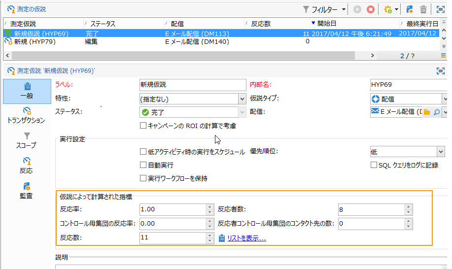
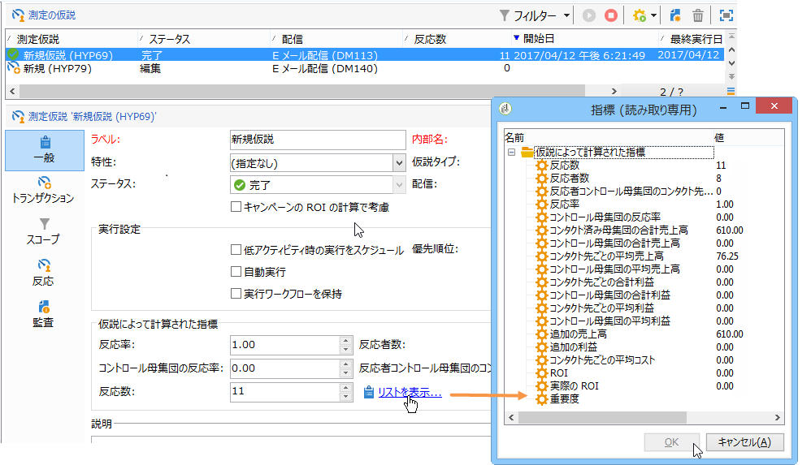
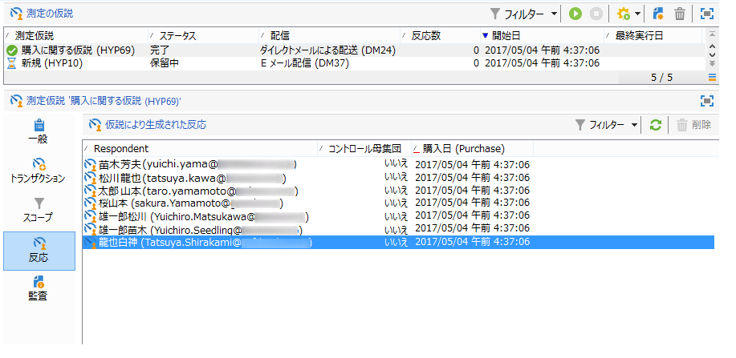
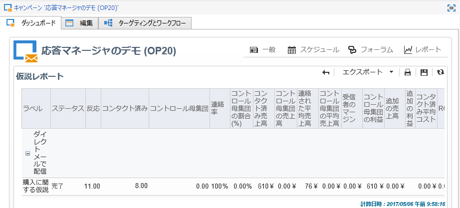
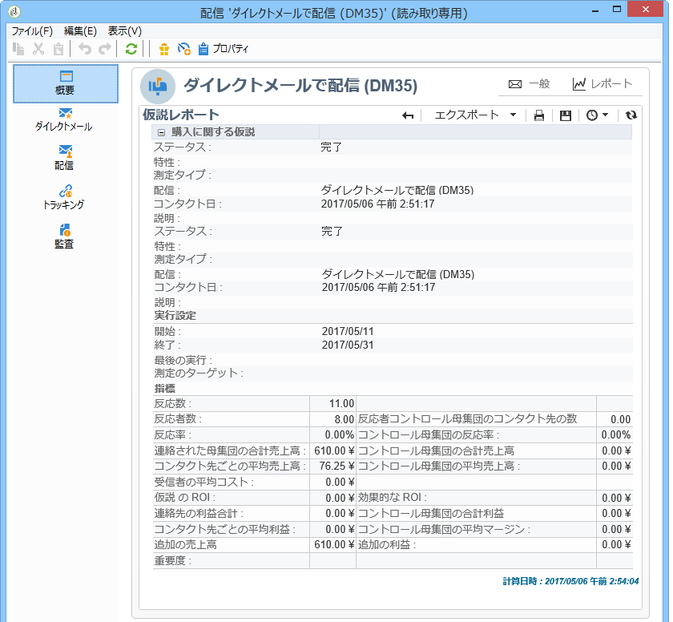

# 仮説のトラッキング{#hypothesis-tracking}

仮説の計算結果は、Adobe Campaign プラットフォームの様々なレベルで確認できます。仮説によって計算された指標およびターゲット母集団の反応は、実際の仮説でもキャンペーンと配信の仮説レポートでも確認できます。

## 仮説の結果 {#hypothesis-results}

### 指標 {#indicators}

仮説が計算されると、いくつかの測定指標が自動的に更新されます。 これらの指標は、仮説の「**[!UICONTROL 一般]**」タブで確認できます。

以下の指標を確認できます。

* **反応者数**：仮説に一致するコンタクト先個人の数。
* **連絡済み反応率**：反応者数÷配信中のコンタクト先の総数。
* **回答者コントロール母集団のコンタクト先の数**：仮説に一致するコントロール母集団の数。
* **コントロール母集団の反応率**：回答者コントロール母集団のコンタクト先の数÷配信コントロール母集団の総数。
* **反応数**：個人、仮説およびトランザクションテーブル間の関係を含むテーブル内のレコード数。

すべての指標のリストについては、「**[!UICONTROL リストを表示]**」リンクをクリックします。

指標により次の情報が提供されます。

* **コンタクト済み母集団の合計売上高**：合計金額÷コンタクトした個人数。
* **コントロール母集団の合計売上高**：合計金額÷コントロール母集団数。
* **コンタクト先ごとの平均売上高**：合計金額÷コンタクト先。
* **コントロール母集団の平均売上高**：合計金額÷コントロール母集団。
* **コンタクト先あたりの利益合計**：合計利益÷コンタクト先。
* **コントロール母集団の合計利益**：合計利益÷コントロール母集団。
* **コンタクト先ごとの平均利益**：合計利益÷コンタクト先。
* **コントロール母集団の平均利益**：合計利益÷コントロール母集団。
* **追加の売上高**：（コンタクト先の平均売上高 - コントロール母集団の平均売上高）&#42; コンタクト先数
* **追加のマージン**：（コンタクト先の平均利益 - コントロール母集団の平均利益）÷ コンタクト先数
* **コンタクト先あたり平均コスト**：計算済み配信コスト÷コンタクト先数。
* **ROI**：配信の計算されたコスト÷コンタクト先ごとの合計利益
* **効果的な ROI**：計算済み配信コスト÷追加利益。
* **重要度**：キャンペーンの重要度に応じて 0 ～ 3 の値。

### 反応 {#reactions}

仮説に対する受信者の反応は、「**[!UICONTROL 反応]**」タブで確認できます。

1. 仮説の計算が完了したら、Adobe Campaign ツリーの&#x200B;**[!UICONTROL キャンペーン管理／測定の仮説]**&#x200B;ノードに移動します。
1. 仮説を選択し、「**[!UICONTROL 反応]**」タブをクリックして、マーケティングキャンペーン後に何かを購入する可能性がある受信者のリストを確認します。

   

## レポート {#reports}

「**[!UICONTROL 仮説レポート]**」では、キャンペーンおよび配信で実行した仮説の結果を確認できます。 このレポートには、仮説によって計算された指標が含まれます（詳しくは、[指標](#indicators)を参照）。

* **キャンペーンレベルで確認する場合**：キャンペーンの「**[!UICONTROL レポート]**」リンクをクリックし、「**[!UICONTROL 仮説レポート]**」を選択します。 このレポートには、キャンペーン配信と、各配信に計算された仮説のリストが含まれます。

  

* **配信レベルで確認する場合**：レポートにアクセスするには、配信を開き、「**[!UICONTROL 概要]**」タブの「**[!UICONTROL レポート]**」をクリックし、「**[!UICONTROL 仮説レポート]**」を選択します。 同一の配信に複数の仮説が計算された場合は、すべての仮説がレポートに表示されます。

  
