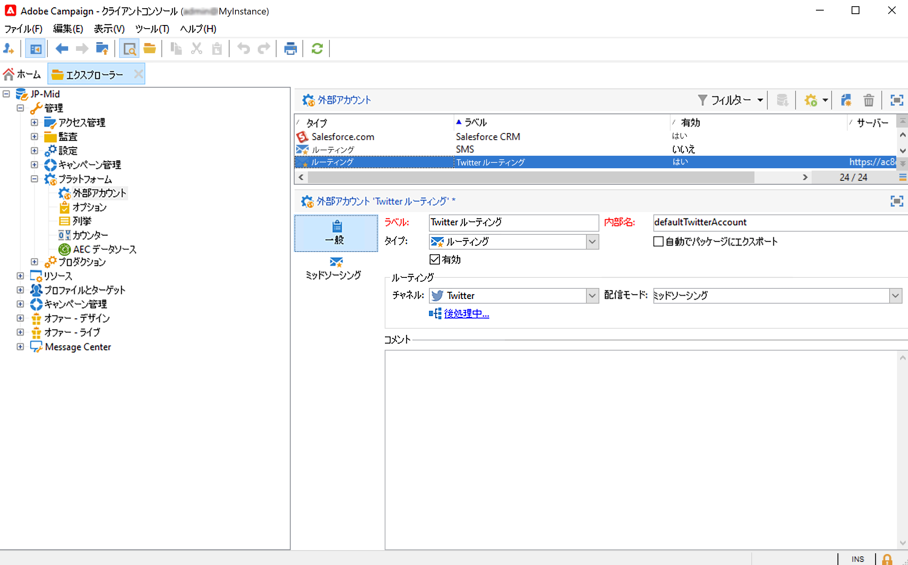

# ソーシャルマーケティングについて{#about-social-marketing}

ソーシャルネットワークを管理するために設計された&#x200B;**ソーシャルネットワーク管理**（ソーシャルマーケティング）アプリケーションを使用すると、Twitter を介して顧客や見込み客とやり取りすることができます。

Campaign と Twitter を統合する主な手順については、[Campaign v8 ドキュメント](https://experienceleague.adobe.com/docs/campaign/campaign-v8/connect/ac-tw.html?lang=ja){target="_blank"}を参照してください。

オンプレミス環境またはハイブリッド環境のお客様は、Twitter の外部アカウントを設定して有効にする必要があります。ハイブリッド設定の場合、「**ミッドソーシング**」タブも、ミッドソーシングプラットフォームへのアクティブな接続を設定する必要があります。

