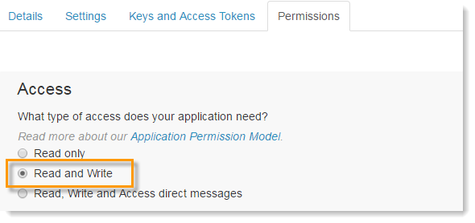
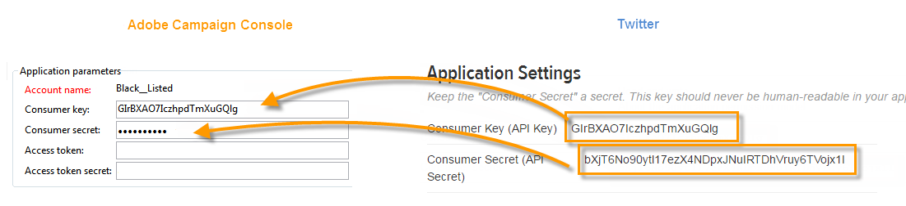

# Twitterでの投稿の設定{#configuring-publishing-on-twitter}

Adobe CampaignがTwitterアカウントにツイートを送信できるようにするには、これらのアカウントのAdobe Campaignへの書き込みアクセス権を委任する必要があります。 これを行うには、次の設定手順を適用します。

* Twitterアカウントを作成します。
* 校正を送信するためのテスト用Twitterアカウントを作成します。
* Twitterアカウントごとに1つのTwitterアプリを作成します。
* 各Twitterアプリに対して、新しいタイプのサービスを **[!UICONTROL Twitter]** 作成します。

## 前提条件 {#prerequisites}

まず、ツイートの送信先の1つ以上のTwitterアカウントを作成します。

Twitterアカウントを作成するには、https://twitter.comにアクセス [します](https://twitter.com)。

## Twitterでのテストアカウントの作成 {#creating-a-test-account-on-twitter}

ツイートの校正を送信するために使用できる非公開のTwitterアカウントを作成することもお勧めします(詳しくは、「 [Sending the proof](../../social/using/publishing-on-twitter.md#sending-the-proof)」を参照)。

* 新しいTwitterアカウントを作成します。
* 右上隅のメニューをクリックし、を選択します **[!UICONTROL Settings]**。
* タブを選択 **[!UICONTROL Security and privacy]** し、チェックボックスをオンに **[!UICONTROL Protect my Tweets]** します。
* ページの下 **[!UICONTROL Save Changes]** 部にあるボタンをクリックします。

## Twitterでのアプリの作成 {#creating-an-application-on-twitter}

Adobe CampaignでTwitterアカウントにツイートを送信するには、Twitterアカウントごとに1つのTwitterアプリを作成する必要があります。 それには、次の手順に従います。

1. Twitterアカウントにログオンします。
1. インターネットブラウザーに次のアドレスを入力します。https://apps.twitter.com/ .
1. 次に、右側のボ **[!UICONTROL Create New App]** タンをクリックします。

   

1. ウィザードの指示に従ってプロセスを進めます。

   このアプリでAdobe Campaignが自分のアカウントにツイートを送信できるようにするには、アプリのタブに移動し **[!UICONTROL Permissions]** て、そのセクション **[!UICONTROL Read and Write]** を選択 **[!UICONTROL Access]** します。 また、この **[!UICONTROL Settings]** タブでは、フィールドを空のままにしておく必要 **[!UICONTROL Callback URL]** があります。

   

## Adobe Campaignへの書き込みアクセスの委任 {#delegating-write-access-to-adobe-campaign}

Twitterアプリごとに、アプリの設定を含む異なるタイプのサ **[!UICONTROL Twitter]** ービスを作成する必要があります。

この手順では、Adobe Campaignコンソールと、Twitterアカウントにログオンしているインターネットブラウザーに同時にアクセスする必要があります。

* **Twitter**:以前に作成したアプリケーション([https://dev.twitter.com/apps](https://dev.twitter.com/apps))を選択し、タブをクリック **[!UICONTROL Keys and Access Tokens]** します。

   

* **Adobe Campaign**:宇宙に移動し **[!UICONTROL Profiles and targets]** 、リンクをクリック **[!UICONTROL Services and Subscriptions]** してボタンをクリック **[!UICONTROL Create]** します。

   

1. Select the **[!UICONTROL Twitter]** type.

   

   >[!NOTE]
   >
   >このオプ **[!UICONTROL Synchronize subscriptions]** ションはデフォルトで有効になっています。 このボックスをオンにすると、Twitterアカウントの同期ワークフロー( [Twitterアカウントの同期を参照](#synchronizing-twitter-accounts))でTwitterのフォロワーのリストが回復され、ダイレクトメッセージを送信できるようになります(購読者へのダイレクトメッセージの送信を参照 )。 フォロワーのリストを回復しない場合は、このボックスのチェックを外します。

1. サービスのラベルと内部名を入力します。

   

   >[!IMPORTANT]
   >
   >サー **[!UICONTROL Internal name]** ビスの名前は、Twitterアカウントの名前と同じにする必要があります。 エントリエラーがないことを確認するには、次の手順を適用します。

   * ボタンをクリッ **[!UICONTROL Save]** クします。
   * サービスの概要で、作成したTwitterタイプのサービスをクリックします。
   * タブを選択 **[!UICONTROL Twitter page]** します。 Twitterアカウントが表示されます。

      

1. フィールド **[!UICONTROL Visitor folder]** で、フォロワーを作成する訪問者フォルダーを選択します。 For more on this, refer to [Operating principle](../../social/using/publishing-on-twitter.md#operating-principle). デフォルトでは、フォロワーはフォルダーのルートに作成さ **[!UICONTROL Visitors]** れます。

   

1. Twitterで、およびフィールドの内容をコピ **[!UICONTROL Consumer Key (API Key)]** ーし、コ **[!UICONTROL Consumer Secret (API Secret)]** ンソールのおよびフ **[!UICONTROL Consumer key]** ィール **[!UICONTROL Consumer secret]** ドに貼り付けます。

   

1. Twitterで、およびフィールドの内容をコピ **[!UICONTROL Access Token]** ーし、コ **[!UICONTROL Access Token Secret]** ンソールのおよびフ **[!UICONTROL Access token]** ィール **[!UICONTROL Access token secret]** ドに貼り付けます。

   

1. Adobe Campaignコンソールで、をクリックしま **[!UICONTROL Save]**&#x200B;す。 書き込みアクセス権のAdobe Campaignへの委任が完了しました。

   

>[!NOTE]
>
>Twitterアプリケーションごとに1つのタ **[!UICONTROL Twitter]** イプサービスを作成する必要があります。

ワークフ **[!UICONTROL Twitter account Synchronization]** ローは、Adobe CampaignでTwitterアカウントを同期します。 詳しくは、「Facebookページの同期」を参 [照してください](../../social/using/publishing-on-facebook-walls.md#synchronizing-facebook-pages)。

## Twitterアカウントの同期 {#synchronizing-twitter-accounts}

>[!IMPORTANT]
>
>ワークフローでTwitter購読者のリストを回復するには、アカウントにリンクされ **[!UICONTROL Twitter account synchronization]** たサービスの編集セクションで、このボックスをチェックする必要があります。 詳しくは、「Adobe Campaignへの書き込みアク [セスの委任」を参照してください](#delegating-write-access-to-adobe-campaign)。

このワ **[!UICONTROL Twitter account synchronization]** ークフローは、ノードを介してアクセス **[!UICONTROL Administration > Production > Technical workflows > Managing social networks]** され、以前にAdobe Campaignで設定したTwitterアカウントを同期できます。 デフォルトでは、このワークフローは木曜日の午前7時30分にトリガーされます。

>[!NOTE]
>
>予想されるタスク処理を実行することで、ワークフローをいつでも開始できます。 スケジューラーを編集して、ワークフローのトリガー頻度を変更することもできます。 For more on the scheduler, refer to [this section](../../workflow/using/scheduler.md).

Twitterアカウントにツイートを送信し、フォロワーにダイレクトメッセージを送信できるようになりました。 詳しくは、次を参照してください。Twitter [での投稿](../../social/using/publishing-on-twitter.md)。
