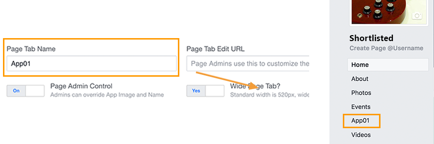

# Facebookアプリの作成{#creating-a-facebook-application}

Social Marketingでは、Webアプリのおかげで、パーソナライズされたコンテンツをFacebookアプリに表示でき、このソーシャルネットワークを使用して見込み客を容易に獲得できます。 FacebookタイプのWebアプリケーションの例については、「Facebookアプリケー [ションの例」を参照してください](../../social/using/examples-of-facebook-apps.md)。

>[!NOTE]
>
>また、パートナーが開発したFacebookアプリケーションとAdobe Campaignを統合することもできます。 この場合、Adobe Campaign webアプリケーションを使用してFacebookプロファイルを取得する必要はありません。 For more on this, refer to [Configuring external accounts](#configuring-external-accounts).

次の設定手順を実行します。

1. 1つ以上のFacebookアプリを作成します。 For more on this, refer to: [Creating a Facebook application](../../social/using/publishing-on-facebook-walls.md#creating-a-facebook-application).
1. Facebook権限リクエ **[!UICONTROL terms of service]** スト画面 **[!UICONTROL Privacy policy]** に表示するおよびリンクを入力します。 詳しくは、次を参照してください。サー [ビス規約およびプライバシーポリシーのリンクの入力](#entering-the-terms-of-service-and-privacy-policy-links)。
1. 各Facebookアプリに対して、タイプの外部アカウ **[!UICONTROL Facebook Connect]** ントを作成します。 For more on this, refer to: [Configuring external accounts](#configuring-external-accounts).
1. Facebookアプリごとに、Adobe CampaignでFacebookタイプのWebアプリを作成します。 詳しくは、次を参照してください。Facebookタイプ [のWebアプリケーションの作成](#creating-a-facebook-type-web-application)。
1. FacebookアプリがFacebookページのタブとして表示されるように設定します。 For more on this, refer to: [Configuring Facebook tabs](#configuring-facebook-tabs).

## 外部アカウントの設定 {#configuring-external-accounts}

Facebook アプリケーションごとに、**[!UICONTROL Facebook Connect]** タイプの外部アカウントを作成する必要があります。

この手順では、Adobe Campaignコンソールと、ページ管理に使用するFacebookアカウントにログオンしているインターネットブラウザーの両方にアクセスする必要があります。

* **Facebook**:前に作成したアプリケーション( [https://developers.facebook.com/apps](https://developers.facebook.com/apps))を選択し、「/」タ **[!UICONTROL Settings]** ブを選択 **[!UICONTROL Basic]** します。

   

   >[!NOTE]
   >
   >セクション **[!UICONTROL Facebook Web Games]** が表示されない場合は、ページの下 **[!UICONTROL Add Platform]** 部にあるボタンをクリックし、を選択します **[!UICONTROL Facebook Web Games]**。

* **Adobe Campaign**:ツリーのノ **[!UICONTROL Administration > Platform > External accounts]** ードに移動し、をクリックしま **[!UICONTROL New]**&#x200B;す。

   

1. ラベルと内部名を入力し、タイプを選択し **[!UICONTROL Facebook Connect]** ます。

   

1. アプリケーションのホスティングモードを選択します。ま **[!UICONTROL hosted by a partner]** た **[!UICONTROL hosted by this instance]**&#x200B;は

   

   **パートナーがホストするアプリケーション**

   パートナーが開発したFacebookアプリケーションとAdobe Campaignを統合できます。 この場合、Adobe Campaign webアプリケーションを使用してFacebookプロファイルを取得する必要はありません。 Facebookユーザーがアプリをインストールすると、キー（アクセストークン）が生成されます。 パートナーは、Webサービスを呼び出して、このアクセストークンをAdobe Campaignに転送します。 その後、Adobe Campaignはこのトークンを使用してFacebookデータベースにログオンし、アプリケーションを介してユーザーが共有するデータを収集します。

   >[!NOTE]
   >
   >Webサービスのパラメーターの詳細については、次のWSDLファイルを参照してください。 **`https://<Instance name>/nl/jsp/schemawsdl.jsp?schema=nms:visitor`**

   サードパーティアプリケーションをAdobe Campaignに統合するには、および **[!UICONTROL App ID]****[!UICONTROL App Secret]** Facebookフィールドのコンテンツをコピーして、コンソールのフィールドとフィールドに貼り付け **[!UICONTROL Application ID]** る必 **[!UICONTROL Application secret]** 要があります。

   

   **このインスタンスでホストされるアプリケーション**

   このインスタンスでアプリをホストする場合（サードパーティのアプリケーションがない場合）、Adobe Campaign webアプリケーションを使用してFacebookプロファイルを取得する必要があります。 詳しくは、「Facebookアプリの例」 [を参照してください](../../social/using/examples-of-facebook-apps.md)。

   Adobe Campaignコンソールで、フィールドに含まれるアドレスをコピー **[!UICONTROL Secure Canvas URL]** し、Facebook上の（セクション内の） **[!UICONTROL Facebook Web games (https)]** フィールドに貼り付 **[!UICONTROL Facebook Web Games]** けます。

   

   >[!CAUTION]
   >
   >どのような状況でも、保護されていないURLを使用してはいけません。

   Facebookで、フィールドとフィールドの内容をコ **[!UICONTROL App ID]** ピーし **[!UICONTROL App Secret]** て、コンソールのフィ **[!UICONTROL Application ID]** ールド **[!UICONTROL Application secret]** に貼り付けます。

   

1. Facebookで、ページの下部 **[!UICONTROL Save Changes]** にあるボタンをクリックします。
1. Adobe Campaignコンソールで、このボタンをクリックす **[!UICONTROL Subscribe]** ると、ファンがこのアプリケーションを介してチェックインするたびに、Adobe Campaignがリアルタイムでデータを回復できます。 詳しくは、次を参照してください。Facebookア [プリの例を参照してください](../../social/using/examples-of-facebook-apps.md)。

   

## サービス規約およびプライバシーポリシーのリンクの入力 {#entering-the-terms-of-service-and-privacy-policy-links}

Facebook権限リクエスト画面に **[!UICONTROL Terms of service]** 表示する **[!UICONTROL Privacy policy]** リンクとリンクを追加することを強くお勧めします。

設定段階は次のとおりです。

1. 次のアドレスを入力します。https://developers.facebook.com/apps [を開き](https://developers.facebook.com/apps)、Facebookアプリを選択します。
1. タブを選択 **[!UICONTROL Settings > Basic]** し、フィールドとフ **[!UICONTROL Privacy Policy URL]** ィールドを入 **[!UICONTROL Terms of Service URL]** 力します。

   

## FacebookタイプのWebアプリケーションの作成 {#creating-a-facebook-type-web-application}

Adobe Campaign Facebookアプリを使用すると、パーソナライズされたコンテンツをFacebookアプリに表示できます。 各Facebookアプリに対して、Adobe CampaignでWebアプリを作成する必要があります。 Facebook webアプリケーションを作成するには、次の手順に従います。

1. 宇宙に移動し **[!UICONTROL Social networks]** 、リンクをクリ **[!UICONTROL Applications]** ックして、ボタンをクリッ **[!UICONTROL Create]** クします。

   

1. リストからFacebook webアプリテンプレートを選択し、ラベルを入力します。

   

   >[!NOTE]
   >
   >デフォルトで提供されるFacebook webアプリケーションテンプレートは4つあります。
   >
   >* **[!UICONTROL New Facebook application]**:空白のアプリから開始する場合は、このテンプレートを選択します。
   >* **[!UICONTROL Pre-entered form]**:フォームと「Facebookログイン」ボタンを持つFacebookアプリケーション。ユーザーは、プロファイルのデータを使用してフォームのフィールドに自動入力できます。 これにより、ユーザーはより迅速にフォームに記入し、ブランドはより良い品質の情報を得ることができます。
   >* **[!UICONTROL "Canvas page" competition]**:ユーザーに視覚的な効果を与えるために画面に表示されるFacebookアプリ。
   >* **[!UICONTROL "Page Tab" competition]**:Facebookアプリは、ブランドページのタブに完全に統合されています。

1. フィールド **[!UICONTROL Application]** に、Facebookアプリにリンクされた外部アカウントを入力します。 For more on this, refer to: [Configuring external accounts](#configuring-external-accounts).

   

1. タブを選択し **[!UICONTROL Edit]** て、Webアプリケーションを編集します。 詳しくは、次を参照してください。Facebookア [プリの例を参照してください](../../social/using/examples-of-facebook-apps.md)。

   

1. Webアプリケーションが完了したら、タブを選択し、をク **[!UICONTROL Dashboard]** リックしてオンラインで公 **[!UICONTROL Publish]** 開します。

   

## Facebookタブの設定 {#configuring-facebook-tabs}

Facebookページにタブとして表示されるFacebookアプリを設定できます。 それには、次の手順に従います。

1. Facebookアプリ(https://developers.facebook.com/apps[)を選択し、タブを選択し](https://developers.facebook.com/apps)**[!UICONTROL Settings > Basic]** ます。

   

1. ページの下部で、ボタンをクリック **[!UICONTROL Add Platform]** し、を選択します **[!UICONTROL Page Tab]**。

   

1. セクション **[!UICONTROL Page Tab Name]** のフィールド **[!UICONTROL Page Tab]** に、Facebookページに表示するラベルを入力します。

   

1. このフィー **[!UICONTROL Secure Page Tab URL]** ルドに、Webアプリケーションの公開URLを入力します。このURLは、Webアプリケーションのタ **[!UICONTROL Dashboard]** ブからアクセスできます。 FacebookタイプのWebアプリケーションの作成について詳しくは、「FacebookタイプのWebア [プリケーションの作成」を参照してくださ](#creating-a-facebook-type-web-application)い。

   

1. Webアプリケ **[!UICONTROL Dashboard]** ーションの上で、リンクをクリック **[!UICONTROL Add a page tab]** します。

   

1. タブの追加先のFacebookページを選択し、をクリックします **[!UICONTROL Add Page Tab]**。

   

