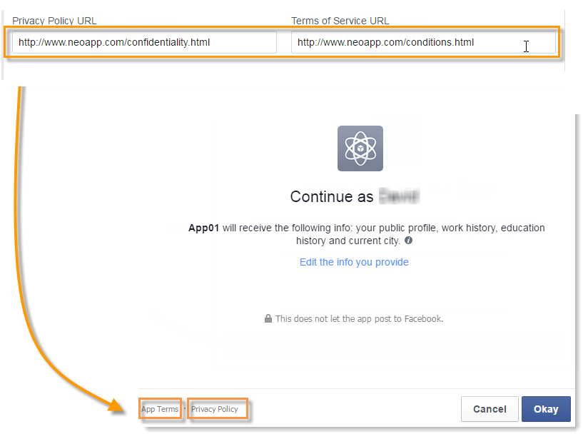
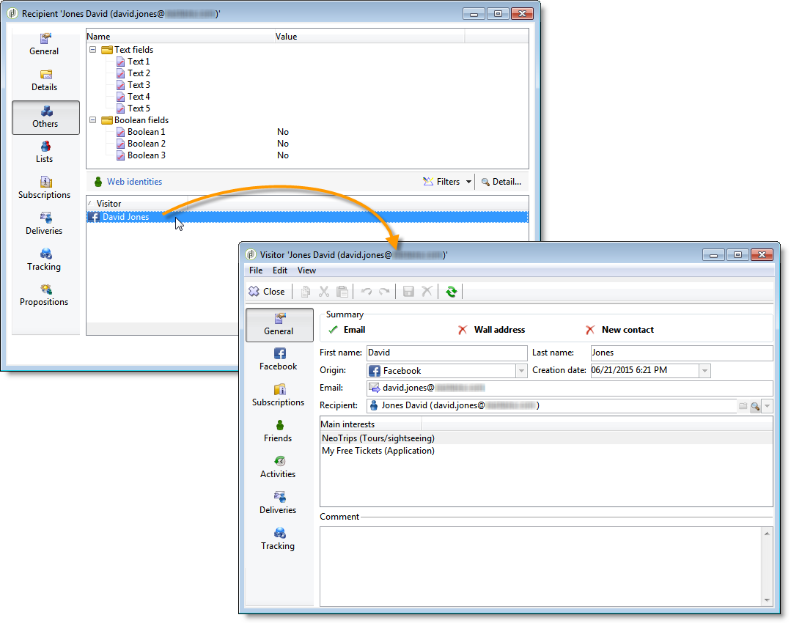

# Facebookアプリの例{#examples-of-facebook-apps}

ユーザーがFacebookアプリのタブをクリックすると、幅が810ピクセルのスペースに表示されます。 Adobe Campaignでは、FacebookタイプのWebアプリケーションを使用して、Facebookアプリケーションに表示するコンテンツを定義およびパーソナライズできるので、プロファイルの取得が容易になります。

>[!NOTE]
>
>また、パートナーが開発したFacebookアプリケーションとAdobe Campaignを統合することもできます。 この場合、Adobe Campaign webアプリケーションを使用してFacebookプロファイルを取得する必要はありません。 For more on this, refer to [Configuring external accounts](../../social/using/creating-a-facebook-application.md#configuring-external-accounts).

>[!IMPORTANT]
>
>Facebookアプリケーションの作成で説明されている設定手 [順に従ってください](../../social/using/creating-a-facebook-application.md)。

>[!NOTE]
>
>ここでは、FacebookタイプのWebアプリにリンクされた要素について詳しく説明します。 標準のWebアプリケーションと共有するすべての要素について、この節で [詳しく説明しま](../../web/using/about-web-applications.md)す。

ここで詳しく説明するFacebookタイプのWebアプリの例を以下に示します。

* 7つの手順でFacebookアプリを作成する方法を説明します。 詳しくは、クイックス [タートを参照してください。Facebookアプリの作成手順は7つです](#quick-start--creating-a-facebook-application-in-7-steps)。
* 設定をFacebookアプリケーションに転送する方法を説明します。 設定をFacebookア [プリに転送する方法を参照してください](#how-to-forward-settings-to-a-facebook-application-)。
* ファンデータの取得方法。 ファンデ [ータの取得方法を参照](#how-to-acquire-fan-data-)。

>[!IMPORTANT]
>
>以下の単純な使用例は、FacebookタイプのWebアプリケーションの機能を示す例として提供されています。

## 推奨事項 {#recommendations}

次の制限はFacebookに直接リンクされています。

* すべてのWebアプリケーションはHTTPSで構築する必要があります。
* タブを介して表示されるFacebookアプリの幅は810ピクセルです。

## クイックスタート：7つの手順でFacebookアプリを作成する {#quick-start--creating-a-facebook-application-in-7-steps}

この例では、Adobe Campaignで作成したアプリをFacebookに表示する手順を説明します。 この場合、ユーザーが「アプリ」タブ( **App01******)をクリックしたときにようこそメッセージを表示できるアプリを作成します。

このアプリケーションを作成するには、次の手順を適用します。

1. Facebookでアプリを作成します(https://developers.facebook.com/apps )。 For more on this, refer to: [Creating a Facebook application](../../social/using/publishing-on-facebook-walls.md#creating-a-facebook-application).

   

1. タイプの外部ア **[!UICONTROL Facebook Connect]** カウントを作成し、Facebookアプリのパラメーターを入力します。 For more on this, refer to: [Configuring external accounts](../../social/using/creating-a-facebook-application.md#configuring-external-accounts).

   

1. Facebook権限リクエ **[!UICONTROL Terms of service]** スト画面 **[!UICONTROL Privacy policy]** に表示するおよびリンクを入力します。 詳しくは、次を参照してください。サー [ビス規約およびプライバシーポリシーのリンクの入力](../../social/using/creating-a-facebook-application.md#entering-the-terms-of-service-and-privacy-policy-links)。

   

1. Adobe CampaignでFacebookタイプのWebアプリケーションを作成します。 詳しくは、次を参照してください。Facebookタイプ [のWebアプリケーションの作成](../../social/using/creating-a-facebook-application.md#creating-a-facebook-type-web-application)。

   

1. Webアプリケーションを編集します。 この例では、アクティビティを追加し、そ **[!UICONTROL Page]** のタイトルを定義しています。

   

1. アプリケーションをデプロイします。

   

1. FacebookアプリがFacebookページのタブとして表示されるように設定します。 For more on this, refer to: [Configuring Facebook tabs](../../social/using/creating-a-facebook-application.md#configuring-facebook-tabs).

   

App01アプリのタブがFacebookページに表 **示される** ことを確認します。 クリックすると、お知らせメッセージが **表示され** ます。

## 設定をFacebookアプリケーションに転送する方法を教えてください。 {#how-to-forward-settings-to-a-facebook-application-}

>[!IMPORTANT]
>
>「Facebookアプリケーションの作成」で詳しく説 [明されている設定手順に従います](../../social/using/creating-a-facebook-application.md)。

例1では、フィールドの値に従ってFacebookページの表示をパーソナライズし **[!UICONTROL Fan of the page]** ます。 フィールドを処理することもでき **[!UICONTROL Application settings]** ます。 このフィールドを使用すると、Adobe Campaignで生成されたリンクに含まれるデータをFacebook経由で回復できます。

電子メールキャンペーンの送信を決定した会社の例を見てみましょう。 配信では、リンクがFacebookアプリに向かっています。 このリンクは、URLの末尾に追加されたパラ **[!UICONTROL app_data]** メーターによってパーソナライズされます。 このパラメーターの値は、顧客の意義を反映するインジケーターにすることができます。 この例では、パラメーターの値は **[!UICONTROL app_data]** (重要な顧 **[!UICONTROL big]** 客)と **[!UICONTROL small]** （あまり重要でない顧客）です。

パーソナライズされると、URLは次のようになります。

* `http://<path of the Facebook application>&app_data=big` （重要なお客様向け）
* `http://<path of the Facebook application>&app_data=small` （あまり重要でない顧客の場合）

FacebookによってAdobe Campaignに転送された匿名データの中で、フィールドの値が収集され、Adobe Campaignでこのパラメーターに基づいてアプリの表示をパーソナライズできます。 **[!UICONTROL Application parameters]**

ユーザーが重要な顧客(パラメーターの値が **[!UICONTROL app_data]** )の場合、 **[!UICONTROL big]**&#x200B;次の画像が表示されます。

ユーザーの重要度が低い場合(パラメーターの値が **[!UICONTROL app_data]** である **[!UICONTROL small]**)は、次の画像が表示されます。

この使用例を再作成するには、次の要素で構成されるWebアプリケーションを作成しました。

* フィー **[!UICONTROL Test]** ルドに基づくアクティビティ **[!UICONTROL Application parameter]** です。
* フィールドの値に従って表示する画像を含む2つのページ **[!UICONTROL Application parameter]** 。

## ファンデータの取得方法 {#how-to-acquire-fan-data-}

>[!CAUTION]
>
>「Facebookアプリケーションの作成」で詳しく説 [明されている設定手順に従います](../../social/using/creating-a-facebook-application.md)。

この例は、Facebookユーザーと連絡を取り、ユーザーがプロフィール情報を共有できるようにする方法を示します。 見込み客を獲得したいと思っている企業の例を見てみましょう。Facebookのページでコンペティションを組織し、見込み客を惹きつけようとしています。

ユーザーがタブをクリ **[!UICONTROL App03]** ックするたびに、競合相手に参加するかどうかを尋ねます。

彼らがコンペに参加すると決めたら、彼らのプロフィール情報を共有するよう申し出ます。

情報の共有に同意すると、次の画面が表示されます。

この使用例を作成するには、次の要素を含むWebアプリケーションを作成しました。

* 活 **[!UICONTROL Test]** 動
* 三ページ
* 活 **[!UICONTROL Access control]** 動
* 活 **[!UICONTROL Pre-loading]** 動
* 活 **[!UICONTROL Save]** 動
* 活 **[!UICONTROL End]** 動

### テストアクティビティ {#test-activity}

アクティビテ **[!UICONTROL Test]** ィは、「&amp;」フィールドに基づ **[!UICONTROL ID]** いて作成 **[!UICONTROL Application parameters]** されます。

3つの枝で構成されています。

* **[!UICONTROL identifier (UID) is empty]** :識別子は、ユーザーが既に情報の共有に同意している場合にのみ、Facebookによって転送されます。 アクティビティの最初のブ **[!UICONTROL Test]** ランチでは、入力したことのないユーザー（空のIDを持つユーザー）のみが競合を利用できるようにします。
* **[!UICONTROL application parameter equals 'thanks']** :facebookにリンクされた表示エラーを回避するために、Webアプリのエンドページは、値を使用してパラメーターが追加されたFacebookアプリの **[!UICONTROL app_data]** URLを指し **[!UICONTROL thanks]** ています(詳しくは、次を参照してください。アクテ [ィビティの終了](#end-activity))。 2つ目のブランチでは、ユーザーが1つ目のブランチのアクティビティから来たかどうかを調べ、「ありがとうございます」というメッセージを表示できます。 **[!UICONTROL End]** 追加のURLパラメーターの使用について詳しくは、次を参照してください。Facebookア [プリに設定を転送する方法を教えてください](#how-to-forward-settings-to-a-facebook-application-)。
* **[!UICONTROL Default branch]** :ユーザーが前日に既に競合相手（IDが既に入力されている）に参加している場合は(アプリケーションパラメーターとは異なる **[!UICONTROL thanks]**)、既に参加したことを示すページが表示されます。

### 競合ページ {#competition-page}

Facebookにリンクされた表示エラーを回避するには、競合ページのフィールド **[!UICONTROL Parent window]** でまた **[!UICONTROL In the top window]** はを選 **[!UICONTROL Window]** 択する必要もあります。

### アクセス制御アクティビティ {#access-control-activity}

アクテ **[!UICONTROL Access control]** ィビティを使用すると、ユーザーが競合相手に入ったときにFacebook権限リクエストページを表示できます。 情報の共有に同意した場合は、プリロード時に復元されます。 For more on this, refer to: [Pre-loading activity](#pre-loading-activity).

Webアプリの作成時に以前に外部アカウントを入力した場合(「 [FacebookタイプのWebアプリの作成」を参照](../../social/using/creating-a-facebook-application.md#creating-a-facebook-type-web-application))は、アクティビティを編集する必要はありません。 そうでない場合は、このフィールドに移動し **[!UICONTROL Application]** 、Facebookアプリにリンクされている外部アカウントを選択します。

### プリロードアクティビティ {#pre-loading-activity}

プリロードに使用するデータソースを選択します。

* **[!UICONTROL Marketing database]** :このオプションを使用すると、Adobe Campaignデータベースを介してデータを事前に読み込むことができます。
* **[!UICONTROL Facebook]** :このオプションを使用すると、Facebookを使用してデータを事前に読み込むことができます。

**マーケティングデータベース**

このオプションを使用すると、visitorsテーブルに存在するプロファイルのデータを回復できます。 検証は、ユーザがFacebookアプリタブをクリックしたときに回復した外部Facebook IDに基づいて行われます。 アクティビティの後にフォームを追加 **[!UICONTROL Pre-loading]** すると、データベースに情報が含まれるフィールドが事前に読み込まれます。

>[!NOTE]
>
>Adobe Campaignデータベースを介したデータのプリロードについて詳しくは、この節を参照 [してください](../../web/using/publishing-a-web-form.md#pre-loading-the-form-data)。

**Facebook**

このオプションを使用すると、保存を考慮して、ユーザーが共有に同意したFacebookプロファイル情報を収集するように定義できます。

このオ **[!UICONTROL Database information]** プションを使用すると、次のデータを収集できます。

* **[!UICONTROL External ID]**:ユーザーID
* **[!UICONTROL Gender]**:ユーザーの性別
* **[!UICONTROL Verified]** :このフィールドは、ユーザーが有効なFacebookアカウントを持っているかどうかを指定します。
* **[!UICONTROL Full name]**:ユーザーのフルネーム
* **[!UICONTROL First name]**:ユーザーの名
* **[!UICONTROL Last name]**:ユーザーの姓
* **[!UICONTROL Language]**:ユーザーの言語

また、該当するボックスをオンにして、プロフィール写真、友達のリスト、電子メールアドレス、生年月日、関心事、場所を収集することもできます。

をクリックする前に、ボ **[!UICONTROL Ok]**&#x200B;ックスをオンに **[!UICONTROL I agree to comply with Facebook conditions of use]** します。

>[!NOTE]
>
>セクション内の1つ以上のボックスをオンにす **[!UICONTROL Private information]** ると、Facebook権限リクエスト画面に、このデータのアクセスリクエストが自動的に表示されます。
>
>選択した情報を収集するには、ユーザーが情報を共有することに同意する必要があります。
>
>両方のタイプのプリロード（Adobe CampaignとFacebookを使用）が必要な場合は、2つのプリロードボックスを1つずつ追加します。

### アクティビティの保存 {#save-activity}

このア **[!UICONTROL Save]** クティビティでは、訪問者の表の前のステージで収集した情報を保存できます。

訪問者のテーブルに既にプロファイルが存在する場合、そのデータは収集された新しいデータで更新されます。

データベースにプロファイルが存在せず、Facebookユーザーの電子メールアドレスが収集されている場合、訪問者テーブルに訪問者が作成されます。

1. フィールド **[!UICONTROL Visitor creation folder]** で、プロファイルを作成するフォルダーを選択します。 FacebookタイプのWebアプリケーションの場合、デフォルトの作成フォルダーはです **[!UICONTROL Visitors]**。
1. フィールド **[!UICONTROL Reconciliation mode]** で、使用する調整モードを選択します。

   * **[!UICONTROL Automatic]** :調整は、電子メール、姓、名、生年月日に基づいて行われます。
   * **[!UICONTROL Manual]** :1つ以上の調整キーを選択してください。
   * **[!UICONTROL None]** :和解は起こらない。

1. フィー **[!UICONTROL Mapping]** ルドで、調整を実行するスキーマを選択します。

   >[!CAUTION]
   >
   >タブのフィールドが配信マッピン **[!UICONTROL Social networks]** グに正しく入力されていることを確認します。 配信マッピングはノードを介してアクセス **[!UICONTROL Administration > Campaign management > Target mappings]** されます。

1. 調整用の検索フォルダーと、新しいプロファイル用の作成フォルダーを選択できます。 フィールドが空の場合は、プロファイルが検索され、マッピングスキーマのデフォルトのフォルダーに作成されます。

### アクティビティの終了 {#end-activity}

Facebookにリンクされた表示エラーを回避するには、ボックスをオンにしてFacebookアプリのURLを入力し、その後にパラメーターと値を入力す **[!UICONTROL Use an external URL]****[!UICONTROL app_data]** る必要があります。 この値は、アクティビティで使用さ **[!UICONTROL Test]** れ、ユーザーが競合相手に参加したかどうかを検出し、該当する場合は「ありがとうございます」メッセージを表示します。 For more on this, refer to: [Test activity](#test-activity).

この例では、使用する値は「ありがとう」 **です**。

### 訪問者の詳細画面 {#details-screen-of-a-visitor}

Twitterのフォロワーと同様(運用原 [則](../../social/using/publishing-on-twitter.md#operating-principle))、回復したFacebookプロファイルは訪問者のテーブルに保存されます。 訪問者のリストを表示するには、ノードに移動し **[!UICONTROL Profiles and Targets > Visitors]** ます。

プロファイル情報の共有に同意する各Facebookの見込み客が、訪問者のリストに追加されます。 アクティビティ **[!UICONTROL Friends]** でこのボックスがチェックインさ **[!UICONTROL Pre-load]** れている場合（次を参照）。プリロ [ードアクティビティ](#pre-loading-activity))、友達も追加されます。

訪問者の詳 **[!UICONTROL Summary]** 細ウィンドウのセクションには、インジケーターの2つの状態が考えられ **[!UICONTROL New Contact]** ます。

緑色のチェックマークが表示されている場合は、その訪問者が他の受信者と調整されていないことを意味します。 この場合、受信者のリストに新しいプロファイルが作成されます。

赤い十字は、訪問者が受信者と和解したことを意味します。 フィールドの右側の虫めがねをクリックすると、一 **[!UICONTROL Recipient]** 致する受信者が表示されます。

該当する場合は、受信者の詳細ウィンドウに移動して、一致する訪問者を表示します。 タブを選 **[!UICONTROL Others]** 択し、セクション内の訪問者の名前をダブルクリックし **[!UICONTROL Web identities]** ます。

訪問者 **[!UICONTROL Activities]** の詳細ページの画面には、次の情報が含まれます。

* 「Open Graph」タイプのファン活動：音楽の再生、ビデオの視聴、記事の読み取り、インストールされたアプリケーションの下位数（Deizer、Spotify、Dailymotion、Yahoo Newsなど）

   

* 「いいね！」およびAdobe Campaignから送信された配信後のファンによるコメント
* ファンから好まれたページ
* ファンによるチェックイン

   

   >[!NOTE]
   >
   >Adobe Campaignでファンのチェックインを収集するには、サービス設定画面のボタンをク **[!UICONTROL Subscribe]** リックする必要があります。 For more on this, refer to [Configuring external accounts](../../social/using/creating-a-facebook-application.md#configuring-external-accounts).

## Facebookプロファイルデータを使用してフォームのフィールドを事前に読み込む方法 {#how-to-pre-load-the-fields-of-a-form-using-facebook-profile-data}

また、 **[!UICONTROL Social Marketing]** Facebookのプロファイル情報を使用してフィールドを事前に読み込むためのボタンをフォームに追加することもできます。 このオプションは、すべてのWebアプリケーションテンプレート（タイプアクティビティ）**[!UICONTROL Page]** で使用でき、この節で詳 [しく説明しま](../../web/using/static-elements-in-a-web-form.md#inserting-html-content)す。

>[!NOTE]
>
>この機能を使用する前に、Facebookアプリを作成し、外部アカウントをタイプする必 **[!UICONTROL Facebook Connect]** 要があります。 For more on this, refer to [Configuring external accounts](../../social/using/creating-a-facebook-application.md#configuring-external-accounts).

