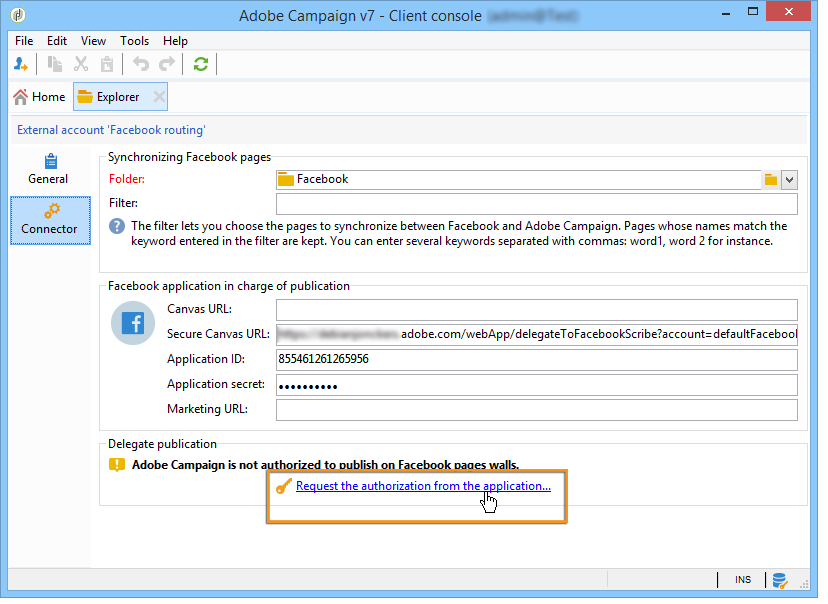
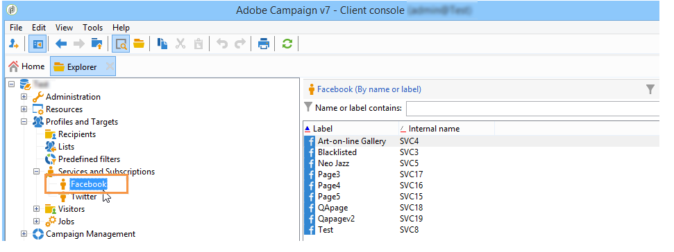

# Facebookのウォールでの投稿{#publishing-on-facebook-walls}

Adobe CampaignでFacebookのウォールにパブリケーションを送信するには、これらのページの書き込みアクセス権をAdobe Campaignに委任する必要があります。 これには、次の設定手順が含まれます。

1. 1つ以上のページを持つFacebookアカウントを作成します。
1. 校正を送信するためのテスト用Facebookページを作成します。
1. Facebookアプリを作成します。
1. 外部アカウントのAdobe CampaignにFacebookアプリ設定を入 **[!UICONTROL Facebook routing]** 力します。

## 前提条件 {#prerequisites}

まず、Facebookアカウントと複数のページを作成します。これらは出版物の送信に使用されます。

* Facebookアカウントを作成するには、https://www.facebook.comリンクを使 [用します](https://www.facebook.com) 。
* Facebookページを作成するには、https://www.facebook.com/pages/create.phpリンクを使 [用します](https://www.facebook.com/pages/create.php) 。

   すべてのページを管理する場合は、同じFacebookアカウントを使用することをお勧めします。 この方法では、アカウントのすべてのページに書き込むのに必要なFacebookアプリと外部アカウントが1つだけです。

   

## テスト用Facebookページの作成 {#creating-a-test-facebook-page}

公開の証明を配信するためのプライベートFacebookページを作成することをお勧めします(詳しくは、「証明 [の送信](#sending-the-proof)」を参照)。

1. ページの管理に使用するFacebookアカウントにログオンします。
1. 新しいFacebookページを作成します。
1. 右上隅 **[!UICONTROL Settings]** のボタンをクリックします。
1. タブで、 **[!UICONTROL General]** ページの表示パラメータを変更します。チェックボックスをオ **[!UICONTROL Page unpublished]** ンにします。
1. ボタンをクリッ **[!UICONTROL Save Changes]** クします。

## Facebookアプリの作成 {#creating-a-facebook-application}

Adobe Campaignをページのウォールに投稿できるようにするには、Facebookアプリを作成する必要があります。 それには、次の手順に従います。

1. ページの管理に使用するFacebookアカウントにログオンします。
1. ブラウザーに次のアドレスを入力します。https://developers.facebook.com/apps .

   >[!IMPORTANT]
   >
   >所有しているアカウントの種類に応じて、1つ以上の承認が必要な場合があります。
   >
   >Facebookアプリを作成するには、有効なFacebookアカウントが **必要です** 。

1. ページ **[!UICONTROL Add a New App]** の右上隅にあるボタンをクリックします。 アプリ名と連絡先の電子メールを入力し、セキュリティチェックを渡します。

   

1. で、 **[!UICONTROL Settings > Basic]**&#x200B;をクリックし **[!UICONTROL Add a platform]** てタイプを選択し **[!UICONTROL Facebook Web Games]** ます。

   

1. 左のメニ **[!UICONTROL Products]** ューのセクションで、製品が表示されていることを確認し **[!UICONTROL Facebook Login]** ます。 正しくない場合は、新しい製品を追加してを選択しま **[!UICONTROL Facebook Login]**&#x200B;す。

   

1. アプリを作成したら、タブを選択し、ア **[!UICONTROL App Review]** プリを公開します。

   

## Adobe Campaignへの書き込みアクセスの委任 {#delegating-write-access-to-adobe-campaign}

Adobe Campaignに対する書き込みアクセス権を委任してページのウォールに投稿するには、以前に作成したFacebookアプリのパラメーターを入力する必要があります。

この手順では、Adobe Campaignコンソールと、ページ管理に使用するFacebookアカウントにログオンしているインターネットブラウザーの両方にアクセスする必要があります。

>[!IMPORTANT]
>
>この設定を行うには、Adobe Campaign演算子に管理者権限が必要です。

* **Facebook**:以前に作成したアプリケーション( [https://developers.facebook.com/apps](https://developers.facebook.com/apps))を選択し、タブを選択 **[!UICONTROL Settings > Basic]** します。

   

   >[!NOTE]
   >
   >セクション **[!UICONTROL Facebook Web Games]** が表示されない場合は、ページの下 **[!UICONTROL Add Platform]** 部にあるボタンをクリックし、を選択します **[!UICONTROL Facebook Web Games]**。

* **Adobe Campaign**:ツリーのノ **[!UICONTROL Administration > Platform > External Accounts]** ードに移動し、外部アカウントを **[!UICONTROL Facebook routing]** 選択して、タブをクリックし **[!UICONTROL Connector]** ます。

   

1. Adobe Campaignコンソールで、フィールドに含まれるアドレスをコピー **[!UICONTROL Secure Canvas URL]** し、Facebook上の（セクション内の） **[!UICONTROL Secure Web Games URL (https)]** フィールドに貼り付 **[!UICONTROL Facebook Web Games]** けます。

   

   >[!IMPORTANT]
   >
   >どのような状況でも、保護されていないURLを使用してはいけません。

   このURLをコピーして、> > >の下に **[!UICONTROL Products]** 貼り付け **[!UICONTROL Facebook Login]** ま **[!UICONTROL Settings]** す **[!UICONTROL Valid OAuth Redirect URIs]**。 URLの有効性を確認するには、アプリケーションを保存し、URLをコピーしてフィールドに貼り付け、「URL」 **[!UICONTROL Redirect URI to Check]** をクリックしま **[!UICONTROL Check URI]**&#x200B;す。

   

1. Facebookで、フィールドとフィールドの内容をコ **[!UICONTROL App ID]** ピーし **[!UICONTROL App Secret]** て、コンソールの一致するフィールドに貼り付けます。

   

1. Facebookで、ページの下部 **[!UICONTROL Save Changes]** にあるボタンをクリックします。
1. Adobe Campaignコンソールに移動し、外部アカウントを保存します。

   >[!NOTE]
   >
   >このフィ **[!UICONTROL Marketing URL]** ールドはオプションです。

1. Adobe Campaignコンソールで、タブの下部にあ **[!UICONTROL Request the authorization from the application]** るリンクをクリックし **[!UICONTROL Connector]** ます。 ワークフ **[!UICONTROL Synchronize Facebook pages]** ローが自動的にトリガーされ、管理者が管理するすべてのFacebookページが収集されます。 詳しくは、「Facebookページの同期」を参 [照してください](#synchronizing-facebook-pages)。

   

   >[!NOTE]
   >
   >デフォルトでは、ページはサービスフォルダーに追 **[!UICONTROL Facebook]** 加され、ノードを介して使用で **[!UICONTROL Profiles and Targets > Services and Subscriptions]** きます。 タブの **[!UICONTROL Folder]** フィールド **[!UICONTROL Connector]** を使用すると、Facebookページが同期後に作成されるサービスフォルダーを変更できます。 また、このフィールドを使用して、Adobe Campaignで同期するFacebookページを選択することもでき **[!UICONTROL Filter]** ます。 このフィールドを空のままにすると、管理者が管理するすべてのFacebookページが同期されます。

1. 様々なFacebook権限設定を含むダイアログボックスが表示されます。 これにより、Adobe CampaignはFacebookアカウントページにパブリケーションを送信できます。

   様々な権限リクエストを受け入れます。

   

1. Adobe Campaignには、Facebookアカウントのページのウォールに投稿する権限が与えられました。

   

>[!NOTE]
>
>Facebookアカウントで複数のページを管理している場合は、Facebookアカウントの任意のページに書き込む1つの外部アカウントを設定します。 新しいFacebookアカウントごとに、新しいタイプの外部アカウントを作成する **[!UICONTROL Routing]** 必要があります。

ワークフ **[!UICONTROL Synchronization of Facebook pages]** ローは、Facebookアカウントが管理するすべてのページを同期して、Adobe Campaignを介して直接そのウォールに投稿できます。 詳しくは、「Facebookページの同期」を参 [照してください](#synchronizing-facebook-pages)。

## Facebook ページの同期 {#synchronizing-facebook-pages}

このワ **[!UICONTROL Synchronization of Facebook pages]** ークフローは、ノードを介してア **[!UICONTROL Administration > Production > Technical workflows > Managing social networks]** クセスし、以前に設定したFacebookアカウントのページを（Adobe Campaignで）同期できます。 デフォルトでは、このワークフローは、1日に1回、または管理者がサービス設定画面でリンクをクリックするたびに実行するように設定されます(「Adobe Campaignへの書き込みア **[!UICONTROL Request an authorization from the application]** クセスの委任 」を参照)。

同期が完了すると、収集されたページは、外部アカウントに入力されたサービスフォルダーに表示されます(「Adobe Campaignへの書き込み [アクセスの委任](#delegating-write-access-to-adobe-campaign)」を参照)。 デフォルトでは、ページはサービスフォルダーのルートに追加さ **[!UICONTROL Facebook]** れます。このルートは、メニューから使用で **[!UICONTROL Profiles and Targets > Services and subscriptions]** きます。

Adobe Campaignを使用してFacebookページのウォールに直接投稿できるようになりました。 詳しくは、「Facebookでの投稿」を参 [照してください](#publishing-on-facebook-walls)。
