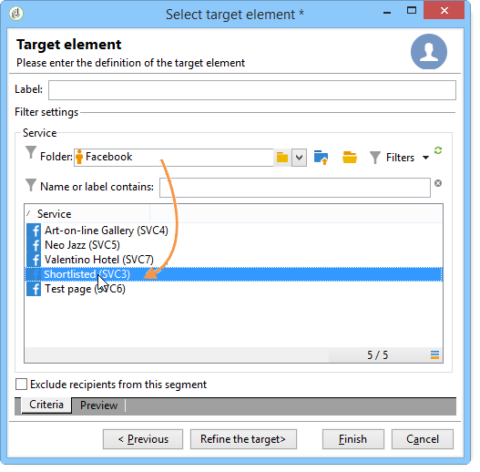
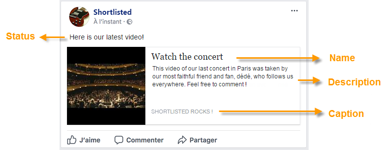
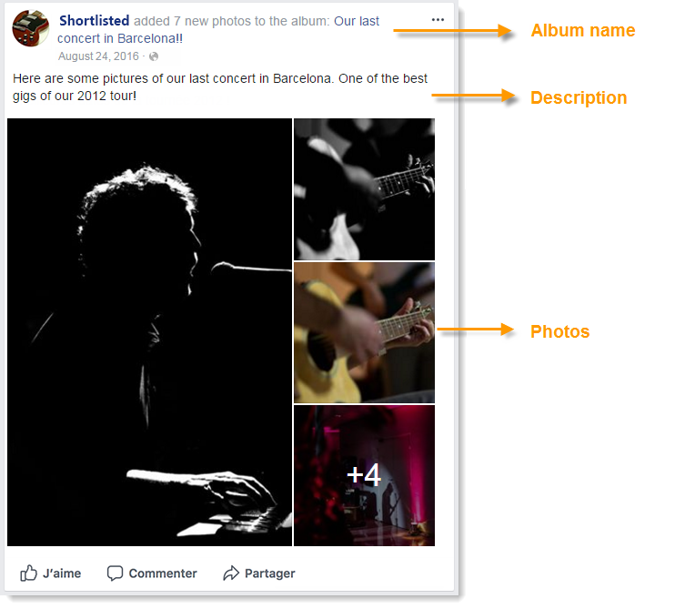

# Facebookでの投稿{#publishing-on-facebook}

設定が完了すると、Social MarketingでFacebookページのウォールにパブリケーションを投稿できます。

## 制限事項 {#limitations}

Facebookには次の制限が付属しています。

* メッセージの長さは1,000文字を超えることはできません。
* HTMLはサポートされていません。

## 配信の作成 {#creating-the-delivery}

配信テンプレートを使用して新しい配信 **[!UICONTROL Publish to a brand page]** を作成します。

## メインターゲットの選択 {#selecting-the-main-target}

パブリケーションを投稿するページを選択する必要があります。

1. リンクをクリック **[!UICONTROL To]** します。

   

1. ボタンをクリッ **[!UICONTROL Add]** クします。

   

1. 選択 **[!UICONTROL A Facebook page]**.

   

1. フィールド **[!UICONTROL Folder]** で、Facebookページを含むサービスフォルダーを選択します。 デフォルトでは、ページはサービスフォルダーのルートに保存 **[!UICONTROL Facebook]** されます。 次に、投稿するFacebookページを選択します。

   

## 配達確認のターゲットの選択 {#selecting-the-proof-target}

このタ **[!UICONTROL Target of the proofs]** ブでは、配信を送信する前に配信のテストに使用するFacebookページを定義できます。 この目的のために専用のプライベートFacebookページを作成することをお勧めします。 プライベートFacebookページの作成について詳しくは、「テストFacebookペ [ージの作成」を参照してください](../../social/using/publishing-on-facebook-walls.md#creating-a-test-facebook-page)。 校正ターゲットを選択するには、メインターゲットと同じ手順を適用します。メイン [ターゲットの選択](#selecting-the-main-target)。

>[!NOTE]
>
>すべての配信に同じFacebookテストページを使用している場合は、配信テンプレートに校正ターゲットを保存できます。このテンプレートは、ノ **[!UICONTROL Publish to a brand page]** ードを介してアクセス **[!UICONTROL Resources > Templates > Delivery templates]** します。 配達確認ターゲットは、新しい配信ごとにデフォルトで入力されます。

## オーディエンスの定義 {#defining-the-audience}

ローカルセグメントを使用して、パブリケーションを表示する権限のある公開ページのタイプを絞り込む場合は、セグメントごとに1つのFacebookページを作成することをお勧めします(例：Adobe Campaign Paris、Adobe Campaign Londonなど)。

ただし、Facebookで使用されるオーディエンスフィルターを使用することもできます。 このタブ **[!UICONTROL Audience]** には、次の4つのフ **[!UICONTROL Select target window]** ィルターがあります。

* **[!UICONTROL Country]**
* **[!UICONTROL Regions]**
* **[!UICONTROL Cities]**
* **[!UICONTROL Languages]**

>[!CAUTION]
>
>この関数は注意して使用してください。 配信レポートでは、インジケー **[!UICONTROL Number of fans]** ターはこれらのFacebookフィルターを考慮しません。
>
>Facebookは、オーディエンスフィルターのリストと値を変更する場合があります。

## メッセージ内容の定義 {#defining-message-content}

ドロップダウンメニューを使用して、パブリケー **[!UICONTROL Content type]** ションの種類を選択します。

次の配信タイプを使用できます。

* a **[!UICONTROL Status]**
* a **[!UICONTROL Status with a link]**
* a **[!UICONTROL Status with a YouTube link]**
* a **[!UICONTROL Photo album]**

### ステータスの公開 {#publishing-a-status}

次の例のように、ステータスタイプの配信にはテキストのみを含めることができます。

入力ゾーンにパブリケーションの状態を入力します。

### リンクを含むステータスの公開 {#publishing-a-status-with-a-link}

リンクを含むステータスタイプ配信には、テキスト、画像、およびリンクを含めることができます。 以下の節では、配信編集画面のフィールドとFacebook上の最終的な投稿との対称性について説明します。

次の各フィールドを入力します。

>[!CAUTION]
>
>すべてのURLは、「http://」ま **たは「https://」で始まる****必要があります**。

1. フィールド **[!UICONTROL Status]** に、ページ名の下に表示するテキストを入力します。
1. フィールド **[!UICONTROL Name]** に、パブリケーションのタイトルを入力します。
1. パブリケー **[!UICONTROL Link]** ションが指すURLをフィールドに入力します。

   >[!NOTE]
   >
   >このフィールドをFacebookアプリのURL **[!UICONTROL Link]** に追加してプロモーションする場合は、スマートフォンの表示条件に合わせて適合させることをお勧めします。
   >
   >1. Facebookアプリケーションhttps://developers.facebook.com/apps [を選択し](https://developers.facebook.com/apps)、タブを選択し **[!UICONTROL Settings > Basic]** ます。
   >1. フィールドを入 **[!UICONTROL Namespace]** 力します。
   >1. フィールドを入 **[!UICONTROL Mobile Site URL]** 力します。ユーザーがスマートフォン上のパブリケーションリンクをクリックすると、Facebookによってこのフィールドに定義されたURLに自動的にリダイレクトされます。
   >1. Facebookディスプレイが使用するデバイス（スマートフォンまたはPC）の機能としてパーソナライズされるように、Webアプリを作成します。
   >1. Adobe Campaignコンソール **[!UICONTROL Link]** からパブリケーションのフィールドに移動し、フィールドのURLを入力し **[!UICONTROL Canvas page]** ます。

1. このフ **[!UICONTROL Image]** ィールドに、パブリケーションの左側に表示する画像のURLを入力します。

   >[!CAUTION]
   >
   >Facebookが画像をアップロードできるようにするには、公開インターネットサイトで画像をホストする必要があります。

1. フィールド **[!UICONTROL Caption]** に、文書の末尾に表示するテキストを入力します。
1. フィールドに移 **[!UICONTROL Description]** 動し、タイトルの下に表示するテキストを入力します。

### YouTubeリンクを使用したステータスの公開 {#publishing-a-status-with-a-youtube-link}

このタイプのコンテンツを使用すると、YouTubeビデオへのリンクを投稿できます。 通常のリンクを持つステータスと同様に、ステータス、名前、キャプション、説明および追加のリンクを定義できます。 画像はFacebookによって自動的に追加されます。 配信編集画面のフィールドとFacebook上の最終公開との対称性を以下に示します。

次の各フィールドを入力します。

>[!CAUTION]
>
>すべてのURLは、「http://」ま **たは「https://」で始まる****必要があります**。

1. フィールド **[!UICONTROL Status]** に、ページ名の下に表示するテキストを入力します。
1. フィールド **[!UICONTROL Name]** に、パブリケーションのタイトルを入力します。
1. フィールド **[!UICONTROL Video code]** に、YouTubeビデオのコードを入力します。 例えば、「http://www.youtube.com/watch?v=abc123456&#39;」リンクの場合、ビデオコードは「abc123456」です。
1. フィールド **[!UICONTROL Caption]** に、文書の末尾に表示するテキストを入力します。
1. フィールドに移 **[!UICONTROL Description]** 動し、タイトルの下に表示するテキストを入力します。

### フォトアルバムの公開 {#publishing-a-photo-album}

このタイプのコンテンツを使用すると、フォトアルバムを公開できます。 アルバムの名前と説明、および各写真のキャプションを追加できます。 配信編集画面のフィールドとFacebook上の最終公開との対称性を以下に示します。

次の各フィールドを入力します。

1. Start by entering the **[!UICONTROL Album name]**.
1. 次に、写真の **[!UICONTROL Description]** 上に表示する画像を入力します。
1. 写真を追加するには、ボタンをクリ **[!UICONTROL Add]** ックし、写真を選択してをクリックしま **[!UICONTROL Open]**&#x200B;す。
1. キャプションは各写真に追加できます。

## プレビュー {#previewing}

このタ **[!UICONTROL Preview]** ブでは、パブリケーションのレンダリングを表示できます。

1. タブをクリック **[!UICONTROL Preview]** します。
1. ドロップダウ **[!UICONTROL Test personalization]** ンメニューをクリックし、を選択しま **[!UICONTROL Service]**&#x200B;す。
1. フィールド **[!UICONTROL Folder]** で、Facebookページを含むサービスフォルダーを選択します。 デフォルトでは、ページはサービスフォルダーのルートに保存 **[!UICONTROL Facebook]** されます。
1. プレビューをテストするFacebookページを選択します。

>[!NOTE]
>
>プレビューは、最終的なFacebookパブリケーションとは少し異なる場合があります。 最終的な配信の前に証明書を送信し、正確なレンダリングを行うことを強くお勧めします。 「証明の送 [信」を参照](#sending-the-proof)。

## トラッキングの設定 {#configuring-tracking}

トラッキングは、配信レポート、配信とサービスのタ **[!UICONTROL Edit > Tracking]** ブに表示することができます。

配信に含まれるURLのクリック数は、Adobe Campaignで測定されます。 ボタンのクリック数、コ **[!UICONTROL Like]** メント数およびファン数は、Facebookによって測定されます。

追跡の設定は、電子メール配信の場合と同じです。 詳しくは、[この節](../../delivery/using/monitoring-a-delivery.md)を参照してください。

>[!NOTE]
>
>配信テンプレート **[!UICONTROL Publish to a brand page]** では、トラッキングはデフォルトで有効になっています。

## 配達確認の送信 {#sending-the-proof}

非公開のFacebookテストページでパブリケーションの正確なレンダリングを表示するには、最終配信前にパブリケーションの証明を送信することを強くお勧めします。 プライベートFacebookテストページの作成について詳しくは、「テストFacebook [ページの作成」を参照してください](../../social/using/publishing-on-facebook-walls.md#creating-a-test-facebook-page)。 ターゲットの校正を選択する手順について詳しくは、校正ターゲット [の選択を参照してください](#selecting-the-proof-target)。

配達確認の配信は、電子メールの配信と同じです。 [この節](../../delivery/using/steps-validating-the-delivery.md#sending-a-proof)を参照してください。

## メッセージの送信 {#sending-the-message}

1. コンテンツが承認されたら、ボタンをクリック **[!UICONTROL Send]** します。
1. を選択し **[!UICONTROL Deliver as soon as possible]** 、ボタンをクリック **[!UICONTROL Analyze]** します。

   >[!NOTE]
   >
   >このオ **[!UICONTROL Postpone the delivery]** プションを使用すると、後日配信を延期できます。

   

1. 分析が完了したら、結果を確認します。
1. をクリック **[!UICONTROL Confirm delivery]**&#x200B;し、をクリックしま **[!UICONTROL Yes]**&#x200B;す。

   

