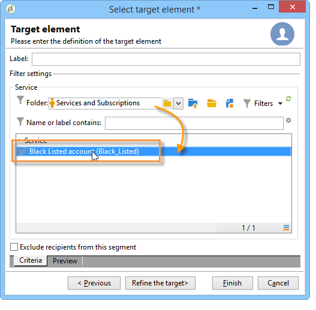

# Twitterでの投稿{#publishing-on-twitter}

## Twitterアカウントでの投稿 {#publishing-on-your-twitter-accounts}

設定が完了すると、Social MarketingでツイートをTwitterアカウントに送信できます。

### 制限事項 {#limitations}

Twitterに固有の制約には、次の制限があります。

* メッセージは140文字を超えることはできません。
* HTML形式はサポートされていません。

### 配信の作成 {#creating-the-delivery}

配信テンプレートに基づいて新しい配信を **[!UICONTROL Tweet (twitter)]** 作成します。

### メインターゲットの選択 {#selecting-the-main-target}

ツイートの送信先のアカウントを選択します。

1. リンクをクリック **[!UICONTROL To]** します。

   

1. ボタンをクリッ **[!UICONTROL Add]** クします。

   

1. 選択 **[!UICONTROL A Twitter account]**.

   

1. フィールド **[!UICONTROL Folder]** で、Twitterアカウントを含むサービスフォルダーを選択します。 次に、ツイートの送信先のTwitterアカウントを選択します。

   

### Selecting the target of the proof {#selecting-the-target-of-the-proof}

このタ **[!UICONTROL Target of the proofs]** ブでは、最終的な配信前にテスト配信に使用するTwitterアカウントを定義できます。 したがって、証明の送信専用のプライベートTwitterアカウントを作成することをお勧めします。 非公開のTwitterアカウントの作成方法について詳しくは、「Twitterでのテストア [カウントの作成」を参照してください](../../social/using/configuring-publishing-on-twitter.md#creating-a-test-account-on-twitter)。 配達確認ターゲットを選択する手順は、メインターゲットを選択する手順と同じです。 詳しくは、Twitter [でのテストアカウントの作成を参照してください](../../social/using/configuring-publishing-on-twitter.md#creating-a-test-account-on-twitter)。

>[!NOTE]
>
>すべての配信に同じTwitterテストアカウントを使用している場合は、ノードを介してアクセスする配信テンプレートに配 **[!UICONTROL Tweet]** 信確認ターゲットを保存でき **[!UICONTROL Resources > Templates > Delivery templates]** ます。 その後、新しい配信ごとにデフォルトで配達確認ターゲットが入力されます。

### メッセージ内容の定義 {#defining-the-message-content}

タブにツイートのコンテンツを入力し **[!UICONTROL Content]** ます。

### プレビューの表示 {#viewing-the-preview}

タブで **[!UICONTROL Preview]** は、ツイートのレンダリングを表示できます。

1. タブをクリック **[!UICONTROL Preview]** します。
1. ドロップダウ **[!UICONTROL Test personalization]** ンメニューをクリックし、を選択しま **[!UICONTROL Service]**&#x200B;す。
1. フィールド **[!UICONTROL Folder]** で、Twitterアカウントが含まれるサービスフォルダーを選択します。
1. プレビューをテストするTwitterアカウントを選択します。

>[!NOTE]
>
>プレビューは、最後のツイートと少し異なる場合があります。 最終配信の前に配達確認を送信して、ツイートの正確なレンダリングを表示することを強くお勧めします。 「証明の送 [信」を参照](#sending-the-proof)。

### トラッキングの設定 {#configuring-tracking}

トラッキングは、配信レポート、配信とサービスのタ **[!UICONTROL Edit > Tracking]** ブに表示することができます。

追跡の設定は、電子メール配信の場合と同じです。 詳しくは、[この節](../../delivery/using/monitoring-a-delivery.md)を参照してください。

>[!NOTE]
>
>配信テンプレート **[!UICONTROL Tweet]** では、トラッキングはデフォルトで有効になっています。

>[!CAUTION]
>
>ツイートを分析するロボットと実際にクリックしているユーザーの違いは分かりません

### 配達確認の送信 {#sending-the-proof}

非公開のTwitterテストページでパブリケーションを正確にレンダリングするには、最終配信前にパブリケーションの証明を送信することを強くお勧めします。 非公開のTwitterアカウントの作成について詳しくは、「Twitterでのテストア [カウントの作成」を参照してください](../../social/using/configuring-publishing-on-twitter.md#creating-a-test-account-on-twitter)。 配達確認ターゲットを選択する手順について詳しくは、「 [配達確認のターゲットの選択](#selecting-the-target-of-the-proof)」を参照してください。

配達確認の配信は、電子メールの配信と同じです。 [この節](../../delivery/using/steps-validating-the-delivery.md#sending-a-proof)を参照してください。

### メッセージの送信 {#sending-the-message}

1. コンテンツが承認されたら、ボタンをクリック **[!UICONTROL Send]** します。
1. を選択し **[!UICONTROL Deliver as soon as possible]** 、ボタンをクリック **[!UICONTROL Analyze]** します。

   >[!NOTE]
   >
   >このオ **[!UICONTROL Postpone the delivery]** プションを使用すると、後日配信を延期できます。

   

1. 分析が完了したら、結果を確認します。
1. をクリック **[!UICONTROL Confirm delivery]**&#x200B;し、をクリックしま **[!UICONTROL Yes]**&#x200B;す。

## 購読者へのダイレクトメッセージの送信 {#sending-direct-messages-to-subscribers}

### 動作の仕組み {#operating-principle}

ワークフ **[!UICONTROL Synchronize Twitter accounts]** ロー(「Twitterアカウ [ントの同期](../../social/using/configuring-publishing-on-twitter.md#synchronizing-twitter-accounts)」を参照)は、Twitter購読者のリストを回復して、ダイレクトメッセージを送信できるようにします。 回復されたフォロワーは、次の特定のテーブルに格納されます。visitorsテーブル。 Twitterのフォロワーのリストを表示するには、ノードに移動し **[!UICONTROL Profiles and Targets > Visitors]** ます。

>[!CAUTION]
>
>ワークフローでTwitterのフォロワーリストを回復するには、アカウントにリンクされ **[!UICONTROL Synchronize Twitter accounts]** たサービスの編集画面でこのボックスをオンにする必要があります。 詳しくは、次を参照してください。書き込 [みアクセスのAdobe Campaignへの委任](../../social/using/configuring-publishing-on-twitter.md#delegating-write-access-to-adobe-campaign)。

Adobe Campaignは、フォロワーごとに次の情報を回復します。

* **[!UICONTROL Origin]**:ソーシャルネットワークの名前(**Twitter** 、この場合)
* **[!UICONTROL External ID]**:ユーザー識別子
* **[!UICONTROL User name]**:ユーザーのアカウント名
* **[!UICONTROL Full name]**:ユーザー名
* **[!UICONTROL Language]**:ユーザー言語
* **[!UICONTROL Number of friends]**:フォロワー数
* **[!UICONTROL Time zone]**:ユーザータイムゾーン
* **[!UICONTROL Verified]**:このフィールドは、ユーザーが有効なTwitterアカウントを持っているかどうかを示します

### 制限事項 {#limitations-1}

Twitterに固有の制約には、次の制限があります。

* メッセージは140文字を超えることはできません。
* HTMLはサポートされていません。
* 1日に250件を超えるダイレクトメッセージを送信することはできません。 このしきい値を超えないように、複数の波で配信できます。 ウェーブ内の配信は、電子メール配信のように設定されます。 詳しくは、[この節](../../delivery/using/steps-sending-the-delivery.md#sending-using-multiple-waves)を参照してください。

### 配信の作成 {#creating-the-delivery-}

配信テンプレートに基づいて新しい配信を **[!UICONTROL Tweet (Direct Message)]** 作成します。

### メインターゲットの選択 {#selecting-the-main-target-1}

ダイレクトメッセージを送信するフォロワーを選択します。

1. リンクをクリック **[!UICONTROL To]** します。

   

1. ボタンをクリッ **[!UICONTROL Add]** クします。

   

1. ターゲットのタイプを選択します。

   

   * すべてのア **[!UICONTROL Twitter subscribers]** カウントのフォロワーにダイレクトメッセージを送信する場合に選択します。

      >[!CAUTION]
      >
      >1日に250件を超えるメッセージを送信することはできません。 Twitterアカウントに250人を超えるフォロワーがいる場合は、頻繁に配信することを強くお勧めします。 これには、電子メール配信と同じプロセスが含まれます。 [この節](../../delivery/using/steps-sending-the-delivery.md#sending-using-multiple-waves)を参照してください。

   * クエリ **[!UICONTROL Filter conditions]** ーを定義し、結果を表示する場合に選択します。 このオプションは、電子メール配信の場合と同じです。 詳しくは、[この節](../../platform/using/defining-filter-conditions.md)を参照してください。

      

### Selecting the target of the proof {#selecting-the-target-of-the-proof-1}

このタ **[!UICONTROL Target of the proofs]** ブでは、ダイレクトメッセージの証明を受け取るフォロワーを選択できます。 選択プロセスは、メインターゲットの場合と同じです。 詳しくは、メイ [ンターゲットの選択を参照してくださ](#selecting-the-main-target)い。

>[!NOTE]
>
>すべてのダイレクトメッセージの校正を同じTwitterフォロワーに送信する場合は、ノードを介してアクセスする配信テンプレートに配 **[!UICONTROL Tweet (Direct Message)]** 信確認ターゲットを保存でき **[!UICONTROL Resources > Templates > Delivery templates]** ます。 その後、新しい配信ごとにデフォルトで配達確認ターゲットが入力されます。

### メッセージ内容の定義 {#defining-message-content-}

タブにツイートのコンテンツを入力し **[!UICONTROL Content]** ます。

パーソナライゼーションフィールドは、電子メール配信と同じ方法で使用できます。例えば、メッセージの本文にフォロワーの名前を追加できます。 コンテンツのパーソナライゼーションにつ [いては、この節で](../../delivery/using/about-personalization.md)説明します。

以下の手順は、ツイートをTwitterアカウントに送信する場合と同じです。 Twitterアカウント [での投稿を参照してください](#publishing-on-your-twitter-accounts)。
