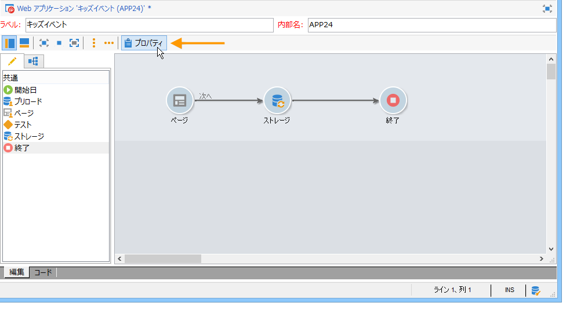

# オンライン調査の設定{#configuring-surveys}

## 調査のプロパティ {#survey-properties}

オンライン調査では、独自の要件を満たすため、自由に設定やカスタマイズをおこなうことができます。パラメーターは、プロパティウィンドウで入力する必要があります。

使用可能なパラメーターについて詳しくは、[このドキュメント](../../web/using/defining-web-forms-properties.md)を参照してください。

## 調査のデータストレージ {#survey-data-storage}

デフォルトでは、Web フォームフィールドは、受信者テーブルに格納されます。別のテーブルを使用するには、「**[!UICONTROL ドキュメントタイプ]**」フィールドで選択します。**[!UICONTROL ズーム]**&#x200B;アイコンを使用すると、選択したテーブルの内容を表示できます。

フィールドに格納されていない（ただしローカル変数に格納されている）ユーザーによって提供された調査の回答は、「**調査への回答**」テーブルに格納されます。「**[!UICONTROL ライブラリ]**」フィールドに基づいて、使用するスキーマを変更できます。このフィールドは、**調査**&#x200B;でのみ使用できます。
