# 調査を作成するための主な手順{#getting-started-with-surveys}

ここでは、次のビルトインテンプレートを使用して、簡単な調査を作成するための主な手順の概要を説明します。

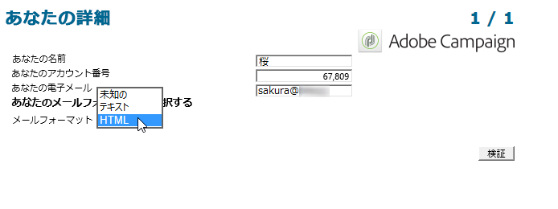

手順は次のとおりです。

1. [手順 1 - 調査の作成](#step-1---creating-a-survey)
1. [手順 2 - テンプレートの選択](#step-2---selecting-the-template)
1. [手順 3 - 調査の作成](#step-3---building-the-survey)
1. [手順 4 - ページコンテンツの作成](#step-4---creating-the-page-content)
1. [手順 5 - 調査データの格納](#step-5---storing-the-survey-data-)
1. [手順 6 - ページの公開](#step-6---publishing-the-pages)
1. [手順 7 - オンライン調査の共有](#step-7---sharing-your-online-survey)

## 手順 1 - 調査の作成 {#step-1---creating-a-survey}

新しい調査を作成するには、「**[!UICONTROL キャンペーン]**」または「**[!UICONTROL プロファイルとターゲット]**」タブに移動して、**[!UICONTROL Web アプリケーション]**&#x200B;メニューをクリックします。 フォームのリストの上にある「**[!UICONTROL 作成]**」ボタンをクリックします。

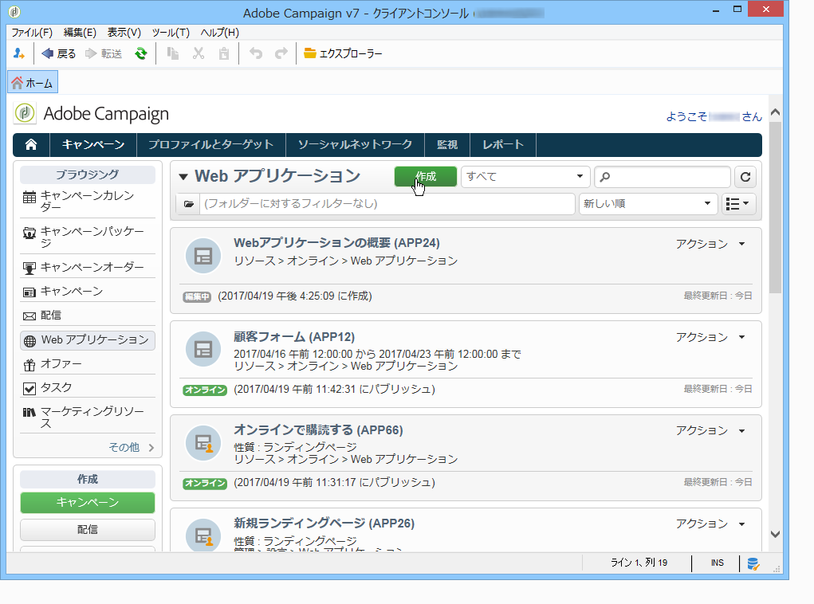

## 手順 2 - テンプレートの選択 {#step-2---selecting-the-template}

調査テンプレートを選択し、調査に名前を付けます。 この名前はエンドユーザーには表示されませんが、Adobe Campaign内でアンケートを識別できます。 「**[!UICONTROL 保存]**」をクリックして、調査を Web アプリケーションのリストに追加します。

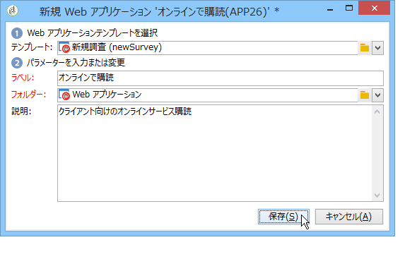

## 手順 3 - 調査の作成 {#step-3---building-the-survey}

アンケートは、コンテンツを作成するページ、データのプリロードと保存の手順、テストの各段階という、次の要素が配置されたダイアグラムに組み込まれています。 スクリプトやクエリも挿入できます。

グラフを構築するには、調査のフォームの「**[!UICONTROL 編集]**」をクリックします。

調査には、**少なくとも**、ページ、ストレージボックス、終了ページの 3 つのコンポーネントが含まれている必要があります。

* ページを作成するには、次に示すように、エディターの左側のセクションで「**[!UICONTROL ページ]**」オブジェクトを選択し、中央のセクションに移動させます。

  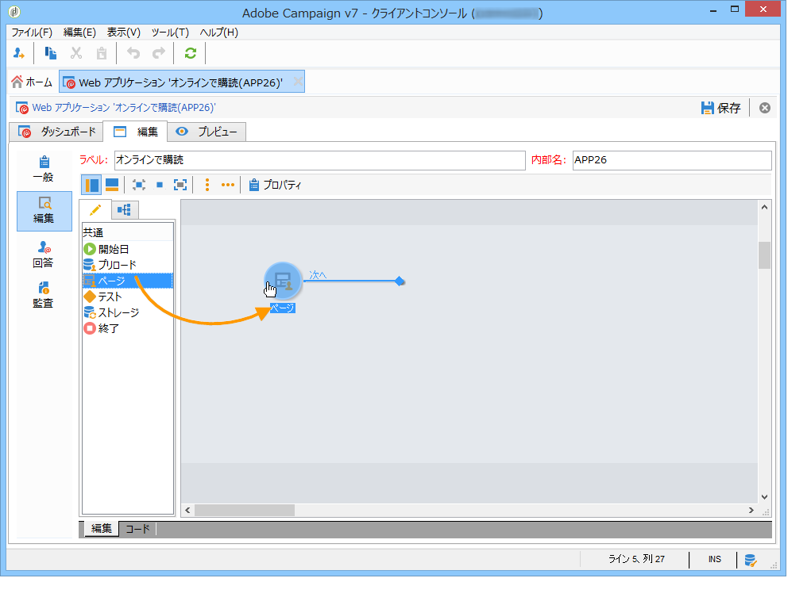

* 次に、「**[!UICONTROL ストレージ]**」オブジェクトを選択し、ページのアウトバウンドトランジション上に配置します。
* 最後に、「**[!UICONTROL 終了]**」オブジェクトを選択し、次のダイアグラムのように、ストレージボックスのアウトバウンドトランジションの終わりに配置ます。

  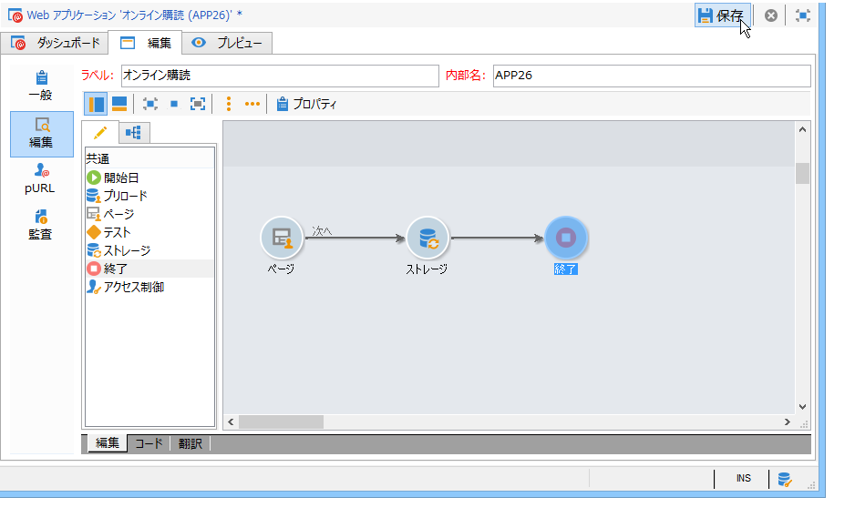

## 手順 4 - ページコンテンツの作成 {#step-4---creating-the-page-content}

次の例では、**[!UICONTROL ページ（v5 互換）]**&#x200B;タイプのページを使用します。 このタイプのページは、「**[!UICONTROL 編集]**」タブの詳細設定メニューからアクセスします。

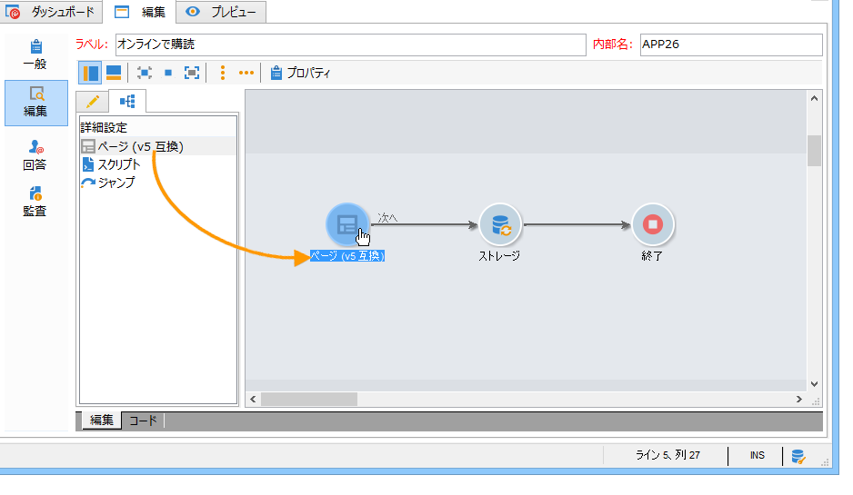

* **入力フィールドの追加**

  ページのコンテンツを作成するには、ページを編集する必要があります。これを行うには、**[!UICONTROL ページ]**&#x200B;オブジェクトをダブルクリックします。 ツールバーの最初のアイコンをクリックし、フィールド作成アシスタントを開きます。 受信者のプロファイルの一致するフィールドに格納するユーザー名の入力フィールドを作成するには、「**[!UICONTROL 受信者を編集]**」を選択します。

  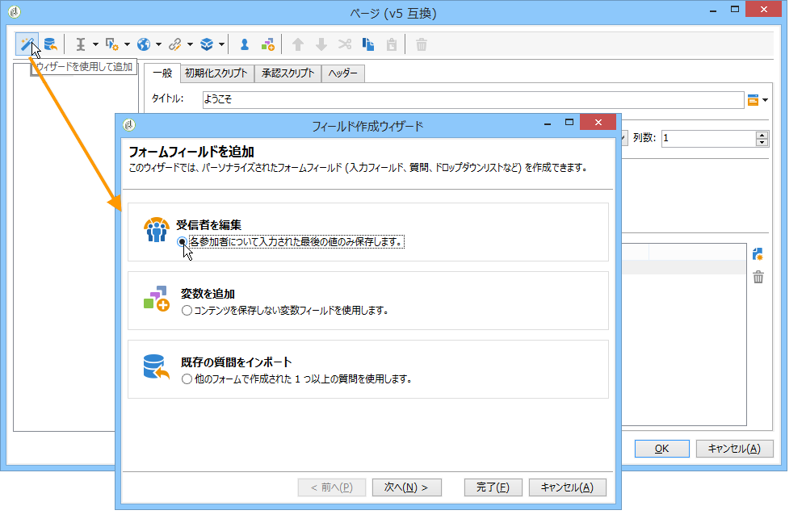

  「**[!UICONTROL 次へ]**」ボタンをクリックして、データベース内のデータストレージのフィールドを選択します。 この場合、「姓」フィールド。

  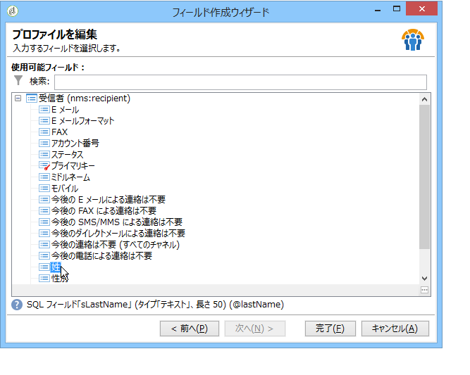

  「**[!UICONTROL 完了]**」をクリックして、フィールドの作成を確認します。

  デフォルトでは、情報がデータベースに既に存在するフィールドに保存されている場合、フィールドは選択したフィールドの名前（この例では「姓」など）を受け取ります。 次に示すように、このラベルを変更できます。

  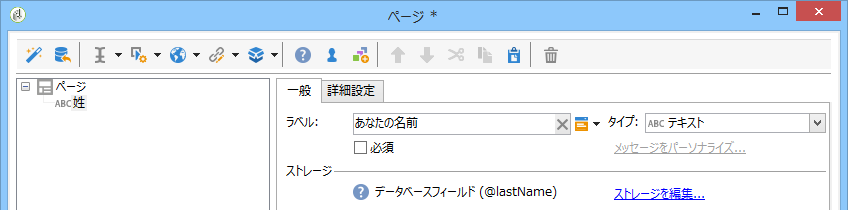

  次に、ユーザーアカウント番号のエントリフィールドを作成します。 操作を繰り返し、「アカウント番号」フィールドを選択します。

  同じ手順を実行して、ユーザーがメールアドレスを入力するためのフィールドを追加します。

* **質問の作成**

  質問を作成するには、ツリーの最後の要素を右クリックし、**[!UICONTROL コンテナ／質問]**&#x200B;を選択するか、**[!UICONTROL コンテナ]**&#x200B;アイコンをクリックして&#x200B;**[!UICONTROL 質問]**&#x200B;を選択します。

  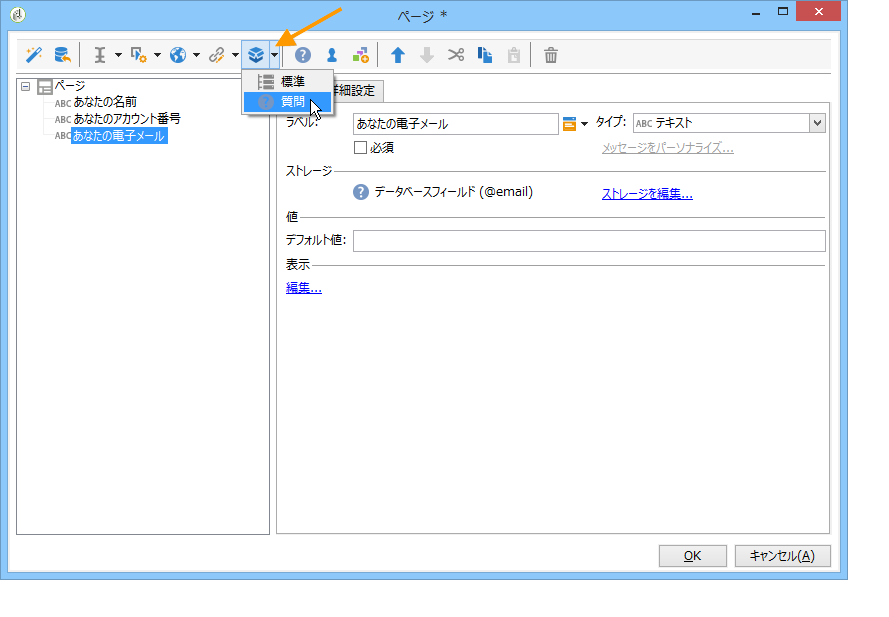

  質問のラベルを入力し、回答フィールドを質問のサブブランチとして挿入します。 これを行うには、回答フィールドを作成するときに、質問にリンクされているノードを選択する必要があります。 次に示すように、**[!UICONTROL 選択コントロール]**&#x200B;アイコンまたは右クリックで、**[!UICONTROL ドロップダウンリスト]**&#x200B;を追加します。

  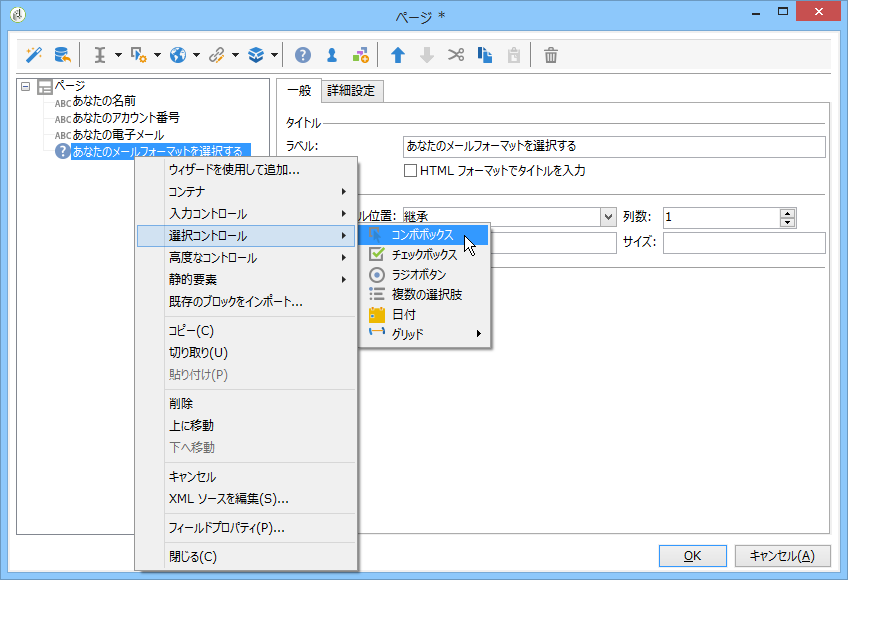

  ストレージスペースを選択します。列挙フィールドを選択し、値を自動的に取得します（この場合、メールフォーマット）。

  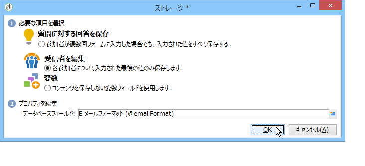

  「**[!UICONTROL 一般]**」タブで、「**[!UICONTROL データベースからの値のリストを初期化]**」リンクをクリックします。値のテーブルが自動的に入力されます。

  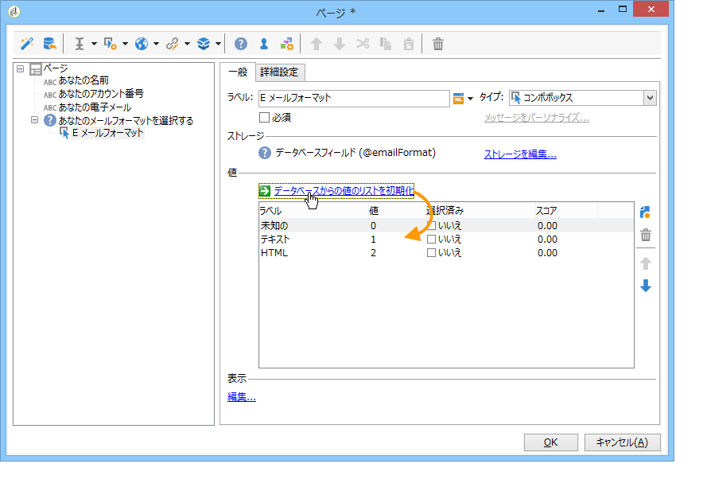

  「**[!UICONTROL OK]**」をクリックしてエディターを閉じ、「**[!UICONTROL 保存]**」をクリックして変更を保存します。

  >[!NOTE]
  >
  >各フィールドまたは質問では、「**[!UICONTROL 詳細設定]**」タブのオプションを使用して、ニーズに合わせてページレイアウトを適応できます。 調査画面のレイアウトについて詳しくは、[この節](../../web/using/about-web-forms.md)を参照してください。

  詳細画面で、「**[!UICONTROL プレビュー]**」タブをクリックして、今作成した調査のレンダリングを表示します。

  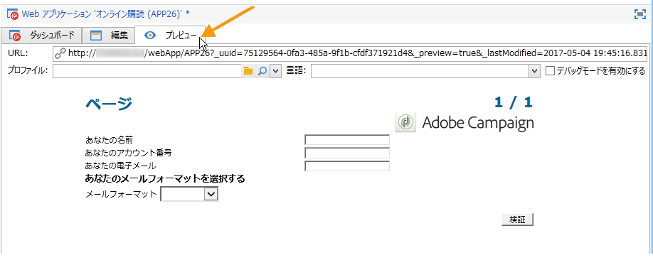

## 手順 5 - 調査データの格納 {#step-5---storing-the-survey-data-}

ストレージ ボックスを使用すると、ユーザーの応答をデータベースに保存できます。 データベース内の既存のプロファイルを識別するには、紐付けキーを選択する必要があります。

これをおこなうには、ボックスを編集して、データを格納する際に紐付けキーとして使用するフィールドを選択します。

以下の例では、保存（確認）を行う際に、フォームに入力されたアカウント番号と同じアカウント番号でデータベースにプロファイルが保存されると、プロファイルが更新されます。 プロファイルが存在しない場合は、作成されます。

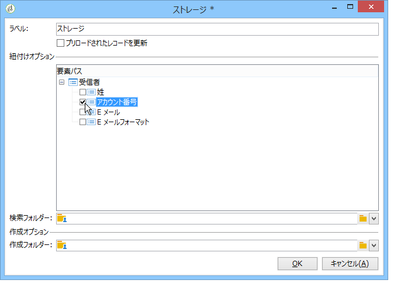

「**[!UICONTROL OK]**」をクリックして確認し、「**[!UICONTROL 保存]**」をクリックして調査を保存します。

## 手順 6 - ページの公開 {#step-6---publishing-the-pages}

HTML ページにアクセスするには、アプリケーションを使用可能にする必要があります。 このフィールドは編集段階ではなく、本番段階である必要があります。 アンケートを本番環境に導入するには、アンケートを公開する必要があります。 手順は次のとおりです。

* 調査ダッシュボードの上にある「**[!UICONTROL パブリッシュ]**」ボタンをクリックします。
* 「**[!UICONTROL 開始]**」をクリックして、パブリケーションを開始し、アシスタントを閉じます。

  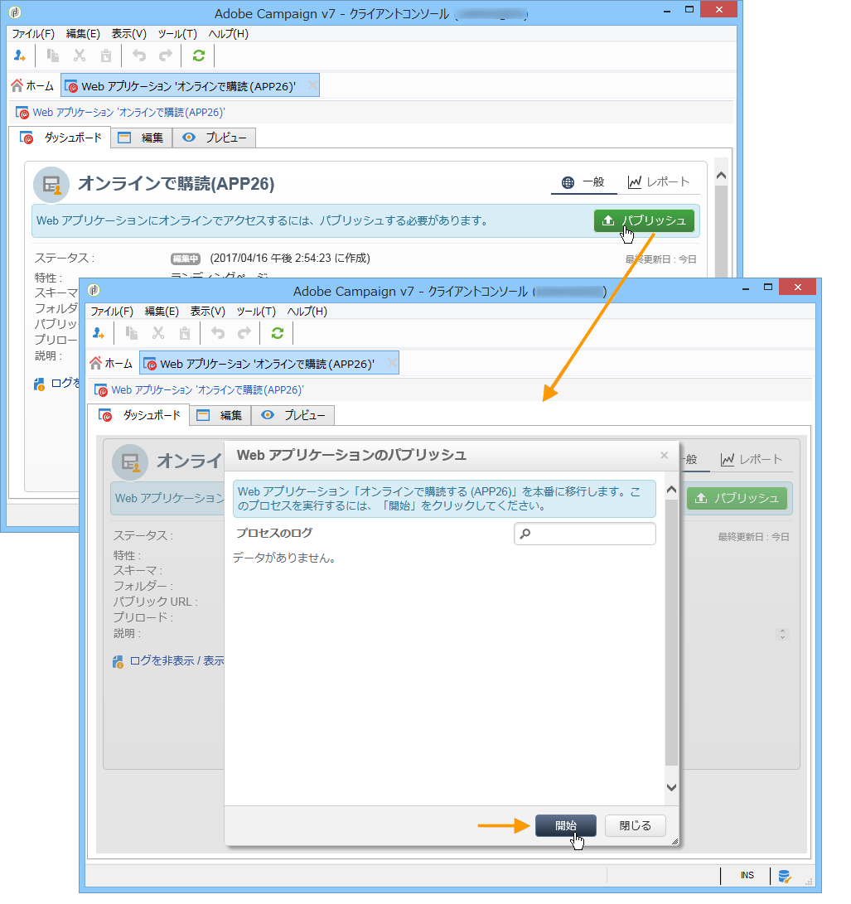

  調査のステータスが&#x200B;**オンライン**&#x200B;に変わります。

  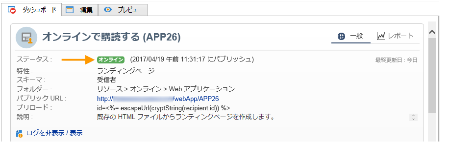

## 手順 7 - オンライン調査の共有 {#step-7---sharing-your-online-survey}

実稼動環境に移行すると、アンケートにサーバーからアクセスできるようになり、アンケートを配信できます。 アンケートにアクセスするためのURLがダッシュボードに表示されます。

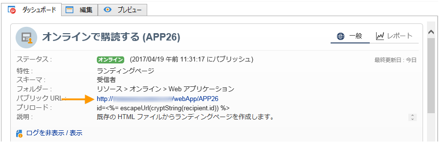

調査を配信するには、例えば、ターゲット母集団へのアクセスリンクを含むメッセージを送信したり、調査のアクセス URL を Web ページに配置したりできます。

その後、レポートおよびログを使用して、ユーザーの回答を監視できます。 [回答のトラッキング](../../surveys/using/publish-track-and-use-collected-data.md#response-tracking)を参照してください。

>[!CAUTION]
>
>パブリック URLには、アンケートの内部名が含まれます。 内部名が変更されると、URLが自動的に更新されます。調査へのすべてのリンクも更新する必要があります。
>
>フォームへのリンクを含む配信が、既に送信されている場合、このリンクは機能しなくなります。
