# 収集したデータの公開、トラッキングおよび使用{#publish-track-and-use-collected-data}


フォームの作成、設定、パブリッシュが完了したら、オーディエンスとリンクを共有して反応をトラッキングできます。

>[!NOTE]
>
>Adobe Campaign の調査のライフサイクルと、そのパブリッシュおよび配信モードは、Web フォームに似ています。詳しくは、[この節](../../web/using/about-web-forms.md)を参照してください。

## 調査ダッシュボード {#survey-dashboard}

各調査には、ステータス、説明、パブリック URL および利用スケジュールを表示できる独自のダッシュボードがあります。また、利用可能なレポートを表示できます。[詳細情報](#reports-on-surveys)。

調査の公開 URL は、ダッシュボードに表示されます。


## 回答のトラッキング {#response-tracking}

調査の回答をログおよびレポートでトラッキングできます。

### 調査ログ {#survey-logs}

配信された各調査について、「**[!UICONTROL ログ]**」タブで回答をトラッキングできます。このタブには、調査を完了したユーザーとその接触チャネルのリストが表示されます。

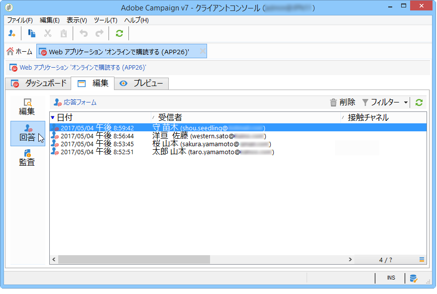

行をダブルクリックして、回答者が入力した調査フォームを表示します。すべての調査を参照して、すべての回答にアクセスできます。これらは、外部ファイルにエクスポートできます。詳しくは、[回答のエクスポート](#exporting-answers)を参照してください。

接触チャネルは、次の文字を追加することで、調査 URL に示されます。

```
?origin=xxx
```

調査が編集されている間、その URL にはパラメーター **[!UICONTROL __uuid]** が含まれます。これは、テストフェーズにあり、まだオンラインでないことを示しています。この URL で調査にアクセスする場合、作成されたレコードは、トラッキング（レポート）で考慮されません。origin の値は、強制的に **[!UICONTROL Adobe Campaign]** になります。

URL パラメーターについて詳しくは、[このページ](../../web/using/defining-web-forms-properties.md#form-url-parameters)を参照してください。

### 調査のレポート {#reports-on-surveys}

「ダッシュボード」タブを使用すると、調査レポートにアクセスできます。レポート名をクリックすると、表示されます。

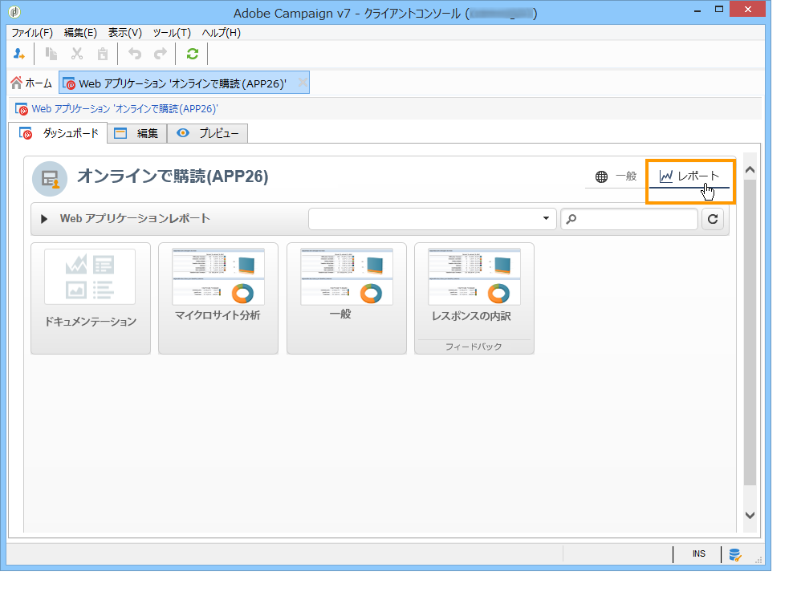

調査の構造は、**[!UICONTROL ドキュメント]**&#x200B;レポートに表示されます。

調査の「**[!UICONTROL レポート]**」タブでは Web 調査に関するレポートがほかにも 2 つ利用できます。**[!UICONTROL 一般]**&#x200B;および&#x200B;**[!UICONTROL 回答の分類]**&#x200B;です。

* 一般

   このレポートには、調査に関する一般的な情報（時間の経過に伴う回答数の変化、接触チャネルおよび言語による配分）が含まれます。

   一般レポートの例：

   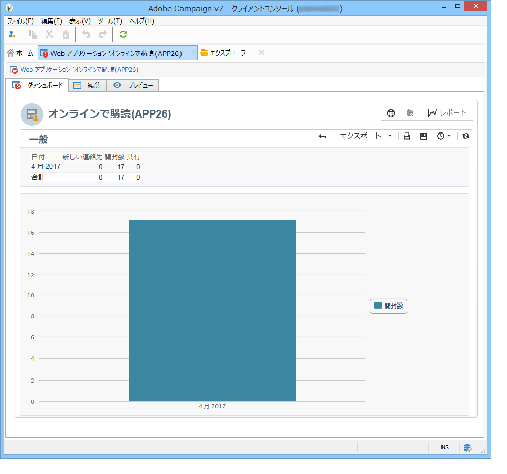

* 回答の分類

   このレポートには、各質問に関する回答の分類が表示されます。この分類は、**[!UICONTROL 質問]**&#x200B;タイプのコンテナに格納されたフィールドに提供された回答でのみ利用できます。選択コントロールに対してのみ有効です（例えば、テキストフィールドは分類されません）。

   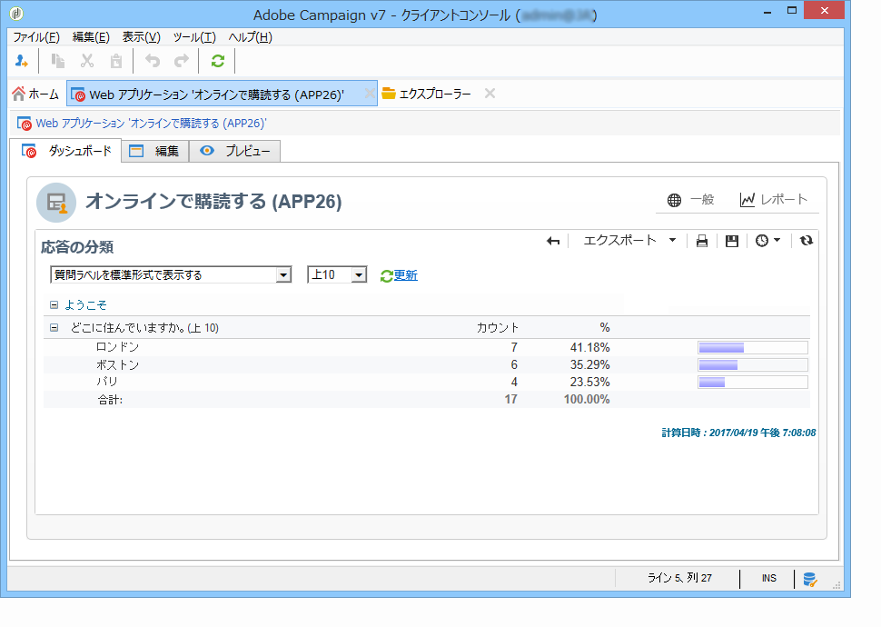

## 回答のエクスポート {#exporting-answers}

調査の回答は、後で処理するために、外部ファイルにエクスポートできます。それには、次の 2 つの方法があります。

1. レポートデータのエクスポート

   レポートデータをエクスポートするには、「**[!UICONTROL エクスポート]**」ボタンをクリックして、エクスポート形式を選択します。

   レポートデータのエクスポートについて詳しくは、[この節](../../reporting/using/about-reports-creation-in-campaign.md)を参照してください。

1. 回答のエクスポート

   回答をエクスポートするには、調査の「**[!UICONTROL 回答]**」タブをクリックして、右クリックします。「**[!UICONTROL エクスポート]**」をクリックします。

   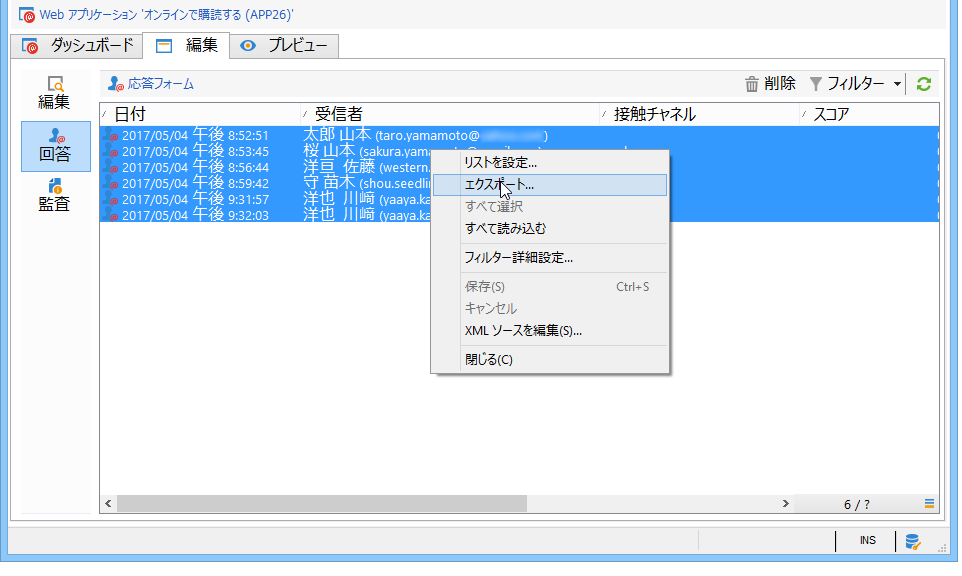

   次に、エクスポートする情報およびストレージファイルを入力します。

   エクスポートウィザードで、出力ファイルのコンテンツおよび形式を設定できます。

   次のことが可能です。

   * 出力ファイルに列を追加し、（データベースに格納された）受信者の情報を復元する
   * エクスポートしたデータの形式を設定する
   * ファイルの情報のエンコード形式を選択する

   エクスポートする調査にいくつかの「**[!UICONTROL 複数ラインテキスト]**」または「**[!UICONTROL HTML テキスト]**」フィールドが含まれている場合、**[!UICONTROL XML]** 形式でエクスポートする必要があります。これをおこなうには、次に示すように、**[!UICONTROL 出力フォーマット]**&#x200B;ドロップダウンリストで、この形式を選択します。

   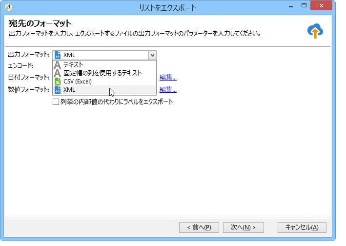

   「**[!UICONTROL 開始]**」をクリックして、エクスポートを実行します。

   >[!NOTE]
   >
   >データのエクスポートおよびその設定のステージについて詳しくは、[この節](../../platform/using/about-generic-imports-exports.md)を参照してください。

## 収集したデータの使用 {#using-the-collected-data}

オンライン調査で収集された情報は、ターゲティングワークフローのフレームワーク内で復元できます。これをおこなうには、**[!UICONTROL 調査の回答]**&#x200B;ボックスを使用します。

次の例では、少なくとも 2 人の子供を含む、オンライン調査で最高スコアを獲得した 5 人の受信者に特別に Web オファーを実行します。この回答の調査は、次のようになります。


ターゲティングワークフローで、**[!UICONTROL 調査の回答]**&#x200B;は、次のように設定されます。

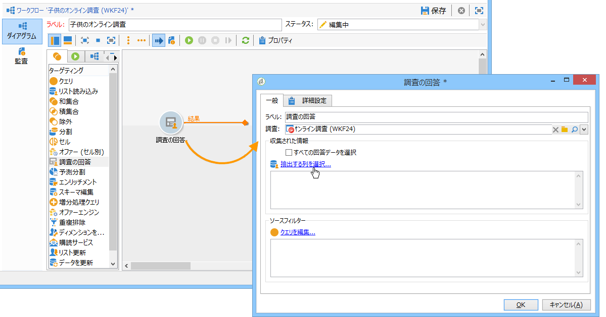

最初に、関連する調査を選択してから、ウィンドウの中央のセクションで、抽出するデータを選択します。この場合、5 つの最高スコアを復元するために分割ボックスで使用するので、少なくともスコア列を抽出する必要があります。

「**[!UICONTROL クエリを編集]**」リンクをクリックして、回答のフィルター条件を示します。

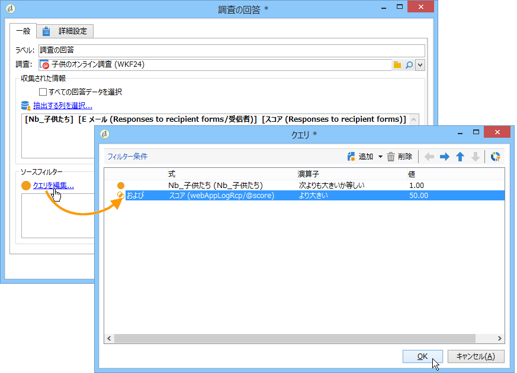

ターゲティングワークフローを開始します。このクエリは、8 人の受信者を復元します。

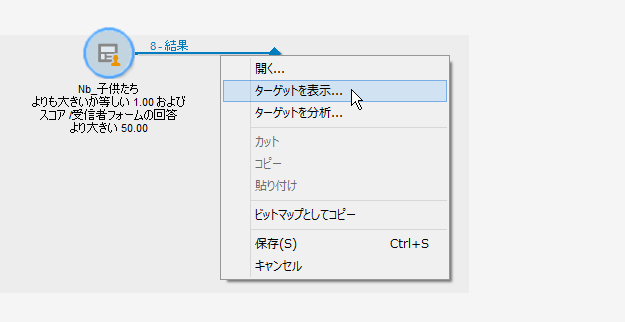

コレクションボックスのアウトバウンドトランジションを右クリックして、表示します。


次に、分割ボックスをワークフローに配置して、最高スコアの 5 人の受信者を復元します。

分割ボックスを編集して、次のように設定します。

* 最初に、「**[!UICONTROL 一般]**」タブで適切なスキーマを選択して、次にサブセットを設定します。

   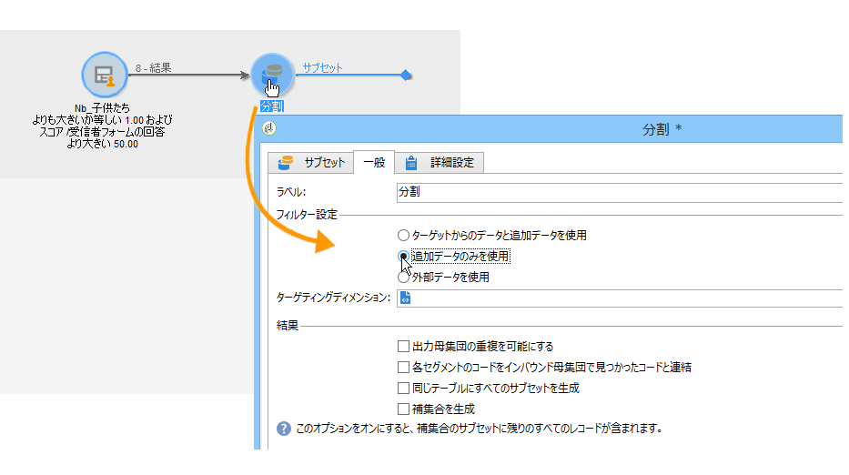

* 「**[!UICONTROL サブセット]**」タブに移動して、「**[!UICONTROL 選択レコード数の制限]**」オプションを選択し、「**[!UICONTROL 編集]**」リンクをクリックします。

   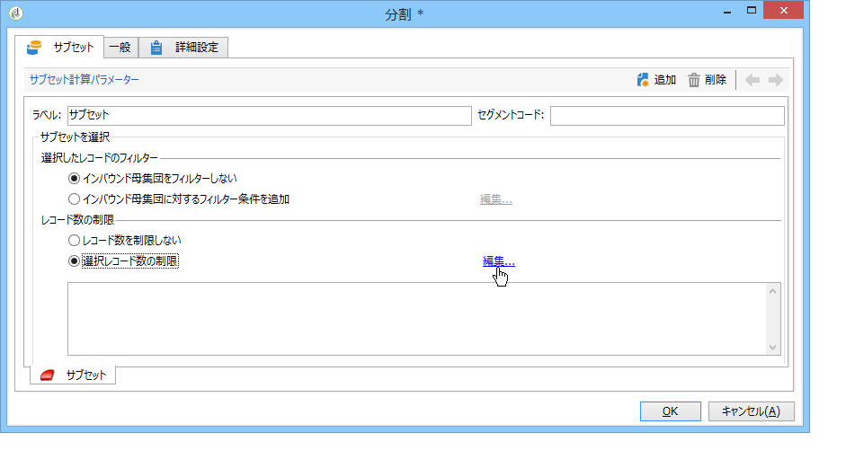

* 「**[!UICONTROL 並べ替えの後に最初のレコードのみ保持]**」オプションを選択して、並べ替える列を選択します。「**[!UICONTROL 降順で並べ替え]**」オプションをチェックします。

   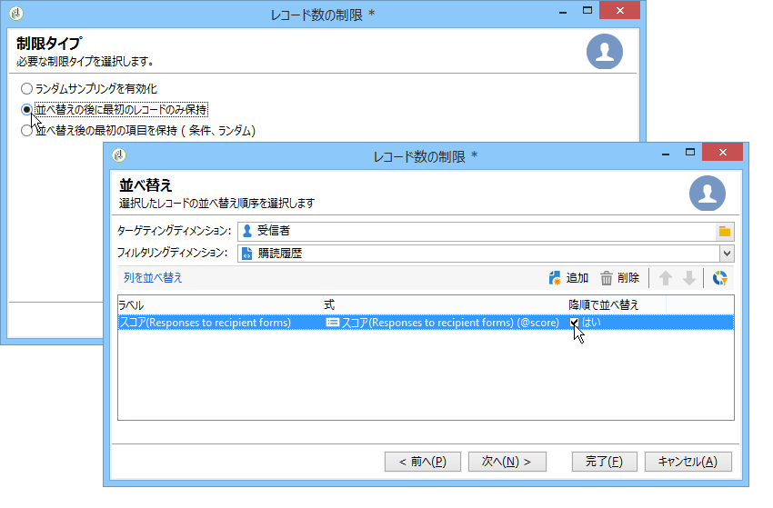

* 「**[!UICONTROL 次へ]**」ボタンをクリックして、レコードの数を 5 に制限します。

   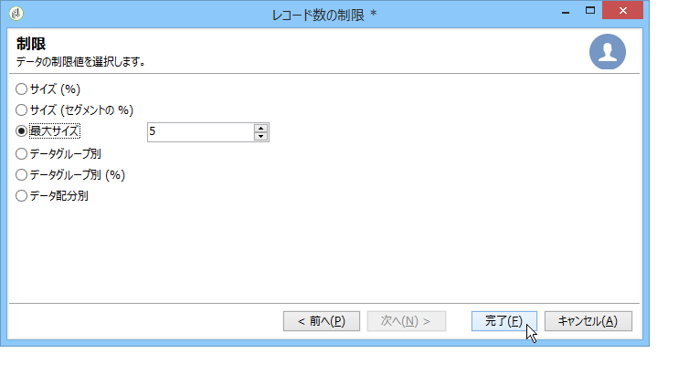

* 「**[!UICONTROL 完了]**」をクリックしてから、ワークフローを再起動してターゲティングを承認します。

## データの標準化 {#standardizing-data}

エイリアスを使用して収集したデータに対して、Adobe Campaign で標準化プロセスを設定できます。これにより、データベースに保存されているデータを標準化できます。それには、関連情報を含んだ項目別リストでエイリアスを定義します。[詳細情報](../../platform/using/managing-enumerations.md#about-enumerations)
