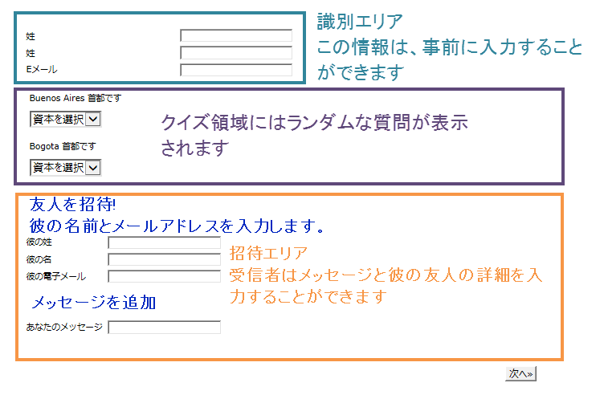
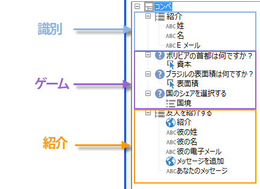
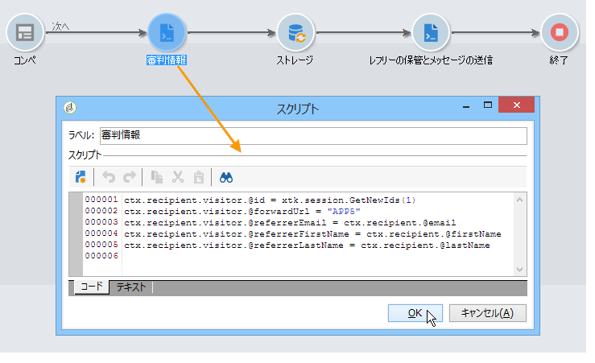
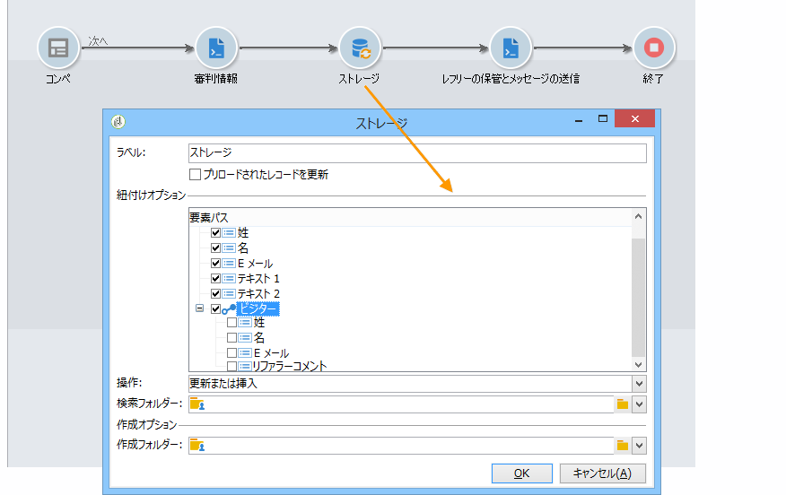
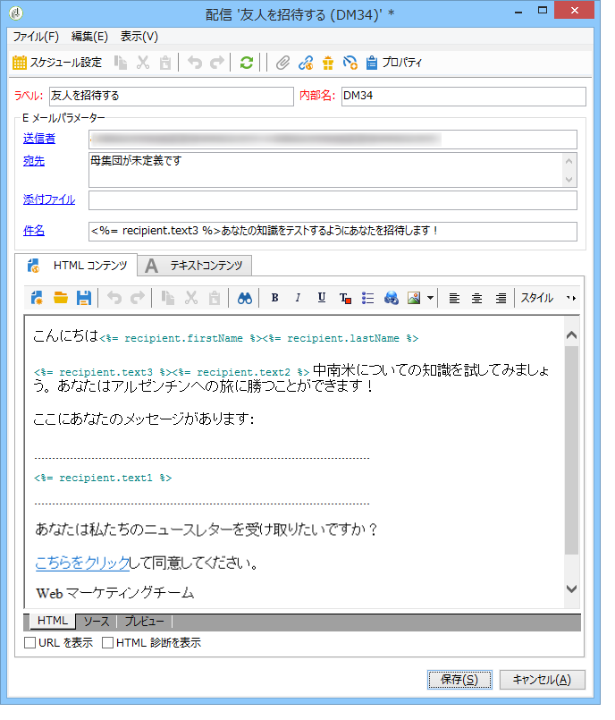
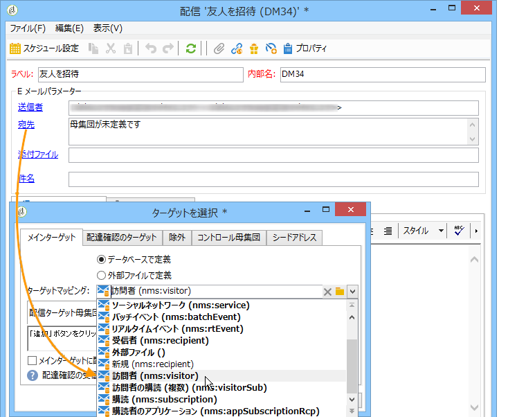
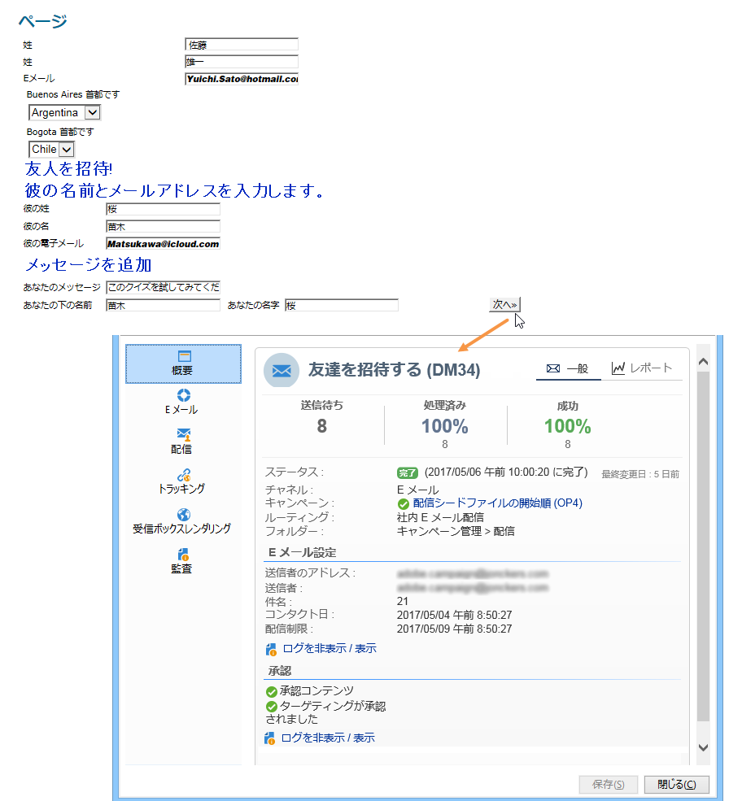
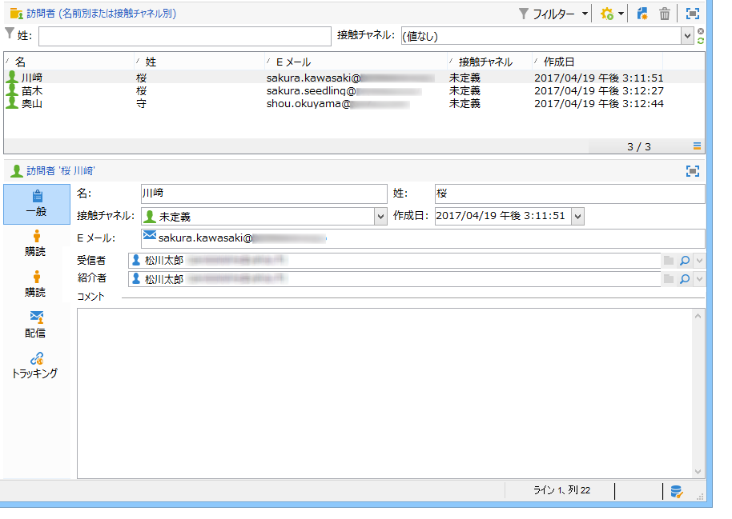

# ユースケース：リファラルフォームの作成{#use-case-creating-a-refer-a-friend-form}


この例では、データベースの受信者に競合他社を紹介します。Web フォームには、回答を入力するセクションを用意し、別のセクションで、メールアドレスを入力することで友達を紹介します。



識別ブロックおよび競合他社ブロックは、前に説明した手順で作成されます。

紹介ブロックを設定および作成するには、次の手順に従います。

1. 次に示すように、質問および友達の連絡先情報を入力するフィールドを備えた競合他社 Web フォームを作成します。

   

   「**メッセージ**」フィールドを使用して、被紹介者にメッセージを入力できます。また、紹介者は、**姓**、**名**&#x200B;およびメール&#x200B;**を入力する必要があります。**

   フィールドに入力された情報は、訪問者テーブルと呼ばれる特定のテーブルに格納されます。

   >[!NOTE]
   >
   >受信者から同意が得られない限り、データベースにそれらの情報と受信者を格納できません。バイラルマーケティングキャンペーン用に設計された **訪問者** テーブル（**nms:visitor**）に一時的に保存されます。 このテーブルは、**クレンジング**&#x200B;操作によって、定期的にパージされます。
   >
   >この例では、受信者をターゲットにして、紹介者に勧められた競合他社になるよう提案します。ただし、このメッセージでは、情報サービスのいずれかの購読もオファーします。購読する場合、データベースに格納できます。

   

   被紹介者に関係するフィールドのコンテンツは、プロファイル作成スクリプトおよび被紹介者に送信されるメッセージで使用されます。

1. 最初に、紹介者を被初回者にリンクするスクリプトを作成します。

   スクリプトには、次の命令が含まれます。

   

   ```
   ctx.recipient.visitor.@id = xtk.session.GetNewIds(1)
   ctx.recipient.visitor.@forwardUrl = "APP5"
   ctx.recipient.visitor.@referrerEmail = ctx.recipient.@email
   ctx.recipient.visitor.@referrerFirstName = ctx.recipient.@firstName
   ctx.recipient.visitor.@referrerLastName = ctx.recipient.@lastName
   ```

   ページの識別ブロックに入力された姓、名およびメールアドレスは、紹介者の姓、名およびメールアドレスとして識別されます。これらのフィールドは、被紹介者に送信されるメッセージの本文に再挿入されます。

   APP5 の値は、Web フォームの内部名に一致します。この情報により、被紹介者の生成元を調べることができます。つまり、作成された被紹介者に基づいて訪問者と Web フォームをリンクします。

1. ストレージボックスを使用すると、情報を収集してデータベースに保存できます。

   

1. 次に、手順 1 で作成した情報サービスにリンクされた配信テンプレートを作成します。情報サービスの「**[!UICONTROL シナリオを選択]**」フィールドで選択されます。

   紹介オファーメッセージを作成するために使用される配信テンプレートには、次の情報が含まれます。

   

   このテンプレートには、次のような特徴があります。

   * ターゲットマッピングとして訪問者テーブルを選択します。

     

   * 被紹介者の連絡先情報および紹介者に関する情報は、訪問者テーブルから取得されます。パーソナライゼーションボタンを使用して挿入されます。

     

   * このテンプレートには、競合他社フォームへのリンクと、被紹介者がニュースレターを購読するための購読リンクが含まれます。

     購読リンクは、パーソナライゼーションブロックを使用して挿入されます。デフォルトでは、プロファイルは&#x200B;**ニュースレター**&#x200B;サービスを購読できます。このパーソナライゼーションブロックは、例えば、受信者が異なるサービスを購読するなど、ニーズに合わせて変更できます。

   * 内部名（ここでは「referrer（紹介者）」）は、次に示すように、メッセージ配信スクリプトで使用されます。

   >[!NOTE]
   >
   >配信テンプレートについて詳しくは、[Campaign v8 ドキュメント &#x200B;](https://experienceleague.adobe.com/docs/campaign/campaign-v8/send/create-templates.html?lang=ja){target="_blank"} を参照してください。

1. 購読メッセージを配信するための 2 番目のスクリプトを作成します。

   

   ```
   // Updtate visitor to have a link to the referrer recipient
   ctx.recipient.visitor.@referrerId = ctx.recipient.@id
   ctx.recipient.visitor.@xtkschema = "nms:visitor"
   ctx.recipient.visitor.@_operation = "update" 
   ctx.recipient.visitor.@_key = "@id" 
   xtk.session.Write(ctx.recipient.visitor)
   
   // Send email to friend
   nms.delivery.QueueNotification("referrer",
   <delivery>
   <targets>
     <deliveryTarget>
       <targetPart type='query' exclusion='false' ignoreDeleteStatus='false'>
         <where>
           <condition expr={'@id IN ('+ ctx.recipient.visitor.@id +')' }/>
         </where>
       </targetPart>
      </deliveryTarget>
     </targets>
    </delivery>)
   ```

1. 競合他社フォームをパブリッシュして、初期のターゲットである受信者に招待状を送付します。受信者の誰かが友達を招待したら、**紹介オファー**&#x200B;テンプレートに基づいた配信が作成されます。

   

   被紹介者が&#x200B;**[!UICONTROL 管理／訪問者ノード]**&#x200B;にある訪問者フォルダーに追加されます。

   

   被紹介者のプロファイルには、紹介者によって入力された情報が含まれます。被紹介者のプロファイルは、フォームスクリプトに入力された設定に基づいて格納されます。被紹介者がニュースレターを購読することに決めると、受信者テーブルに保存されます。
