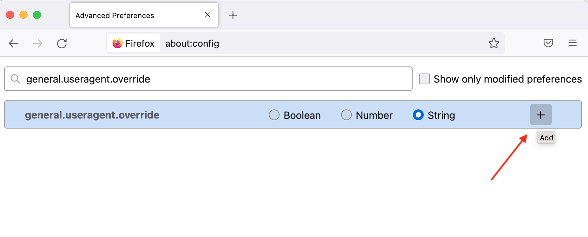

# Chrome および Firefox ブラウザーでの Campaign Web コンポーネントとバージョン 100 {#version-100}

## What {#what-version-100}

Googleと Mozilla は、Chrome と Firefox が、今後の 3 桁のバージョンにより一部の Web サイトを停止する可能性があることを警告しています。
バージョン番号を 2 桁から 3 桁に変更すると、この変更に対して準備されていない Web サイトを訪問する際に、問題が発生する場合があります。 一部の Web ページは、新しいバージョンのブラウザーで正しく表示されなくなる場合があります。

Mozilla とGoogleは、主要な Web サイトの互換性を事前にテストしています。 これらのバージョンがリリースされる前に修正できない問題がサイトに発生した場合は、両方のサイトが影響を受けないように、バックアップ計画を用意しておきます。

## 理由 {#why-version-100}

Web サイトで発生する可能性のある問題や機能の喪失は、訪問している Web サイトにブラウザーが送信するユーザーエージェント文字列に起因します。ユーザーエージェントは、ブラウザーから web サイトに送信される文字列で、使用しているブラウザーとバージョン、および関連するテクノロジーをサイトに知らせます。 ブラウザーが Web サイトにリクエストを送信すると、リクエストしたコンテンツを取得する前に、そのブラウザーがユーザーエージェント文字列で識別されます。 ユーザーエージェント文字列のデータは、Web サイトがブラウザーに適した形式でコンテンツを配信する際に役立ちます。 ユーザーエージェントのバージョンは、ブラウザーのバージョン番号に合わせて増分されます。 2 桁から 3 桁に移行すると、問題が発生する可能性があります。

## When {#when-version-100}

Chrome v100 はでのリリース用に設定されています。 **2022 年 3 月 30 日**、および Firefox v100 以降 **2022 年 5 月 4 日**.

## ここで、 {#where-version-100}

Adobeでは、Web フォームや調査、E メールミラーページなどの Campaign Web アプリケーションをテストし、これらの新しいブラウザーバージョンでも正常に動作することを確認することをお勧めします。

この推奨事項は、すべての Web アプリケーション（特に JavaScript コードが含まれている場合）に適用されます。

Firefox と Chrome、モバイル、デスクトップの両方を確認する必要があります。

## 方法 {#how-version-100}

Chrome および Firefox Nightly では、ブラウザーを設定して、現在バージョンを 100 としてレポートし、発生した問題を修正できます。

### Firefox 100{#test-firefox-100}

Mozilla Firefox 100 で Web ページをテストするには、ユーザーエージェント文字列を手動で変更することで、Web アプリでの今後のユーザーエージェントの変更をシミュレートできます。

1. Firefox を開き、 `about:config` アドレスバーで、Enter キーを押します。
1. を検索 `general.useragent.override`.
1. 「文字列」を選択し、プラス記号 (+) をクリックします。

   

1. フィールドに次のテキストを入力します。

   ```
   Mozilla/5.0 (Windows NT 10.0; rv:100.0) Gecko/20100101 Firefox/100.0
   ```

1. 青いチェックマークボタンをクリックして、設定を保存します。
1. ブラウザーを閉じて再起動します。

これらの設定を使用すると、ブラウザーは新しいユーザーエージェント文字列を Web サイトに送信し、ブラウザーが Firefox 100 であることを示します。 Web フォームで問題が発生した場合は、Mozilla の新しいバグレポートを作成する必要があります。 この変更を幅広く利用する前に、これらの Web フォームを再構築することを検討してください。

ユーザーエージェントをデフォルトに戻すには、次に戻ります。 `about:config` およびを検索します。 `general.useragent.override` 設定を再度おこないます。  ごみ箱アイコンが表示されたら、ごみ箱アイコンをクリックして設定を削除し、ブラウザーを再起動します。

### Chrome 100{#test-chrome-100}

独自の Web アプリでGoogle Chrome 100 ユーザーエージェントをテストするには、次の手順でこのテストを有効にします。

1. Chrome を開き、と入力します。 `chrome://flags` アドレスバーで、Enter キーを押します。
1. 検索 `Force major version to 100 in User-Agent` 」と入力し、次に示すように有効にします。

   

1. ブラウザーを閉じて再起動します。
1. を閉じる `chrome://flags` 画面

これらの設定を使用すると、ブラウザーは新しいユーザーエージェント文字列を Web サイトに送信し、ブラウザーが Chrome 100 であることを示します。 訪問した Web サイトで問題が発生した場合は、Googleの新しいバグレポートを作成する必要があります。 この変更を幅広く利用する前に、これらの Web フォームを再構築することを検討してください。

ユーザーエージェントをデフォルトに戻すには、次の手順に従い、フラグの設定をに変更します。 `Default` ブラウザーを再起動します。
