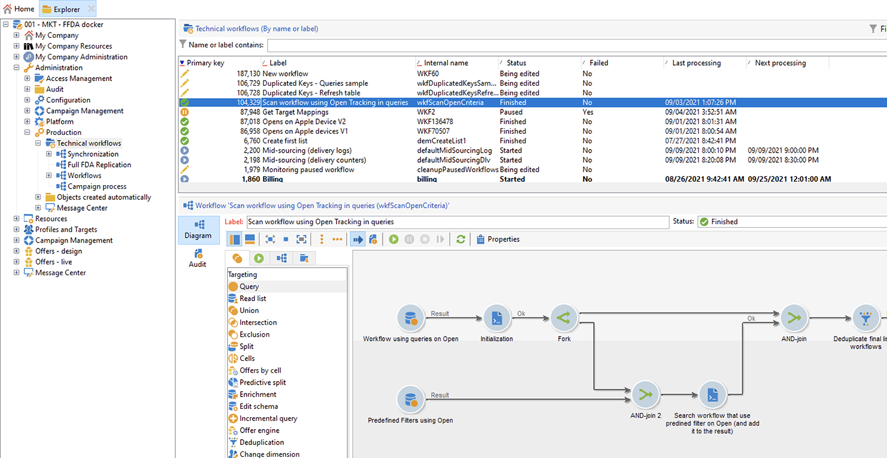
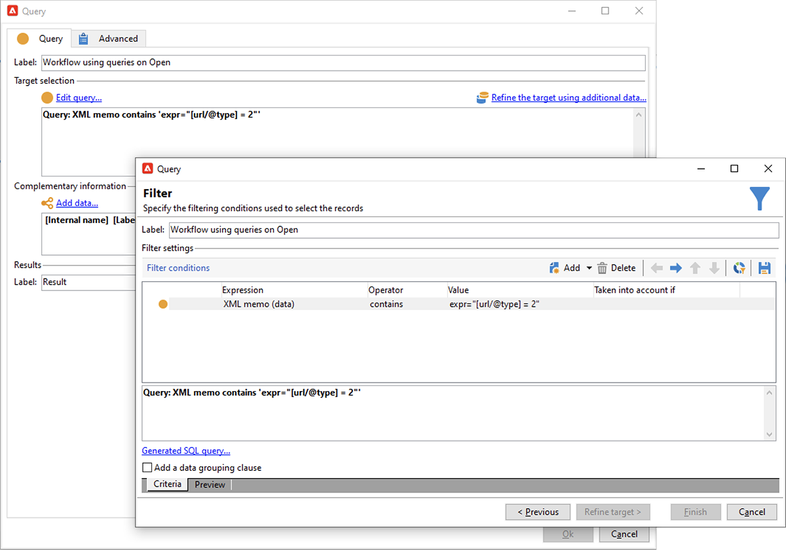

# Apple Mail アプリでのメールプライバシー保護


## 変更点

2021 年に、Appleはネイティブの Mail アプリに新しいプライバシー保護機能を導入しました。 このアプリにAppleのメールプライバシー保護機能が含まれるようになりました。 基本的に、送信者は、Appleのメールプライバシー保護機能の有効化を選択した受信者に関する情報を収集するために、トラッキングピクセルを使用できなくなりました。 [詳細情報](https://experienceleague.adobe.com/docs/deliverability-learn/deliverability-best-practice-guide/additional-resources/technotes/apple-mail-privacy-faq.html?lang=ja){target=&quot;_blank&quot;}。

## キャンペーンへの影響

Adobe Campaignには、追跡ピクセルを使用して電子メールの開封を追跡する機能が用意されています。 この機能は、ターゲティングとキャンペーンだけでなく、指標にも使用できます。 例えば、電子メールの開封率を使用して、キャンペーンの効果とユーザーエンゲージメントを測定できます。 つまり、セグメント化、ターゲティング、指標はキャンペーンの影響を受ける可能性があります。

## 実行すべきアクション

Appleの新機能は、電子メールのプライバシー保護に関して業界で生まれるべきものの形です。 アドビでは、Adobeの推奨に従うことを強くお勧めします。

### キャンペーントリガーへの影響を評価

これらの変更が現在のキャンペーントリガーに及ぼす影響を評価する。 E メールの開封がセグメント化、ターゲティングまたはリターゲティングの基準として使用されるワークフローを特定します。 詳しくは、 [ヒントとテクニック](#find-email-open-tracking).

### データを保持

データを保持し、現在の知識をデバイスに統合します。 主要業績評価指標 (KPI) は、ユーザーエージェントに基づいて設定できます。 例えば、iOSとAppleの Mail アプリを使用するユーザーのプロファイルに関する KPI を作成できます。 詳しくは、 [ヒントとテクニック](#preserve-tracking-data).

### 保持期間を超えたトラッキングログをアーカイブする

Adobe Campaignの保持期間を超えたトラッキングログをアーカイブします。

1. キャンペーンインスタンスで保持期間を確認します。
1. アクティブなターゲットマッピングを再度確認します。 標準のプロファイルテーブル (`nmsRecipient`) をクリックします。
1. Adobe Campaignからトラッキングログを書き出します。 ユーザーエージェントとオペレーティングシステムに関するデータを含むログを含めます。

### 開封率の現在の傾向を評価

iOSデバイスでAppleのメールアプリを使用するオーディエンスの割合を決定します。
この評価を使用すると、潜在的な異常ギャップとその原因を特定できます。 ギャップがキャンペーンのパフォーマンスの問題に起因するものか、Appleのプライバシー保護機能に起因するものかを判断できます。 詳しくは、 [ヒントとテクニック](#measure-ios-footprint).

### キャンペーン戦略とパフォーマンス指標を再評価する

特に、キャンペーン戦略とキャンペーンのパフォーマンス指標を積極的に再評価することを強くお勧めします。 クリックスルー、製品表示、購入など、より信頼性の高い指標に再度焦点を当てることができます。

現在使用可能なデータを調べて、開封率と他の指標との相関関係を評価することをお勧めします。 これらの指標が一貫して相関関係にある場合は、信頼性の高いトリガーを向上させることができます。

## ヒントとテクニック

### iOS全体のフットプリントを測定 {#measure-ios-footprint}

Adobe Campaignデータからインサイトを収集するには、標準のレポートを使用できます。

* **[!UICONTROL オペレーティングシステム]** レポート

   オペレーティングシステムごととバージョンごとの訪問者の割合を識別するには、このレポートを使用します。 [詳細情報](../../reporting/using/global-reports.md#operating-systems)。

   訪問者の合計数に関する、オペレーティングシステムごとの訪問者の分類を表示できます。

   

   各オペレーティングシステムで、オペレーティングシステムのバージョンごとに訪問者の分類を表示できます。

   

* **[!UICONTROL 開封数の分類]** レポート

   オペレーティングシステムごとの電子メールの開封率を特定するには、このレポートを使用します。 [詳細情報](../../reporting/using/global-reports.md#breakdown-of-opens)。

   

### E メール開封トラッキングの使用方法の決定 {#find-email-open-tracking}

E メールの開封がセグメント化、ターゲティングおよびリターゲティングの基準として使用されるワークフローを識別できます。

これをおこなうには、 **[!UICONTROL type]** 属性を持つリンク URL (**[!UICONTROL url/@type]**) をクリックします。 電子メールを開く場合、この属性は **[!UICONTROL 開く]**. この属性は、クエリエディター ( **[!UICONTROL クエリ]** ワークフローの「 」アクティビティと定義済みフィルター。 この属性をマーケティングキャンペーンのターゲット条件として使用できます。


この例では、マーケターは、過去 7 日間に特定の配信 E メールを開封し、過去 1 か月間に購入した受信者に報酬オファーを送信したいと考えています。 ワークフロークエリでは、E メールの開封を様々な方法で使用できます。

* E メールの開封をクエリのターゲット条件として使用できます。

   特定の配信のトラッキングログの URL タイプをに設定する必要があることをフィルター条件として指定できます。 **[!UICONTROL 開く]**.

   

* 定義済みフィルターを使用できます。 [詳細情報](../../workflow/using/creating-a-filter.md)。

   

   この定義済みフィルターは、ワークフローのクエリアクティビティで使用できます。

   

   >[!NOTE]
   >
   >ワークフローからは、定義済みフィルターのターゲティング条件を表示できません。

E メールの開封がターゲット条件として使用されているワークフローのリストを取得するには、 `xtk:workflow` スキーマ。 ワークフローの内容は、 **[!UICONTROL XML メモ（データ）]** フィールドを XML 形式で指定します。


ワークフローにこの内容を含めるように指定できます。

`expr="[url/@type] = 2"`

このターゲット条件は、トラッキングされる URL のタイプを **[!UICONTROL 開く]**.


#### 実装例とサンプルパッケージ

この実装例を使用して、E メールの開封がターゲット条件として使用されているワークフローを特定し、選択したキャンペーンオペレーターに通知を送信できます。 この実装は、次の目的で使用できます。

* ターゲティングワークフローで、電子メールの開封数から別の KPI に切り替えた場合の潜在的な影響を測定できます。 電子メールの開封を使用しない場合は、それ以上のアクションは必要ありません。
* 実装を再評価する際に、この例を使用して、ワークフローをスキップしないようにできます。

この例は、単一のテクニカルワークフローでのカスタム実装を示しています。


>[!IMPORTANT]
>
>パッケージは例としてのみ提供され、製品機能としてのAdobeではサポートされません。
>
>場合によっては、サンプルコードをキャンペーンの実装に適応させる必要があります。
>
>このサンプルパッケージのインストールと使用は、エンドユーザーのみが担当します。
>
>このパッケージは、実稼動環境以外でテストおよび検証することを強くお勧めします。

をダウンロードします。 [サンプルパッケージ](assets/PKG_Search_workflows_using_Opens_in_queries_V1.xml) をクリックし、インストールします。 [詳細情報](../../platform/using/working-with-data-packages.md#importing-packages)。

パッケージをインストールしたら、インスタンスに標準のテクニカルワークフローが含まれているフォルダーからワークフローにアクセスできます。

`/Administration/Production/Technical workflows/nmsTechnicalWorkflow`

ユーザーインターフェイスで、「 」を選択します。 **[!UICONTROL 管理]** > **[!UICONTROL 実稼動]** > **[!UICONTROL テクニカルワークフロー]**.



ワークフローは、次の主な手順で構成されます。

1. E メールの開封がターゲット条件として使用されているワークフローをリストします。
1. E メールの開封がターゲット条件として使用されている定義済みフィルターを一覧表示します。
1. これらの定義済みフィルターが使用されるワークフローをリストします。
1. 2 つのワークフローのリストを 1 つのリストに結合します。
1. 指定したオペレーターに電子メール通知を送信します。

ワークフローは、次の詳細な手順で構成されます。

1. 最初のアクティビティは、 `xtk:workflow` スキーマ。 このアクティビティは、電子メールを含む明示的なワークフロークエリを、基準に従ったインスタンスで検索するために使用されます。

   

   

   

   結果として、ワークフローのリストが返されます。

   

   この情報は再利用されるので、作業用テーブルの名前はグローバルワークフローインスタンス変数に格納されます。

   

1. 2 つ目のクエリは、E メールの開封を含む定義済みフィルターを検索するために使用されます。

   

   

   

   その結果、定義済みフィルターのリストが返されます。

   

1. この定義済みフィルターのリストは、これらのフィルターが使用されるワークフローを検索するために使用されます。
1. 両方のワークフローリストが 1 つのリストに結合されます。

   そのために、JavaScript コードが使用されます。

   

   ```javascript
   const queryPredFilter = xtk.queryDef.create(
     <queryDef schema={vars.targetSchema} operation="select">
        <select>
          <node alias="@id" expr="@id" />
          <node alias="@name" expr="@name"  />
        </select>
        <where/>
     </queryDef>
       ).ExecuteQuery()
   
   var qDef =
     <queryDef schema="xtk:workflow" operation="select">
       <select>
         <node expr="@id"/>
         <node expr="@internalName"/>
         <node expr="@label"/>
       </select>
       <where>
         <condition boolOperator="OR" expr={"data like '%expr=[url/@type] = 2%'" }/>
       </where>
     </queryDef>
   
   for each (var filter in queryPredFilter) {       
   
      //logInfo (filter.@name);
      var condition;
      condition =<condition boolOperator="OR" expr={"data like '%" + filter.@name + "%'" }/>
      qDef.where.appendChild(condition);   
   
   }
   
   var queryWorkflowList = xtk.queryDef.create(qDef);
   var workflowList = queryWorkflowList.ExecuteQuery();
   
   var sWorkflowList = "";
   var iCount = 0
   for each (var workflow in workflowList) {       
   
      //logInfo ("Workflow ID: " + workflow.@id + " in " + instance.vars.mainTargetSchema);
   
      iWorkflowId = workflow.@id;
      iWorkflowName = workflow.@internaName;
      iWorkflowLabel = workflow.@label;
   
       xtk.session.Write(
             <{instance.vars.mainTargetSchema.split(':')[1]}
               _operation="insertOrUpdate"       
               _key="@id"
               xtkschema={instance.vars.mainTargetSchema}
               id={iWorkflowId}
               internaName={iWorkflowName}
               label={iWorkflowLabel}
             />
       )
   }
   ```

1. 重複したワークフローは、マージされたリストから削除されます。

   

1. リストが空でないかを確認するためのテストが実行されます。

   

   リストが空でない場合は、電子メール通知用のHTMLテーブルに挿入されます。

   

   ```js
   const queryWorkflow = xtk.queryDef.create(
       <queryDef schema={vars.targetSchema} operation="select">
           <select>
               <node alias="@id" expr="@id" />
               <node alias="@internalName" expr="@internalName"  />
               <node alias="@label" expr="@label"  />
           </select>
           <where/>
       </queryDef>
   ).ExecuteQuery()
   
   var sWorkflowList = '<table border="0" >';
   
   sWorkflowList = sWorkflowList + "<tr><th>Worklow Id</th><th>Name</th><th>Label</th></tr>";
   
   for each (var workflow in queryWorkflow) {       
   
      sWorkflowList = sWorkflowList + "<tr>" +
                       "<td>" + workflow.@id + "</td>" +
                       "<td>" + workflow.@internalName + "</td>" +
                       "<td>" + workflow.@label + "</td>" +
                       "</tr>";
   
   }
   
   sWorkflowList = sWorkflowList + "</table>";
   
   instance.vars.workflowList = sWorkflowList;
   ```

1. HTMLテーブルが通知テンプレートに追加されます。

   ```js
   <%= instance.vars.workflowLIst%>
   ```

   

   電子メール通知には、電子メールの開封をクエリのターゲット条件として含むワークフローのリストが含まれます。

   

### 現在のトラッキングデータを保持 {#preserve-tracking-data}

#### 影響を受けるデータはどれですか？

プロファイルデータは、電子メールの開封数やクリックスルーなどのアクションのトラッキングデータで強化されます。 また、トラッキングでは、ユーザーエージェントを通じて、この情報が利用可能になったときに、ユーザーのデバイスに関する主要な情報を提供します。

要約すると、Adobe Campaignのトラッキングデータは次の情報を提供します。

* 特定の電子メールメッセージを開いた、またはクリックした人に関連付けられたプロファイル
* 開封日
* 使用されたデバイス ( 例：iPhone、Mac)
* オペレーティングシステムとバージョン ( 例：iOS 15、macOS 12、Windows 10)
* メールアプリケーションや Web ブラウザーなどのアプリケーションと、バージョン（Outlook 2019 など）

#### トラッキングデータを保持する必要があるのはなぜですか？

次の複数の理由から、このデータを保持することを強くお勧めします。

* このデータは、限られた期間、Adobe Campaignで保持されます。 リテンション期間は、インスタンスの設定によって異なります。

   インスタンスの設定を確認します。 [詳細情報](../../platform/using/privacy-management.md#data-retention)。

* Appleでの最近の変更に加えて、トラッキングデータを使用して、オーディエンスのエンゲージメントを促進するための大きな価値を追加できます。
* Appleは、ネイティブのメールアプリとメールプライバシー保護機能にさらに変更を加える可能性があります。

これらの理由により、このデータをできるだけ早くエクスポートすることを強くお勧めします。 そうしないと、一部のオーディエンスのトラッキングデータに悪影響が及ぶ場合があります。

#### トラッキングデータを保持するにはどうすればよいですか？

トラッキングデータを保持するには、Adobe Campaignからお使いの情報システムに書き出す必要があります。 [詳細情報](../../platform/using/get-started-data-import-export.md)。

>[!IMPORTANT]
>
>次の例では、標準搭載の `nms:Recipient` schema（デフォルトのプロファイルスキーマ） カスタムプロファイルに添付された追加のカスタムターゲットマッピングを使用する場合は、このエクスポート方法をすべてのカスタムログテーブルに拡張することをお勧めします。 [詳細情報](../../configuration/using/target-mapping.md)。

##### 原則

デフォルトでは、 `nms:Recipient` スキーマは、書き出す必要のある次の 3 つのスキーマにリンクされています。

| スキーマ | コンテンツ |
| --- | --- |
| nms:trackingLogRcp | データのトラッキング、対象ユーザー、時間、関連するメッセージ |
| nms:trackingUrl | E メールの開封やクリックスルーなど、リンクの特性を含む詳細 |
| nms:userAgent | デバイスに関する情報 |

テーブルはデータモデル内でリンクされます。


これらの関係を使用して、単一の書き出しクエリを作成します。


リンクされたスキーマから役立つ情報を使用して、このデータをエンリッチメントできます。

| スキーマ | コンテンツ |
| --- | --- |
| nms:Recipient | プロファイルに関連する詳細 |
| nms:Delivery | ユーザーが反応したメッセージに関する情報 |

結果を、Adobe Campaignでサポートされている外部ストレージソリューションに書き出すことができます。

* SFTP
* S3
* Azure Blob

##### 実装

この例では、Adobe Campaignからトラッキングデータを書き出す方法を示します。

1. クエリで始まるワークフローを作成します。

   最初のクエリは、過去 3 か月間のトラッキングログを取得するために使用されます。
増分処理クエリを使用して、まだエクスポートしていないレコードのみを抽出できます。

   必要な情報をすべて **[!UICONTROL 追加データ]** ノード。

   

1. を追加します。 **[!UICONTROL データ抽出（ファイル）]** アクティビティ。 クエリのすべてのデータを抽出ファイル形式にマッピングします。

   

   ファイル形式（TXT、CSV など）を選択します。

   

1. サポートされているストレージソリューションに、ファイルのアップロードに関する 3 番目および最後のアクティビティを追加します。


##### 高度な実装：iOSデバイスによる分類

ワークフローを使用して、受信者がApple Mail アプリを使用するかどうかを判断できます。 トラッキングログは、デバイス別に分割できます。 例えば、クエリフィルターを使用して、iOSデバイスでレコードを分類できます。

| アプリケーション | オペレーティングシステムまたはデバイス  | クエリフィルター |
| --- | --- | --- |
| Apple Mail | iOS 15 | `operating System (Browser) contains 'iOS 15' and browser (Browser) contains 'ApplewebKit'` |
| Apple Mail | iOS 14 またはiOS 13 | `browser contains 'AppleWebKit' and operating System of browser contains 'iOS 14' or operating System of browser contains 'iOS 13'` |
| Apple Mail | iOSモバイルデバイス：iPad、iPod、iPhone | `device (Browser) contains iPhone or device (Browser) equal to iPod or device (Browser) equal to iPad and browser (Browser) equal to 'AppleWebKit'` |
| Apple Mail | iPhone、iPadまたは iPod | `browser (Browser) equal to 'AppleWebKit' and device (Browser) equal to iPhone or device (Browser) equal to iPod or device (Browser) equal to iPad` |
| Apple Mail | Mac | `browser (Browser) equal to 'AppleWebKit' and operating System (Browser) contains 'Mac'` |
| Safari | macOS | `browser (Browser) equal to 'Safari' and device (Browser) equal to PC and operating System (Browser) contains 'Mac'` |
| Safari | モバイルデバイス | `browser (Browser) equal to 'Safari' and device (Browser) equal to iPad or device (Browser) equal to iPod or device (Browser) equal to iPhone` |


これらのルールは、様々な目的で使用できます。

* 外部ストレージソリューションへのデータのエクスポートとアーカイブ
* プロファイルに添付する KPI を計算
* 抑制リストの作成
* レポート

以下の例は、ワークフローを使用してiOSデバイスでレコードを分類する方法を示しています。

* 1 つ目のワークフローの例は、次のアクティビティで構成されます。

   1. 最初の **[!UICONTROL クエリ]** アクティビティは、過去 3 か月間のすべての E メール開封数を選択するために使用されます。
   1. A **[!UICONTROL 分割]** 「 」アクティビティは、電子メールアプリケーション、ブラウザー、オペレーティングシステム、デバイス別に選択を分割する場合に使用します。

   1. A **[!UICONTROL 重複排除]** 各 **[!UICONTROL 分割]** アクティビティ。 この **[!UICONTROL 重複排除]** アクティビティは、重複した E メールアドレスを削除するために使用します。

      この **[!UICONTROL 重複排除]** アクティビティが **[!UICONTROL 分割]** 「 」アクティビティを使用して、様々なデバイスを使用する受信者に関する情報が失われるのを防ぎます。

   1. An **[!UICONTROL 終了]** 各 **[!UICONTROL 重複排除]** アクティビティ。

   このタイプのワークフローは、ターゲティング用に標準の受信者テーブルにのみ受信者を保存する場合に役立ちます。

   

* 2 つ目のワークフローの例は、次のアクティビティで構成されます。

   1. 最初の **[!UICONTROL クエリ]** アクティビティは、過去 3 か月間のすべての E メール開封数を選択するために使用されます。
   1. A **[!UICONTROL 重複排除]** アクティビティは、重複した E メールアドレスを削除するために使用します。
   1. A **[!UICONTROL 分岐]** アクティビティは次の場合に使用されます。

      * あるトランジションでは、 **[!UICONTROL ディメンションを変更]** 「 」アクティビティは、トラッキングログが参照する受信者を検索するために使用されます。
      * 他のトランジションでは、 **[!UICONTROL 分割]** 「 」アクティビティは、電子メールアプリケーション、ブラウザー、オペレーティングシステム、デバイス別に選択を分割する場合に使用します。
   1. An **[!UICONTROL 終了]** アクティビティは、次の後の各トランジションに従います **[!UICONTROL 分割]** アクティビティ。

   このタイプのワークフローは、標準の受信者テーブル以外のテーブルに受信者を格納する場合に役立ちます。

   
