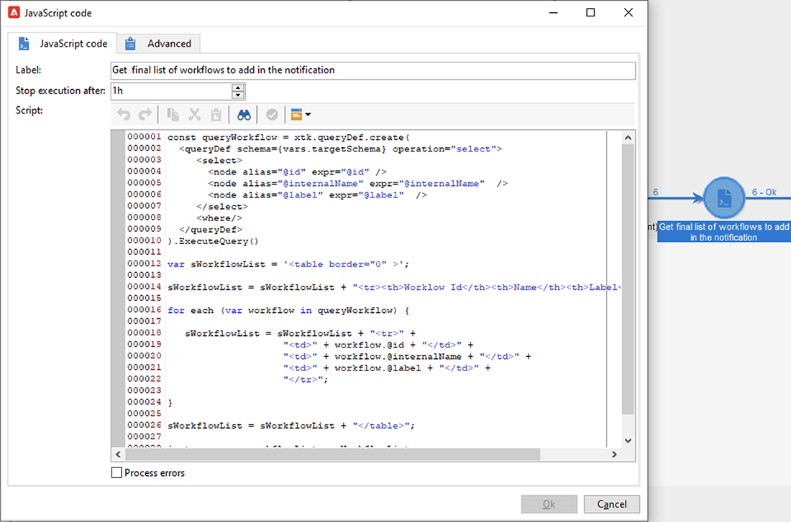
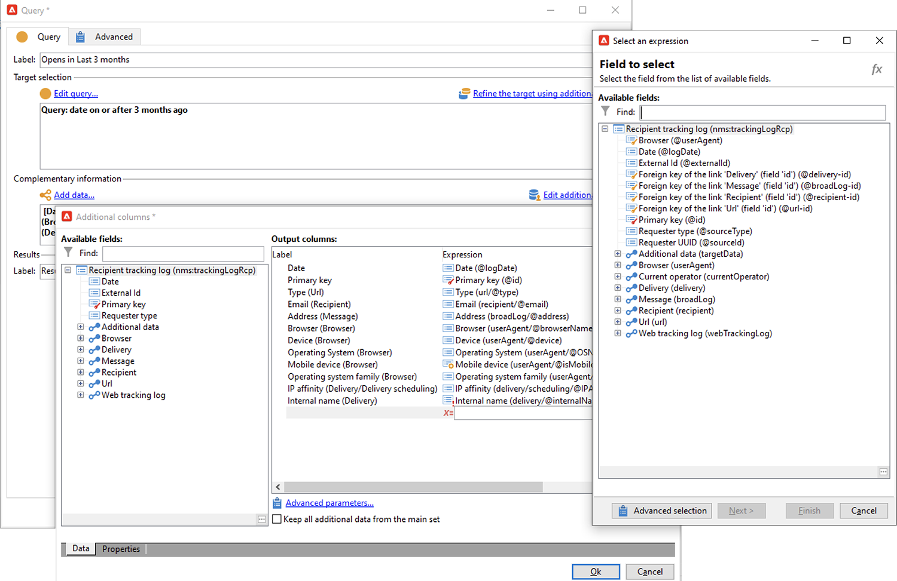

# Apple のメールアプリにおけるメールプライバシー保護


## 変更点

2021年、Apple は、ネイティブのメールアプリに新しいプライバシー保護機能を導入しました。このアプリには、Apple のメールプライバシー保護機能が含まれるようになりました。基本的に、送信者は、Apple のメールプライバシー保護機能を有効にすることを選択した受信者に関する情報を、トラッキングピクセルを使用して収集できなくなります。

## キャンペーンに与える影響

Adobe Campaign には、トラッキングピクセルを使用してメールの開封数を追跡する機能が用意されています。この機能は、ターゲティングやキャンペーンだけでなく、指標にも使用できます。例えば、メールの開封率を使用して、キャンペーンの有効性とユーザーエンゲージメントを測定できます。つまり、キャンペーンでは、セグメント化、ターゲティングおよび指標が影響を受ける可能性があります。

## 実行すべきアクション

Apple の新機能は、メールプライバシー保護の観点から、業界に今後登場するものの形です。アドビの推奨事項に従うことを強くお勧めします。

### キャンペーントリガーへの影響を評価

これらの変更が現在のキャンペーントリガーにどのような影響を与えるかを評価します。メールの開封数がセグメント化、ターゲティング、またはリターゲティングの条件として使用されるワークフローを識別します。[ヒントとテクニック](#find-email-open-tracking)を参照してください。

### データを保持

データを保持し、デバイスに関する現在の知識を統合します。ユーザーエージェントに基づいて主要業績評価指標（KPI）を設定できます。例えば、iOS と Apple のメールアプリを使用するユーザーのプロファイルに基づいて KPI を作成できます。[ヒントとテクニック](#preserve-tracking-data)を参照してください。

### 保持期間を超えたトラッキングログをアーカイブ

Adobe Campaign の保持期間を超えたトラッキングログをアーカイブします。

1. キャンペーンインスタンスの保持期間を確認します。
1. アクティブなターゲットマッピングを再確認します。標準のプロファイルテーブル（`nmsRecipient`）に加えてカスタムプロファイルテーブルを使用するかどうかを決定します。
1. Adobe Campaign からトラッキングログをエクスポートします。ユーザーエージェントとオペレーティングシステムに関するデータを含むログを含めます。

### 開封率の現在の傾向を評価

iOS デバイスで Apple のメールアプリを使用しているオーディエンスの割合を特定します。
この評価を使用すると、潜在的な異常なギャップとその原因を識別できます。ギャップの原因がキャンペーンのパフォーマンスの問題によるものか、Apple のプライバシー保護機能によるものなのかを判断できます。[ヒントとテクニック](#measure-ios-footprint)を参照してください。

### キャンペーン戦略とパフォーマンス指標を再評価

何よりも、キャンペーン戦略とキャンペーンのパフォーマンス指標を積極的に再評価することを強くお勧めします。クリックスルー、製品ビュー、購入数など、より信頼性の高い指標に再び焦点を当てることができます。

現在利用可能なデータを調べて、開封率と他の指標との相関関係を評価することをお勧めします。これらの指標が一貫して相関している場合は、十分なレベルの信頼性でトリガーを向上させることができます。

## ヒントとテクニック

### iOS 全体のフットプリントを測定 {#measure-ios-footprint}

Adobe Campaign データからインサイトを収集するには、標準レポートを使用できます。

* **[!UICONTROL オペレーティングシステム]**&#x200B;レポート

  オペレーティングシステム別およびバージョン別の訪問者の割合を識別するには、このレポートを使用します。[詳細情報](../../reporting/using/global-reports.md#operating-systems)。

  訪問者の合計数に関するオペレーティングシステム別の訪問者の分類を表示できます。

  

  オペレーティングシステム別に、オペレーティングシステムのバージョン別の訪問者の分類を表示できます。

  

* **[!UICONTROL 開封数の分類]**&#x200B;レポート

  オペレーティングシステム別のメールの開封数の割合を識別するには、このレポートを使用します。[詳細情報](../../reporting/using/global-reports.md#breakdown-of-opens)。

  

### メールの開封トラッキングの使用方法を決定 {#find-email-open-tracking}

メールの開封数がセグメント化、ターゲティング、リターゲティングの条件として使用されるワークフローを識別できます。

これを行うには、追跡されるリンク URL（**[!UICONTROL url/@type]**）の「**[!UICONTROL type]**」属性を使用します。メールの開封数の場合、この属性は&#x200B;**[!UICONTROL 開封]**&#x200B;に設定されます。この属性は、クエリエディター、ワークフローの&#x200B;**[!UICONTROL クエリ]**&#x200B;アクティビティおよび定義済みフィルターから利用できます。この属性は、マーケティングキャンペーンのターゲティング条件として使用できます。


この例では、マーケターは、過去 7 日以内に特定の配信メールを開き、過去 1 か月間購入した受信者に報酬オファーを送信したいと考えています。ワークフロークエリでは、メールの開封数を様々な方法で使用できます。

* メールの開封数は、クエリのターゲティング条件として使用できます。

  フィルタリング条件として、特定の配信のトラッキングログの URL タイプを&#x200B;**[!UICONTROL 開封]**&#x200B;に設定する必要があることを指定できます。

  

* 定義済みフィルターを使用できます。[詳細情報](../../workflow/using/creating-a-filter.md)。

  

  この定義済みフィルターは、ワークフローのクエリアクティビティで使用できます。

  

  >[!NOTE]
  >
  >ワークフローから、定義済みフィルターのターゲティング条件を表示できません。

メールの開封数がターゲティング条件として使用されるワークフローのリストを取得するには、`xtk:workflow` スキーマにクエリを実行する必要があります。ワークフローのコンテンツは、XML 形式で「**[!UICONTROL XML メモ（データ）]**」フィールドに保存されます。


ワークフローに次のコンテンツを含める必要があることを指定できます。

`expr="[url/@type] = 2"`

このターゲティング条件は、追跡される URL のタイプを&#x200B;**[!UICONTROL 開封]**&#x200B;に設定する必要があることを意味します。


#### 実装の例とサンプルパッケージ

この実装の例を使用すると、メールの開封数がターゲティング条件として使用されるワークフローを識別し、選択したキャンペーンオペレーターに通知を送信できます。この実装は、次の目的で使用できます。

* ターゲティングワークフローで、メールの開封数から別の KPI に切り替えた場合の潜在的な影響を測定できます。メールの開封数を使用しない場合は、それ以上のアクションは必要ありません。
* 実装を再評価する際は、この例を使用して、ワークフローのスキップを回避できます。

この例では、単一のテクニカルワークフローでのカスタム実装を示します。


>[!IMPORTANT]
>
>パッケージは例としてのみ提供され、アドビでは製品機能としてサポートしていません。
>
>場合によっては、サンプルコードをキャンペーンの実装に合わせて調整する必要があります。
>
>このサンプルパッケージのインストールと使用は、エンドユーザーのみが担当します。
>
>実稼動以外の環境で、このパッケージをテストし、検証することを強くお勧めします。

[サンプルパッケージ](assets/PKG_Search_workflows_using_Opens_in_queries_V1.xml)をダウンロードしてインストールします。[詳細情報](../../platform/using/working-with-data-packages.md#importing-packages)。

パッケージをインストールすると、インスタンスに標準テクニカルワークフローを含むフォルダーからワークフローにアクセスできます。

`/Administration/Production/Technical workflows/nmsTechnicalWorkflow`

ユーザーインターフェイスから、**[!UICONTROL 管理]**／**[!UICONTROL 実稼動]**／**[!UICONTROL テクニカルワークフロー]**&#x200B;を選択します。


ワークフローは、次の主な手順で構成されます。

1. メールの開封数がターゲティング条件として使用されるワークフローをリストします。
1. メールの開封数がターゲティング条件として使用される定義済みフィルターをリストします。
1. これらの定義済みフィルターが使用されるワークフローをリストします。
1. ワークフローの 2 つのリストを 1 つのリストに結合します。
1. 指定したオペレーターにメール通知を送信します。

ワークフローは、次の詳細な手順で構成されます。

1. 最初のアクティビティは、`xtk:workflow` スキーマのクエリアクティビティです。このアクティビティは、該当するインスタンスで、メールの開封数をターゲティング条件として含む明示的なワークフロークエリを検索するために使用されます。

   

   

   

   結果として、ワークフローのリストが返されます。

   

   この情報は再利用されるので、作業用テーブルの名前はグローバルワークフローインスタンス変数に保存されます。

   

1. 2 番目のクエリは、メールの開封数を含む定義済みフィルターを検索するために使用されます。

   

   

   

   結果として、定義済みフィルターのリストが返されます。

   

1. この定義済みフィルターのリストは、これらのフィルターが使用されるワークフローの検索に使用されます。
1. 両方のワークフローリストが 1 つのリストに結合されます。

   この目的のために、JavaScript コードを使用します。

   

   ```javascript
   const queryPredFilter = xtk.queryDef.create(
     <queryDef schema={vars.targetSchema} operation="select">
        <select>
          <node alias="@id" expr="@id" />
          <node alias="@name" expr="@name"  />
        </select>
        <where/>
     </queryDef>
       ).ExecuteQuery()
   
   var qDef =
     <queryDef schema="xtk:workflow" operation="select">
       <select>
         <node expr="@id"/>
         <node expr="@internalName"/>
         <node expr="@label"/>
       </select>
       <where>
         <condition boolOperator="OR" expr={"data like '%expr=[url/@type] = 2%'" }/>
       </where>
     </queryDef>
   
   for each (var filter in queryPredFilter) {       
   
      //logInfo (filter.@name);
      var condition;
      condition =<condition boolOperator="OR" expr={"data like '%" + filter.@name + "%'" }/>
      qDef.where.appendChild(condition);   
   
   }
   
   var queryWorkflowList = xtk.queryDef.create(qDef);
   var workflowList = queryWorkflowList.ExecuteQuery();
   
   var sWorkflowList = "";
   var iCount = 0
   for each (var workflow in workflowList) {       
   
      //logInfo ("Workflow ID: " + workflow.@id + " in " + instance.vars.mainTargetSchema);
   
      iWorkflowId = workflow.@id;
      iWorkflowName = workflow.@internaName;
      iWorkflowLabel = workflow.@label;
   
       xtk.session.Write(
             <{instance.vars.mainTargetSchema.split(':')[1]}
               _operation="insertOrUpdate"       
               _key="@id"
               xtkschema={instance.vars.mainTargetSchema}
               id={iWorkflowId}
               internaName={iWorkflowName}
               label={iWorkflowLabel}
             />
       )
   }
   ```

1. 重複したワークフローは、結合リストから削除されます。

   

1. リストが空でないことを確認するテストが実行されます。

   

   リストが空でない場合は、メール通知用の HTML テーブルに挿入されます。

   

   ```js
   const queryWorkflow = xtk.queryDef.create(
       <queryDef schema={vars.targetSchema} operation="select">
           <select>
               <node alias="@id" expr="@id" />
               <node alias="@internalName" expr="@internalName"  />
               <node alias="@label" expr="@label"  />
           </select>
           <where/>
       </queryDef>
   ).ExecuteQuery()
   
   var sWorkflowList = '<table border="0" >';
   
   sWorkflowList = sWorkflowList + "<tr><th>Worklow Id</th><th>Name</th><th>Label</th></tr>";
   
   for each (var workflow in queryWorkflow) {       
   
      sWorkflowList = sWorkflowList + "<tr>" +
                       "<td>" + workflow.@id + "</td>" +
                       "<td>" + workflow.@internalName + "</td>" +
                       "<td>" + workflow.@label + "</td>" +
                       "</tr>";
   
   }
   
   sWorkflowList = sWorkflowList + "</table>";
   
   instance.vars.workflowList = sWorkflowList;
   ```

1. HTML テーブルが通知テンプレートに追加されます。

   ```js
   <%= instance.vars.workflowLIst%>
   ```

   

   メール通知には、クエリのターゲティング条件としてメールの開封数を含むワークフローのリストが含まれます。

   

### 現在のトラッキングデータを保持 {#preserve-tracking-data}

#### 影響を受けるデータ

プロファイルデータは、メールの開封数やクリックスルーなどのアクションからのトラッキングデータでエンリッチメントされます。また、トラッキングでは、この情報が利用可能な場合は、ユーザーエージェントを通じて、ユーザーのデバイスに関する主な情報も提供します。

簡単に言うと、Adobe Campaign のトラッキングデータから次の情報が得られます。

* 特定のメールメッセージを通じて開封またはクリックスルーしたユーザーに関連付けられたプロファイル
* 開封日
* 使用したデバイス（例：iPhone または Mac）
* オペレーティングシステムとバージョン（例：iOS 15、macOS 12、Windows 10）
* アプリケーション（メールアプリケーションや web ブラウザーなど）とバージョン（Outlook 2019 など）

#### トラッキングデータを保持する必要がある理由

次のような複数の理由により、このデータを保持することを強くお勧めします。

* このデータは、Adobe Campaign によって期間限定で保持されます。保持期間は、インスタンスの設定に応じて異なります。

  インスタンスの設定を確認します。[詳細情報](../../platform/using/privacy-management.md#data-retention)。

* Apple の最近の変更以外にも、トラッキングデータを使用して計り知れない価値を追加し、オーディエンスのエンゲージメントを推進できます。
* Apple では、ネイティブのメールアプリとメールプライバシー保護機能にさらなる変更を行う可能性があります。

これらすべての理由から、このデータをできるだけ早くエクスポートすることを強くお勧めします。そうしないと、オーディエンスの一部でトラッキングデータが悪影響を受ける可能性があります。

#### トラッキングデータを保持する方法

トラッキングデータを保存するには、Adobe Campaign から情報システムにエクスポートする必要があります。[詳細情報](../../platform/using/get-started-data-import-export.md)。

>[!IMPORTANT]
>
>次の例は、デフォルトのプロファイルスキーマである、標準の `nms:Recipient` スキーマに焦点を当てています。カスタムプロファイルに添付された追加のカスタムターゲットマッピングを使用する場合は、このエクスポート戦略をすべてのカスタムログテーブルに拡張することをお勧めします。[詳細情報](../../configuration/using/target-mapping.md)。

##### 原則

デフォルトでは、`nms:Recipient` スキーマは、エクスポートが必要な 3 つのスキーマにリンクされます。

| スキーマ | コンテンツ |
| --- | --- |
| nms:trackingLogRcp | トラッキングデータ、つまりユーザー、時間、関連するメッセージ |
| nms:trackingUrl | メールの開封やクリックスルーなどの特性を含む、リンクに関する詳細 |
| nms:userAgent | デバイスに関する情報 |

テーブルは、データモデル内でリンクされます。


これらの関係を使用して、1 つのエクスポートクエリを作成します。


リンクされたスキーマの有用な情報を使用して、このデータのエンリッチメントを行うことができます。

| スキーマ | コンテンツ |
| --- | --- |
| nms:Recipient | プロファイルに関連する詳細 |
| nms:Delivery | ユーザーが応答したメッセージに関する情報 |

結果は、Adobe Campaign でサポートされている外部ストレージソリューションにエクスポートできます。

* SFTP
* S3
* Azure Blob

##### 実装

この例では、Adobe Campaign からトラッキングデータをエクスポートする方法を示します。

1. クエリで始まるワークフローを作成します。

   最初のクエリは、過去 3 か月間のトラッキングログを取得するために使用されます。
増分クエリを使用すると、まだエクスポートしていないレコードのみを抽出できます。

   **[!UICONTROL 追加データ]**&#x200B;ノードから必要な情報をすべて追加します。

   

1. **[!UICONTROL データ抽出（ファイル）]**&#x200B;アクティビティを追加します。クエリからのすべてのデータを抽出ファイル形式にマッピングします。

   

   ファイル形式（TXT、CSV など）を選択します。

   

1. サポートされるストレージソリューションにファイルをアップロードするため、3 番目と最後のアクティビティを追加します。


##### 高度な実装：iOS デバイス別の分類

ワークフローを使用して、受信者が Apple のメールアプリを使用しているかどうかを判断できます。トラッキングログは、デバイス別に分割できます。例えば、クエリフィルターを使用して、iOS デバイス別にレコードを分類できます。

| アプリケーション | オペレーティングシステムまたはデバイス | クエリフィルター |
| --- | --- | --- |
| Apple メール | iOS 15 | `operating System (Browser) contains 'iOS 15' and browser (Browser) contains 'ApplewebKit'` |
| Apple メール | iOS 14 または iOS 13 | `browser contains 'AppleWebKit' and operating System of browser contains 'iOS 14' or operating System of browser contains 'iOS 13'` |
| Apple メール | iOS モバイルデバイス：iPad、iPod、iPhone | `device (Browser) contains iPhone or device (Browser) equal to iPod or device (Browser) equal to iPad and browser (Browser) equal to 'AppleWebKit'` |
| Apple メール | iPhone、iPad または iPod | `browser (Browser) equal to 'AppleWebKit' and device (Browser) equal to iPhone or device (Browser) equal to iPod or device (Browser) equal to iPad` |
| Apple メール | Mac | `browser (Browser) equal to 'AppleWebKit' and operating System (Browser) contains 'Mac'` |
| Safari | macOS | `browser (Browser) equal to 'Safari' and device (Browser) equal to PC and operating System (Browser) contains 'Mac'` |
| Safari | モバイルデバイス | `browser (Browser) equal to 'Safari' and device (Browser) equal to iPad or device (Browser) equal to iPod or device (Browser) equal to iPhone` |


これらのルールは、様々な目的で使用できます。

* 外部ストレージソリューションにデータをエクスポートしてアーカイブ
* プロファイルに添付する KPI を計算
* 抑制リストを作成
* レポート

これらの例は、ワークフローを使用して iOS デバイス別にレコードを分類する方法を示します。

* 最初のワークフロー例は、次のアクティビティで構成されます。

   1. 最初の&#x200B;**[!UICONTROL クエリ]**&#x200B;アクティビティは、過去 3 か月間のすべてのメールの開封数を選択するために使用されます。
   1. **[!UICONTROL 分割]**&#x200B;アクティビティは、メールアプリケーション、ブラウザー、オペレーティングシステム、デバイス別に選択内容を分割するために使用されます。

   1. **[!UICONTROL 分割]**&#x200B;アクティビティの後には毎回、**[!UICONTROL 重複排除 - 重複]**&#x200B;アクティビティが続きます。**[!UICONTROL 重複排除 - 重複]**&#x200B;アクティビティは、重複したメールアドレスを削除するために使用されます。

      **[!UICONTROL 重複排除 - 重複]**&#x200B;アクティビティは、様々なデバイスを使用する受信者に関する情報の損失を回避するために、**[!UICONTROL 分割]**&#x200B;アクティビティの後に配置されます。

   1. **[!UICONTROL 重複排除 - 重複]**&#x200B;アクティビティの後には毎回、**[!UICONTROL 終了]**&#x200B;アクティビティが続きます。

  このタイプのワークフローは、ターゲティング用に標準の受信者テーブルにのみ受信者を保存する場合に役立ちます。

  

* 2 番目のワークフロー例は、次のアクティビティで構成されます。

   1. 最初の&#x200B;**[!UICONTROL クエリ]**&#x200B;アクティビティは、過去 3 か月間のすべてのメールの開封数を選択するために使用されます。
   1. **[!UICONTROL 重複排除 - 重複]**&#x200B;アクティビティは、重複したメールアドレスを削除するために使用されます。
   1. **[!UICONTROL 分岐]**&#x200B;アクティビティは、次の場合に使用されます。

      * 1 つのトランジションでは、**[!UICONTROL ディメンションを変更]**&#x200B;アクティビティを使用して、トラッキングログが参照する受信者を検索します。
      * もう 1 つのトランジションでは、**[!UICONTROL 分割]**&#x200B;アクティビティを使用して、メールアプリケーション、ブラウザー、オペレーティングシステム、デバイス別に選択内容を分割します。

   1. **[!UICONTROL 分割]**&#x200B;アクティビティ後の各トランジションの後には、**[!UICONTROL 終了]**&#x200B;アクティビティが続きます。

  このタイプのワークフローは、標準の受信者テーブル以外のテーブルに受信者を保存する場合に役立ちます。

  
