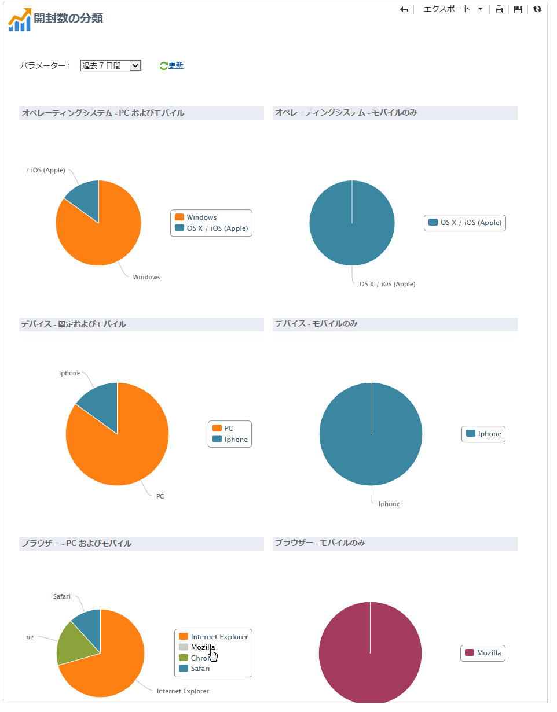
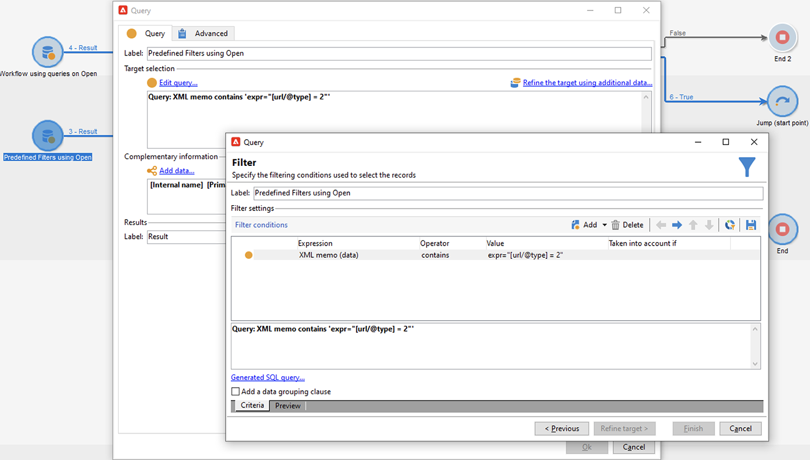
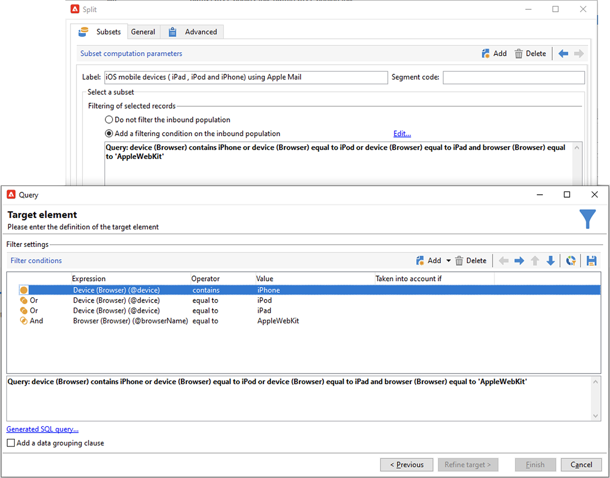

# Appleのメールアプリでのメールプライバシー保護


## 変更点

2021 年に、Appleはネイティブの Mail アプリケーションに新しいプライバシー保護機能を導入しました。 このアプリには、Appleのメールプライバシー保護機能が含まれるようになりました。 基本的に、送信者は、Appleのメールプライバシー保護機能を有効にするように選択した受信者に関する情報を収集するために、トラッキングピクセルを使用できなくなりました。 [詳細を表示](https://experienceleague.adobe.com/docs/deliverability-learn/deliverability-best-practice-guide/additional-resources/technotes/apple-mail-privacy-faq.html){target=&quot;_blank&quot;}。

## キャンペーンへの影響

Adobe Campaignは、追跡ピクセルを使用して、電子メールの開封を追跡する機能を提供します。 この機能は、ターゲティングとキャンペーンだけでなく、指標にも使用できます。 例えば、E メールの開封率を使用して、キャンペーンの効果とユーザーエンゲージメントを測定できます。 つまり、セグメント化、ターゲティング、指標はキャンペーンに影響を与える可能性があります。 [詳細を表示](https://experienceleague.adobe.com/docs/deliverability-learn/deliverability-best-practice-guide/additional-resources/technotes/apple-mail-privacy-faq.html#in-addition-to-measuring-opens%2C-what-else-is-impacted%3F){target=&quot;_blank&quot;}。

## 私はどのような行動をとるべきですか？

Appleの新機能は、電子メールのプライバシー保護に関して業界で提供されるものの形です。 アドビでは、Adobeの推奨に従うことを強くお勧めします。

### キャンペーントリガーへの影響の評価

これらの変更が現在のキャンペーンのトリガーに及ぼす影響を評価する。 E メールの開封がセグメント化、ターゲティングまたはリターゲティングの基準として使用されるワークフローを特定します。 [ ヒントとコツ ](#find-email-open-tracking) を読んでください。

### データの保持

データを保持し、現在の知識をデバイスに統合します。 主要業績評価指標 (KPI) は、ユーザーエージェントに基づいて設定できます。 例えば、iOSとAppleの Mail アプリを使用するユーザーのプロファイルに関する KPI を作成できます。 [ ヒントとコツ ](#preserve-tracking-data) を読んでください。

### 保持期間を超えたトラッキングログをアーカイブする

Adobe Campaignの保持期間を超えたトラッキングログをアーカイブします。

1. キャンペーンインスタンスで保持期間の期間を確認します。
1. アクティブなターゲットマッピングを再確認します。 標準のプロファイルテーブル (`nmsRecipient`) に加えて、カスタムプロファイルテーブルを使用するかどうかを決定します。
1. Adobe Campaignからトラッキングログを書き出します。 ユーザーエージェントとオペレーティングシステムに関するデータを含むログを含めます。

### 開封率の現在の傾向を評価

iOSデバイスでApple Mail アプリを使用するオーディエンスの割合を決定します。
この評価を使用して、潜在的な異常ギャップとその原因を特定できます。 ギャップがキャンペーンのパフォーマンスの問題に起因するものか、Appleのプライバシー保護機能に起因するものかを判断できます。 [ ヒントとコツ ](#measure-ios-footprint) を読んでください。

### キャンペーン戦略とパフォーマンス指標の再評価

特に、キャンペーン戦略とキャンペーンのパフォーマンス指標を積極的に再評価することを強くお勧めします。 クリックスルー、製品表示、購入など、より信頼性の高い指標に再び焦点を当てることができます。

現在利用可能なデータを調べて、開封率と他の指標との相関関係を評価することをお勧めします。 これらの指標を一貫して相関させる場合は、十分な信頼性を持ってトリガーを向上させることができます。

## ヒントとテクニック

### iOS全体の設置面積を測定する {#measure-ios-footprint}

Adobe Campaignデータからインサイトを収集するには、標準のレポートを使用できます。

* **[!UICONTROL オペレーティングシス]** テムレポート

   オペレーティングシステムとバージョンごとの訪問者の割合を識別するには、このレポートを使用します。 [詳細情報](../../reporting/using/global-reports.md#operating-systems)。

   訪問者の合計数に関する、オペレーティングシステムごとの訪問者の分類を表示できます。

   

   各オペレーティングシステムで、オペレーティングシステムのバージョンごとの訪問者の分類を表示できます。

   

* **[!UICONTROL OpensReport の分]** 類

   オペレーティングシステムごとの E メール開封率を特定するには、このレポートを使用します。 [詳細情報](../../reporting/using/global-reports.md#breakdown-of-opens)。

   

### E メール開封トラッキングの使用方法の決定 {#find-email-open-tracking}

E メールの開封がセグメント化、ターゲティング、リターゲティングの基準として使用されるワークフローを識別できます。

これをおこなうには、追跡するリンク URL の **[!UICONTROL type]** 属性 (**[!UICONTROL url/@type]**) を使用します。 電子メールを開く場合、この属性は **[!UICONTROL Open]** に設定されます。 この属性は、クエリエディター、ワークフロー内の **[!UICONTROL クエリ]** アクティビティ、定義済みフィルターから使用できます。 この属性をマーケティングキャンペーンのターゲット条件として使用できます。


この例では、過去 7 日以内に特定の配信 E メールを開封し、過去 1 か月間に購入した受信者に報酬オファーを送信します。 ワークフロークエリでは、様々な方法で E メールの開封を使用できます。

* E メールの開封をクエリのターゲット条件として使用できます。

   特定の配信のトラッキングログの URL タイプを **[!UICONTROL Open]** に設定する必要があることをフィルター条件として指定できます。

   

* 定義済みフィルターを使用できます。 [詳細情報](../../workflow/using/creating-a-filter.md)。

   

   この定義済みフィルターは、ワークフロー内のクエリアクティビティで使用できます。

   

   >[!NOTE]
   >
   >ワークフローからは、定義済みフィルターのターゲット条件は表示できません。

電子メールの開封がターゲティング条件として使用されているワークフローのリストを取得するには、`xtk:workflow` スキーマに対してクエリを実行する必要があります。 ワークフローの内容は、XML 形式の「**[!UICONTROL XML メモ（データ）]**」フィールドに格納されます。


ワークフローに次の内容を含める必要があることを指定できます。

`expr="[url/@type] = 2"`

このターゲット条件は、トラッキングする URL のタイプを **[!UICONTROL 開く]** に設定する必要があることを意味します。


#### 実装例とサンプルパッケージ

この実装例を使用して、E メールの開封がターゲティング条件として使用されているワークフローを特定し、選択したキャンペーンオペレーターに通知を送信できます。 この実装は、次の目的で使用できます。

* ターゲティングワークフローで、電子メールの開封数から別の KPI に切り替えた場合の潜在的な影響を測定できます。 電子メールの開封を使用しない場合は、それ以上のアクションは必要ありません。
* 実装を再評価する際に、この例を使用してワークフローをスキップしないことができます。

この例は、単一のテクニカルワークフローでのカスタム実装を示しています。


>[!IMPORTANT]
>
>パッケージは例としてのみ提供され、製品機能としてのAdobeではサポートされません。
>
>場合によっては、サンプルコードをキャンペーンの実装に合わせて調整する必要があります。
>
>このサンプルパッケージのインストールと使用は、エンドユーザーのみが担当します。
>
>このパッケージを実稼動環境以外でテストおよび検証することを強くお勧めします。

[ サンプルパッケージ ](assets/PKG_Search_workflows_using_Opens_in_queries_V1.xml) をダウンロードしてインストールします。 [詳細情報](../../platform/using/working-with-data-packages.md#importing-packages)。

パッケージをインストールしたら、インスタンスに標準のテクニカルワークフローが含まれているフォルダーからワークフローにアクセスできます。

`/Administration/Production/Technical workflows/nmsTechnicalWorkflow`

ユーザーインターフェイスから、**[!UICONTROL 管理]** / **[!UICONTROL 実稼動]** / **[!UICONTROL テクニカルワークフロー]** を選択します。


ワークフローは、次の主な手順で構成されます。

1. E メールの開封がターゲット条件として使用されるワークフローをリストします。
1. E メールの開封がターゲット条件として使用される定義済みフィルターをリストします。
1. これらの定義済みフィルターが使用されるワークフローをリストします。
1. 2 つのワークフローのリストを 1 つのリストに結合します。
1. 指定したオペレーターに電子メール通知を送信します。

ワークフローは、次の詳細な手順で構成されます。

1. 最初のアクティビティは、`xtk:workflow` スキーマの「クエリ」アクティビティです。 このアクティビティは、電子メールを含む明示的なワークフロークエリを、基準として開く、基準に従ったインスタンスを検索するために使用します。

   

   

   

   結果として、ワークフローのリストが返されます。

   

   この情報は再利用されるので、作業用テーブルの名前はグローバルワークフローインスタンス変数に保存されます。

   

1. 2 つ目のクエリは、E メール開封を含む定義済みフィルターを検索するために使用されます。

   

   

   

   定義済みフィルターのリストが結果として返されます。

   

1. この定義済みフィルターのリストは、これらのフィルターが使用されるワークフローを見つけるのに使用されます。
1. 両方のワークフローリストが 1 つのリストに結合されます。

   そのために、JavaScript コードが使用されます。

   

   ```javascript
   const queryPredFilter = xtk.queryDef.create(
     <queryDef schema={vars.targetSchema} operation="select">
        <select>
          <node alias="@id" expr="@id" />
          <node alias="@name" expr="@name"  />
        </select>
        <where/>
     </queryDef>
       ).ExecuteQuery()
   
   var qDef =
     <queryDef schema="xtk:workflow" operation="select">
       <select>
         <node expr="@id"/>
         <node expr="@internalName"/>
         <node expr="@label"/>
       </select>
       <where>
         <condition boolOperator="OR" expr={"data like '%expr=[url/@type] = 2%'" }/>
       </where>
     </queryDef>
   
   for each (var filter in queryPredFilter) {       
   
      //logInfo (filter.@name);
      var condition;
      condition =<condition boolOperator="OR" expr={"data like '%" + filter.@name + "%'" }/>
      qDef.where.appendChild(condition);   
   
   }
   
   var queryWorkflowList = xtk.queryDef.create(qDef);
   var workflowList = queryWorkflowList.ExecuteQuery();
   
   var sWorkflowList = "";
   var iCount = 0
   for each (var workflow in workflowList) {       
   
      //logInfo ("Workflow ID: " + workflow.@id + " in " + instance.vars.mainTargetSchema);
   
      iWorkflowId = workflow.@id;
      iWorkflowName = workflow.@internaName;
      iWorkflowLabel = workflow.@label;
   
       xtk.session.Write(
             <{instance.vars.mainTargetSchema.split(':')[1]}
               _operation="insertOrUpdate"       
               _key="@id"
               xtkschema={instance.vars.mainTargetSchema}
               id={iWorkflowId}
               internaName={iWorkflowName}
               label={iWorkflowLabel}
             />
       )
   }
   ```

1. 結合されたリストから重複したワークフローが削除されます。

   

1. リストが空でないかどうかを確認するテストが実行されます。

   

   リストが空でない場合は、電子メール通知用のHTMLテーブルに挿入されます。

   

   ```js
   const queryWorkflow = xtk.queryDef.create(
       <queryDef schema={vars.targetSchema} operation="select">
           <select>
               <node alias="@id" expr="@id" />
               <node alias="@internalName" expr="@internalName"  />
               <node alias="@label" expr="@label"  />
           </select>
           <where/>
       </queryDef>
   ).ExecuteQuery()
   
   var sWorkflowList = '<table border="0" >';
   
   sWorkflowList = sWorkflowList + "<tr><th>Worklow Id</th><th>Name</th><th>Label</th></tr>";
   
   for each (var workflow in queryWorkflow) {       
   
      sWorkflowList = sWorkflowList + "<tr>" +
                       "<td>" + workflow.@id + "</td>" +
                       "<td>" + workflow.@internalName + "</td>" +
                       "<td>" + workflow.@label + "</td>" +
                       "</tr>";
   
   }
   
   sWorkflowList = sWorkflowList + "</table>";
   
   instance.vars.workflowList = sWorkflowList;
   ```

1. HTMLテーブルが通知テンプレートに追加されます。

   ```js
   <%= instance.vars.workflowLIst%>
   ```

   

   電子メール通知には、クエリのターゲット条件として電子メールの開封を含むワークフローのリストが含まれます。

   

### 現在のトラッキングデータを保持 {#preserve-tracking-data}

#### 影響を受けるデータはどれですか。

プロファイルデータは、電子メールの開封数やクリックスルー数などのアクションのトラッキングデータで強化されます。 また、トラッキングでは、ユーザーエージェントを通じて、この情報が利用可能になった時点で、ユーザーのデバイスに関する主要な情報を確認できます。

要約すると、Adobe Campaignのトラッキングデータは次の情報を提供します。

* 特定の電子メールメッセージを開いた、またはクリックスルーした人に関連付けられているプロファイル
* 開封日
* 使用されたデバイス ( 例：iPhone、Mac)
* オペレーティングシステムとバージョン ( 例：iOS 15、macOS 12、Windows 10)。
* メールアプリケーションや Web ブラウザーなどのアプリケーションと、バージョン（例：Outlook 2019）

#### 追跡データを保持する必要があるのはなぜですか？

次の複数の理由により、このデータを保持することを強くお勧めします。

* このデータは、限られた期間Adobe Campaignで保持されます。 保持期間は、インスタンスの設定に応じて異なります。

   インスタンスの設定を確認します。 [詳細情報](../../platform/using/privacy-management.md#data-retention)。

* Appleでの最近の変更に加えて、トラッキングデータを使用して、オーディエンスのエンゲージメントを推進する莫大な値を追加できます。
* Appleは、ネイティブのメールアプリとメールプライバシー保護機能にさらに変更を加える可能性があります。

これらの理由により、このデータをできるだけ早くエクスポートすることを強くお勧めします。 そうしないと、一部のオーディエンスのトラッキングデータに悪影響が及ぶ可能性があります。

#### トラッキングデータを保持するにはどうすればよいですか？

トラッキングデータを保持するには、Adobe Campaignからお使いの情報システムにデータを書き出す必要があります。 [詳細情報](../../platform/using/get-started-data-import-export.md)。

>[!IMPORTANT]
>
>次の例では、デフォルトのプロファイルスキーマである、標準の `nms:Recipient` スキーマに焦点を当てています。 カスタムプロファイルに関連付けられた追加のカスタムターゲットマッピングを使用する場合は、このエクスポート方法をすべてのカスタムログテーブルに拡張することをお勧めします。 [詳細情報](../../configuration/using/target-mapping.md)。

##### 原則

デフォルトでは、`nms:Recipient` スキーマは、書き出す必要がある次の 3 つのスキーマにリンクされます。

| スキーマ | コンテンツ |
| --- | --- |
| nms:trackingLogRcp | データのトラッキング、宛先、ユーザー、時刻、関連するメッセージ |
| nms:trackingUrl | 電子メールの開封やクリックスルーなど、リンクに関する詳細（特性を含む） |
| nms:userAgent | デバイスに関する情報 |

テーブルはデータモデル内でリンクされます。


これらの関係を使用して、単一の書き出しクエリを作成します。


このデータを、リンクされたスキーマの役に立つ情報でエンリッチメントできます。

| スキーマ | コンテンツ |
| --- | --- |
| nms:Recipient | プロファイルに関連する詳細 |
| nms:Delivery | ユーザーが反応したメッセージに関する情報 |

結果を、Adobe Campaignでサポートされている外部ストレージソリューションに書き出すことができます。

* SFTP
* S3
* Azure Blob

##### 実装

この例では、Adobe Campaignからトラッキングデータを書き出す方法を示します。

1. クエリで始まるワークフローを作成します。

   最初のクエリは、過去 3 ヶ月間のトラッキングログを取得するために使用されます。
増分処理クエリを使用して、まだエクスポートしていないレコードのみを抽出できます。

   **[!UICONTROL 追加データ]** ノードから必要な情報をすべて追加します。

   

1. **[!UICONTROL データ抽出（ファイル）]** アクティビティを追加します。 クエリのすべてのデータを抽出ファイル形式にマッピングします。

   

   ファイル形式（TXT や CSV など）を選択します。

   

1. サポートされているストレージソリューションに、ファイルのアップロードの 3 番目および最後のアクティビティを追加します。


##### 高度な実装：iOSデバイスによる分類

ワークフローを使用して、受信者がApple Mail アプリを使用するかどうかを判断できます。 トラッキングログは、デバイス別に分割できます。 例えば、クエリフィルターを使用して、iOSデバイスでレコードを分類できます。

| アプリケーション | オペレーティングシステムまたはデバイス  | クエリフィルター |
| --- | --- | --- |
| Apple Mail | iOS 15 | `operating System (Browser) contains 'iOS 15' and browser (Browser) contains 'ApplewebKit'` |
| Apple Mail | iOS 14 またはiOS 13 | `browser contains 'AppleWebKit' and operating System of browser contains 'iOS 14' or operating System of browser contains 'iOS 13'` |
| Apple Mail | iOSモバイルデバイス：iPad、iPod、iPhone | `device (Browser) contains iPhone or device (Browser) equal to iPod or device (Browser) equal to iPad and browser (Browser) equal to 'AppleWebKit'` |
| Apple Mail | iPhone、iPadまたは iPod | `browser (Browser) equal to 'AppleWebKit' and device (Browser) equal to iPhone or device (Browser) equal to iPod or device (Browser) equal to iPad` |
| Apple Mail | Mac | `browser (Browser) equal to 'AppleWebKit' and operating System (Browser) contains 'Mac'` |
| Safari | macOS | `browser (Browser) equal to 'Safari' and device (Browser) equal to PC and operating System (Browser) contains 'Mac'` |
| Safari | モバイルデバイス | `browser (Browser) equal to 'Safari' and device (Browser) equal to iPad or device (Browser) equal to iPod or device (Browser) equal to iPhone` |



次のルールは、様々な目的で使用できます。

* 外部ストレージソリューションへのデータのエクスポートとアーカイブ
* プロファイルに関連付ける KPI の計算
* 抑制リストの作成
* レポート

次の例は、ワークフローを使用してiOSデバイスでレコードを分類する方法を示しています。

* 最初のワークフローの例は、次のアクティビティで構成されます。

   1. 最初の **[!UICONTROL クエリ]** アクティビティを使用して、過去 3 ヶ月間の電子メール開封をすべて選択します。
   1. **[!UICONTROL 分割]** アクティビティは、選択内容を電子メールアプリケーション、ブラウザー、オペレーティングシステム、デバイスで分割する場合に使用します。

   1. **[!UICONTROL 重複排除]** アクティビティは、各 **[!UICONTROL 分割]** アクティビティに従います。 **[!UICONTROL 重複排除]** アクティビティは、重複した E メールアドレスを削除するために使用します。

      **[!UICONTROL 重複排除]** アクティビティは、**[!UICONTROL 分割]** アクティビティの後に配置されるので、様々なデバイスを使用する受信者に関する情報が失われるのを防ぎます。

   1. **[!UICONTROL 終了]** アクティビティは、各 **[!UICONTROL 重複排除]** アクティビティに従います。

   このタイプのワークフローは、ターゲティング用に標準の受信者テーブルにのみ受信者を格納する場合に便利です。

   

* 2 つ目のワークフローの例は、次のアクティビティで構成されます。

   1. 最初の **[!UICONTROL クエリ]** アクティビティを使用して、過去 3 ヶ月間の電子メール開封をすべて選択します。
   1. **[!UICONTROL 重複排除]** アクティビティは、重複した E メールアドレスを削除するために使用します。
   1. **[!UICONTROL Fork]** アクティビティが使用されます。

      * あるトランジションでは、「**[!UICONTROL ディメンションを変更]**」アクティビティを使用して、トラッキングログが参照する受信者を検索します。
      * もう 1 つのトランジションでは、「**[!UICONTROL 分割]**」アクティビティを使用して、選択を E メールアプリケーション、ブラウザー、オペレーティングシステム、デバイス別に分割します。
   1. **[!UICONTROL 終了]** アクティビティは、**[!UICONTROL 分割]** アクティビティの後の各トランジションに従います。

   このタイプのワークフローは、標準の受信者テーブル以外のテーブルに受信者を格納する場合に役立ちます。

   

## 参考になるリンク

[Appleメールプライバシー保護に関する FAQ](https://experienceleague.adobe.com/docs/deliverability-learn/deliverability-best-practice-guide/additional-resources/technotes/apple-mail-privacy-faq.html){target=&quot;_blank&quot;}
