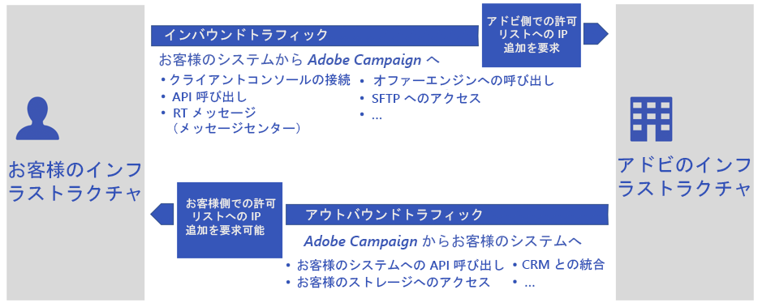

# パブリッククラウドへの移行に関する FAQ{#dc-faq}

[Gold Standard Initiative](../../rn/using/gold-standard.md) の一環として、Adobeはレガシーデータセンターを廃止します。 Campaign Classicインスタンスは、パブリッククラウドAmazon Web サービス (AWS) に転送する必要があります。 [この取り組みの詳細を表示します](dc-migration.md)。

以下に、このプロジェクトに関するよくある質問、Campaign 環境への影響、その他の役に立つリソースを示します。

その他の質問については、[アドビカスタマーケア](https://experienceleague.adobe.com/?support-solution=Campaign#support)にお問い合わせください。

## インフラストラクチャへの影響

データベースおよびインフラストラクチャに対する全体的な影響を以下に示します。

* **データベースは変更されますか？新しいデータベースのバージョンは何ですか？使用するオペレーティングシステムは何ですか？**

   アドビは、最適な状態で Adobe Campaign サービスを提供するために最も適したデータベース管理エンジンを選択し、デプロイする権利を有します。

   また、最高レベルのセキュリティを維持するために、インフラストラクチャに関する詳細な情報は提供しません。

* **データ損失のリスクはありますか？**

   データベースはレガシーデータセンターからダンプされ、パブリッククラウド（AWS）で復元されます。新しいデータセンターで再起動すると、移行前の状態からアプリケーションが再開されます。 一部のスケジュール済みタスクが遅延することを除いて、ユーザーが違いに気づくことはありません。

* **レガシーデータセンターとパブリッククラウドの間で、パッケージのサイズに違いはありますか？**

   アドビでは、現在のデータベースサイズ、ディスクサイズなどに基づく新しいパッケージ定義でパブリッククラウド（AWS）にプロビジョニングしています。例えば、レガシーデータセンターに 1 つのアプリケーションサーバーがある場合、パッケージ定義に基づいて、パブリッククラウド (AWS) に 2 つのアプリケーションサーバーを持つことができます。

* **ビルド番号または Campaign バージョンは変更されますか？**

   最初のステップとして、移行では Campaign Classic のビルドは同じままです。

   さらに手順を進めて、最新のCampaign ClassicGA ビルドにアップグレードします。 詳しくは、[ ビルドアップグレードの FAQ](../../platform/using/faq-build-upgrade.md) および [Campaign Gold Standard リリースノート ](../../rn/using/gold-standard.md) を参照してください。

* **移行後の問題に対処するためにどのような計画がありますか？**

   本番システムの移行前に、広範なテストを実施します。ただし、問題が発生した場合は、[Adobeカスタマーケア ](https://experienceleague.adobe.com/?support-solution=Campaign#support) が最も重要な窓口となります。 Adobeは、必要に応じて、高度なサポートを提供するために、専門家のチームを設立しました。

## 配信品質への影響

IP、ブロックリスト、サブドメインおよび URL に対する全体的な影響を以下に示します。

* **このアイテムの IP はど許可リストのように処理されますか。顧客は、Campaign からの受信トラフィック用に新しい IP アド許可リストレスをに追加する必要がありますか？**

   Adobe サーバーの IP アドレスが変更されます。そのため、お客様は、システム内のシステムにこれらの新しい IP アドレ許可リストスを追加する必要があります。

   [IP の詳細に](#config) ついては、ここをクリックしてく許可リストださい。

* **SFTP/FTP アクセス用にポートに追加さ許可リストれたポートをどのように処理しますか。**

   SFTP 設定（公開鍵との IP）許可リストは、レガシーデータセンターからパブリッククラウド (AWS) にも移行されます。 お客様からのアクションは必要ありません。

* **IP は変更されますか？**

   Adobe サーバーの IP アドレスが変更されます。そのため、お客様は、これらの新しい IP アドレスをシステム内の許可リストに追加する必要があります。

   [IP の詳細に](#config) ついては、ここをクリックしてく許可リストださい。

* **サブドメインの委任はどのように処理されますか？**

   既存のサブドメインは、レガシーデータセンターからパブリッククラウド (AWS) に移動されます。 この部分は、移行プロセスの一環として、アドビの配信品質チームが処理します。

   アドビは、移行後に新しいパブリッククラウド（AWS）サーバーで設定が実行されるようにするために必要なテストをお客様に案内します。

* **移行によって、トラッキング、リソースおよび Web アプリケーション用の新しい URL が生成されますか？**

   いいえ、既存の URL が保持されます。

* **neolane.net から campaign.adobe.com へのサブドメインに変更はありますか？**

   `neolane.net` と `campaign.adobe.com` の両方が移行後に適用されます。 簡単にするには：neolane.net をパブリッククラウド (AWS) の新しいインスタンスにリダイレクトするので、お客様が変更する必要はありません。

* **IP ウォーミングの計画とは何ですか？**

   まず、Adobe配信品質は、プラットフォームの配信品質ステータスを評価し、新しい IP への切り替えに関する計画を推奨します。

   移行後にウォームアップをおこなう必要はありません。例外が発生する場合があります。その場合、[Adobeカスタマーケア ](https://experienceleague.adobe.com/?support-solution=Campaign#support) がお客様に連絡します。

   ただし、稼動時におこなわれる最初のランプアップとは異なり、この計画は、この操作をビジネスに対して透過的なものにするためのものです。

   移行が完了すると、Campaign インスタンスの送信 IP は、まったく異なるものになります。スムーズな移行のために、アドビでは、古い IP から新しい IP にトラフィックを順次切り替えることで、新しい送信 IP のランプアップを実装します。

* **URL 上の移動を行ってい許可リストますか？**

   はい、これはサーバー設定ファイルに保存され、ソースから新しいインスタンスにコピーされます。

* **コミュニケーションのブランド化に使用される委任されたサブドメインにはどのような影響がありますか？**

   マーケティングコミュニケーションに使用されるサブドメインは同じです。 ただし、実装に応じて、クライアント側でアクションが必要になります。
   * Adobe（デフォルト）へのサブドメインのデリゲーションの場合、Adobeはすべての変更を処理し、シームレスなトランジションを確保します。
   * CNAME の設定（例外）の場合、クライアントは変更を実装するように要求されます。Adobeと連携します。

## 設定と接続性への影響

### 「 」タブの IP に関する許可リスト注意{#config}

パブリッククラウドへの移行により、Adobe Campaign アプリケーションサーバー用の IP が新しくなります。このため、IP の変更が Adobe サーバーとお客様の情報システム間の接続性に影響する可能性があります。

以下の 2 つの事例について考えてみましょう。

* インバウンドトラフィック：お使いのシステムまたはその他のサードパーティからAdobe Campaignサーバーに対して開始されるすべてのネットワークアクティビティ。 設定はアドビがおこない、移行時にレガシーからパブリッククラウドにコピーされます。その後、インバウンドトラフィックの接続は移行後もそのまま維持され、お客様側では何の操作も行われません

* 送信トラフィック：Adobe Campaignサーバがお使いの情報システムまたは他のサードパーティに対して開始するすべてのネットワークアクティビティ ( 例：SMS プロバイダー )。 組織内で実行されているセキュリティ・ポリシーによっては、IP の変更において、お使いの情報システムまたはその他のサ許可リストード・パーティからの操作が必要になる場合があります

### グローバルな影響

設定、他のシステムおよび製品との接続、API およびタイムゾーンへの全体的な影響を以下に示します。

* **移行は、外部アカウントへの接続に影響しますか？**

   はい。サードパーティ統合（SMS プロバイダーなど）は、新しいAdobe Campaignアプリケーションサーバーの IP アドレスをサードパーティに追加する必要があ許可リストります。

* **移行は、Genesis Connector を使用した Adobe Analytics への接続に影響しますか？Adobe Analytics側のに Campaign の IP アド許可リストレスを追加する方法について教えてください。**

   Adobe Campaign アプリケーションサーバーの IP アドレスが変更されます。この手順は、移行後にアドビカスタマーケアによって処理されます。

* **移行は、他のアドビのソリューション（AEM、Target など）との接続に影響しますか？**

   統合とは、アカウント設定と Web サービスアカウント設定で宣言さ許可リストれた IP アドレスの組み合わせです。 これは、Adobeカスタマーケアによって計上および所有されます。

   アプリケーションサーバーの IP が変更され許可リストる際に、外部ソリューションで必要となる IP アドレスが、アプリケーション上に存在します。 この情報が提供されます。統合の他の部分は IMS ベースで、そのまま機能します。

* **IMS 統合の組織 ID に関連付けられていないお客様について教えてください。**

   お客様が IMS をお持ちでない場合は提供されます。IMS 組織 ID がインスタンスに関連付けられます。

* **マルチブランド設定は移行の影響を受けますか？**

   サブドメインおよびすべての関連設定がレガシーデータセンターからパブリッククラウド（AWS）に正しく移動／リダイレクトされていれば、影響を考慮する必要はありません。

* **API 接続は移行の影響を受けますか？**

   Adobe サーバーの IP アドレスが変更されます。そのため、お客様は、これらの新しい IP アドレスをシステム内の許可リストに追加する必要があります。

   [IP オン](#config) の詳細については、ここをクリックしてく許可リストださい。

* **移行後にすべての JavaScript メモリ設定パラメーターは確実に正しく設定されますか？**

   レガシーデータセンターからパブリッククラウド（AWS）にインスタンス設定がコピーされるので、これらの値は移行後も保持されます。

* **特定のファイル拡張子へのアクセスに対するリスクはありますか？**

   お客様がフォントファイルや Outlook 会議ファイルをパブリックリソースフォルダーに読み込めるようにしたい場合があります。この設定は、現在の `config-<instance>.xml` ファイルで行われます。 これは設定ファイルと共にコピーされます。

* **タイムゾーンは新しいサーバーで変更されますか？お客様は現在のタイムゾーンをそのまま使用できますか？**

   新しいサーバーの場所に応じて変更される場合があります。ただし、お客様は現在のタイムゾーンをそのまま使用できます。

   [Adobe Campaign Classic v7](../../workflow/using/managing-time-zones.md) のタイムゾーン管理について詳しくは、ここをクリックしてください。

## セキュリティと権限

このパブリッククラウド（AWS）への移行により、お客様の環境は、すべての必要なセキュリティ要件に基づいて最新の状態に維持されます。次のような要件があります。

* 最新の OS とセキュリティパッチを定期的に適用
* お客様ごとのインフラストラクチャの分離
* ロードバランサー、ネットワークセキュリティルール、ストレージ暗号化などのクラウドインフラストラクチャをサポートするための管理されたセキュリティと監査のレビュー。

権限、証明書および SFTP アクセスに対する影響を以下に示します。

* **すべての証明書は新しいサーバーに移動されますか？**

   はい、この移行の一環として、すべての証明書が移動されます。

* **お客様から新しい SFTP アクセスキーを要求する必要はありますか？**

   いいえ、Adobeは、新しいサーバーでそのまま SFTP アクセスキーをコピーします。

* **SFTP 権限はどのように処理されますか？**

   新しい SFTP サーバー、ユーザー、ディレクトリおよびファイルが完全に同じ権限レベルになるようにしています。

* **SFTP 接続を確立できなかった場合、お客様が操作を続けられるようにするためにどのような回避策／計画がありますか？**

   接続に関する問題が発生する可能性があるのは、お客様側の許可リストに関する問題だけです。 お客様は、非本番環境でこのテストを追加し、本番環境への移行前に機能することを確認する必要があります。

* **移行が必要なデータセンター固有の許可リスト設定はありますか。**

   いいえ。管理するデータセンター固有の許可リスト設定はありません。

* **アドビは、カスタムスクリプトが新しい環境で正常に実行されることを確認していますか？**

   お客様の実装では、例えば、ワークフローでカスタムスクリプト（Perl/Shell/Python/JavaScript）を使用して、ファイルやフォルダーを操作できます。

   ホストされているインスタンスでは、スクリプトは JavaScript エンジンを介してのみ実行されます。 これらの特定の実装は、セキュリティの欠陥やアップグレード後の問題の原因となる可能性があります。これらはサポートされていません。

* **IMS 統合を使用する場合、新しいインスタンスでそのまま機能しますか？ それとも追加の設定更新が必要ですか？**

   DNS 名は同じままですので、移行後も同じように機能します。

## 移行の実行

移行中の全体的な影響を以下に示します。

* **移行中にマーケティングアクティビティの停止を計画する必要がありますか？**

   Adobeでは、レガシーデータセンターでアプリケーションがシャットダウンされる直前に、実行の速度を低下させ、すべての実行を一時停止することをお勧めします。配信とワークフロー これにより、プロセスが「適切に」一時停止し、進行中の実行状態を保存する時間が与えられるので、Cloud Server(AWS) での再起動が容易になります。

* **Adobe Campaign サービスのダウンタイムは予想されますか？**

   移行では、プラットフォームのダウンタイムは避けられません。この計画の目的は、このダウンタイムを最小限に抑えられるようにすることです。

   データセンター間のデータ転送は、ダウンタイムのクリティカルパス上にあります。データは以下の 2 つの方法で保存されます。

   * 最も重要な、データベース
   * アプリケーションサーバー上のファイル（データのインポートとエクスポート）

   データの転送を高速化するには、データベースのサイズを小さくすることが最も重要です。提案：

   * 履歴データ（配信ログ、トラッキングログなど）の保持期間を短縮
   * 他のテーブル（配信、受信者、カスタムテーブル）の不要なレコードを削除

* **インスタンスの移行に伴う推定ダウンタイムはどれくらいですか？**

   ダウンタイムは、お客様のデータベースおよび SFTP ファイルストレージのサイズに完全に依存します。推定期間については、カスタマーケアの担当者にお問い合わせください。

* **レガシーサーバーから送信されたメッセージについて教えてください。リンクは常にアクセス可能ですか？**

   移行実行中は、1 つのサービス（E メールリンクのリダイレクト）のみが機能し続けます。すべての受信者は、E メール内をクリックするとランディングページにアクセスできます。ただし、これらのクリックはトラッキングされないので、移行の直前に開始された配信のクリック率は、通常より低くなります。

* **ミッドソーシング／RT 環境について教えてください。**

   ミッドソーシングと RT は、インフラストラクチャの他のホストされている部分として処理されます。

* **移行はどのような順序でおこなわれますか？**

   環境は以下の順序で移行されます。

   1. 開発環境
   1. ステージ環境
   1. 実稼動環境
   1. RT 環境
   1. ミッドソーシング環境

* **ロールバックプランとは何ですか？**

   ロールバックプランでは、DNS を元に戻し、ソースデータベースを読み取り専用から読み取り／書き込みに戻します。最終的には自動化されます。

* **移行後も、古いインスタンスにアクセスできますか？**

   アプリケーションの移行が完了した後は、レガシーデータセンターで再びプロセスを実行する計画はありません。スケジュールされたバックアッププロセスがパブリッククラウド（AWS）で実行されるまでは、一時的なバックアップを除き、レガシーデータセンター上のすべてのデータを消去できると考えられます。

* **パブリッククラウドへの移行後、各インスタンスのテストにどのくらいの時間がかかりますか。**

   お客様の環境の複雑さに応じて、ステージ環境と本番環境の移行の間に少なくとも 1 週間の時間が必要です。

* **新しい IP の追加を処理するユーザーを教えてく許可リストださい。**

   Adobeカスタマーケアチームは、新しい IP を顧客に追加することで、お客様およびサードパーティが確実に新しいシステムにアクセスできるようにし許可リストます。

## サポートおよびその他の役立つリンク{#support}

* [Adobe Managed Services（パブリッククラウド）への移行](dc-migration.md)
* [Gold Standard へのアップグレード](../../rn/using/gs-overview.md)
* [ビルドアップグレードに関する FAQ](../../platform/using/faq-build-upgrade.md)
