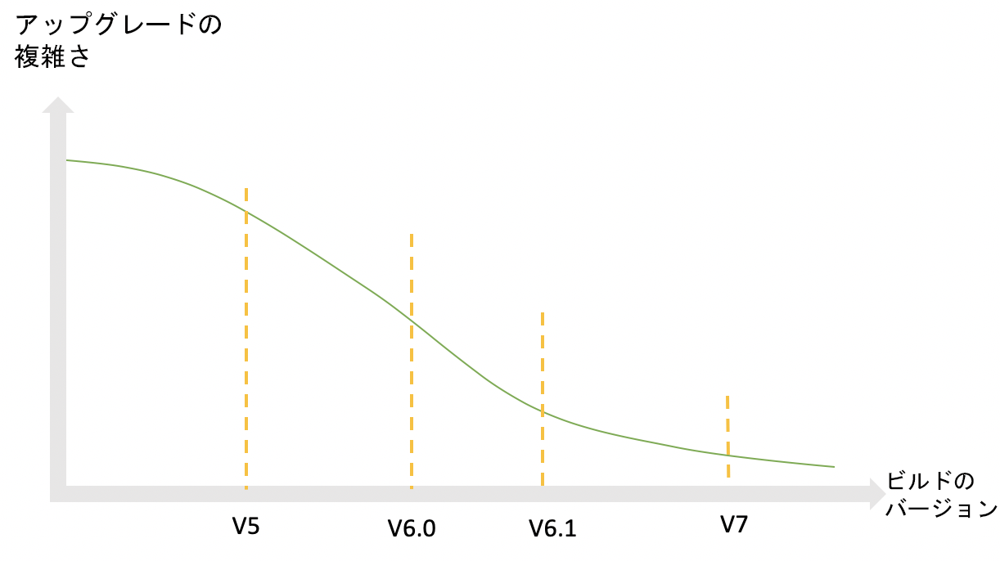
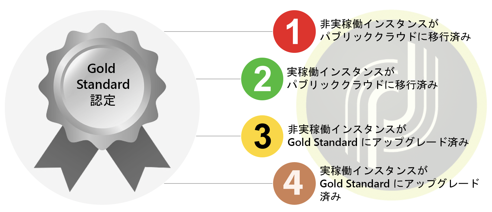
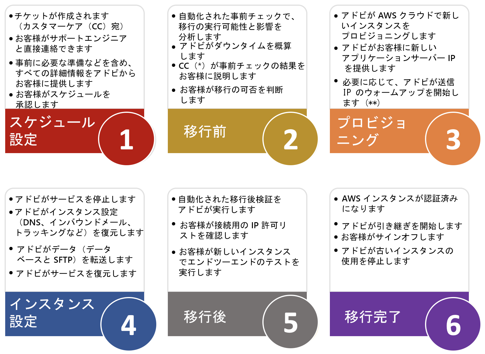

# 概要{#dc-ovv}

## コンテキスト

アドビは、Adobe Campaign Classic のお客様に最高のエクスペリエンスと価値を提供することに全力で取り組んでいます。長年にわたって、お客様のクラウドホスティングの価値と信頼性を実現して参りました。アドビでは、[Gold Standard Initiative](../../rn/using/gold-standard.md) の一環として、より優れた信頼性の高いサービスを提供するために、すべてのお客様を Adobe Managed Services（AWS 上のパブリッククラウド）に移行しつつあります。

このプログラムの主な目標は次の 3 つです。

* インフラストラクチャを安全な最新の環境（AWS）に移行することで、特定されたセキュリティ脆弱性に対処します。
* 煩雑なスケーリングプロセスをなくし、[Enhanced MTA](../../delivery/using//sending-with-enhanced-mta.md) へのアクセスを提供し、すべてのメンテナンスサービスレベルを向上させます。
* 多くのリソースや時間を必要としない自動化された定期的なアップグレードなど、Adobe Campaign Classic の今後のリリースに備えてお客様のインスタンスを準備します。

### 用語集

* **ビルドアップグレード**：Adobe Campaign Classic ソフトウェアを最新のセキュアなビルド番号に更新しても、メジャー／マイナービルドレベルは変わりません。例：Campaign v7 20.2.3 ビルド 9182 から Campaign v7 21.2.5 ビルド 9188。[詳細情報](../../platform/using/faq-build-upgrade.md)。
* **MID／RT**：Adobe クラウドにホストされたメッセージ実行サーバー（MID はバッチキャンペーン用、RT はリアルタイム単一メッセージ用）
* **Gold Standard アップグレード**：このプログラムは、セキュリティの向上、サポートの強化、メンテナンスと安定性の向上をもたらします。また、今後のアップグレードが容易になり、Campaign の新機能を利用できるようになります。[詳細情報](../../rn/using/gs-overview.md)。
* **AWS**：Amazon Web Services（Amazon パブリッククラウド）
* **SFTP**：セキュアなファイル転送プロトコルです。[詳細情報](../../platform/using/sftp-server-usage.md)。

>[!NOTE]
>Campaign Classic v7 のパブリッククラウドへの移行による影響を受けるのは、**Adobe Managed Services** を使用するお客様のみです。

## 利点

**セキュリティ**

* 最新のセキュリティ修正
* 保存時のデータ暗号化
* 認証（IMS）の強化

**インフラストラクチャ**

* アジャイルハードウェアの拡張性
* 復元の高速化
* 信頼性と安定性の向上
* 作業手順の統一

**パフォーマンス**

* E メール容量の改善
* データベースの拡大
* 実証済みの Campaign バージョン - Gold Standard

**Adobe Campaign Classic のお客様向けに堅牢で信頼性の高いソリューションを提供**

1. 生産手順の改善。これにより信頼性の向上、問題発生時の対応の迅速化、重大な問題発生時のリカバリの高速化が実現。
1. E メール送信容量の増加。新しいデータセンターでホストされるインスタンスは、E メール配信専用インフラストラクチャのメリットを活用できるようになります。その結果、E メールの配信速度が向上したり、送信 IP の使用量が少なくなる可能性があります。
1. ハードウェア拡張性の向上。ハードウェアリソースの増加は、より迅速におこなうことができます。厳密には、数日ではなく 1 時間ほどになります。

**Gold Standard により今後のアップグレードが容易に**

1. 組織がアップグレードを待つ時間が長くなるほど、アップグレードがより複雑になり、脆弱性に直面する可能性が高まります（特により古いバージョンから移行する場合）。
1. Gold Standard アップグレードを使用すると、インスタンスが最新化され、手動の介入もリソースも少ない、より自動化された定期的な更新を受ける準備が整います。

## 移行について

Adobe Managed Services（パブリッククラウド）への移行は、影響を受けるアカウントについて 2020年または 2021年に行われます。この取り組みの期間中、アドビがお客様の組織をリードしガイドします。

この取り組みを開始するにあたり、この移行を必要とするアカウントは、タイムラインとドキュメントへのアクセス方法が記載された E メールをアドビから受け取ります。これは、アカウントの移行がスケジュールされていることを示す通知です。

移行を開始するには、[カスタマーケアの新しいサポートチケットを開きます](https://experienceleague.adobe.com/?support-solution=Campaign#support)。件名として「AWS への移行」を使用します。

### この移行は必須ですか？

クラウドへのこうした移行は、お客様の Adobe Campaign インスタンスの **[Gold Standard 認定](../../rn/using/gs-overview.md)**&#x200B;を取得するための最初のステップです。パブリッククラウド（AWS）以外のデータセンターでホストされている場合、この移行は必須です。

Adobe Managed Services クラウドは、安全で最適化された最新の環境である AWS でホストされています。AWS について詳しくは、[こちら](https://aws.amazon.com/application-hosting/benefits/)を参照してください。

アドビでは、従来のデータセンターを廃止する予定です。そこで実行している Adobe Campaign インスタンスは、新しい基準データセンター（AWS）に転送する必要があります。

現在の場所では&#x200B;**セキュリティとパフォーマンスの脆弱性**&#x200B;に晒される可能性があるので、これは、前進するうえで不可欠です。

さらに、この移行は、今では Adobe Campaign の&#x200B;**今後のビルドアップグレードのための前提条件**&#x200B;になりました。ビルドアップグレードはレガシーデータセンターでできなくなりました。

アドビは、お客様のデータを保護し、Adobe Campaign を将来にわたって利用し続けられるように取り組んでいます。共同で成功を収めるには、お客様のパートナーシップが必要です。

アドビは、専任のカスタマーケア担当者、カスタマーサクセスマネージャー、製品マネージャー、エンジニア、テクニカルオペレーションスペシャリストおよび製品コンサルタントからなる&#x200B;**チームを編成**&#x200B;しており、このエクスペリエンスがスムーズかつシームレスになるように支援します。アドビでは、関連するプロジェクト情報および連絡先情報をお客様が確実に保持できるように取り組んでいます。

アドビは、この移行を迅速、シームレス、安全なものにするテクノロジーの開発に多大な努力を注いできました。

### 制約

* 移行では、プラットフォームのダウンタイムは避けられません。この計画の目的は、このダウンタイムを最小限に抑えられるようにすることです。
* データ統合のための IP の変更。
* 新しい送信 IP の配信品質のランプアップ。ただし、稼動時に行われる最初のランプアップとは異なり、この計画は、この操作をビジネスに対して透過的なものにするためのものです。

詳しくは、Campaign の[パブリッククラウドへの移行に関する FAQ](dc-migration-faq.md) を参照してください。

## Gold Standard 認定への道のり

各マイルストーンの間の検証手順をアドビが支援します。

## パブリッククラウドへの移行パス

アドビでほとんどのアクションをおこないます。お客様には検証とサインオフを行っていただく必要があります。

## 移行ガイドライン

### グローバルなアプローチ

**データベース**

データベースは従来のデータセンターからダンプされ、パブリッククラウド（AWS）で復元されます。新しいデータセンターで再起動すると、アプリケーションはシャットダウン前と同じ状態から再開されます。一部のスケジュール済みタスクが遅延することを除いて、ユーザーが違いに気づくことはありません。

**メール送信 IP**

移行が完了すると、Campaign インスタンスの送信 IP は、まったく異なるものになります。スムーズな移行のために、アドビでは、古い IP から新しい IP にトラフィックを順次切り替えることで、新しい送信 IP のランプアップを実装します。

**データ統合 IP**

クライアント側でのデータ統合は、データ統合用 IP の変更の影響を受ける可能性があります。この変更は、Campaign がサーバーとして動作するかクライアントとして動作するかによって、両方向に影響を与える可能性があります。
典型的な状況：

* SFTP（場合によっては両方向）
* HTTP（場合によっては両方向）
* SMPP（SMS プロバイダーへの接続）、クライアントとしての Campaign、ソース IP の変更

一般に、クライアントはファイアウォールに設定された IP 制限の可能性を確認し、それに応じて適応する必要があります。*

**Campaign サーバー**

既存の Campaign サーバー（実際にはコンテナ）は、「リフト＆シフト」アプローチでパブリッククラウド（AWS）に移行されます。つまり、新しいサーバーをインストールする必要はなく、サーバー全体が新しいデータセンターに転送されます。この操作に必要な作業は、低レベルの技術的な再設定のみです。

**サーバー名**

マーケティングコミュニケーションに使用されるサブドメイン以下は同じままです。ただし、実装によっては、クライアント側でアクションが必要になる場合があります。

* アドビへのサブドメイン委任の場合（通常の場合）、アドビがすべての変更を処理し、シームレスな移行を確実におこないます
* CNAME 設定の場合（例外）、クライアント側で変更を実装する必要があります。アドビとの調整が必要になります。

ユーザーアクセスとデータ統合の場合、neolane.net 下の名前は同じままです。

つまり、サーバー名がハードコードされた IP で置き換えられなかった場合、変更はユーザーおよびデータ統合の実装に対して透過的になります。

### 準備

**メール送信 IP**

まず、アドビの担当部署がプラットフォームの配信品質ステータスを評価し、新しい IP への切り替え計画を助言します。

アドビは、同じ数の IP を新しいデータセンターにプロビジョニングします。

新しい IP の立ち上げは、プロビジョニングされ次第、開始できます。

**アプリケーションクリーンアップ**
データセンター間のデータ転送はダウンタイムのクリティカルパス上にあります。

データは以下の 2 つの方法で保存されます。

1. 最も重要な、データベース
1. アプリケーションサーバー上のファイル（データのインポートとエクスポート）

データの転送を高速化するには、データベースのサイズを小さくすることが最も重要です。

提案：

* 履歴データ（配信ログ、トラッキングログなど）の保持期間を短縮
* 他のテーブル（配信、受信者、カスタムテーブル）の不要なレコードを削除

### 実行

**実行の一時停止**

従来のデータセンターでアプリケーションをシャットダウンする直前に、配信とワークフローのすべての実行をスローダウンし理想的な状態で一時停止することをお勧めします。これにより、プロセスを「適切に」一時停止して進行中の実行状態を保存する時間を確保できるので、クラウドサーバー（AWS）での再起動が容易になります。

**移行中**

移行中は、1 つのサービス（メールリンクのリダイレクト）のみ機能し続けます。つまり、受信者はメール内でクリックするとランディングページにアクセスできます。ただし、これらのクリックは記録されないので、移行の直前に開始された配信のクリック率は通常より低くなります。

**再起動**

新しい環境に移行したら、アプリケーションは徐々に再起動されます。

* 最初にコンソールにアクセスします。ユーザーは、何も実行していない状態でもステータスを確認できます。
* 次に、ワークフローと配信です。

### 移行後

**従来のデータセンターでのインスタンスの削除**

アプリケーションの移行が完了したら、従来のデータセンターで再びプロセスを実行することはありません。スケジュールされたバックアッププロセスがパブリッククラウド（AWS）で実行されるまでは、一時的なバックアップを除き、レガシーデータセンター上のすべてのデータを消去できると考えられます。

**DNS デリゲーション**

通常、Campaign からの E メール（エラーアドレスの @ 記号の右側の部分）の送信に使用されるドメインは、アドビにデリゲートされています。デリゲーションは、AWS DNS サーバーに対して変更および実装できます。

## サポートリンクおよびその他の役立つリンク{#support}

* [Adobe Managed Services（パブリッククラウド）への移行に関する FAQ](dc-migration-faq.md)
* [Gold Standard へのアップグレード](../../rn/using/gs-overview.md)
* [ビルドアップグレードに関する FAQ](../../platform/using/faq-build-upgrade.md)
