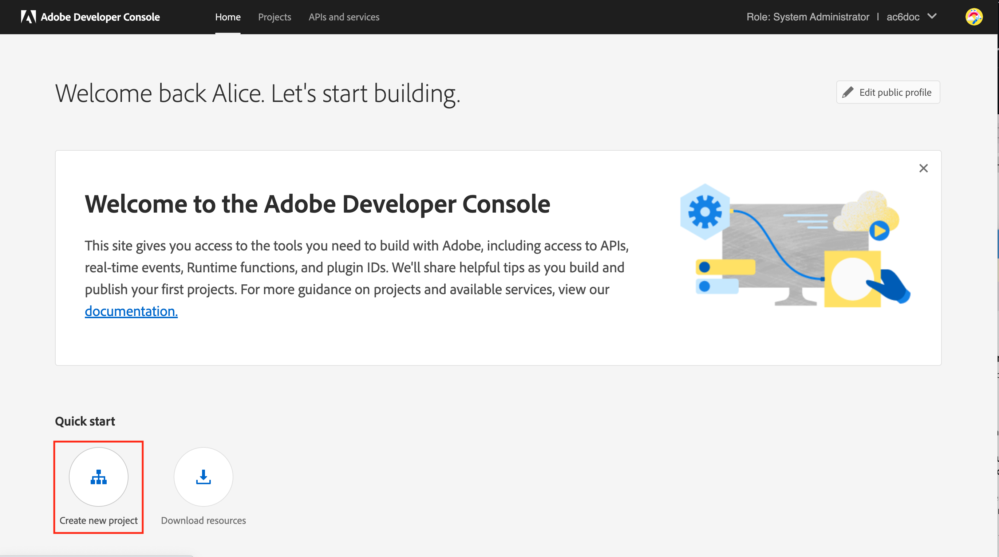

# 新しい配信サーバーへの更新 {#acc-deliverability}

[v7.2.2 リリース](../../rn/using/latest-release.md#release-7-2-2)以降、Adobe Campaign は、可用性が高くセキュリティコンプライアンスの問題にも対処できる新しい配信品質サーバーを利用しています。Campaign Classic は、新しい配信サーバーとの間で、配信品質ルール、broadLog および抑制アドレスを同期するようになりました。古い配信品質サーバーは 2022年8月31日に廃止されます。

Campaign Classic のお客様は、**2022年8月31日までに**&#x200B;新しい配信品質サーバーを実装する必要があります。

>[!NOTE]
>
>これらの変更に関する詳細な質問については、[FAQ](#faq) を参照するか、[アドビカスタマーケア](https://helpx.adobe.com/jp/enterprise/admin-guide.html/enterprise/using/support-for-experience-cloud.ug.html){_blank}にお問い合わせください。

## 変更点{#acc-deliverability-changes}

アドビは、セキュリティコンプライアンス上の理由により、古いデータセンターを廃止しています。Adobe Campaign Classic のクライアントは、Amazon Web Service（AWS）でホストされる新しい配信サービスに移行する必要があります。

この新しいサーバーは、高い可用性（99.9）を保証し、安全で認証済みのエンドポイントを提供して、キャンペーンサーバーが必要なデータを取得できるようにします。新しい配信サーバーは、リクエストごとにデータベースに接続するのではなく、可能な限りリクエストに対応するためにデータをキャッシュします。このメカニズムにより、応答時間が改善されます。

## 影響の有無{#acc-deliverability-impacts}

すべてのお客様に影響があるので、新しい配信品質サーバーのメリットを得るには [Campaign v7.2.2](../../rn/using/latest-release.md#release-7-2-2)（またはそれ以上）にアップグレードして、環境を実装する必要があります。

## 更新方法{#acc-deliverability-update}

**ホスト環境のお客様**&#x200B;の場合、アドビはお客様と協力してインスタンスを新しいバージョンにアップグレードし、Adobe Developer Console でプロジェクトを作成します。

**オンプレミス／ハイブリッド環境のお客様**&#x200B;の場合、新しい配信品質サーバーのメリットを得るには、 [Campaign v7.2.2](../../rn/using/latest-release.md#release-7-2-2)（またはそれ以上）にアップグレードする必要があります。すべてのインスタンスがアップグレードされると、アドビ配信品質サーバーに[新しい統合を実装し](#implementation-steps)、シームレスな移行を確実に実現できるようになります。

## 実装手順 {#implementation-steps}

新しい配信サーバーの統合の一環として、Campaign は、Identity Management Service（IMS）ベースの認証を経由して Adobe Shared Services と通信する必要があります。推奨される方法は、Adobe Developer ベースのゲートウェイトークン（テクニカルアカウントトークンまたは Adobe I/O JWT とも呼ばれます）を使用することです。


>[!WARNING]
>
>これらの手順は、ハイブリッド実装とオンプレミス実装でのみ実行してください。

### 前提条件{#prerequisites}

実装を開始する前に、インスタンスの設定を確認します。

1. Campaign クライアントコンソールを開き、管理者として Adobe Campaign にログオンします。
1. **管理／プラットフォーム／オプション**&#x200B;を参照します。
1. 以下を確認します。 `DmRendering_cuid` オプションの値が入力されます。

   * オプションの値が入力されている場合は、実装を開始できます。
   * 値が入力されていない場合は、[アドビカスタマーケア](https://helpx.adobe.com/enterprise/admin-guide.html/enterprise/using/support-for-experience-cloud.ug.html){_blank} に連絡して CUID を取得してください。

   このオプションは、すべての Campaign インスタンス (MKT、MID、RT、EXEC) に正しい値で入力する必要があります。ハイブリッド環境のお客様は、アドビに連絡して、MID、RT、EXEC の各インスタンスでオプションを設定してもらいます。

オンプレミス型の顧客は、Campaign が **[!UICONTROL 製品プロファイル]** は組織で使用できます。 手順は次のとおりです。

1. 管理者として、 [Adobe Admin Console](https://adminconsole.adobe.com/){_blank}.
1. 次にアクセス： **製品とサービス** セクションとチェック **Adobe Campaign** が表示されます。
が **Adobe Campaign** 連絡先 [Adobeカスタマーケア](https://helpx.adobe.com/enterprise/admin-guide.html/enterprise/using/support-for-experience-cloud.ug.html){_blank} を追加します。
1. クリック **Adobe Campaign** 組織を選択します。
1. をチェックします。 **[!UICONTROL 製品プロファイル]** が存在します。 そうでない場合は、作成します。 この&#x200B;**[!UICONTROL 製品プロファイル]**&#x200B;には権限は必要ありません。 


>[!CAUTION]
>
>オンプレミス環境のお客様がファイアウォールを自ら実装する場合は、この URL `https://deliverability-service.adobe.io` を許可リストに追加する必要があります。 [詳細情報](../../installation/using/url-permissions.md)。


### 手順 1：Adobe Developer プロジェクトを作成／更新 {#adobe-io-project}

1. [Adobe Developer Console](https://developer.adobe.com/console/home) にアクセスし、組織の開発者アクセス権を使用してログインします。正しい組織ポータルにログインしていることを確認します。

1. 「**[!UICONTROL 新規プロジェクトを作成]**」を選択します。
   


   >[!CAUTION]
   >
   >別の統合（Analytics コネクタ、Adobe トリガーなど）で既に Adobe I/O JWT 認証機能を使用している場合は、**Campaign API** をそのプロジェクトに追加します。

1. 「**[!UICONTROL API を追加]**」を選択します。
   
1. **[!UICONTROL API を追加]**&#x200B;ウィンドウで、「**[!UICONTROL Adobe Campaign]**」を選択します。
   
1. クライアント ID が空の場合は、「**[!UICONTROL キーペアを生成]**」を選択して、公開鍵と秘密鍵のペアを作成します。
   

   キーは、デフォルトの有効期限 365 日で自動的にダウンロードされます。 有効期限が切れたら、新しいキーペアを作成し、設定ファイルで統合を更新する必要があります。 オプション 2 を使用すると、有効期限の長い&#x200B;**[!UICONTROL 公開鍵]**を手動で作成してアップロードすることを選択できます。
   

   >[!CAUTION]
   >
   >再度ダウンロードすることができないので、ダウンロードプロンプトが表示されたら、`config.zip` ファイルを保存してください。

1. 「**[!UICONTROL 次へ]**」をクリックします。
1. 既存の&#x200B;**[!UICONTROL 製品プロファイル]**&#x200B;を選択するか、必要に応じて新しいプロファイルを作成します。 この&#x200B;**[!UICONTROL 製品プロファイル]**&#x200B;には権限は必要ありません。 **[!UICONTROL 製品プロファイル]**&#x200B;について詳しくは、[このページ](https://helpx.adobe.com/jp/enterprise/using/manage-developers.html){_blank}を参照してください。
   

   次に、「**[!UICONTROL 設定済み API を保存]**」をクリックします。

1. プロジェクトから **[!UICONTROL Adobe Campaign]** を選択し、「**[!UICONTROL サービスアカウント (JWT)]**」の下に次の情報をコピーします。

   

   * **[!UICONTROL クライアント ID]**
   * **[!UICONTROL クライアント秘密鍵]**
   * **[!UICONTROL テクニカルアカウント ID]**
   * **[!UICONTROL 組織 ID]**

>[!CAUTION]
>
>Adobe Developer 証明書は 12 か月後に期限が切れます。毎年新しいキーペアを生成する必要があります。

### 手順 2：Adobe Campaign へのプロジェクト資格情報の追加 {#add-credentials-campaign}

秘密鍵は、Base64 UTF-8 形式でエンコードする必要があります。

それには、次の手順に従います。

1. 上記の手順で生成された秘密鍵を使用します。
1. `base64 ./private.key > private.key.base64` というコマンドを使用して秘密鍵をエンコードします。これにより、base64 コンテンツが新しいファイル `private.key.base64` に保存されます。

   >[!NOTE]
   >
   >秘密鍵をコピーして貼り付けるときに、余分な行が自動的に追加される場合があります。 これは、秘密鍵をエンコードする前に忘れずに削除してください。

1. ファイル `private.key.base64` からコンテンツをコピーします。
1. Adobe Campaign インスタンスがインストールされている各コンテナに SSH 経由でログインし、`neolane` ユーザーとして次のコマンドを実行して Adobe Campaign にプロジェクト資格情報を追加します。これにより、**[!UICONTROL テクニカルアカウント]**&#x200B;資格情報がインスタンス設定ファイルに挿入されます。

   ```sql
   nlserver config -instance:<instance name> -setimsjwtauth:Organization_Id/Client_Id/Technical_Account_ID/<Client_Secret>/<Base64_encoded_Private_Key>
   ```

1. 変更を反映させるには、サーバーを停止し、再起動する必要があります。 また、 `config -reload` コマンドを使用します。

### 手順 3：新しい配信品質サーバーを有効にする

これで、新しい配信サーバーを有効にできます。次の手順を実行します。

1. クライアントコンソールを開き、管理者としてAdobe Campaign にログオンします。
1. **管理／プラットフォーム／オプション**&#x200B;を選択します。
1. `NewDeliverabilityServer_FeatureFlag` オプションにアクセスし、値を `1` に設定します。この設定は、すべての Campaign インスタンス（MKT、MID、RT、EXEC）で実行する必要があります。ハイブリッド環境のお客様は、アドビに連絡して、MID、RT、EXEC の各インスタンスでオプションを設定してもらいます。

### 手順 4：設定を検証

統合が成功したことを確認するには、次の手順に従います。


1. クライアントコンソールを開き、Adobe Campaign にログオンします。
1. **管理／プロダクション／テクニカルワークフロー**&#x200B;を参照します。
1. **配信品質の更新** (deliverabilityUpdate) ワークフローを再起動します。すべての Campaign インスタンス（MKT、MID、RT、EXEC）でこの手順を実行する必要があります。ハイブリッド環境のお客様は、アドビに連絡して、MID、RT、EXEC の各インスタンスでワークフローを再開してもらいます。
1. ログを確認：ワークフローは、エラーなく実行する必要があります。


## よくある質問 {#faq}

### 更新のタイムライン

新しい配信品質サーバーへの移行は、これらの強化された機能の追加とセキュリティの強化を可能にし、ホスト環境のお客様 (Campaign Managed Services) 向けに 2022年7月に開始されます。 すべてのホスト環境のお客様は、8月末までに更新されます。

オンプレミス環境およびハイブリッド環境のお客様は、同じ期間中に移行する必要があります。

### 環境をアップグレードしない場合はどうなりますか？

8月31日までにアップグレードされなかった Campaign インスタンスは、Campaign 配信品質サーバーに接続できなくなります。結果として、**配信品質の更新** (deliverabilityUpdate) ワークフローは失敗し、配信品質に影響を与えます。

環境をアップグレードしない場合、E メール設定の同期は停止されます（MX 管理ルール、インバウンド E メールルール、ドメイン管理ルール、バウンスの選定ルール）。 これは、配信品質の長期化に影響を与える可能性があります。これらのルールに大きな変更が加えられた場合は、この時点から手動で適用する必要があります。

MKT インスタンスの場合は、[グローバル抑制リスト](../../campaign-opt/using/filtering-rules.md#default-deliverability-exclusion-rules)のみが影響を受けます。

