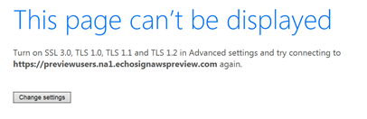

# TLS 1.0 および 1.1 のサポートのサポートの終了{#eol-tls-support}

Adobeは、Transport Layer Security(TLS)1.2 プロトコルに準拠していないユーザーシステムおよびクライアントシステムをサポートしなくなりました。 古いバージョンの TLS を引き続き使用する場合、すべてのAdobe製品およびサービスへのアクセスが失われる可能性があります。

## このページが表示されるのはなぜですか？

次のメッセージが表示された場合： **このページは表示できません**&#x200B;つまり、アクセスしようとしているAdobeアプリ、Web ページ、またはサービスには、Web ブラウザー、オペレーティングシステム、アプリとのより安全なネットワーク接続が必要です。 これは、 **TLS 1.2** 安全なネットワーク通信と、ユーザーシステムとAdobeアプリ、web サービス間のデータ交換を実現します。

Adobeは、より低いバージョンの TLS（TLS 1.0 および 1.1 を含む）のサポートを廃止しました。 TLS 1.2 プロトコルに関する技術的な詳細については、 [よくある質問](#faq).

## サービスを再開するにはどうすればよいですか？

最新の Web ブラウザーは TLS 1.2 をサポートしています。ブラウザーをアップグレードすると、これらのアプリやサービスにアクセスできます。

次の一般的なブラウザーのいずれかをダウンロードしてインストールできます。

* [Google Chrome](https://www.google.com/chrome/)
* [Apple Safari](https://www.apple.com/safari/)
* [Firefox](https://www.mozilla.org/en-US/firefox/new/)
* [Microsoft Edge](https://www.microsoft.com/en-us/edge)

別のブラウザーを使用している場合は、TLS 1.2 がサポートされていることを確認します。

お使いのオペレーティングシステムとアプリケーションフレームワークは、TLS 1.2 もサポートしている必要があります。ブラウザをアップグレードしても問題が解決しない場合は、コンピュータが [Campaign 互換性マトリックス](../../rn/using/compatibility-matrix.md).

## よくある質問{#faq}

* **Transport Layer Security(TLS) とは**

   [トランスポート層のセキュリティ](https://en.wikipedia.org/wiki/Transport_Layer_Security) (TLS) は、2 つの通信アプリケーション間のプライバシーとデータの整合性を提供するセキュリティプロトコルです。 データをネットワーク経由で安全に交換する必要がある Web ブラウザーや他のアプリケーションに対して広く展開されています。

   プロトコル仕様に従い、TLS には、TLS レコードプロトコルと TLS ハンドシェイクプロトコルの 2 つの層が含まれます。 Record プロトコルは、接続のセキュリティを提供します。 Handshake プロトコルを使用すると、サーバとクライアントは互いに認証し、データ交換の前に暗号化アルゴリズムと暗号鍵のネゴシエーションを行うことができます。

* **どのような影響がありますか？**

   Adobeのセキュリティコンプライアンス標準規格では、2018 年 5 月現在、古いプロトコルの廃止が必要です。また、TLS 1.2 を最新バージョンとして使用することを義務付けています。 システムが TLS 1.2 に準拠していない場合、一部のAdobeアプリやサービスへのアクセスは制限されます。

* **TLS はお客様に与える影響**

   安全なネットワーク接続を通じて、一部のAdobeアプリやサービスとのみ関わることができます。 TLS は、ブラウザーとこれらのアプリおよび Web サービスとの間の接続が安全で信頼性の高いものであることを保証します。

   新しいブラウザーおよびオペレーティングシステムがリリースされると、セキュリティ標準がアップグレードされ、より高いレベルのプライバシーとデータの整合性が確保されます。 ただし、これらのブラウザーや OS の古いバージョンは、最新の標準を含むように更新されません。

   許容可能なレベルのセキュリティが向上するにつれ、これらの古くて安全でないブラウザーのバージョンやアプリケーションは残されます。

   セキュアなサイトに接続するには、OS とブラウザーのバージョンを更新します。

* **TLS はハッカーに対して脆弱ですか？**

   古い暗号化方式を使用した TLS 1.0 に対する攻撃が文書化され、古いバージョンは TLS 1.2 よりも脆弱です。詳しくは、「TLS/SSL に対する攻撃」を参照してください。

* **Adobeが TLS 1.0 および 1.1 のサポートを無効にしているのはなぜですか？**

   Adobeには、古いプロトコルのサポートを無効にする必要があるセキュリティコンプライアンス標準があります。 このような規格の 1 つは、支払いカード業界 (PCI) への準拠を保証します。 PCI 適応サーバは、セキュリティ標準のセットで、安全な環境を維持するために、クレジットカード情報の受け入れ、処理、保存、送信を行う組織が必要とします。

   PCI コンプライアンスは、2018 年 5 月現在、TLS 1.1 以降の使用を義務付けています。

* **Adobeが TLS 1.1 または TLS 1.0 を許可するのではなく、TLS 1.2 の使用が必須なのはなぜですか？**

   Adobeアプリや Web サービスに対する要求の多くは、TLS 1.2 準拠のユーザーシステムから発生し、TLS 1.1 システムからのトラフィックが少なくなっています。

   Adobeは、TLS 1.2 に移行され、アプリや Web サービスへの安全なアクセスが可能になりました。

* **古いバージョンの TLS を使用できる最後の日付は何ですか？**

   Adobeは、セキュリティの脆弱性への暴露を避けるために、古いバージョンをすばやく放棄するようユーザーに促します。 詳しくは、カスタマーケアまたはAdobeサクセスマネージャーにお問い合わせください。

* **TLS 1.2 用に設定されていないブラウザーを使用すると、どのようなエラーメッセージが表示されますか？**

   使用しているブラウザーによって異なります。 で言及されているすべてのブラウザー [Campaign 互換性マトリックス](../../rn/using/compatibility-matrix.md) が TLS 1.2 を使用するように設定されています。一覧に表示されていないブラウザーまたはバージョンを使用している場合は、ブラウザーを更新してください。

   Adobeは、SSL 通信レイヤーによって生成されるエラーメッセージを制御しません。 ブラウザーアプリおよびサービスに接続する前に、Adobeがこれらのメッセージを生成します。 Windows 7 上の Internet Explorer 11 で発生する可能性のあるエラーの例を次に示します。

   

   TLS 1.2 は Internet Explorer 11 でデフォルトで有効になっていますが、無効になっている場合は、有効にすることができます。 この場合、他の選択肢を使用する代わりに、詳細設定ダイアログで TLS 1.2 をオンにしてください。 次のようなその他のエラーも発生する場合があります。

   * サービスに接続できません
   * サービスを利用できません
   * 接続中にエラーが発生しました
