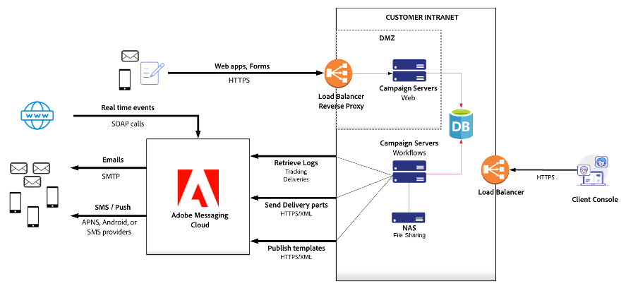

# ハードウェアサイズについての推奨事項{#hardware-sizing-reco}

## 概要

>[!CAUTION]
>
>この記事は、一般的なサンプルガイドとしてのみ提供されています。Campaign プロジェクトを開始する前に、Adobe Campaign カスタマーサクセスマネージャーと協力して、デプロイメントの正確なサイズを測定する必要があります。これが完了するまでは、インフラストラクチャやハードウェアを取得またはデプロイ&#x200B;**しないでください**。

このドキュメントでは、オンプレミスのデータセンターまたは仮想化されたクラウド環境での Adobe Campaign Classic v7 のデプロイメントに関する一般的な推奨事項を説明します。**ハイブリッド**&#x200B;または&#x200B;**ミッドソーシング**&#x200B;と呼ばれるこのタイプのデプロイメントでは、Campaign マーケティングインスタンスとマーケティングデータベースを操作のコントロール下に置き、同時に Adobe Cloud Messaging サービスを使用してメール、SMS または SMPP メッセージを送信し、メールの開封、バウンスおよびクリックの追跡データを収集します。

マーケティングインスタンスは、Adobe Campaign アーキテクチャの一部であり、すべてのマーケティングアクティビティを推進し、キャンペーンから返されるすべての受信者データと分析データを保存します。マーケティングインスタンスは、Adobe Campaign サービスを実行するオンプレミスサーバーのセットとリレーショナルデータベースです。

>[!CAUTION]
>
>このドキュメントの情報は、完全にホストされた Adobe Campaign インスタンス（Adobe Cloud Services にデプロイ）を使用している場合には適用されません。

ソフトウェアの互換性については、[互換性マトリックス](../../rn/using/compatibility-matrix.md)を参照してください。

### シナリオ

デプロイメント図とハードウェアサイズについての推奨事項は、次の 3 つの代表的なシナリオに対して提供されます。

1. [中規模サイズ](#scenario-1) - システム内の 500 万人のアクティブな受信者
1. [大規模サイズ](#scenario-2) - システム内の 2,000 万人のアクティブな受信者
1. [大規模法人](#scenario-3) - トランザクションメッセージを使用する 5,000 万人のアクティブな受信者

### 前提

このドキュメントでは、3 つのシナリオすべてについて、次のタイプの使用法も前提としています。

* 大規模なメールキャンペーンは、週に 2 回、アクティブな受信者の約 50％に送信されます
* ダイレクトメールは、月に 1 回、システム内の各受信者向けに生成されます
* SMS メッセージは、毎月、アクティブな受信者の約 10％に送信されます
* 各受信者を定義するデータベーススキーマは、1 つの追加テーブルで拡張されています。このテーブルには、各受信者に対して約 200 バイトのデータが含まれています
* Adobe Campaign インタラクションモジュールは、送信メールにオファーを追加するために使用されます
* メールトラッキングデータは、90 日間、Campaign システムに保持されます

## 一般的なガイドライン

Campaign は、データベース中心のアプリケーションであり、データベースサーバーのパフォーマンスが重要です。ワークフローの実行、セグメント化、データアップロードのトラッキング、インバウンドインタラクション、分析、その他のアクティビティはすべて、データベースアクティビティを生成します。一般に、これらの操作のサイズと頻度によってデータベースサーバーのサイズが決まります。

マーケティングインスタンスのアプリケーションサーバーには、ワークフローを実行し、Campaign コンソールユーザーからのリクエストを含む SOAP API 呼び出しに応答するのに十分な CPU とメモリが必要です。CPU 要件は、複雑なオファールールを伴うアウトバウンドインタラクションを使用するワークフロー、カスタム Javascript を実行するワークフロー、トラフィックレベルの高い web アプリケーションの場合に重要になる可能性があります。

Campaign web アプリケーションは、マーケティングインスタンスのアプリサーバーまたは別の web サーバーシステムにデプロイすることもできます。Web アプリケーションのワークロードは重要なワークフローや Campaign コンソールのユーザーと競合するので、web アプリケーションとインバウンドインタラクションを別のサーバーにデプロイして、Campaign のコア機能が良好なパフォーマンスで確実に実行されるようにすることができます。

セキュリティと可用性を確保するために、アドビでは、インターネットのトラフィックをビジネスユーザーが生成するトラフィックから分離することをお勧めします。そのため、図には、Web サーバー（Web1 および Web2 に接続するインターネット）と、アプリケーションサーバー（ビジネスプロセス App1 および App2）の 2 つのサーバーグループが含まれています。

商用メールの送信者は法的要件により、機能するオプトアウト web ページを用意することが求められます。アドビでは、フェイルオーバーシナリオに備えて、各グループサーバーに冗長マシンを使用することをお勧めします。これは、Adobe Campaign がオプトアウトページをホストする場合に特に当てはまります。

### リバースプロキシ

Campaign アーキテクチャでは、マーケティングインスタンスと Adobe Cloud Messaging 間の通信に SSL over HTTP（HTTPS）を使用することで、高度なセキュリティが強化されます。セキュリティ、信頼性、可用性は、「非武装地帯」（DMZ）サブネットでリバースプロキシを使用して、マーケティングインスタンスサーバーとデータベースを分離して保護することによって強化されます。

### ロードバランサー

アプリサーバーのロードバランサーは、プロキシで終端する HTTPS を使用して、アクティブ／パッシブ設定で指定されます。Web サーバーのロードバランサーは、プロキシで終端する HTTPS を使用して、アクティブ／アクティブ設定で指定されます。

アドビでは、デプロイメント環境内の Adobe Campaign サーバーに中継できる URL パスの排他的なリストを用意しています。

### アーキテクチャ

一般的なアーキテクチャは、ボリュームに関係なくほぼ同じです。セキュリティと高可用性の要件により、少なくとも 4 台のサーバー、web アプリを使用しない場合は 2 台のサーバーが必要です。設定の違いは、主に CPU コアやメモリなどのハードウェア設定が異なります。

## シナリオ 1：中規模サイズのデプロイメント{#scenario-1}

推定ボリューム：

| チャネル | ボリューム |
| ----------------------- | ----------------- |
| アクティブな受信者 | 500 万 |
| メール | 420 万/月 |
| ダイレクトメール | 100 万/月 |
| モバイル SMS | 100,000/月 |
| 1 日あたりのメールのピーク量 | 500 |

これらのボリュームの場合は、Adobe Campaign アプリケーションサーバーシステムのペアが、Adobe Campaign クライアントユーザーとワークフローの実行に対してすべての機能を提供します。500 万人のアクティブな受信者とこの量のメールの場合、アプリケーションサーバーのワークロードは CPU や I/O を集中的に使用しません。ストレスのほとんどはデータベースにかかっています。

Adobe Campaign web サーバーは、セキュリティで保護されたゾーンに表示されます。

### Web およびアプリケーションサーバー

このシナリオでは、次の仕様を持つ 4 台のマシンに Adobe Campaign をインストールすることをお勧めします。

**3Ghz+ クアッドコア CPU、8-GB RAM、RAID 1 または 10、2 x 80-GB SSD**

これらのシステムでは、Campaign コンソールユーザーを直接サポートし、キャンペーンワークフローを実行するマーケティングインスタンスアプリケーションサーバーを作成します。

DMZ 内のリバースプロキシは、Adobe Campaign web サーバーへのトラフィックを負荷分散します。プロキシマシンに Adobe Campaign ソフトウェアスタックをインストールする必要はありません。任意のリバースプロキシソフトウェアまたはネットワーク機器を使用できます。

購読のオプトイン／オプトアウトおよび環境設定センターの機能は、Campaign または独自の web サイトで提供できます。この機能を web サイトに実装することを選択した場合は、環境設定および購読情報が Campaign マーケティングデータベースに確実に生成されるようにする必要があります。これを行うには通常、キャンペーンワークフローによって自動的にアップロードされる抽出ファイルを作成します。

アプリケーションサーバーのディスクス容量の使用量は、サードパーティのサービスプロバイダー（ダイレクトメールの印刷ベンダーなど）と交換されるファイルの保持期間と、web サイトからのサブスクリプションや環境設定のアップデート、独自の CRM やマーケティングシステムからの抽出など、インポート済みフラットファイルのサイズおよび保持によって異なります。

### データベース

データベースサーバーのハードウェアについての推奨事項は次のとおりです。

**3Ghz+ 4 コア CPU、16-GB RAM、RAID 1 または 10、128GB SSD 以上**

メモリの予測値は、大規模なキャンペーン立ち上げのための約 500,000 人の受信者の完全なキャッシュに加えて、ワークフローの実行、トラッキングデータのインポート、その他の同時アクティビティのための RDBMS バッファースペースを前提としています。

すべての Adobe Campaign 技術データ（キャンペーン、トラッキング、作業用テーブルなど）を保存するためにデータベースに必要なディスクスペースは、3 か月の保持期間に基づいて約 35 GB と予測されます。トラッキングデータを 6 か月保持することを選択した場合、データベースサイズは約 40 GB に増加し、保持期間が 12 か月の場合はデータベースサイズは約 45 GB に増加します。この環境では、受信者データに約 5 GB 使用します。

>[!CAUTION]
>
>この予測値には、追加の顧客データは含まれていません。顧客データの追加の列またはテーブルを Adobe Campaign データベースにレプリケートすることを計画している場合は、必要な追加のディスクスペースを予測する必要があります。アップロードされたセグメント／リストで必要となるストレージは、サイズ、頻度、保持期間に応じてさらに増えます。

また、毎日処理される情報量により、データベースサーバーの IOPS が重要であることも考慮してください。例えば、ピーク日に、合計 500,000 人の受信者をターゲットにしたキャンペーンをデプロイできます。各キャンペーンを実行するために、Adobe Campaign では、約 1,200 万レコードを含むテーブル（配信ログテーブル）に 500,000 レコードを挿入します。キャンペーンのデプロイメント中に許容可能なパフォーマンスを提供するために、アドビでは、このシナリオで少なくとも 60,000 の 4 KB ランダム読み取り／書き込み IOPS をお勧めします。

## シナリオ 2：大規模サイズのデプロイメント{#scenario-2}

推定ボリューム：

| チャネル | ボリューム |
| ----------------------- | ----------------- |
| アクティブな受信者 | 2,000 万 |
| メール | 4,200 万/月 |
| ダイレクトメール | 1,000 万/月 |
| モバイル SMS | 1,000,000/月 |
| 1 日あたりのメールのピーク量 | 5,000,000 |

### Web およびアプリケーションサーバー

このシナリオでは、アドビでは、次の仕様を持つ 4 台のマシン（2 台のアプリケーションサーバーと 2 台の web サーバー）に Adobe Campaign をインストールすることをお勧めします。

**3Ghz+ クアッドコア CPU、8-GB RAM、RAID 1 または 10、80-GB SSD**

アプリケーションサーバーでは、Campaign コンソールユーザーとキャンペーンワークフローの実行を直接サポートします。この機能は、高可用性を実現するために 2 台の同一のサーバーにデプロイされ、ネットワーク接続ストレージ（NAS）ファイルシステムを共有してフェイルオーバーを可能にします。

Web サーバーでは、システム内の 1,000 万人のアクティブな受信者をサポートする Campaign web アプリケーションをホストします。

プロキシ、環境設定センター／購読の処理、ディスクスペースの使用量について詳しくは、[シナリオ 1：中規模サイズのデプロイメント](#scenario-1)を参照してください。

### データベース

データベースサーバーのハードウェアについての推奨事項は次のとおりです。

**3Ghz+ 8 コア CPU、64-GB RAM、RAID 1 または 10、2 x 320-GB SSD または RAID 10、640 GB SSD 以上**

メモリの予測値は、大規模なキャンペーンの開始のために約 5,000,000 人の受信者の完全なキャッシュに加えて、ワークフローの実行、トラッキングデータのインポート、その他の同時アクティビティのための RDBMS バッファースペースを前提としています。

すべての Adobe Campaign 技術データ（キャンペーン、トラッキング、作業用テーブルなど）を保存するためにデータベースに必要なディスクスペースは、3 か月の保持期間に基づいて約 280 GB と予測されます。トラッキングデータを 6 か月間保持することを選択した場合、データベースサイズは約 450 GB に増加し、12 か月の保持ではデータベースサイズは約 900 GB に増加します。この環境では、受信者データは約 15 GB を使用します。

## シナリオ 3：Message Center を使用する大規模企業のデプロイメント{#scenario-3}

推定ボリューム：

| チャネル | ボリューム |
| ----------------------- | ----------------- |
| アクティブな受信者 | 5,000 万 |
| メール | 1 億 800 万／月 |
| ダイレクトメール | 2,500 万/月 |
| モバイル SMS | 250 万/月 |
| トランザクションメッセージ | 250 万/月 |
| 1 日あたりのメールのピーク量 | 250 万 |

5,000 万人の受信者をサポートするデプロイメントは、[シナリオ 2](#scenario-2) で示したものと基本的に同じです。Campaign web アプリケーションのトラフィックは Campaign web サーバーにルーティングされるので、大規模なキャンペーンのローンチ後の web トラフィックのバーストは、Campaign ワークフローおよびクライアントコンソールユーザーに影響を与えません。

このデプロイメントには、独自の web サイトやアプリケーションからの Message Center 呼び出しも含まれます。

### Web およびアプリケーションサーバー

このシナリオでは、アドビでは、次のように 4 台のマシンに Adobe Campaign をインストールすることをお勧めします。

* アプリケーションサーバー
  **2 台のシステム、3Ghz+ クアッドコア CPU、8-GB RAM、RAID 1 または 10、80-GB SSD**

* Web サーバー
  **2 台のシステム、3Ghz+ クアッドコア CPU、16-GB RAM、RAID 1 または 10、80-GB SSD**

アプリケーションサーバーでは、Campaign コンソールユーザーとキャンペーンワークフローの実行を直接サポートします。この機能は、高可用性を実現するために 2 台の同一のサーバーにデプロイされ、ネットワーク接続ストレージ（NAS）ファイルシステムを共有してフェイルオーバーを可能にします。

Web サーバーでは、システム内の 1,000 万人のアクティブな受信者をサポートする Campaign web アプリケーションをホストします。

プロキシ、環境設定センター／購読の処理、ディスクスペースの使用量について詳しくは、[シナリオ 1：中規模サイズのデプロイメント](#scenario-1)を参照してください。

### データベース

データベースサーバーのハードウェアについての推奨事項は次のとおりです。

**3Ghz+ 8 コア CPU、96-GB RAM、RAID 1 または 10、1.5TB SSD 以上**

メモリの予測値は、大規模なキャンペーンの開始のために約 12,500,000 人の受信者の完全なキャッシュに加えて、ワークフローの実行、トラッキングデータのインポート、その他の同時アクティビティのための RDBMS バッファースペースを前提としています。

すべての Adobe Campaign 技術データ（キャンペーン、トラッキング、作業用テーブルなど）を保存するためにデータベースで必要なディスクスペースは、3 か月の保持期間に基づいて約 700 GB と予測されます。トラッキングデータを 6 か月間保持することを選択した場合、データベースサイズは約 1.2 TB に増加し、12 か月の保持ではデータベースサイズは約 2 TB に増加します。この環境では、受信者データは約 50 GB を使用します。

## 前提条件の変更に関するガイドライン

これらのシナリオに対して行われた前提条件はすべて、ハードウェアについての推奨事項とデプロイメントアーキテクチャに大きな影響を与えます。この節では、様々な前提条件に関するガイドラインについて説明します。要件を満たす具体的な推奨事項については、Adobe Campaign コンサルティングチームにお問い合わせください。

* **受信者数**
アクティブな受信者にはストレージスペースとデータベースバッファースペースの両方が必要となるので、一般に受信者が増えると、データベースサーバーにより多くのメモリと CPU 処理能力が必要になります。ストレージの増加は、受信者自身にとっては比較的わずかですが、メールキャンペーン用に保持されるイベントトラッキングデータにとっては重要になる可能性があります。

* **メールキャンペーンサイズ**
キャンペーンのローンチ頻度は、データベースサーバーの CPU 要件に影響を与えます。ダイレクトメール、インバウンドインタラクション、その他のワークフローと組み合わせると、メールキャンペーンのセグメント化操作ではデータベースサーバーに大きな負荷がかかります。

* **ダイレクトメールの頻度**
ダイレクトメールの頻度は、データベースサーバーの CPU 要件に影響を与える可能性があります。ダイレクトメールのセグメント化操作にキャンペーンのローンチや他のワークフローが組み合わせられると、データベースサーバーに大きな負荷がかかります。

* **SMS メッセージボリューム**
メールキャンペーンサイズと同様に、SMS メッセージの量によってオンプレミスにある Campaign サーバーに大きな負荷がかかることはありません。負荷は、主にクラウド上の Adobe Cloud Messaging サーバーにかかります。メールやダイレクトメールなどの SMS キャンペーンのセグメント化では、マーケティングデータベースに大きな負荷がかかる可能性があります。したがって、SMS メッセージの量よりも、SMS キャンペーンのローンチ頻度とセグメント化の複雑さが関係します。

* **データベーススキーマの複雑さ**
アクティブな受信者ごとのデータ量にはストレージスペースとデータベースバッファースペースの両方が必要となるので、一般に受信者が増えると、データベースサーバーにより多くのメモリと CPU が必要になります。複雑なスキーマでは、セグメント化のために結合する必要があるテーブルも多くなるので、データが複数のテーブルに分散している場合、セグメント化操作の実行が大幅に遅くなり、より多くのデータベース CPU とメモリが必要になる可能性があります。

  データベースサーバーのメモリは、すべての受信者データ、ワークフローを実行するための一時テーブル、他のデータベース操作のためのマージンを含めるのに十分な大きさのデータベースバッファープールを確保することによって予測されます。

* **アウトバウンドインタラクションの使用状況**
バッチモードでのインタラクションのルールでは、複雑な計算をすべてデータベースに引き継ぐワークフローで評価されます。データベースの取り組みの主な要因は、1 回のエンジン呼び出し中に計算される、実施要件を満たすオファーの合計数（N 個の最適なオファーを保持する前の受信者ごとのターゲットサイズ X 平均オファー数）です。データベースサーバーの CPU 速度は、パフォーマンスの最初の要因です。

* **インバウンドインタラクションまたは SOAP API の使用**
インバウンドインタラクションルールとオファーでは、マーケティングデータベースで評価され、大量のデータベースサーバーリソース、特に CPU が必要になります。インバウンドインタラクションまたは SOAP API を頻繁に使用する場合は、作業負荷を Campaign ワークフローの実行から分離するために別の web サーバーが必要になります。

* **トラッキングデータ保持期間**
トラッキングデータの保持期間を 90 日を超えて増やすには、より多くのデータベースストレージが必要になり、新しいトラッキングデータを大規模なテーブルに挿入するので、システムの速度が低下する可能性があります。90 日を超えると、トラッキングデータはキャンペーンのセグメント化には役に立たなくなるので、保持期間を短くすることをお勧めします。

  受信者のマーケティングエクスペリエンスを長期的に分析する必要がある場合は、トラッキングデータを Adobe Analytics または別の分析システムに移動する必要があります。

## 仮想化

すべての Campaign サーバーは仮想化の候補として適しています。適切な可用性とパフォーマンスを確保するには、いくつかの問題に対処する必要があります。

* **フェイルオーバー設定**
クラスター化されたサーバー（負荷分散されたプロキシの下にある冗長アプリケーションサーバーなど）は、ハードウェア障害が発生した場合に両方の VM が停止しないように、別のハードウェアにデプロイする必要があります。

* **I/O 設定**
データベースのセキュリティのために推奨される RAID 設定を維持し、ストレージデバイスの損失によってデータが失われないようにする必要があります。

* **I/O パフォーマンス**
データベースストレージに対して推奨される IOPS 評価を考慮する必要があります。Amazon EC2 などのクラウドサービスは、必要なパフォーマンスを提供しない可能性があるので、慎重に評価する必要があります。例えば、Amazon EC2 でプロビジョニングされた SSD ボリュームは現在、それぞれ 20,000 IOPS と評価されています。詳しくは、[Amazon のドキュメント](https://docs.aws.amazon.com/AWSEC2/latest/UserGuide/ebs-volume-types.html)を参照してください。4 ボリューム RAID 設定の評価は 80,000 IOPS ですが、これでは十分ではない可能性があります。

アドビでは、システムを実稼動環境に導入する前に、Adobe Campaign の仮想化デプロイメントのパフォーマンステストを行うことをお勧めします。

## 関連トピック

* [キャンペーン監視プロセス](../../production/using/monitoring-processes.md)
* [Campaign の一般的なアーキテクチャ](../../installation/using/general-architecture.md)
* [パフォーマンスとスループットの問題](../../production/using/performance-and-throughput-issues.md)
* [セキュリティとプライバシーのチェックリスト](../../installation/using/get-started-security-privacy.md)
