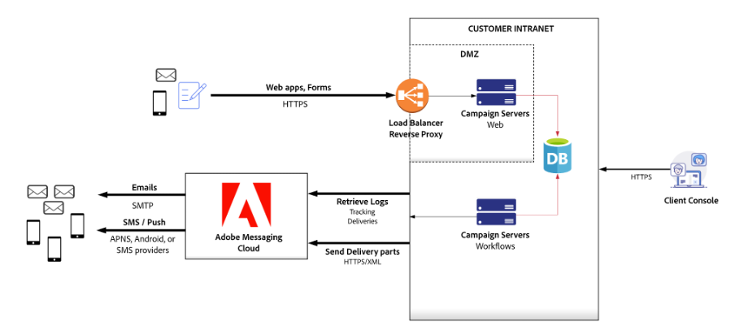

# ハードウェアサイズについての推奨事項{#hardware-sizing-reco}

## 概要

>[!CAUTION]
>
>この記事は、一般的なサンプルガイドとしてのみ提供されています。 Campaign プロジェクトを開始する前に、Adobe Campaignカスタマーサクセスマネージャーに相談して、デプロイメントの正確なサイズを測定する必要があります。 **禁止** インフラストラクチャまたはハードウェアを取得またはデプロイします。

このドキュメントでは、オンプレミスのデータセンターまたは仮想化クラウド環境でのAdobe Campaign Classic v7 の導入に関する一般的な推奨事項を示します。 このタイプのデプロイメント ( **ハイブリッド** または **ミッドソーシング**&#x200B;を使用すると、Campaign マーケティングインスタンスとマーケティングデータベースを操作上の制御の下に配置し、Cloud Messaging サービスを使用して E メール、SMS または SMPP メッセージを送信し、E メールの開封、バウンス、クリック追跡データを収集します。

マーケティングインスタンスは、Adobe Campaignアーキテクチャの一部で、すべてのマーケティングアクティビティを推進し、キャンペーンから返されるすべての受信者データと分析データを保存します。 マーケティングインスタンスは、Adobe Campaign Services を実行するオンプレミスサーバーのセットとリレーショナルデータベースです。

>[!CAUTION]
>
>The information in this document do not apply if you are using a fully hosted Adobe Campaign instance (deployed in Adobe Cloud Services).

### Scenarios

Deployment diagrams and hardware sizing recommendations are provided for three representative scenarios:

1. 
1. 
1. [大規模法人](#scenario-3) - 5,000 万人のアクティブな受信者、トランザクションメッセージ

### 前提

This document also assumes the following types of usage for all three scenarios:

* Large email campaigns are sent twice a week, to approximately 50% of your active recipients
* Direct mailings are generated once per month for each recipient in the system
* SMS メッセージは、毎月、アクティブな受信者の約 10%に送信されます
* 各受信者を定義するデータベーススキーマは、1 つの追加テーブルで拡張されています。このテーブルには、各受信者に対して約 200 バイトのデータが含まれています
* Adobe Campaignインタラクションモジュールは、送信メールにオファーを追加するために使用されます
* E メールトラッキングデータは、Campaign システムに 90 日間保持されます

## 一般的なガイドライン

Campaign はデータベースを中心としたアプリケーションであり、データベースサーバーのパフォーマンスが重要です。 実行中のワークフロー、セグメント化、トラッキングデータのアップロード、インバウンドインタラクション、分析および他のアクティビティはすべて、データベースアクティビティを生成します。 一般に、これらの操作のサイズと頻度によって、データベースサーバーのサイズが決まります。

マーケティングインスタンスのアプリケーションサーバーでは、ワークフローを実行し、Campaign コンソールユーザーからのリクエストを含む SOAP API 呼び出しに応答するのに十分な CPU とメモリが必要です。 CPU 要件は、複雑なオファールールでアウトバウンドインタラクションを使用するワークフロー、カスタム JavaScript を実行するワークフロー、高トラフィックレベルの Web アプリケーションを使用するワークフローでは、大きな影響を与えます。

Campaign Web アプリケーションは、マーケティングインスタンスアプリサーバーまたは別の Web サーバーシステムにもデプロイできます。 Web アプリケーションのワークロードは重要なワークフローや Campaign コンソールのユーザーと競合するので、Web アプリケーションとインバウンドインタラクションを別々のサーバーにデプロイして、コア Campaign 機能を高いパフォーマンスで確実に実行できます。

セキュリティと可用性のため、Adobeでは、インターネットのトラフィックを、ビジネスユーザーが生成したトラフィックから分離することをお勧めします。 このため、図には次の 2 つのサーバーグループが含まれています。Web サーバ（Web1 と Web2 に接続するインターネット）と App サーバ（App1 と App2 を処理するビジネスプロセス）

商用 E メールの送信者が機能的なオプトアウト Web ページを持つことは法的要件です。 Adobeでは、フェイルオーバーシナリオで、各グループサーバに冗長マシンを使用することをお勧めします。 これは、Adobe Campaignがオプトアウトページをホストする場合に特に当てはまります。

### リバースプロキシ

Campaign アーキテクチャは、HTTP 経由の SSL(HTTPS) を使用してマーケティングインスタンスとAdobeCloud Messaging 間の通信を行うことで、高いセキュリティを強化します。 マーケティングインスタンスサーバーとデータベースを分離し、保護するために、「非武装地帯」(DMZ) サブネットでリバースプロキシを使用することで、セキュリティ、信頼性、可用性が適用されます。

### ロードバランサー

アプリサーバーのロードバランサーは、アクティブ/パッシブ設定で設定され、プロキシで HTTPS が終了します。 Web サーバーのロードバランサーは、アクティブ/アクティブ構成で設定され、プロキシで HTTPS が終了します。

Adobeには、デプロイメント環境でAdobe Campaignサーバーに中継できる URL パスの排他的なリストが用意されています。

### アーキテクチャ

一般的なアーキテクチャは、ボリュームに関係なくほぼ同じです。 セキュリティと高可用性の要件により、最低 4 台のサーバが求められます。WebApps を使用しない場合は 2 台のサーバー 設定の違いは、主に CPU コアやメモリなどのハードウェア構成によって異なります。

## シナリオ 1:適度なサイズのデプロイメント{#scenario-1}

推定ボリューム：

| チャネル | 音量 |
| ----------------------- | ----------------- |
| アクティブな受信者 | 500 万 |
| メール | 420 万/月 |
| ダイレクトメール | 100 万/月 |
| Mobile SMS | 100,000/月 |
| 1 日のピークメール量 | 500 |

これらのボリュームでは、Adobe Campaignアプリケーションサーバーシステムのペアは、Adobe Campaignクライアントユーザーとワークフローの実行に対してすべての機能を提供します。 500 万人のアクティブな受信者とこの E メールボリュームの場合、アプリケーションサーバの負荷は CPU や I/O を集中的に消費しません。ストレスのほとんどはデータベースにあります。

Adobe Campaign Web サーバーは、セキュアゾーンに表示されます。

### Web およびアプリケーションサーバー

このシナリオでは、次の仕様で、4 台のマシンにAdobe Campaignをインストールすることをお勧めします。

**3Ghz+クアッドコア CPU、8-GB RAM、RAID 1 または 10、2 x 80-GB SSD**

これらのシステムは、マーケティングインスタンスアプリケーションサーバーを作成します。このサーバーは、Campaign コンソールのユーザーを直接サポートし、キャンペーンワークフローを実行します。

DMZ の負荷分散トラフィックのリバースプロキシをAdobe Campaign Web サーバーに送信します。 プロキシマシンにAdobe Campaignソフトウェアスタックをインストールする必要はありません。リバースプロキシソフトウェアまたはネットワーク機器を使用できます。

サブスクリプションのオプトイン/オプトアウトおよびプリファレンスセンターの機能は、Campaign または独自の Web サイトで提供できます。 この機能を Web サイトに実装する場合は、環境設定と購読情報が Campaign マーケティングデータベースに反映されるようにする必要があります。 通常は、キャンペーンワークフローによって自動的にアップロードされる抽出ファイルを作成することでおこなわれます。

アプリケーションサーバーでのディスク容量の消費は、サードパーティのサービスプロバイダー（ダイレクトメール用の印刷ベンダーなど）と交換するファイルの保持期間、Web サイトからの購読や環境設定の更新、独自の CRM やマーケティングシステムからの抽出などのインポート済みフラットファイルのサイズと保持に依存します。

### データベース

データベースサーバのハードウェアの推奨事項は次のとおりです。

****

The memory estimate assumes full caching of approximately 500,000 recipients for a large campaign launch, plus RDBMS buffer space for executing workflows, importing tracking data, and other concurrent activities.

It is estimated that the disk space required on the database to store all Adobe Campaign technical data (campaigns, tracking, working tables, and so on) is approximatively 35 GB based on a retention period of three months. If you choose to retain tracking data for 6 months, database size increases to approximatively 40 GB, and 12-month retention increases database size to approximatively 45 GB. Recipient data consumes about 5 GB for this environment.

>[!CAUTION]
>
>This estimate does not include any additional customer data. If you are planning to replicate additional columns or tables of customer data into the Adobe Campaign database, then you have to estimate the additional disk space requirement for it. Uploaded segments/lists also require more storage, depending on their size, frequency, and retention period.

また、1 日に処理される情報の量が多いので、データベースサーバの IOPS が重要であると考えてください。 For example, on a peak day, you can deploy campaigns targeting a total of 500,000 recipients. To execute each campaign, Adobe Campaign inserts 500,000 records into a table containing roughly 12 million records (the delivery log table). To provide acceptable performance during the campaign deployment, Adobe recommends a minimum of 60,000 4-KB Random read/write IOPS for this scenario.

## Scenario 2: Large-Size Deployment{#scenario-2}

Estimated volume:

| チャネル | 音量 |
| ----------------------- | ----------------- |
| アクティブな受信者 | 2,000 万 |
| メール | 42 百万/月 |
| ダイレクトメール | 1000 万/月 |
| モバイル SMS | 1,000,000/月 |
| 1 日のピークメール量 | 5,000,000 |

### Web およびアプリケーションサーバー

このシナリオでは、Adobeは、次の仕様のAdobe Campaignを 4 台のマシン、2 台のアプリケーションサーバー、2 台の Web サーバーにインストールすることを推奨します。

**3Ghz+クアッドコア CPU、8-GB RAM、RAID 1 または 10、80-GB SSD**

アプリケーションサーバーは、Campaign コンソールユーザーとキャンペーンワークフローの実行を直接サポートします。 この機能は、高可用性を実現するために 2 台の同一サーバに導入され、NAS(Network-Attached Storage) ファイル・システムを共有してフェイルオーバーを可能にします。

Web サーバーは、システム内の 1,000 万人のアクティブな受信者をサポートする Campaign Web アプリケーションをホストします。

参照： [シナリオ 1:適度なサイズのデプロイメント](#scenario-1) プロキシ、プリファレンスセンター/サブスクリプションの処理、ディスク容量の使用に関するコメントを追加しました。

### データベース

データベースサーバのハードウェアの推奨事項は次のとおりです。

**3Ghz+ 8 コア CPU、64-GB RAM、RAID 1 または 10、320-GB SSD x 2、RAID 10、640GB SSD 最小**

メモリの予測値は、大規模なキャンペーン起動用に約 5,000,000 人の受信者のフルキャッシュと、ワークフローの実行、トラッキングデータのインポート、その他の同時アクティビティ用の RDBMS バッファ領域を想定しています。

すべてのAdobe Campaignの技術データ（キャンペーン、トラッキング、作業用テーブルなど）を格納するためにデータベースで必要なディスク容量は、3 か月の保持期間に基づいて約 280 GB であると推定されます。 トラッキングデータを 6 か月間保持する場合、データベースのサイズは約 450 GB に増加し、12 か月の保持ではデータベースのサイズが約 900 GB に増加します。 受信者データは、この環境で約 15 GB を消費します。

## シナリオ 3:Message Center を使用した Enterprise デプロイメント{#scenario-3}

推定ボリューム：

| チャネル | 音量 |
| ----------------------- | ----------------- |
| アクティブな受信者 | 5,000 万 |
| メール | 1 億 8 百万/月 |
| ダイレクトメール | 25 百万/月 |
| モバイル SMS | 2,5 百万/月 |
| トランザクションメッセージ | 2,5 百万/月 |
| 1 日のピークメール量 | 2,500 万 |

5,000 万人の受信者をサポートするデプロイメントは、基本的に [シナリオ 2](#scenario-2):Campaign Web アプリケーショントラフィックは Campaign Web サーバーにルーティングされるので、大規模なキャンペーンの起動後の Web トラフィックのバーストは Campaign ワークフローやクライアントコンソールユーザーに影響しません。

このデプロイメントには、Web サイトやアプリケーションから実行される Message Center 呼び出しも含まれます。

### Web およびアプリケーションサーバー

このシナリオでは、Adobeは、次のように、4 台のマシンにAdobe Campaignをインストールすることをお勧めします。

* アプリケーションサーバー
   **2 台のシステム、3Ghz+クアッドコア CPU、8-GB RAM、RAID 1 または 10、80-GB SSD**

* Web サーバー
   **2 台のシステム、3Ghz+クアッドコア CPU、16-GB RAM、RAID 1 または 10、80-GB SSD**

アプリケーションサーバーは、Campaign コンソールユーザーとキャンペーンワークフローの実行を直接サポートします。 この機能は、高可用性を実現するために 2 台の同一サーバに導入され、NAS(Network-Attached Storage) ファイル・システムを共有してフェイルオーバーを可能にします。

The Web servers host Campaign web applications supporting the 10-million active recipients in the system.

### データベース

Hardware recommendations for the database server are as follows:

****

The memory estimate assumes full caching of approximately 12,500,000 recipients for a large campaign launch, plus RDBMS buffer space for executing workflows, importing tracking data, and other concurrent activities.

すべてのAdobe Campaignの技術データ（キャンペーン、トラッキング、作業用テーブルなど）を格納するためにデータベースで必要なディスク容量は、3 か月の保持期間に基づいて約 700 GB であると推定されます。 If you choose to retain tracking data for 6 months, database size increases to about approximatively 1.2TB, and 12-month retention increases database size to approximatively 2TB. Recipient data consumes about 50 GB for this environment.

## Guidelines for Changing Assumptions

The assumptions made for these scenarios all have a significant impact on the hardware recommendations and deployment architecture. This section discusses guidelines around different assumptions. Contact the Adobe Campaign Consulting team for specific recommendations to meet your requirements.

* **受信者数**
アクティブな受信者には、ストレージ領域とデータベースバッファ領域の両方が必要なので、より多くの受信者は通常、データベースサーバー上でより多くのメモリと CPU 容量を必要とします。 受信者自身にとってストレージの増加は比較的小さいものの、E メールキャンペーン用に保持されるイベントトラッキングデータにとって重要な場合があります。

* **メールキャンペーンサイズ**
キャンペーンの起動頻度は、データベースサーバーの CPU 要件に影響を与えます。 ダイレクトメール送信、インバウンドインタラクション、その他のワークフローと組み合わせて、E メールキャンペーンのセグメント化操作を行うと、データベースサーバーに大きな負荷がかかります。

* **ダイレクトメールの頻度**
ダイレクトメールの頻度は、データベースサーバーの CPU 要件に影響を与える可能性があります。 キャンペーンの起動や他のワークフローと組み合わせて、ダイレクトメールのセグメント化操作は、データベースサーバーに大きな負荷をかけます。

* **SMS メッセージボリューム**
E メールキャンペーンのサイズと同様に、SMS メッセージの量では、オンプレミスにある Campaign サーバーに大きな負荷がかかりません。読み込みは、主にクラウド上のAdobeCloud Messaging サーバーでおこなわれます。 E メールやダイレクトメールなどの SMS キャンペーンをセグメント化すると、マーケティングデータベースに大きな負荷がかかる可能性があります。 したがって、SMS キャンペーンの開始頻度とセグメント化の複雑さは、SMS メッセージの量よりも関連性が高くなります。

* **データベーススキーマの複雑さ**
各アクティブな受信者のデータ量には、ストレージ容量とデータベースバッファ容量の両方が必要なので、一般的に、より多くの受信者はデータベースサーバー上でより多くのメモリと CPU を必要とします。 Complex schemas also require more tables to be joined for segmentation, so segmentation operations can run much slower, and require more database CPU and memory when data is spread across multiple tables.

   Database server memory is estimated by ensuring that the database buffer pool can be large enough to contain all recipient data, plus temporary tables for running workflows, plus a margin for other database operations.

* **** The main factor of effort on the database is the total number of eligible offers computed during one engine call (target size X average number of offers per recipient before keeping the N best offers). The database server CPU speed is the first factor of performance.

* **** Heavy usage of inbound Interactions or SOAP APIs requires separate web servers to separate the work load from running Campaign workflows.

* **** Tracking data is not useful for campaign segmentation after 90 days, so the shorter retention period is recommended.

   Tracking data should be moved into Adobe Analytics or another analytics system if you require long-term analysis of recipient marketing experience.

## Virtualization

All Campaign servers are good candidates for virtualization. Several issues must be addressed to ensure appropriate availability and performance.

* **フェイルオーバー設定**
クラスタ化されたサーバ（負荷分散プロキシの下の冗長なアプリケーションサーバなど）は、ハードウェア障害が発生した場合に両方の VM が停止しないように、別のハードウェアにデプロイする必要があります。

* **I/O 設定**
ストレージデバイスを失ってもデータが失われないように、推奨される RAID 構成は、データベースのセキュリティを維持する必要があります。

* **I/O パフォーマンス**
データベースストレージの推奨 IOPS 評価は考慮する必要があります。 Amazon EC2 などのクラウドサービスは、必要なパフォーマンスを提供しない場合があるので、慎重に評価する必要があります。 例えば、Amazon EC2 プロビジョニングされた SSD ボリュームの評価は、現在、それぞれ 20,000 IOPS です。 詳しくは、 [Amazonドキュメント](https://docs.aws.amazon.com/AWSEC2/latest/UserGuide/ebs-volume-types.html)) の場合は、4 ボリュームの RAID 構成が 80,000 IOPS と評価されますが、これは十分ではない可能性があります。

Adobeでは、Adobe Campaignの仮想化導入に関して、システムを実稼動環境に移行する前にパフォーマンステストを実施することを推奨しています。

## 関連トピック

* [キャンペーン監視プロセス](../../production/using/monitoring-processes.md)
* [Campaign の一般的なアーキテクチャ](../../installation/using/general-architecture.md)
* [パフォーマンスとスループットの問題](../../production/using/performance-and-throughput-issues.md)
* [セキュリティとプライバシーのチェックリスト](../../installation/using/get-started-security-privacy.md)
