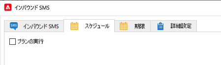

# ミッドソーシングインフラストラクチャに対する「インバウンド SMS」ワークフローアクティビティ {#inbound-sms}

## 制限事項 {#limitations}

* このユースケースは、ミッドソーシングインスタンスから inSMS データを収集するマーケティングインスタンスにのみ適用されます。
* このユースケースをミッドソーシングインスタンスに実装しないでください。
* 外部ミッドソーシングアカウントあたりカスタムワークフローは 1 つのみです。

## 実装 {#implementation}

1. マーケティングインスタンスの `nms:inSMS` スキーマに拡張機能を追加します。拡張機能は、`nms:inSMS` スキーマに新しい属性を追加し、ミッドソーシングインスタンスからの inSMS レコードのプライマリキーを追跡します。

   ```xml
   <element img="nms:miniatures/mini-sms.png" label="Incoming SMS"
          labelSingular="Incoming SMS" name="inSMS">
   <dbindex name="midInSMSId" unique="false">
     <keyfield xpath="@extAccount-id"/>
     <keyfield xpath="@midInSMSId"/>
   </dbindex>
   
   <attribute label="External Mid SMS ID" name="midInSMSId" type="long"/>
   </element>
   ```

1. スキーマに加えた変更を適用するには、データベース更新ウィザードを起動します。このウィザードには、**ツール**／**詳細**／**データベース構造を更新**&#x200B;を通じてアクセスできます。データベースの物理構造が論理的な記述と一致するかどうかを確認し、SQL 更新スクリプトを実行します。[詳細情報](../../configuration/using/updating-the-database-structure.md)

1. 「**インバウンド SMSアクティビティ**」を含むワークフローを停止してバックアップします。

   対応するオプションポインタを `SMS_MO_INDEX_{internal name of the workflow}_{name of the insms workflow activity}_{internal name of the external account to access the mid}` の形式でバックアップします。

[詳しくは、バックアップを参照してください](../../production/using/backup.md)

1. （**オプション**）既に「スケジューラー」アクティビティを使用している場合は、ワークフローを開いて次のように再設定します。

   1. 現在の設定を、「**インバウンド SMS**」アクティビティの「**スケジュール**」タブから外部の「**スケジューラー**」アクティビティにレプリケートします。

   1. 「**インバウンド SMS**」アクティビティの「**スケジュール**」タブで現在の設定を無効にします。

      

1. **インバウンド SMS** カスタムスクリプトを更新します。

   以下のブロックを置き換えます。以前にこのコードをカスタマイズした場合、このスクリプトは異なる場合があります。

   ```Javascript
   var lastSynchKey = getOption('SMS_MO_INDEX_WKF1105_inSmsUS_smsmidus');
   
   var smsId = application.getNewIds(1);
   
   xtk.session.Write(<inSMS xtkschema="nms:inSMS" _operation="insert"
       id={smsId}
       origin={smsMessage.origin}
       message={smsMessage.message}
       providerId={smsMessage.messageId}/>);
   
   return 2;
   ```

   次の新しいカスタムスクリプトを使用して、ミッドソーシングレコードのプライマリキーとマーケティング SMS ルーティングの外部アカウント ID を組み合わせた複合キーに基づいて inSMS データを更新します。

   以下の前提条件に従います。

   * `<EXTERNAL_ACCOUNT_ID>` に実際の値を入力します（例：`var iExtAccountId=72733155`）。
   * カスタムスクリプトには、次の要素を含めます。
      * `_operation="insertOrUpdate"`
      * `_key="@midInSMSId,@extAccount-id"`
      * `midInSMSId={smsMessage.id}`
      * `inSms.@["extAccount-id"] = iExtAccountId;{}`

   ```Javascript
   // please enter real external account ID to replace <EXTERNAL ACCOUNT ID>
   var iExtAccountId=<EXTERNAL_ACCOUNT_ID>;
   
   var inSms = <inSMS xtkschema="nms:inSMS" _operation="insertOrUpdate"
   
               _key="@midInSMSId,@extAccount-id"
               midInSMSId={smsMessage.id}
               message={smsMessage.message}
               origin={smsMessage.origin}
               providerId={smsMessage.providerId}
               alias={smsMessage.alias}
               messageDate = {smsMessage.messageDate}
               receivalDate = {smsMessage.receivalDate}
               deliveryDate = {smsMessage.deliveryDate}
               largeAccount = {smsMessage.largeAccount}
               countryCode = {smsMessage.countryCode}
               operatorCode = {smsMessage.operatorCode}
               linkedSmsId={smsMessage.linkedSmsId}
               separator = {smsMessage.separator}/>
   
   inSms.@["extAccount-id"] = iExtAccountId;
   
   xtk.session.Write(inSms);
   
   return 2;
   ```

1. 次のスクリプトを使用して、インバウンド SMS の詳細初期化スクリプトを更新します。

   スクリプトでは、プライマリキーポインタを 24 時間前にリセットします。ワークフローでは、過去 24 時間以内にミッドソーシングインスタンスからのすべての inSMS データを再処理し、欠落しているデータをマーケティングインスタンスに追加します。

   ```Javascript
   // please enter real external account ID to replace <EXTERNAL_ACCOUNT_ID>
   // please enter real pointer option name to replace '<POINTER_OPTION_NAME>'
   // OPTION NAME format: SMS_MO_INDEX_{internal name of the workflow}_inSms_{internal name of the external account to access the mid}
   
   var queryDef = xtk.queryDef.create(
       <queryDef operation="getIfExists" schema="nms:inSMS" lineCount="1">
       <select>
           <node expr="@midInSMSId" alias="@midInSMSId"/>
       </select>
       <where>
           <condition expr="@midInSMSId != 0"/>
           <condition expr={"@created > SubHours(GetDate(), 24)"}/>
           <condition expr={"[@extAccount-id]=<EXTERNAL_ACCOUNT_ID>"}/>
       </where>
       <orderBy>
           <node expr="@midInSMSId"/>
       </orderBy>
       </queryDef>);
   
   var res = parseInt(queryDef.ExecuteQuery().@midInSMSId.toString());
   
   if( !isNaN(res) )
   setOption('<POINTER_OPTION_NAME>', res);
   ```

   >[!WARNING]
   >
   > * 複数の SMS ルーティングアカウントが同じミッドソーシングインスタンスにリンクされている場合、ミッドソーシングインスタンスあたり 1 つのワークフローのみが許可されます。
   > * 任意の外部アカウント ID を使用できます。外部キーの役割は、ミッドソーシング SMS ID が他のミッドソーシングインスタンス間で同一である可能性がある、様々なミッドソーシングサーバーが関与するシナリオでデータ紐付けの整合性を維持することです。
   > * ミッドソーシングインスタンスあたり複数の inSMS ワークフローがある場合、外部アカウント ID が変化してもミッドソーシング SMS ID は一定のままであるので、データの重複が発生する場合があります。

1. ワークフローを保存して再開します。
