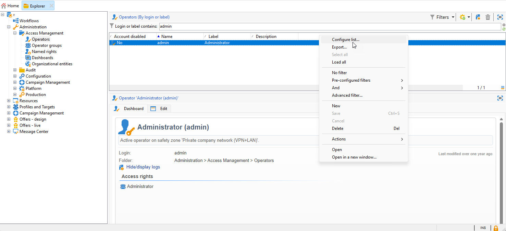
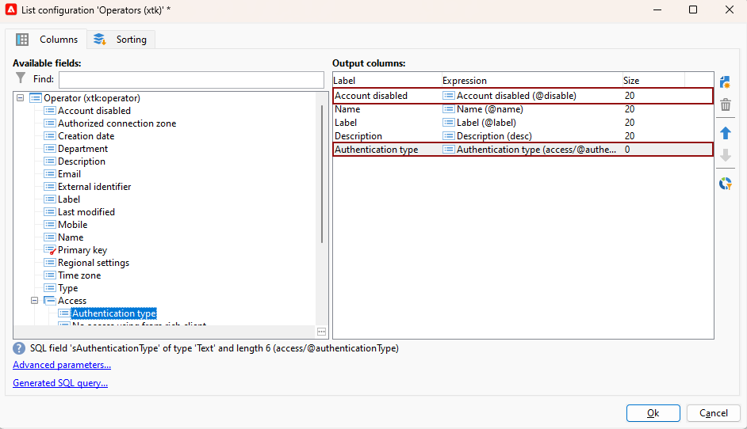
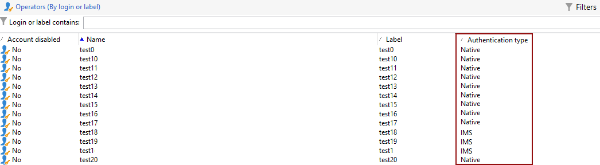

# Campaign オペレーターの Adobe Identity Management System（IMS）への移行 {#migrate-users-to-ims}

セキュリティと認証プロセスを強化する取り組みの一環として、Adobe Campaign では、エンドユーザー認証モードをログイン/パスワードネイティブ認証から Adobe Identity Management System（IMS）に移行することを強くお勧めしています。 すべてのオペレーターは、Campaignに接続するために[Adobe Identity Management System （IMS） &#x200B;](https://helpx.adobe.com/jp/enterprise/using/identity.html){target="_blank"}を実装する必要があります。

この移行について詳しくは、[このページ](ac-ims.md)を参照してください。

## 変更点 {#move-to-ims-changes}

Campaign Classic では、すべての標準ユーザーは、Adobe Identity Management System（IMS）により、Adobe ID を使用して Adobe Campaign クライアントコンソールに既に接続しています。 ただし、ユーザー名とパスワードでの接続は引き続き可能です。 これは、Campaign v8 以降では使用できなくなります。

さらに、セキュリティと認証プロセスを強化する取り組みの一環として、Adobe Campaign クライアントアプリケーションは、IMS テクニカルアカウントトークンを使用して Campaign API を直接呼び出すようになりました。 テクニカルオペレーターの移行について詳しくは、[このページ](ims-migration.md)にある専用の記事を参照してください。

この変更は Campaign Classic v7 で既に適用されており、Campaign v8 に移行するためには&#x200B;**必須**&#x200B;となります。

アドビでは、この移行作業をサポートしています。 詳細なコンテキストと段階的なガイドラインについては、以下の記事を参照してください。

## 影響の有無{#migrate-ims-impacts}

この手順は、まだ Adobe ID を使用して Campaign に接続していないすべての Campaign ユーザーに適用されます。

組織内のオペレーターが Campaign クライアントコンソールにログイン／パスワード（別名 ネイティブ認証）影響を受けるので、以下で説明するようにこれらのオペレーターを Adobe IMS に移行する必要があります。

[Adobe Identity Management System （IMS） &#x200B;](https://helpx.adobe.com/jp/enterprise/using/identity.html){target="_blank"}への移行は、環境を安全で標準化するためのセキュリティ上の必須要素です。他のほとんどのAdobe Experience Cloud ソリューションやアプリは既にIMS上にあります。

この変更は、Campaign Classic v7.4.1（および最新の [IMS 移行互換バージョン](ac-ims.md#ims-versions)）以降に適用され、Adobe Campaign v8 に移行するには&#x200B;**必須**&#x200B;となります。

>[!IMPORTANT]
>
>**Campaign コントロールパネルアクセスへの影響**
>
>ユーザーをIMSに移行する際は、Adobe Admin Console内の製品プロファイルの名前に「admin」という単語が含まれていることに注意してください（「Administrators」、「admin」、「admins」、「approval admin」など）。 Campaign Campaign コントロールパネルへのアクセス権を自動的に付与します。 Campaign コントロールパネルは、Campaign インスタンスに大きな変更を加えることができるセルフサービスツールです。
>
>製品プロファイルの命名規則を注意深く確認して、承認済みのユーザーのみがCampaign コントロールパネルにアクセスできるようにします。 Campaign コントロールパネル権限の管理について詳しくは、[Campaign コントロールパネルドキュメント &#x200B;](https://experienceleague.adobe.com/docs/control-panel/using/discover-control-panel/managing-permissions.html){target="_blank"}を参照してください。

## ホスト環境と Managed Services 環境を移行する方法 {#ims-migration-procedure}

### 前提条件 {#ims-migration-prerequisites}

移行プロセスを開始する前に、アドビのテクニカルチームが既存のオペレーターグループとネームド権限を Adobe Identity Management System（IMS）に移行できるように、アドビトランジションマネージャー（Managed Services をご利用の場合）またはアドビカスタマーケア（その他のホスト環境をご利用の場合）にお問い合わせいただく必要があります。

### 主な手順 {#ims-migration-steps}

この移行の主な手順を以下に示します。

1. アドビでは、環境を Campaign v7.4.1（または [IMS 移行互換バージョン](ac-ims.md#ims-versions)）にアップグレードします。
1. アップグレード後も、ネイティブユーザーまたは IMS の両方の方法で新しいユーザーを引き続き作成できます。
1. 内部の Campaign 管理者は、Campaign クライアントコンソール上のすべてのネイティブユーザーに一意のメールアドレスを追加し、これが完了したらアドビ担当者またはアドビカスタマーケアにご確認いただく必要があります。  この手順について詳しくは、[この節](#ims-migration-id)を参照してください。
1. アドビ担当者またはアドビカスタマーケアと連携して、技術に詳しくないユーザー（オペレーター）と製品プロファイルの自動移行をアドビが実行する日付を確保します。 この手順には、サービスのダウンタイムが発生しない 1 時間の時間枠が必要です。
1. 内部の Campaign 管理者がこれらの変更を検証し、サインオフします。 この移行後は、ログイン名とパスワードで認証するオペレーターをさらに作成する必要はありません。

テクニカルオペレーターを Adobe Developer Console に移行することもできます。詳しくは、この[テクニカルノート](ims-migration.md)を参照してください。

この移行が完了したら、アドビトランジションマネージャー（Managed Services をご利用の場合）またはアドビカスタマーケア（ホスト型のお客様の場合）に確認します。 その後、アドビは、移行が完了した旨を表示します。 これにより、環境が保護され、標準化されます。

## ハイブリッド環境とオンプレミス環境を移行する方法 {#ims-migration-procedure-on-prem}

この移行の主な手順を以下に示します。

1. 環境を Campaign v7.4.1（または [IMS 移行互換バージョン](#ims-versions)）にアップグレードします。
1. アップグレード後も、ネイティブユーザーまたは IMS の両方の方法で新しいユーザーを引き続き作成できます。
1. 社内 Campaign 管理者の方は、[このセクション](../../integrations/using/configuring-ims.md)の説明に従い、Adobe IMS を構成する必要があります。
1. 次に、Campaign クライアントコンソールで、すべてのネイティブユーザーに一意の E メールを追加します。 この手順について詳しくは、[この節](#ims-migration-id)を参照してください。
1. [Campaign v8 ドキュメント &#x200B;](https://experienceleague.adobe.com/docs/campaign/campaign-v8/admin/permissions/manage-permissions.html?lang=ja){target="_blank"}の詳細に従って、Adobe Admin Consoleでユーザーと製品プロファイルを作成します。
1. すべてのオペレーターに対して「**Adobe ID を使用して接続**」オプションを有効にします。
1. 接続に対して Adobe IMS を実装するには、[このページ](../../integrations/using/implementing-ims.md)を参照してください。

また、テクニカルオペレーターを Adobe Developer Console に移行することもできます。詳しくは、[このテクニカルノート](ims-migration.md)を参照してください。

## よくある質問 {#ims-migration-faq}

### 移行後にユーザーを作成するにはどうすればよいですか？ {#ims-migration-native}

Adobeでは、Campaign Classic v7.4.1 （または[IMS移行互換バージョン &#x200B;](#ims-versions)）にアップグレードした後は、IMS ユーザーのみを作成することをお勧めします。
Campaign v7.4.1以降では、[このページ &#x200B;](impact-ims-migration.md)で詳しく説明されているようにインスタンス設定を更新することで、ネイティブオペレーターの作成を防ぐことができます。

Campaign 管理者は、Adobe Admin Console と Campaign クライアントコンソールを通じて組織のユーザーに権限を付与できます。 ユーザーは、Adobe ID を使用して Adobe Campaign にログオンします。 IMSで権限を設定する方法については、[Campaign v8 ドキュメント &#x200B;](https://experienceleague.adobe.com/docs/campaign/campaign-v8/admin/permissions/gs-permissions.html?lang=ja){target="_blank"}を参照してください。

### 現在のネイティブユーザー用のメールアドレスを追加するにはどうすればよいですか？ {#ims-migration-id}

Campaign 管理者は、クライアントコンソールからすべてのネイティブユーザーにメール ID を追加する必要があります。 手順は次のとおりです。

1. クライアントコンソールに接続し、**管理／アクセス管理／オペレーター**&#x200B;を参照します。
1. オペレーターリストで更新するオペレーターを選択します。
1. オペレーターフォームの「**連絡窓口**」セクションにオペレーターのメールアドレスを入力します。
1. 変更内容を保存します。

<!--You can also import a CSV file to update all your operator profiles with their email.-->

### IMS 経由で Campaign にログインするにはどうすればよいですか？ {#ims-migration-log}

Campaign と Adobe ID の接続方法については、[この節](../../integrations/using/implementing-ims.md)を参照してください。

### この移行中にダウンタイムは発生しますか？ {#ims-migration-downtime}

ホスト環境および Managed Services 環境のお客様の場合、移行（ユーザーと製品プロファイルの移行）を完了するには、アドビでは、どのインスタンス（ワークフローなど）もダウンタイムなしで 1 時間の時間枠を必要とします。

この期間中、すべての Campaign ユーザーはログオフし、IMS への移行が完了したら Adobe ID を使用して再度ログインする必要があります。

アドビでは、移行期間中はすべてのユーザーをログオフすることを強くお勧めします。

### 組織内のユーザーは既に IMS を使用していますが、引き続き IMS への移行を実行する必要がありますか？{#ims-migration-needed}

この移行には、エンドユーザーの移行（および製品プロファイル）と技術ユーザーの移行（カスタムコードの API で使用）という 2 つの側面があります。

すべてのユーザー（Campaign オペレーター）が IMS を使用している場合でも、製品プロファイルの移行を計画するには、アドビ担当者／カスタマーサポートに問い合わせる必要があります。 また、カスタムコードで使用した可能性のある技術ユーザーも移行する必要があります。 詳しくは、[このページ](ims-migration.md)を参照してください。

### オペレーターの認証タイプを表示するにはどうすればよいですか？

Campaign でオペレーターの認証タイプを表示する方法について説明します。

1. 次から： **エクスプローラ**，アクセス **管理** `>` **アクセス管理** `>` **演算子**.

1. ヘッダー行を右クリックし、**リストを設定**&#x200B;メニューを選択します。

   

1. **無効なアカウント**&#x200B;と&#x200B;**認証タイプ**&#x200B;を&#x200B;**出力列**&#x200B;として追加します。

   

これで、**オペレーター**&#x200B;とその&#x200B;**認証タイプ**&#x200B;のリストが表示されます。

>[!MORELIKETHIS]
>
>* [Adobe Developer Console へのテクニカルユーザーの移行](ims-migration.md)
>* [Adobe Campaign Classic v7 リリースノート](../../rn/using/latest-release.md)
>* [Adobe Identity Management System （IMS）とは](https://helpx.adobe.com/jp/enterprise/using/identity.html){target="_blank"}
