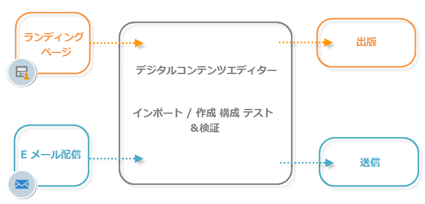

# Campaign の HTML エディターについて{#about-campaign-html-editor}

**デジタルコンテンツエディター（DCE）**&#x200B;は、HTML コンテンツエディターです。DCE を使用すると、Adobe Campaign 内で HTML 形式のテンプレートやコンテンツを容易に作成したり修正したりできます

DCE を使用すると、ページ要素を挿入および書式設定したり、HTML ページの要素にデータベースフィールドを関連付けたりできます。Web アプリケーション用のページを作成する場合や、アクティブになっているテンプレートに基づいて配信を作成する場合には、デフォルトで DCE を使用できます。

>[!NOTE]
>
>DCE で実行できるのは、この節で説明する操作のみです。
>
>サーバー側 JavaScript コードを追加したい場合は、パーソナライゼーションブロックに追加することをお勧めします。パーソナライゼーションブロックの作成と変更について詳しくは、[このページ](../../delivery/using/personalization-blocks.md)を参照してください。

>[!CAUTION]
>
>プライバシー保護のために、すべての外部リソースに対して HTTPS を使用することをお勧めします。

## コンテンツエディターの一般的な操作 {#content-editor-general-operation}

ここでは、Web アプリケーションのフレームワーク内および配信のコンテキストで、DCE で編集したコンテンツを編集およびアップロードする主な手順について説明します。

一般的な操作を次に示します。

シンプルなWebアプリケーションを作成する手順は次のとおりです。

* Webアプリケーションの作成を参照してください。詳しくは、「ランディ [ングページの作成](../../web/using/creating-a-landing-page.md)、
* Select existing content or creating content from a standard template, for more on this, refer to [Template management](../../web/using/template-management.md),
* コンテンツの編集と設定を行う場合、詳しくは「コンテンツの編集 、
* Publish the Web application, for more on this, refer to [Publishing content](../../web/using/creating-a-landing-page.md#step-3---publishing-content) and [this page](../../web/using/publishing-a-web-form.md#managing-web-forms-delivery-and-tracking).

>[!NOTE]
>
>For a complete example detailing the implementation of the DCE within the framework of a Web application, refer to [Creating a landing page](../../web/using/creating-a-landing-page.md).

E メール配信を作成する手順は、次のとおりです。

* DCEがアクティブな電子メールタイプテンプレートから配信を作成します。
* 既存のコンテンツを選択するか、標準テンプレートからコンテンツを作成する、
* オンラインコンテンツの編集と設定、
* 配信を送信します。詳しくは、この節を参 [照してください](../../delivery/using/communication-channels.md)。

>[!NOTE]
>
>For a complete example detailing the implementation of the DCE within the framework of an email delivery, refer to [this use case](../../web/using/use-case--creating-an-email-delivery.md).

