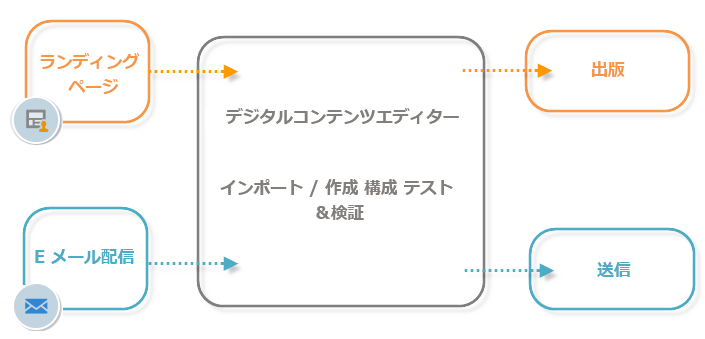

# Campaign の HTML エディターの基本を学ぶ{#about-campaign-html-editor}

**デジタルコンテンツエディター（DCE）**&#x200B;は、Adobe Campaign 内で HTML 形式のコンテンツやテンプレートを容易に作成できる HTML コンテンツエディターです。

DCE を使用すると、ページ要素の挿入や書式設定、HTML ページ要素とデータベースフィールドのマッピングなどをおこなえます。 このエディターは、Web アプリケーションのページを作成する場合や、DCE テンプレートに基づいて配信を作成する場合に使用できます。

>[!NOTE]
>
>サーバーサイド JavaScript コードを追加する必要がある場合は、パーソナライゼーションブロックを使用します。 [Campaign v8 ドキュメント](https://experienceleague.adobe.com/docs/campaign/campaign-v8/send/personalize/personalization-blocks.html?lang=ja){target="_blank"}を参照してください。

>[!CAUTION]
>
>すべての外部リソースは、HTTPS URL で参照する必要があります。

## デジタルコンテンツエディターを使用するための主要な手順 {#content-editor-general-operation}

この節では、DCE でのコンテンツの編集と編集したコンテンツのアップロードの主な手順を、Web アプリケーションや配信デザインのコンテキストで説明します。

一般的な操作は次のとおりです。

単純な **Web アプリケーション**&#x200B;を作成するには、次の操作が必要です。

1. Web アプリケーションを作成します（[詳細情報](creating-a-landing-page.md)）
1. 既存のコンテンツを選択するか、標準テンプレートからコンテンツを作成します（[詳細情報](template-management.md)）
1. コンテンツの編集と設定をおこないます（[詳細情報](editing-content.md)）
1. Web アプリケーションを公開します（[詳細情報](creating-a-landing-page.md#step-3---publishing-content)）

>[!NOTE]
>
>Web アプリケーションのコンテキストでの完全な実装例については、[こちらの節](creating-a-landing-page.md)を参照してください。

**メール配信**&#x200B;を作成するには、次の操作が必要です。

1. DCE テンプレートから配信を作成します（[詳細情報](use-case-creating-an-email-delivery.md)）
1. 既存のコンテンツを選択するか、[標準テンプレート](template-management.md)からコンテンツを作成します
1. オンラインコンテンツの編集と設定をおこないます
1. 配信を送信します（詳しくは、[Campaign v8 ドキュメント](https://experienceleague.adobe.com/docs/campaign/campaign-v8/send/create-message.html?lang=ja){target="_blank"}を参照してください）。

>[!NOTE]
>
>メール配信のコンテキストでの完全な実装例について詳しくは、[こちらのユースケース](use-case-creating-an-email-delivery.md)を参照してください。
