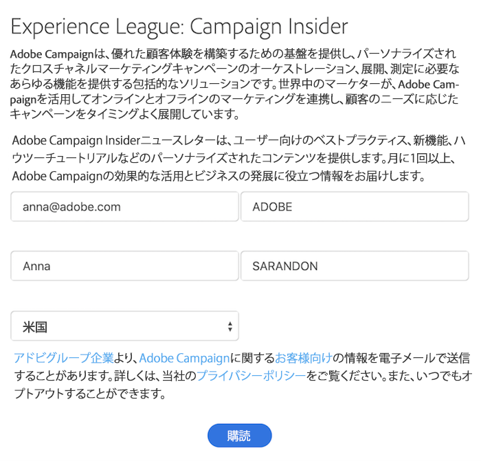
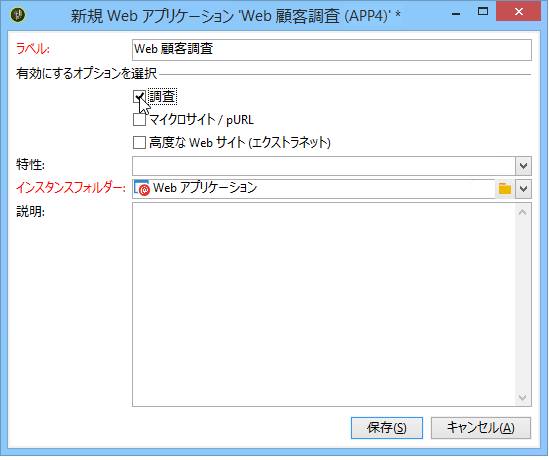

# Web アプリケーションについて{#about-web-applications}

Adobe Campaign では、データベースのデータを使用して動的でインタラクティブな Web アプリケーションの作成とパブリッシュをおこなったり、接続ユーザーの権限に応じたコンテンツを作成したりできます。エクストラネット上の編集フォームのほか、データベースからのデータを含み、テーブル、グラフ、入力フォームなどを備えた通知フォームなど、ページの作成が可能です。この機能を使用すると、ユーザーが情報を調べたり入力したりできる Web ページをデザインおよび投稿できます。

例えば、以下に示されているような、Adobe Campaign データベース内の情報をあらかじめ読み込んだ状態の購読フォームなどを作成できます。

この章では、Web アプリケーションの管理方法の概要について説明します。

>[!CAUTION]
>
>プライバシー保護のために、すべての外部リソースに対して HTTPS を使用することをお勧めします。

## Webアプリケーションの範囲 {#web-application-scope}

Adobe CampaignのWebアプリケーションは、次の機能にアクセスできます。

* 複数ページのフォームの作成
* 統合された翻訳ツールによる多言語の調査の管理
* グラフィカルなページ管理インターフェイス、複数列のページレイアウト
* パーソナライゼーションとフィールドの位置のレンダリング
* 回答に応じた調査フィールドの条件付き表示
* 質問のランダム表示
* 条件付きページ表示
* 期待されるデータタイプ（数値、E メールアドレス、日付など）および必須フィールドに応じて、検証前に情報チェック
* E メールの招待状または通知
* エラーおよび終了メッセージのパーソナライゼーション
* 画像、ビデオ、ハイパーテキストリンク、Captcha などの使用
* リアルタイムの応答の監視

The optional **Survey** creation module offers the following additional functionalities:

* データベースの動的な拡張（最初のデータテンプレートに含まれない応答の作成）
* 専用レポートの生成

Web アプリケーションと比較すると、調査は、シンプルなグラフィカルインターフェイスを備え、編集コントロールが少なくなっています。

>[!NOTE]
>
>調査について詳しくは、[この節](../../web/using/about-surveys.md)を参照してください。
>
>Adobe Campaign の Web フォームの全体的な機能について詳しくは、[この節](../../web/using/about-web-forms.md)を参照してください。

## Webアプリケーションの実装 {#web-application-implementation}

Web アプリケーションを作成および投稿するには、次を実行する必要があります。

1. コンテンツを作成します（フィールド、リスト、テーブル、グラフなど）。

   また、フォームの利用可能なフィールドの詳細を説明するセクションを表示できます。これらすべてのフィールドは、Web アプリケーションでも利用できます。詳しくは、[このページ](../../web/using/adding-fields-to-a-web-form.md)を参照してください。

1. 必要に応じて、プリロード、テストおよび保存手順を追加したり、アクセス制御システムを設定したりすることができます（主にエクストラネットに公開するフレームワーク内で）。
1. Web アプリケーションをパブリッシュして、エクストラネットまたは Adobe Campaign で利用できるようにします。

## Webアプリケーションの初期設定 {#web-application-initial-configuration}

Webアプリケーションは、のリンクと **[!UICONTROL Web Applications]** タブで作成 **[!UICONTROL Campaigns]** され **[!UICONTROL Profiles and targets]** ます。

Webアプリケーションは、Adobe Campaignツ **[!UICONTROL Resources > Online > Web Applications]** リーのノードに保存されます。 設定は、次のフォルダーに分類されます。

* **[!UICONTROL Administration > Configuration > Form renderings]**:Webフォームプレゼンテーション（アプリケーションおよび調査）用のレンダリングテンプレートが含まれます。 テンプレートを使用すると、フォームを生成できます。また、CSS スタイルシートを使用します。このスタイルシートは、テンプレートレベルでオーバーロードできます。詳しくは、[このページ](../../web/using/form-rendering.md#selecting-the-form-rendering-template)を参照してください。
* **[!UICONTROL Resources > Templates > Web application templates]**:フォームテンプレートが含まれます。 フォームまたは Web アプリケーションを作成するには、テンプレートから開始する必要があります。

## Web アプリケーションテンプレート {#web-application-templates}

デフォルトでは、Adobe Campaign は、利用可能な Web アプリケーションごとに 1 つのテンプレートを提供します。

>[!NOTE]
>
>既存の Web アプリケーションをテンプレートに変換できます。そのためには、フォームを選択して右クリックし、選択 **[!UICONTROL Actions > Save as template...]**.

Adobe Campaignツリーのノードを使用して、新し **[!UICONTROL Resources > Templates > Web Application templates]** いテンプレートを作成できます。

以下に示すように、作成ウィザードを使用して、有効にするオプションを選択できます。

>[!CAUTION]
>
>利用可能なアプリケーションは、オプションおよびモジュールによって異なります。使用許諾契約書を確認してください。

