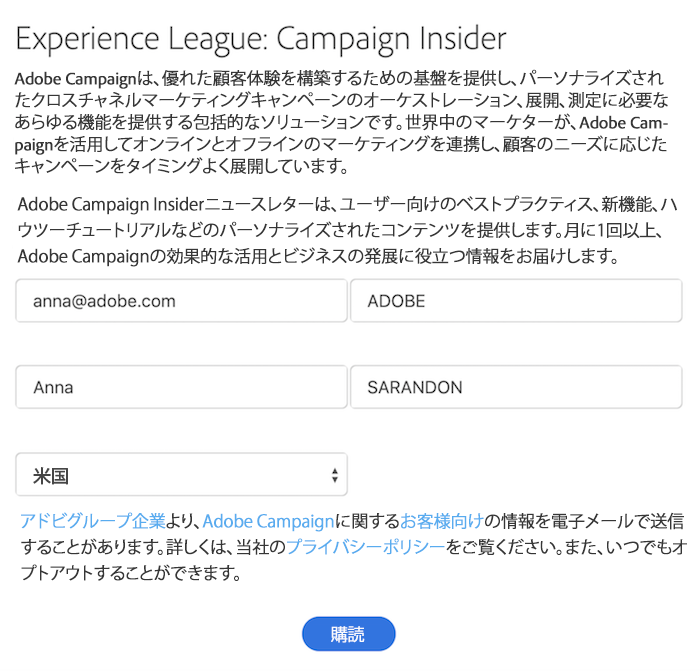
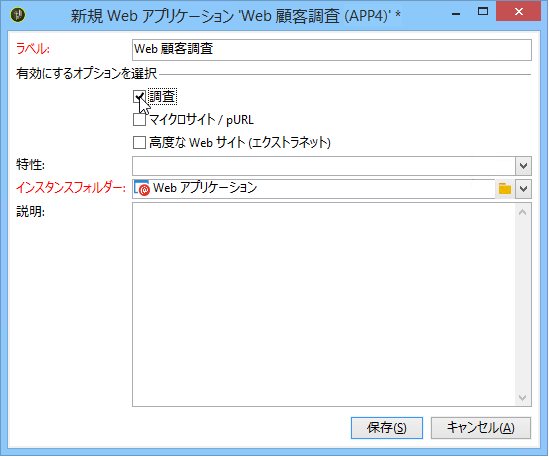

# Web アプリケーションの基本を学ぶ{#about-web-applications}

Adobe Campaign では、データベースのデータを使用して動的でインタラクティブな Web アプリケーションの作成とパブリッシュをおこなったり、接続ユーザーの権限に応じたコンテンツを作成したりできます。

エクストラネット上の編集フォームのほか、データベースからのデータを含み、テーブル、グラフ、入力フォームなどを備えた通知フォームなど、ページの作成が可能です。この機能を使用すると、ユーザーが情報を調べたり入力したりできる Web ページをデザインおよび投稿できます。

例えば、以下に示されているような、Adobe Campaign データベース内の情報をあらかじめ読み込んだ状態の購読フォームなどを作成できます。

この章では、Web アプリケーションの管理方法の概要について説明します。

>[!NOTE]
>
>Web アプリケーションのセキュリティを最適化する方法については、[セキュリティおよびプライバシーチェックリスト](https://helpx.adobe.com/jp/campaign/kb/acc-security.html)を参照してください。

>[!CAUTION]
>
>プライバシー保護のために、すべての外部リソースに対して HTTPS を使用することをお勧めします。

## Web アプリケーションのスコープ {#web-application-scope}

Adobe Campaign の Web アプリケーションでは、次の機能を利用できます。

* 複数ページのフォームの作成。 詳しくは、この[ページ](about-web-forms.md)を参照してください。
* 統合された翻訳ツールによる多言語の調査の管理。 詳しくは、この[ページ](translating-a-web-application.md)を参照してください。
* グラフィカルなページ管理インターフェイス、複数列のページレイアウト。 詳しくは、この[ページ](designing-a-web-application.md)を参照してください。
* パーソナライゼーションとフィールドの位置のレンダリング。 詳しくは、この[ページ](editing-content.md#adding-personalization-content)を参照してください。
* 回答に応じた調査フィールドの条件付き表示。 詳しくは、この[ページ](form-rendering.md#defining-fields-conditional-display)を参照してください。
* 質問のランダム表示。 詳しくは、この[ページ](../../surveys/using/building-a-survey.md#adding-questions)を参照してください。
* 条件付きページ表示。 詳しくは、この[ページ](defining-web-forms-page-sequencing.md#conditional-page-display)を参照してください。
* 想定されるデータタイプ（番号、メールアドレス、日付など）に応じて、検証前の情報チェックを行います。 すべて含まれています。 詳しくは、この[ページ](form-rendering.md#defining-control-settings)を参照してください。
* 電子メールの招待状または通知。 詳しくは、この[ページ](publishing-a-web-form.md#delivering-a-form-via-email)を参照してください。
* エラーおよび終了メッセージのパーソナライゼーション。 詳しくは、この[ページ](defining-web-forms-properties.md#setting-up-an-error-page)を参照してください。
* 画像、動画、ハイパーテキストリンク、キャプチャなどの使用。詳しくは、この[&#x200B; ページ &#x200B;](editing-content.md)を参照してください。
* リアルタイムの応答の監視。 詳しくは、この[ページ](../../surveys/using/publish-track-and-use-collected-data.md#response-tracking)を参照してください。

オプションの&#x200B;**調査**&#x200B;作成モジュールは、次の追加機能を提供します。

* データベースの動的な拡張（最初のデータテンプレートに含まれない応答の作成）。 詳しくは、この[ページ](../../surveys/using/managing-answers.md#storing-collected-answers)を参照してください。
* 専用レポートの生成。 詳しくは、この[ページ](../../surveys/using/publish-track-and-use-collected-data.md#reports-on-surveys)を参照してください。

Web アプリケーションと比較すると、調査は、シンプルなグラフィカルインターフェイスを備え、編集コントロールが少なくなっています。

>[!NOTE]
>
>調査について詳しくは、[この節](../../surveys/using/about-surveys.md)を参照してください。
>
>Adobe Campaign の Web フォームの全体的な機能について詳しくは、[この節](about-web-forms.md)を参照してください。

## Web アプリケーションの実装 {#web-application-implementation}

Web アプリケーションを作成および投稿するには、次を実行する必要があります。

1. コンテンツを作成します（フィールド、リスト、テーブル、グラフなど）。

   また、フォームの利用可能なフィールドの詳細を説明するセクションを表示できます。これらすべてのフィールドは、Web アプリケーションでも利用できます。 詳しくは、[このページ](adding-fields-to-a-web-form.md)を参照してください。

1. 必要に応じて、プリロード、テストおよび保存手順を追加したり、アクセス制御システムを設定したりすることができます（主にエクストラネットに公開するフレームワーク内で）。
1. Web アプリケーションをパブリッシュして、エクストラネットまたは Adobe Campaign で利用できるようにします。

## Web アプリケーションの初期設定 {#web-application-initial-configuration}

Web アプリケーションは、「**[!UICONTROL キャンペーン]**」および「**[!UICONTROL プロファイルとターゲット]**」タブの「**[!UICONTROL Web アプリケーション]**」リンクを使用して作成されます。

Web アプリケーションは、Adobe Campaign ツリーの&#x200B;**[!UICONTROL リソース／オンライン／Web アプリケーション]**&#x200B;ノードに格納されます。 設定は、次のフォルダーに分類されます。

* **[!UICONTROL 管理／設定／フォームのレンダリング]**：Web フォームプレゼンテーションのレンダリングテンプレートが含まれます（アプリケーションおよび調査）。 テンプレートを使用すると、フォームを生成できます。 また、CSS スタイルシートを使用します。 このスタイルシートは、テンプレートレベルでオーバーロードできます。 詳しくは、[このページ](form-rendering.md#selecting-the-form-rendering-template)を参照してください。
* **[!UICONTROL リソース／テンプレート／Web アプリケーションテンプレート]**：フォームテンプレートが含まれます。 フォームまたは Web アプリケーションを作成するには、テンプレートから開始する必要があります。

## Web アプリケーションテンプレート {#web-application-templates}

デフォルトでは、Adobe Campaign は、利用可能な Web アプリケーションごとに 1 つのテンプレートを提供します。

>[!NOTE]
>
>既存の Web アプリケーションをテンプレートに変換できます。 そのためには、フォームを選択して右クリックし、 **[!UICONTROL アクション／テンプレートとして保存]**&#x200B;を選択します。

Adobe Campaign ツリーの&#x200B;**[!UICONTROL リソース／テンプレート／Web アプリケーションテンプレート]**&#x200B;ノードで、新しいテンプレートを作成できます。

以下に示すように、作成アシスタントを使用して、有効にするオプションを選択できます。

>[!CAUTION]
>
>利用可能なアプリケーションは、オプションおよびモジュールによって異なります。 使用許諾契約書を確認してください。
