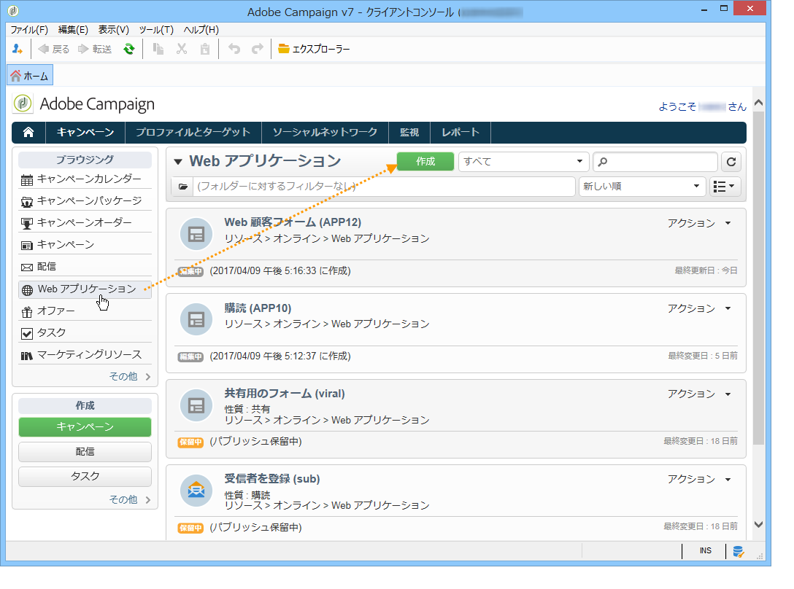
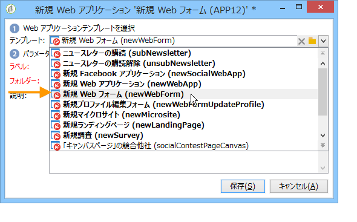
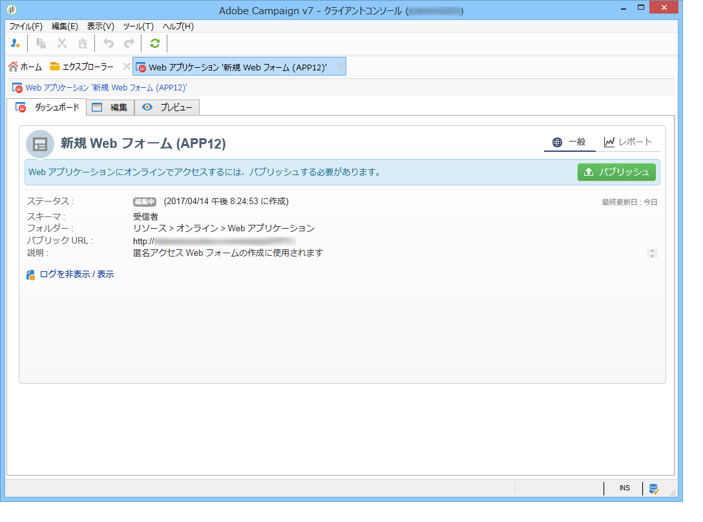
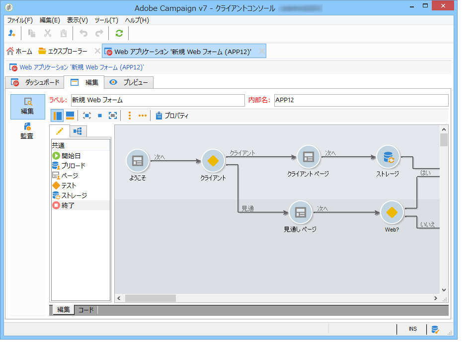
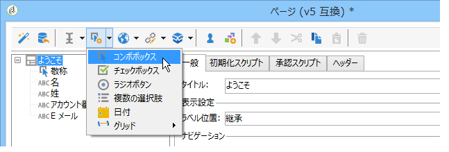
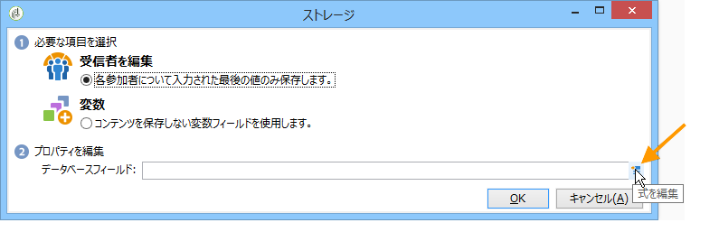
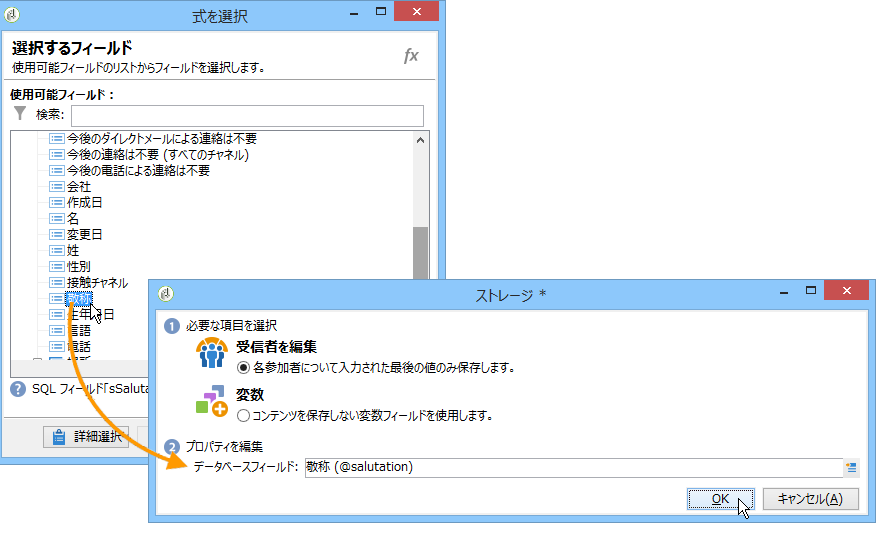

# Web フォームについて{#about-web-forms}

Adobe Campaign には、Web フォームを定義して公開するためのグラフィカルなモジュールが統合されており、入力および選択フィールドを含むページを作成して、データベースからのデータを含めることができます。これにより、ユーザーがアクセスして情報を表示または入力できる Web ページをデザインおよび投稿できます。

この章では、Web フォームの作成と管理、フィールドとページの管理方法、およびストレージとモードの保存について詳しく説明します。

>[!CAUTION]
>
>プライバシー保護のために、すべての外部リソースに対して HTTPS を使用することをお勧めします。

## Web フォームを作成する手順 {#steps-for-creating-a-web-form}

ここでは、Adobe Campaign の **webForm** タイプをデザインするのに必要な手順と、利用可能なオプションおよび設定について説明します。Adobe Campaign を使用して、作成した Web フォームをユーザーが利用できるようにし、回答を収集してデータベースにアーカイブします。

>[!CAUTION]
>
>Web アプリケーションおよび Web フォームを設定する場合、縦の解像度は 900 ピクセル以上必要です（例：1600 x 900）。

Web フォームには、「**キャンペーン**」タブの Web アプリケーションメニューからアクセスします。Adobe Campaign ツリーで、**[!UICONTROL リソース／オンライン／Web アプリケーション]**&#x200B;ノードにグループ化されています。

Web フォームを作成するには、Web アプリケーションのリストの上の「**[!UICONTROL 作成]**」ボタンをクリックします。

Web フォームテンプレートを選択します（デフォルトは **[!UICONTROL newWebForm]**）。

これにより、フォームのダッシュボードが表示されます。

「**[!UICONTROL 編集]**」タブを使用すると、コンテンツを作成できます。

Web フォームの設定とコンテンツを定義するには、次の手順に従います。

* 最初に、必要なページを作成し、入力フィールド、ドロップダウンリスト、HTML コンテンツなどをチェックします。

   この手順は、以下で詳しく説明します。

* ページの順番を定義し、表示を調節します。

   この手順について詳しくは、[Web フォームページの順番の定義](../../web/using/defining-web-forms-page-sequencing.md)を参照してください。

* 必要に応じて、コンテンツを翻訳します。

   この手順について詳しくは、[Web フォームの翻訳](../../web/using/translating-a-web-form.md)を参照してください。

## Web フォームの設計について {#about-web-forms-designing}

フォームのページは、入力ゾーン（テキスト）、選択フィールド（リスト、チェックボックスなど）および静的要素（画像、HTLM コンテンツなど）を定義および設定できる、専用のエディターで作成されます。フォームのページは、コンテナにグループ化したり、ニーズに合わせてレイアウトを変更したりできます（詳しくは、[コンテナの作成](../../web/using/defining-web-forms-layout.md#creating-containers)を参照）。

以降の節では、フォーム画面のコンテンツとレイアウトの定義方法について説明します。

* [Web フォームへのフィールドの追加](../../web/using/adding-fields-to-a-web-form.md),
* [HTML コンテンツの挿入](../../web/using/static-elements-in-a-web-form.md#inserting-html-content),
* [Web フォームの静的要素](../../web/using/static-elements-in-a-web-form.md),
* [Web フォームレイアウトの定義](../../web/using/defining-web-forms-layout.md).

>[!NOTE]
>
>* ページデザイン中に、「**[!UICONTROL プレビュー]**」タブで最終的なレンダリングを表示できます。変更を表示するには、最初にフォームを保存します。すべてのエラーが「**[!UICONTROL ログ]**」タブに表示されます。
>* ページの表示と情報ストレージが適切な順序でおこなわれることを確認するには、Web フォームのデバッグモードを有効にします。これをおこなうには、「**[!UICONTROL プレビュー]**」サブタブに移動し、「**[!UICONTROL デバッグモードを有効にする]**」チェックボックスをオンにして、すべての収集された情報と可能性のある実行エラーが各ページの下部に表示されるようにします。
>

### ツールバーのアイコンの使用 {#using-the-icons-in-the-toolbar}

ツールバーのアイコンまたは右クリックを使用して入力ゾーンを挿入することもできます。

この場合、まず追加するフィールドのタイプを選択してから、回答ストレージモードを選択します。

「**[!UICONTROL OK]**」をクリックして、選択を承認します。

