# Web フォームへのフィールドの追加{#adding-fields-to-a-web-form}

Web フォームのフィールドは、ユーザーによる情報の入力とオプションの選択を可能にします。Web フォームにより、入力フィールド、選択フィールド、静的コンテンツおよび高度なコンテンツ（Captcha、購読など）を提供できます。

ウィザードを使用してフィールドを追加する場合、フィールドタイプは、選択したフィールドまたはストレージ変数に基づいて自動的に検出されます。You can edit it using the **[!UICONTROL Type]** drop-down box in the **[!UICONTROL General]** tab.

ツールバーのボタンを使用する場合、追加するフィールドのタイプを選択します。

次のフィールドのタイプを使用できます。

* テキスト／数値入力：詳しくは、 [入力フィールドの追加を参照してくださ](#adding-input-fields)い。
* コンボボックスの選択 詳しくは、 [コンボボックスの追加を参照してくださ](#adding-drop-down-lists)い。
* チェックボックスを使用した複数選択：チェックボ [ックスの追加を参照](#adding-checkboxes)。
* ラジオボタンを使用した排他的な選択：詳しくは、ラ [ジオボタンの追加を参照してくださ](#adding-radio-buttons)い。
* オプショングリッドでの投票：詳しくは、グ [リッドの追加を参照してくださ](#adding-grids)い。
* 数字と日付。 See [Adding dates and numbers](#adding-dates-and-numbers).
* 情報サービスの購読/購読解除 「購読」チェ [ックボックスを参照してくださ](#subscription-checkboxes)い。
* Captcha検証。 「captchaの [挿入」を参照してください](#inserting-a-captcha)。
* ダウンロードボタン。 [ファイルのアップロード](#uploading-a-file).
* 非表示定数。 詳しくは、非 [表示の定数の挿入を参照してくださ](#inserting-a-hidden-constant)い。

応答の保存モードを指定してください：データベース内のフィールドを更新する（最後に保存した値のみを保存する）か、変数に保存します（回答は保存されません）。 詳しくは、「応答の保存フィールド」 [を参照してください](../../web/using/web-forms-answers.md#response-storage-fields)。

>[!NOTE]
>
>デフォルトでは、フィールドは、現在のツリーの下部に挿入されます。ツールバーの矢印を使用して上下に移動します。

## フィールド作成ウィザード {#field-creation-wizard}

フォームの各ページで、ツールバーの最初のボタンを使用してフィールドを追加できます。これを行うには、メニューに移動し **[!UICONTROL Add using the wizard]** ます。

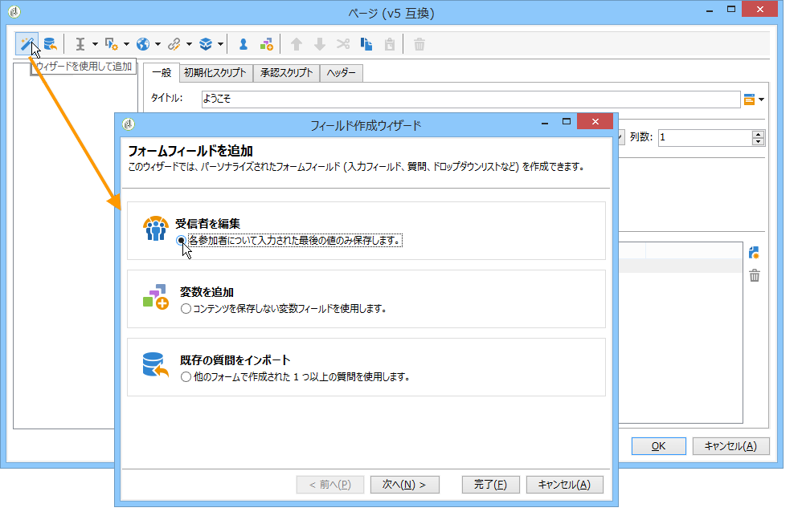

作成するフィールドのタイプを選択します。データベースのフィールドを追加する方法、変数を追加する方法、または別のフォームで作成してコンテナに収集されたフィールドグループをインポートする方法から選択できます。

Click **[!UICONTROL Next]** and select the storage field or variable, or the container you want to import.

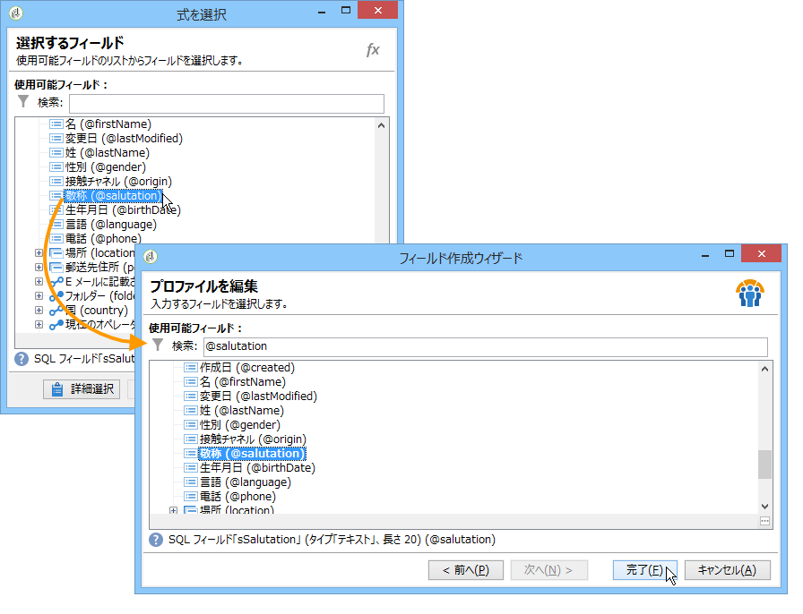

Click **[!UICONTROL Finish]** to insert the selected field into the page.

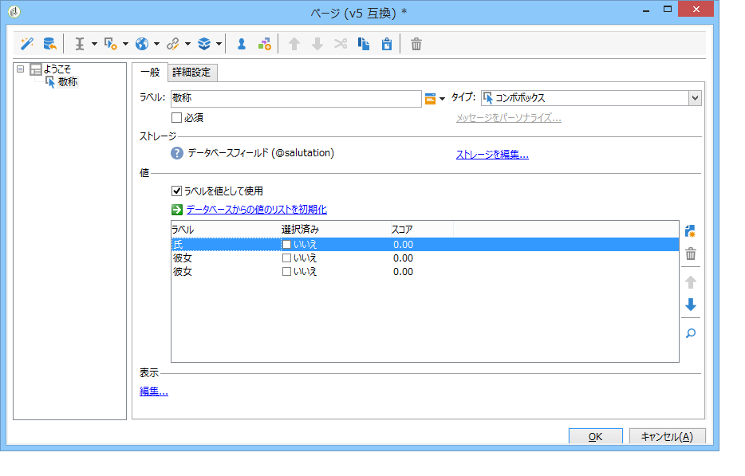

## 入力フィールドの追加 {#adding-input-fields}

To add an input field, click the **[!UICONTROL Input control]** button and choose the type of field you want to add.

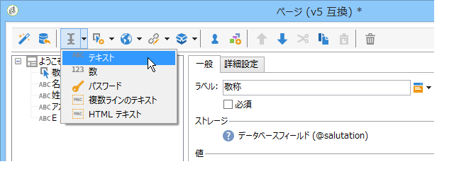

### 入力フィールドのタイプ {#types-of-input-fields}

5 種類のテキストフィールドをフォームページに挿入できます。

* **テキスト**：ユーザーは 1 行にテキストを入力できます。

   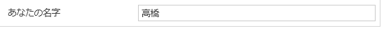

* **数**:1行に数字を入力できます。 for more on this, refer to [Adding numbers](#adding-numbers).

   ページが承認されると、入力された値がフィールドに適合することを確認するために、フィールドコンテンツがチェックされます。詳しくは、「制御設定の定義」を参 [照してください](../../web/using/form-rendering.md#defining-control-settings)。

* **パスワード**：ユーザーは 1 行にテキストを入力できます。テキスト入力中、文字はピリオドで置き換えられます。

   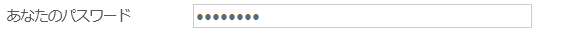

   >[!CAUTION]
   >
   >パスワードは、データベースに暗号化されずに格納されます。

* **複数ラインテキスト**：ユーザーは複数行にテキストを入力できます。

   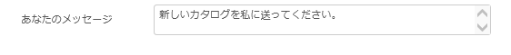

   >[!CAUTION]
   >
   >複数ラインフィールドは、改行を含むことができる特殊なフィールドです。そのストレージスペースは、XML 属性ではなく、XML 要素にマッピングされたフィールドに関連付けられている必要があります。スキーマのデータのタイプについて詳しくは、[この節](../../configuration/using/about-schema-reference.md)の「スキーマリファレンス」の章を参照してください。
   >   
   >**調査**&#x200B;モジュールを使用している場合、このタイプのフィールドを、アーカイブされたフィールドに格納できます。アーカイブされたフィールドは、自動的にその形式に適応します。詳しくは、[この節](../../web/using/about-surveys.md)を参照してください。

* **エンリッチメントされた複数ラインテキスト**：ユーザーは HTML 形式で格納されるレイアウトを使用してテキストを入力できます。

   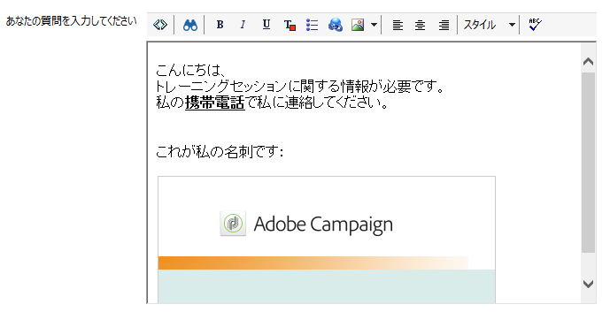

   ユーザーに提供されるエディターのタイプを選択できます。To do this, use the drop-down box of the **[!UICONTROL HTML editor]** field in the **[!UICONTROL Advanced]** tab.

   

   表示されるアイコンの数は、エディターのタイプによって異なります。For an **[!UICONTROL Advanced]** editor, the rendering will be as follows:

   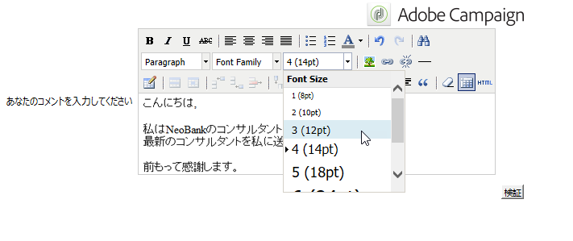

### 入力フィールドの設定 {#configure-input-fields}

入力フィールドは、次のオプションを使用して、すべて同じモードに基づいて設定されます。

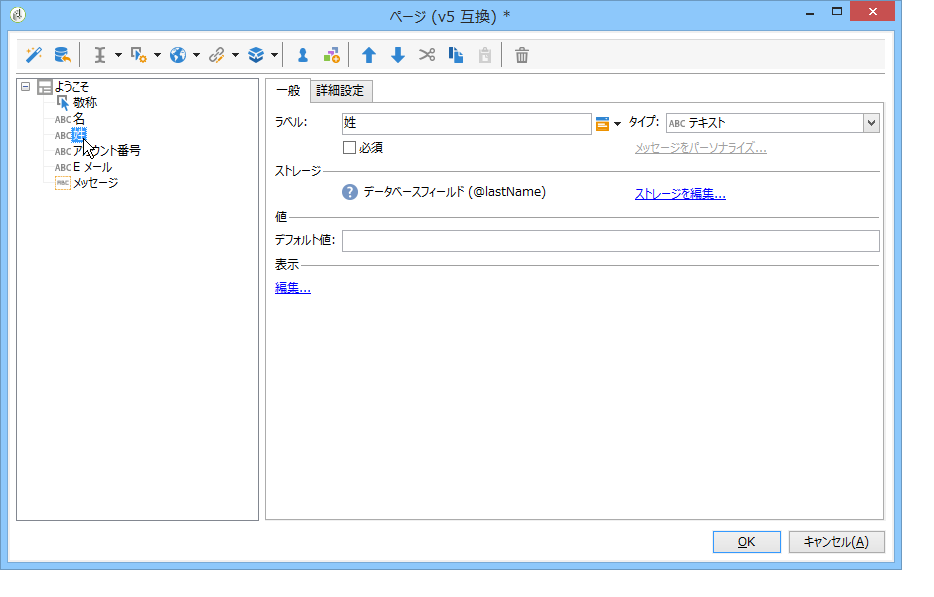

The **[!UICONTROL General]** tab lets you enter the name of the field and attribute a default value to it if necessary.

The answer storage mode can be altered via the **[!UICONTROL Edit storage...]** link. 値は、データベースの既存のフィールドに格納されます。または、情報をデータベースに保存しないように選択することもできます（ローカル変数を使用）。

>[!NOTE]
>
>ストレージ・モードの詳細は、「 [Response storage」フィールドに示されます。](../../web/using/web-forms-answers.md#response-storage-fields)

The **[!UICONTROL Advanced]** tab lets you define display parameters for the field (position of labels, alignment, etc.). See [Defining web forms layout](../../web/using/defining-web-forms-layout.md).

## ドロップダウンリストの追加 {#adding-drop-down-lists}

調査ページにドロップダウンリストを挿入できます。これにより、ユーザーは、ドロップダウンメニューで提供される値を選択できます。

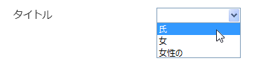

To add a drop-down box to a form page, click the **[!UICONTROL Selection controls > Drop-down list]** button in the toolbar of the page editor.

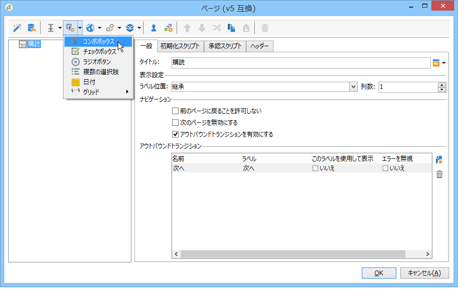

回答ストレージモードを選択して、選択内容を確認します。

Define the labels and values of the list in the lower section of the **[!UICONTROL General]** tab. If the information is stored in an existing field of the database and it is an enumeration field, you can fill in the values automatically by clicking **[!UICONTROL Initialize the list of values from the database]** , as shown below:

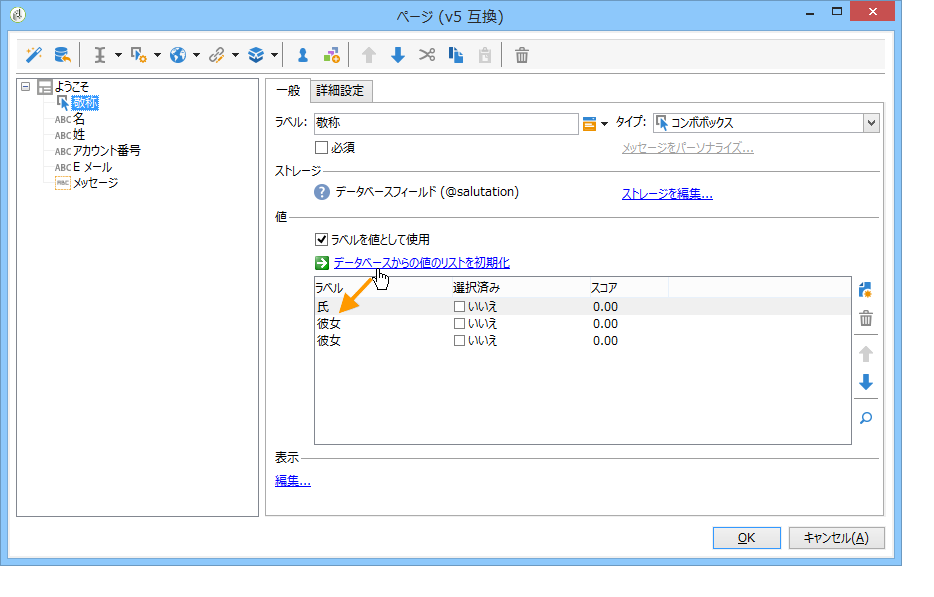

>[!NOTE]
>
>値のリストの右側の矢印を使用して、順序を変更します。

リンクされたテーブルにデータが格納されている場合、リストに候補として提示される値が保存されたフィールドを選択できます。例えば、国の表を選択した場合は、をクリックし、目的の **[!UICONTROL Initialize the list of values from the database...]** フィールドを選択します。

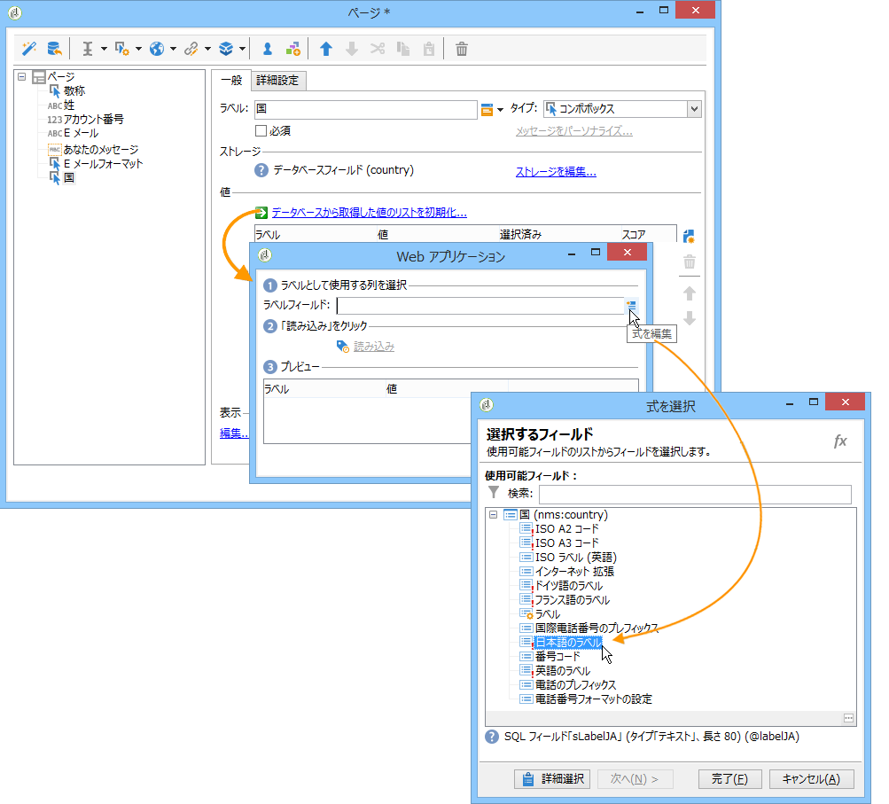

Next, click the **[!UICONTROL Load]** link to retrieve the values:

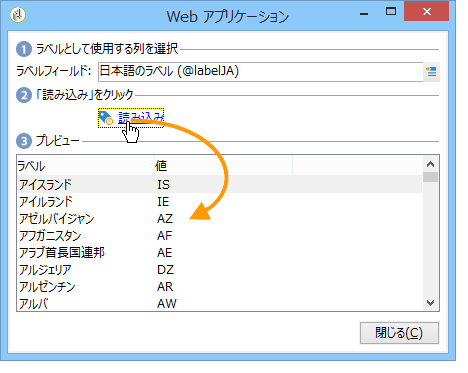

>[!CAUTION]
>
>リストが更新されたら、この操作を繰り返して、オファーの値を更新します。

## チェックボックスの追加 {#adding-checkboxes}

ユーザーがオプションを選択するには、チェックボックスを使用する必要があります。

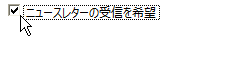

To add a checkbox to a form, click the **[!UICONTROL Selection controls > Checkbox...]** icon in the toolbar of the page editor.

回答ストレージモードを選択して、選択内容を確認します。

Enter the label of the box in the **[!UICONTROL Label]** field of the **[!UICONTROL General]** tab.

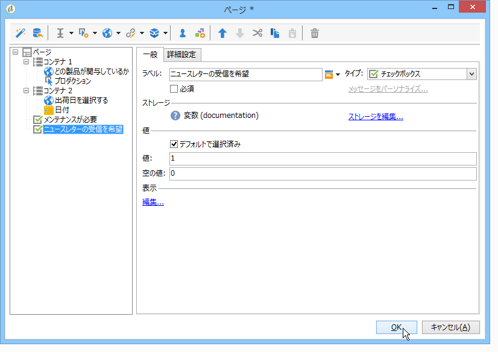

チェックボックスを使用すると、ボックスがチェックされているかどうかに応じて、ストレージフィールド（または値）に値を割り当てることができます。The **[!UICONTROL Values]** section lets you enter the value to assign if the box is checked (in the **[!UICONTROL Value]** field), and the value to assign if it is not checked (in the **[!UICONTROL Empty value]** field). これらの値は、データストレージ形式によって異なります。

ストレージフィールド（または変数）がブール値の場合、ボックスがチェックされていない場合に割り当てる値は、自動的に推測されます。In this case, only the **[!UICONTROL Value if checked]** field is offered, as shown below:

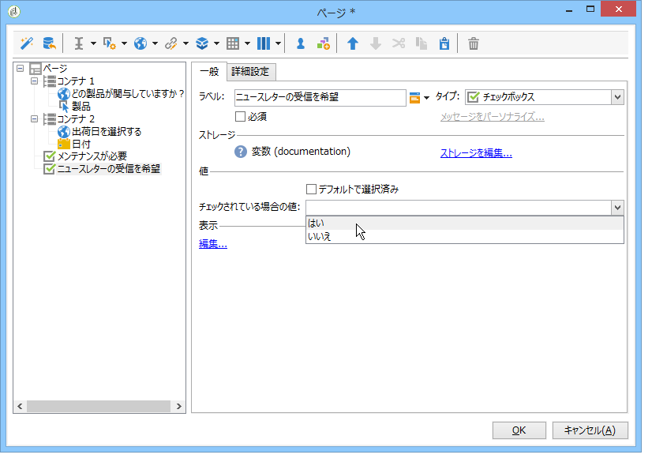

## Example: Assign a value to a field if a box is checked {#example--assign-a-value-to-a-field-if-a-box-is-checked}

次に示すように、メンテナンスリクエストを送信するために、フォームにチェックボックスを挿入します。

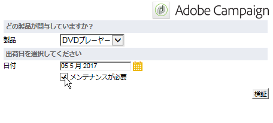

The information will be uploaded to the database and into an existing field (in this case, the **[!UICONTROL Comment]** field):

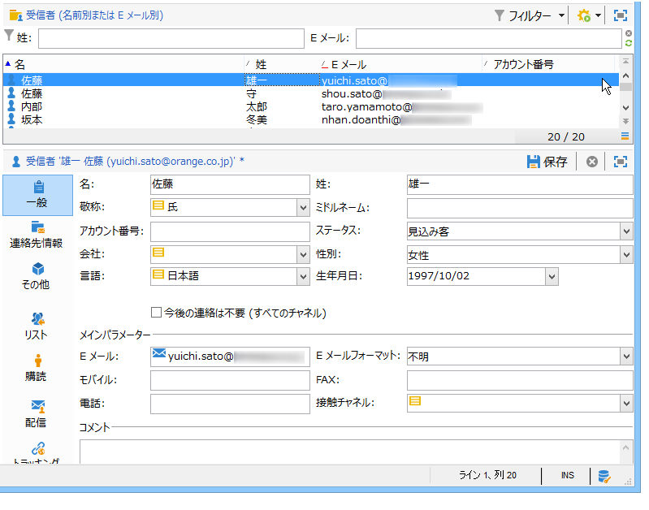

If the &quot;Maintenance required&quot; box is checked, the **[!UICONTROL Comment]** column will contain &quot;Maintenance required&quot;. ボックスがチェックされていない場合、この列には「メンテナンスは不要」と表示されます。この結果を得るには、フォームページ上のチェックボックスに対して、次の設定を適用します。

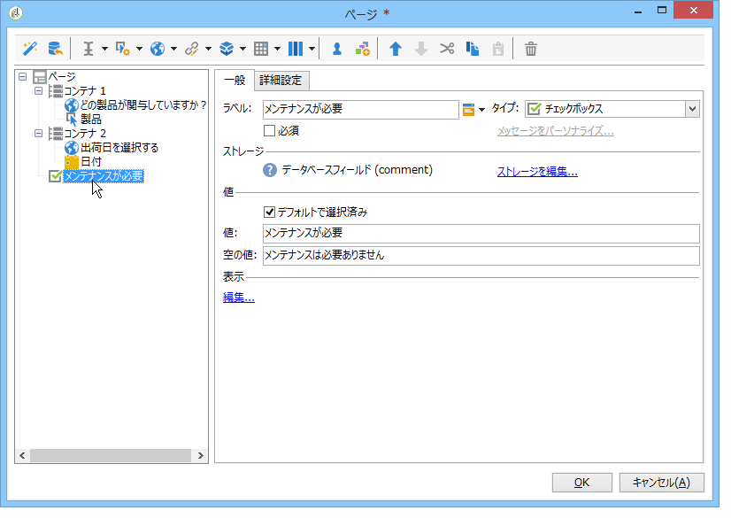

## ラジオボタンの追加 {#adding-radio-buttons}

ラジオボタンを使用すると、一連の排他的な選択オプションをユーザーに提供できます。同じフィールドに異なる値があります。

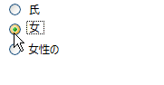

ラジオボタンを個別に作成（ユニットボタン）したり、複数選択リストを使用して作成できますが、ラジオボタンの要点はいずれか 1 つのオプションを選択することなので、単一のボタンのみではなく、常に少なくとも 2 つのラジオボタンを作成します。

>[!CAUTION]
>
>強制的に選択するには、複数選択リストを作成する必要があります。

### 単一ボタンの追加 {#add-single-buttons}

To add a radio button to a form page, go to the **[!UICONTROL Selection controls > Radio button]** menu in the toolbar of the page editor and choose a storage mode.

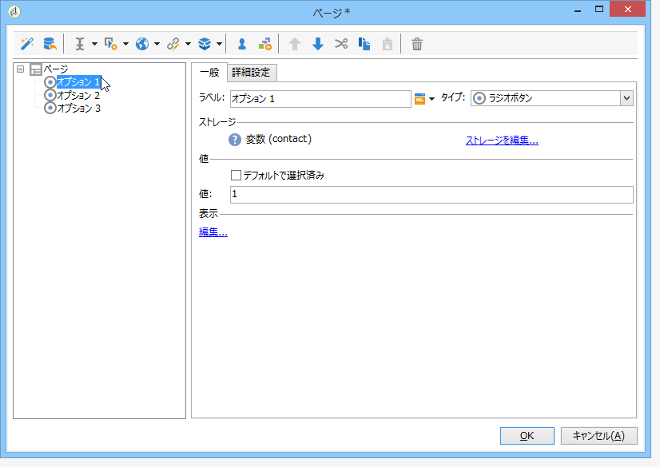

Radio buttons are configured in a similar way to checkboxes (see [Adding checkboxes](#adding-checkboxes)). ただし、オプションが選択されていない場合、値は割り当てられません。いくつかのボタンを相互依存させるには、つまり、1 つを選択することでその他を自動的に選択解除するには、同じフィールドに格納する必要があります。データベースに格納されていない場合、一時的なストレージとして同じローカル変数が使用される必要があります。「応答のスト [レージフィールド」を参照してくださ](../../web/using/web-forms-answers.md#response-storage-fields)い。

### Add a list of buttons {#add-a-list-of-buttons}

To add radio buttons via a list, go to the **[!UICONTROL Selection controls>Multiple choice]** menu in the toolbar of the page editor.

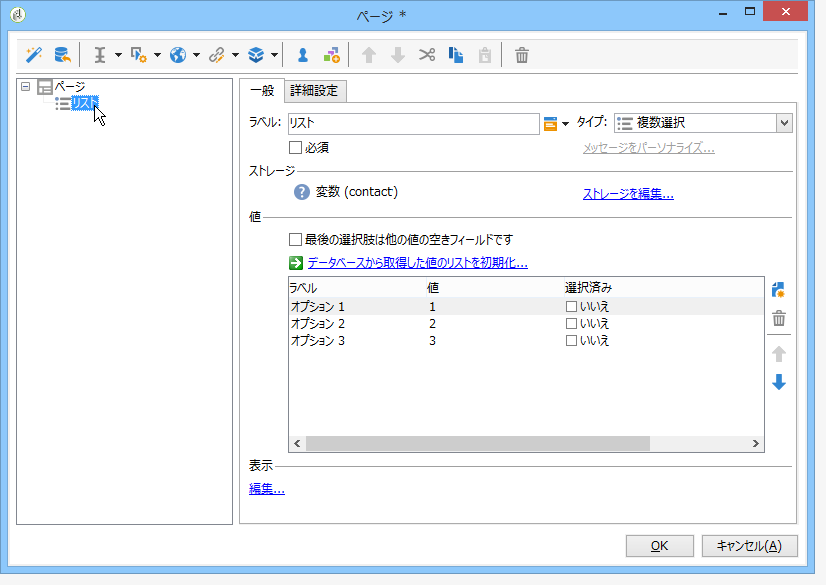

ラベルと同じ数のラジオボタンを追加します。この機能の利点は、既存のフィールドから値をインポートできる（項目別フィールドの場合）ことと、ユーザーに 1 つのオプションを選択させることができることです。ただし、ボタンのレイアウトにはあまり柔軟性がありません。

>[!NOTE]
>
>Web フォームは、いくつかの値の選択を承認しません。複数選択は、**調査**&#x200B;タイプのフォームでのみ有効化できます。詳しくは、[この節](../../web/using/about-surveys.md)を参照してください。\
>It is possible, however, to insert a **[!UICONTROL Multiple choice]** type field into a Web application; but without authorizing the selection of several values: the options offered can be selected using radio buttons.

## グリッドの追加 {#adding-grids}

グリッドは、Web アプリケーションの投票ページをデザインするために使用されます。これにより、次に示すように、調査または評価タイプの Web フォームに回答するためのラジオボタンのリストを提供できます。

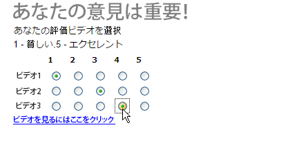

このタイプの要素をフォームで使用するには、シンプルグリッドを作成して、評価される各要素のための線を追加します。

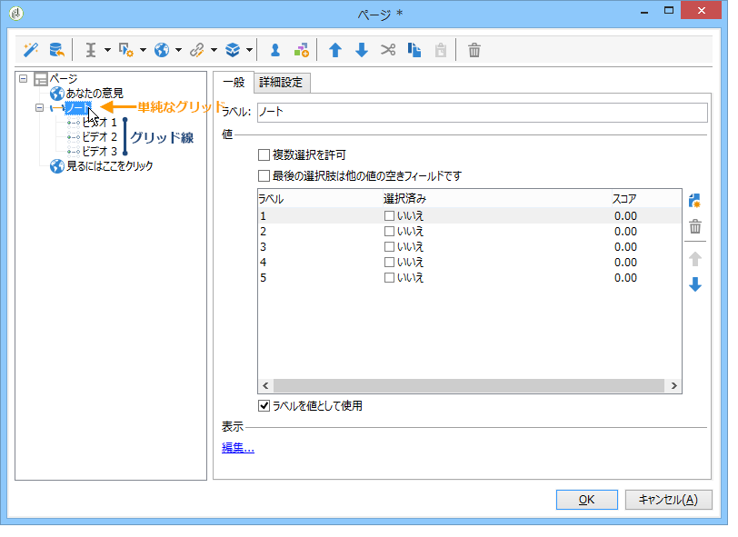

グリッドの各線のラジオボタンの数は、シンプルグリッドで定義された値に一致します。

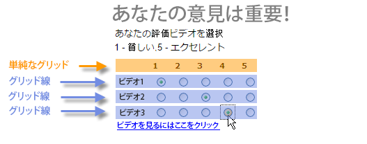

グリッド線あたり 1 つのオプションのみ選択できます。

>[!NOTE]
>
>この例では、グリッドのラベルは非表示です。これを行うには、タブに移動し **[!UICONTROL Advanced]** ます。表示 **[!UICONTROL Label position]** は、のように定義されま **[!UICONTROL Hidden]** す。 See [Defining the position of labels](../../web/using/defining-web-forms-layout.md#defining-the-position-of-labels).

## 日付と数値の追加 {#adding-dates-and-numbers}

フォームフィールドのコンテンツは、データベースに格納されたデータに一致するように書式設定したり、特定の要件を満たすように書式設定したりできます。数値および日付の入力に適したフィールドを作成できます。

### 日付の追加 {#adding-dates}

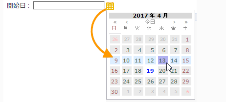

To allow the user to enter a date in a form page, select **[!UICONTROL Add input field > Date...]** in the toolbar or page editor.

フィールドのラベルを入力し、データストレージモードを設定します。

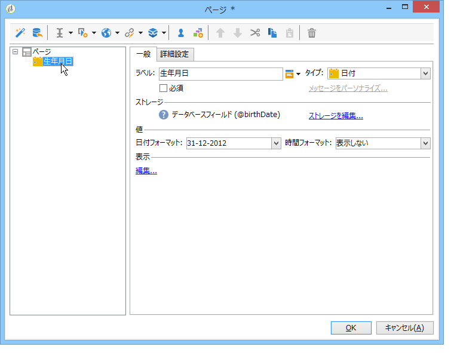

ウィンドウの下部のセクションでは、このフィールドに格納される値の日付および時間の形式を選択できます。

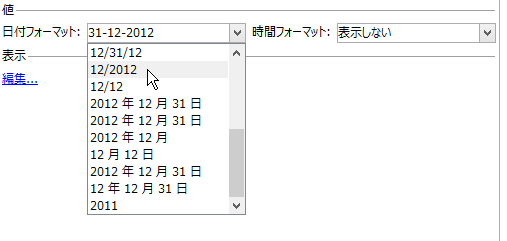

また、日付（または時間）を表示しないように選択することもできます。

日付は、カレンダーまたはドロップダウンボックスを使用して選択できます。また、フィールドに直接入力することもできますが、上の画面で指定した形式に一致させる必要があります。

>[!NOTE]
>
>デフォルトでは、フォームで使用される日付は、カレンダーを使用して入力されます。多言語のフォームの場合、使用するすべての言語でカレンダーが使用できることを確認してください。See [Translating a web form](../../web/using/translating-a-web-form.md).

ただし、（例えば誕生日の入力など）場合によっては、ドロップダウンリストを使用するほうが簡単なことがあります。

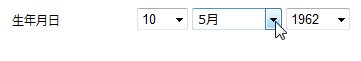

To do this, click the **[!UICONTROL Advanced]** tab and choose the input mode using **[!UICONTROL Drop-down lists]**.

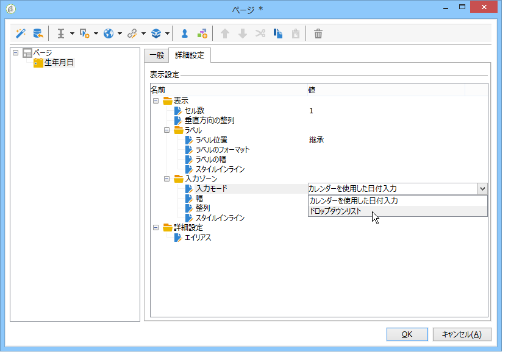

次に、リストに提供される値に対する制限を設定できます。

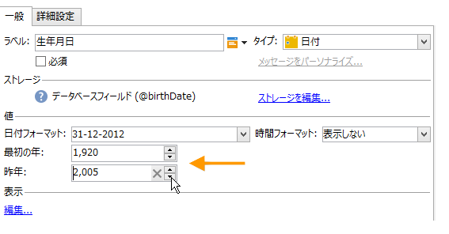

### 数値の追加 {#adding-numbers}

数値の入力に適したフィールドを作成できます。

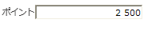

数値フィールドでは、ユーザーは数値のみ入力できます。ページが承認されると、入力コントロールが自動的に適用されます。

データがデータベースに格納されているフィールドに応じて、特別な書式設定または特定の制限が適用されることがあります。また、最大値および最小値を指定することもできます。このタイプのフィールドは、次のように設定されます。

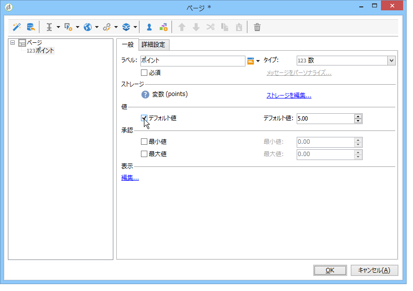

デフォルト値は、フォームがパブリッシュされる際にフィールドに表示される値です。ユーザーはデフォルト値を変更できます。

You can add a prefix and/or suffix to the numeric field via the **[!UICONTROL Advanced]** tab, as shown below:

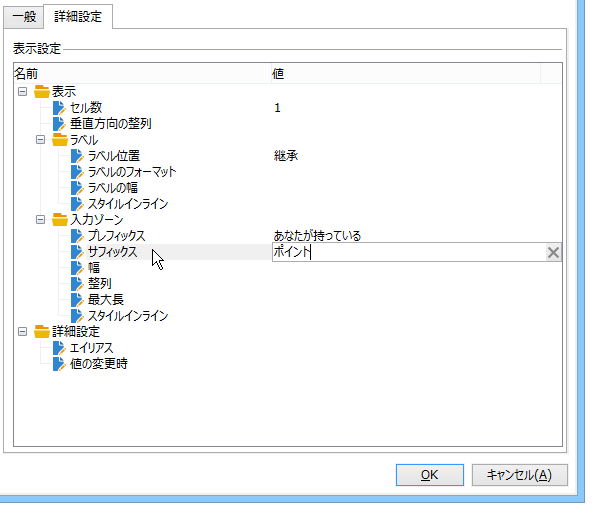

フォームでは、レンダリングは次のようになります。

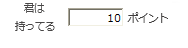

## 購読チェックボックス {#subscription-checkboxes}

ユーザーが 1 つまたは複数の情報サービス（ニュースレター、警告、リアルタイム通知など）を購読または購読解除するためのコントロールを追加できます。購読するには、ユーザーは、対応するサービスをチェックします。

購読のチェックボックスを作成するには、をクリックしま **[!UICONTROL Advanced controls>Subscription]**&#x200B;す。

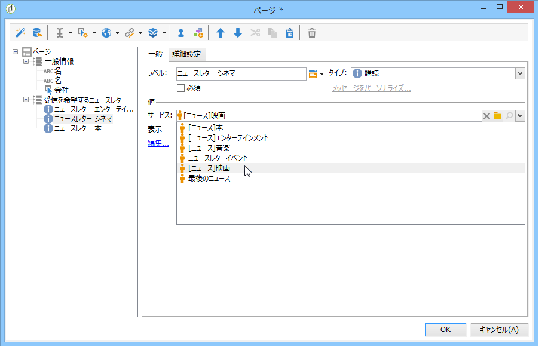

Indicate the label for the checkbox and select the information service concerned using the **[!UICONTROL Service]** drop-down box.

>[!NOTE]
>
>情報サービスについて詳しくは、[このページ](../../delivery/using/managing-subscriptions.md)を参照してください。

ユーザーは、関連するオプションをチェックして、サービスを購読します。

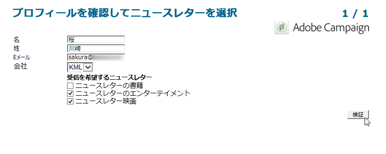

>[!CAUTION]
>
>フォーム承認の際に、ユーザーが既に情報サービスを購読済みで、このサービスにリンクされたボックスがチェックされていない場合、ユーザーは購読解除されます。

購読と紹介の例については、[この節](../../web/using/about-surveys.md)を参照してください。

## Captcha の挿入 {#inserting-a-captcha}

**Captcha** テストの目的は、Web フォームの不正使用を防ぐことにあります。

>[!CAUTION]
>
>フォームにいくつかのページが含まれている場合、セキュリティ対策の回避を防ぐために、Captcha は、常に最後のページの、ストレージボックスの直前に配置されている必要があります。

To insert a Captcha into a form, click the first button on the toolbar and Select **[!UICONTROL Advanced controls>Captcha]**.

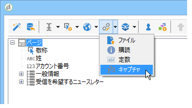

フィールドのラベルを入力します。このラベルは、Captcha 表示領域の前に表示されます。You can change the position of this label in the **[!UICONTROL Advanced]** tab.

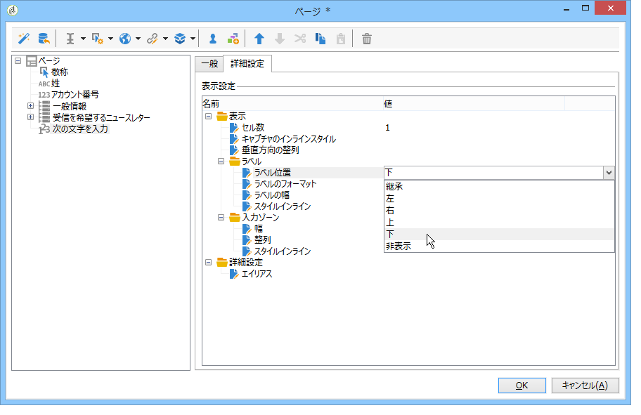

>[!NOTE]
>
>**[!UICONTROL captcha]** タイプのコントロールの場合、ストレージフィールドまたは変数を示す必要はありません。

Captcha は、ビジュアルの下に配置された入力フィールドでページに挿入されます。これらの 2 つの要素は、分離できず、ページレイアウトのための単一の項目とみなされます（これらは単一のセルを占有します）。

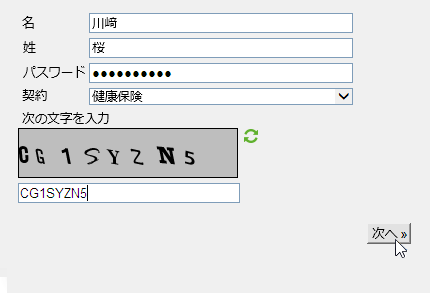

ページが確認される際に、Captcha のコンテンツが適切に入力されなかった場合、入力フィールドが赤で表示されます。

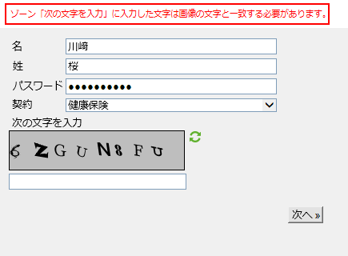

表示するエラーメッセージを作成できます。これを行うには、タブのリ **[!UICONTROL Personalize the message]** ンクを使用し **[!UICONTROL General]** ます。

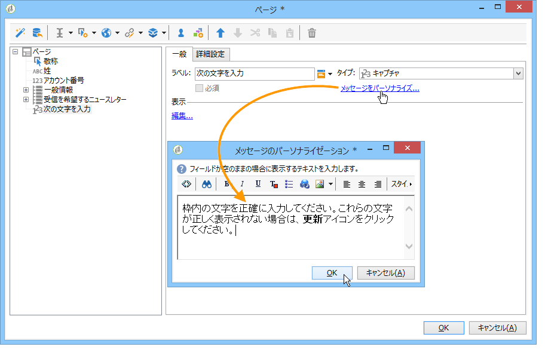

>[!NOTE]
>
>Captcha の長さは常に 8 文字です。この値は修正できません。

## ファイルのアップロード {#uploading-a-file}

アップロードフィールドをページに追加できます。この機能は、イントラネットのファイル共有などに便利です。

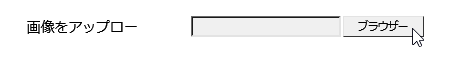

To insert an upload field to a form page, select the **[!UICONTROL Advanced controls > File...]** menu in the toolbar of the page editor.

By default, the uploaded files are stored in resource files accessible via the **[!UICONTROL Resources > Online > Public resources]** menu. この動作は、スクリプトを使用して変更できます。このスクリプトは、[Campaign JSAPI ドキュメント](https://docs.adobe.com/content/help/en/campaign-classic/technicalresources/api/index.html)で定義された関数を使用できます。これには、ファイル操作に関連する関数が含まれます。

ローカル変数またはデータベースフィールドで、これらのファイルにリンクを格納できます。例えば、受信者スキーマを拡張して、ファイルベースのリソースにリンクを追加できます。

>[!CAUTION]
>
>* このタイプのファイルは、（資格情報を使用した）フォームへの安全なアクセス専用です。
>* Adobe Campaign は、アップロードされたリソースのサイズまたはタイプを制御しません。そのため、安全なタイプのイントラネットサイトのみのアップロードフィールドを使用することを強くお勧めします。
>* 複数のサーバーがインスタンスにリンクされている場合（ロードバランシングアーキテクチャ）、Webフォームへの呼び出しが同じサーバーに到達するようにする必要があります。
>* これらの実装には、Adobe Campaign コンサルティングチームの支援が必要です。
>

## 非表示の定数の挿入 {#inserting-a-hidden-constant}

ユーザーがフォームのいずれかのページに移動する際にフィールドをハイライトできます。これをおこなうには、ページに定数を配置し、値とストレージの場所を指定します。

このフィールドは、ユーザーには表示されませんが、ユーザープロファイルのデータをエンリッチメントするために使用できます。

次の例では、ユーザーがこのページを承認するといつでも、受信者プロファイルの **origin** ファイルに自動的に入力されます。定数は、このページには表示されません。

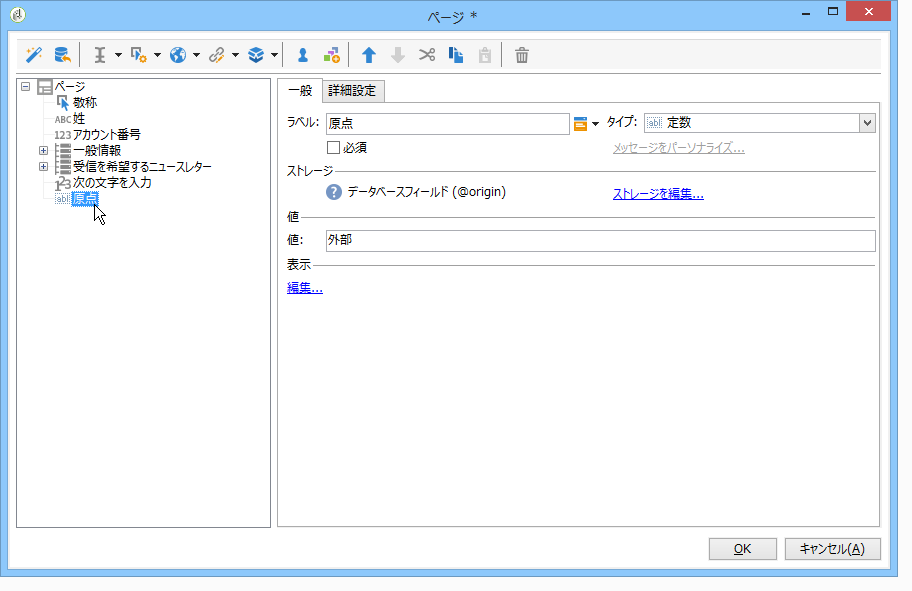

