<?xml version="1.0" encoding="UTF-8"?>
<xliff xmlns="urn:oasis:names:tc:xliff:document:1.2" xmlns:okp="okapi-framework:xliff-extensions" xmlns:its="http://www.w3.org/2005/11/its" xmlns:itsxlf="http://www.w3.org/ns/its-xliff/" version="1.2" its:version="2.0">
<file original="help/web/using/adding-fields-to-a-web-form.md.mdsc" source-language="en-US" target-language="en-XX" datatype="x-text/markdown">
<body>
<trans-unit id="tu186" xml:space="preserve">
<source xml:lang="en-US">https://experienceleague.adobe.com/ja/tools/campaign-api</source>
<target xml:lang="en-XX">https://experienceleague.adobe.com/ja/tools/campaign-api</target>
</trans-unit>
<trans-unit id="tu1" restype="x-YAML_METADATA_HEADER_VALUE" xml:space="preserve">
<source xml:lang="en-US">Add fields to a web form</source>
<target xml:lang="en-XX">web フォームへのフィールドの追加</target>
</trans-unit>
<trans-unit id="tu2" restype="x-YAML_METADATA_HEADER_VALUE" xml:space="preserve">
<source xml:lang="en-US">Add fields to a web form</source>
<target xml:lang="en-XX">web フォームへのフィールドの追加</target>
</trans-unit>
<trans-unit id="tu3" xml:space="preserve">
<source xml:lang="en-US">Also applies to v8</source>
<target xml:lang="en-XX">v8 にも適用されます</target>
</trans-unit>
<trans-unit id="tu4" xml:space="preserve">
<source xml:lang="en-US">Also applies to Campaign v8</source>
<target xml:lang="en-XX">Campaign v8 にも適用されます</target>
</trans-unit>
<trans-unit id="tu5" xml:space="preserve">
<source xml:lang="en-US">Add fields to a web form</source>
<target xml:lang="en-XX">web フォームへのフィールドの追加</target>
</trans-unit>
<trans-unit id="tu6" xml:space="preserve">
<source xml:lang="en-US">In a Web form, fields enable users to enter information and select options. Web forms can offer input fields, selection fields, static and advanced content (captchas, subscriptions, etc.).</source>
<target xml:lang="en-XX">Web フォームのフィールドは、ユーザーによる情報の入力とオプションの選択を可能にします。 Web フォームにより、入力フィールド、選択フィールド、静的コンテンツおよび高度なコンテンツ（Captcha、購読など）を提供できます。</target>
</trans-unit>
<trans-unit id="tu7" xml:space="preserve">
<source xml:lang="en-US">When you use the assistant to add fields, the field type is detected automatically based on the selected field or storage variable. You can edit it using the <ph id="1" ctype="x-STRONG_EMPHASIS">**[!UICONTROL </ph>Type<ph id="3" ctype="x-LINK_REF">]**</ph> drop-down box in the <ph id="5" ctype="x-STRONG_EMPHASIS">**[!UICONTROL </ph>General<ph id="7" ctype="x-LINK_REF">]**</ph> tab.</source>
<target xml:lang="en-XX">アシスタントを使用してフィールドを追加する場合、フィールドタイプは、選択したフィールドまたはストレージ変数に基づいて自動的に検出されます。 「<ph id="5" ctype="x-STRONG_EMPHASIS">**[!UICONTROL </ph>一般<ph id="7" ctype="x-LINK_REF">]**</ph>」タブの<ph id="1" ctype="x-STRONG_EMPHASIS">**[!UICONTROL </ph>タイプ<ph id="3" ctype="x-LINK_REF">]**</ph>ドロップダウンボックスを使用して編集できます。</target>
</trans-unit>
<trans-unit id="tu8" xml:space="preserve">
<source xml:lang="en-US"><ph id="1" ctype="x-IMAGE">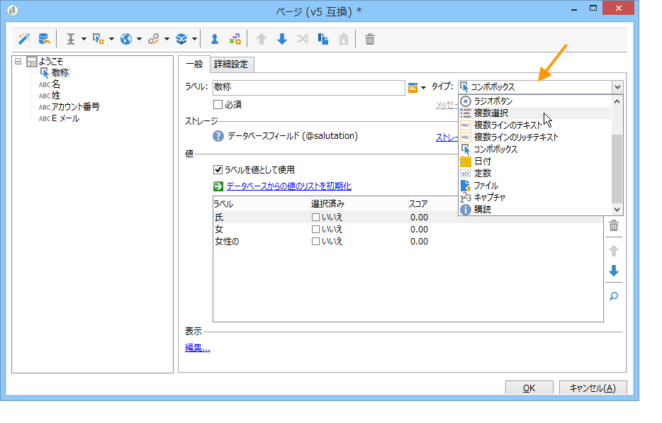</ph></source>
<target xml:lang="en-XX"><ph id="1" ctype="x-IMAGE"></ph></target>
</trans-unit>
<trans-unit id="tu9" xml:space="preserve">
<source xml:lang="en-US">When using the buttons in the toolbar, select the type of field you want to add.</source>
<target xml:lang="en-XX">ツールバーのボタンを使用する場合、追加するフィールドのタイプを選択します。</target>
</trans-unit>
<trans-unit id="tu10" xml:space="preserve">
<source xml:lang="en-US">The following types of field are available:</source>
<target xml:lang="en-XX">次のフィールドのタイプを使用できます。</target>
</trans-unit>
<trans-unit id="tu11" xml:space="preserve">
<source xml:lang="en-US">Text/number input. See <ph id="1" ctype="x-LINK">[</ph>Adding input fields<ph id="2" ctype="x-LINK">](#adding-input-fields)</ph>.</source>
<target xml:lang="en-XX">テキスト／数値入力： <ph id="1" ctype="x-LINK">[</ph>入力フィールドの追加<ph id="2" ctype="x-LINK">](#adding-input-fields)</ph>を参照してください。</target>
</trans-unit>
<trans-unit id="tu12" xml:space="preserve">
<source xml:lang="en-US">Drop-down list selection. See <ph id="1" ctype="x-LINK">[</ph>Adding drop-down lists<ph id="2" ctype="x-LINK">](#adding-drop-down-lists)</ph>.</source>
<target xml:lang="en-XX">ドロップダウンリストの選択： <ph id="1" ctype="x-LINK">[</ph>ドロップダウンリストの追加<ph id="2" ctype="x-LINK">](#adding-drop-down-lists)</ph>を参照してください。</target>
</trans-unit>
<trans-unit id="tu13" xml:space="preserve">
<source xml:lang="en-US">Multiple choice via checkboxes. See <ph id="1" ctype="x-LINK">[</ph>Adding checkboxes<ph id="2" ctype="x-LINK">](#adding-checkboxes)</ph>.</source>
<target xml:lang="en-XX">チェックボックスを使用した複数選択： <ph id="1" ctype="x-LINK">[</ph>チェックボックスの追加<ph id="2" ctype="x-LINK">](#adding-checkboxes)</ph>を参照してください。</target>
</trans-unit>
<trans-unit id="tu14" xml:space="preserve">
<source xml:lang="en-US">Exclusive selection via radio buttons. See <ph id="1" ctype="x-LINK">[</ph>Adding radio buttons<ph id="2" ctype="x-LINK">](#adding-radio-buttons)</ph>.</source>
<target xml:lang="en-XX">ラジオボタンを使用した排他的な選択： <ph id="1" ctype="x-LINK">[</ph>ラジオボタンの追加<ph id="2" ctype="x-LINK">](#adding-radio-buttons)</ph>を参照してください。</target>
</trans-unit>
<trans-unit id="tu15" xml:space="preserve">
<source xml:lang="en-US">Vote in an option grid. See <ph id="1" ctype="x-LINK">[</ph>Adding grids<ph id="2" ctype="x-LINK">](#adding-grids)</ph>.</source>
<target xml:lang="en-XX">オプショングリッドでの投票： <ph id="1" ctype="x-LINK">[</ph>グリッドの追加<ph id="2" ctype="x-LINK">](#adding-grids)</ph>を参照してください。</target>
</trans-unit>
<trans-unit id="tu16" xml:space="preserve">
<source xml:lang="en-US">Numbers and dates. See <ph id="1" ctype="x-LINK">[</ph>Adding dates and numbers<ph id="2" ctype="x-LINK">](#adding-dates-and-numbers)</ph>.</source>
<target xml:lang="en-XX">数値と日付： <ph id="1" ctype="x-LINK">[</ph>日付と数値の追加<ph id="2" ctype="x-LINK">](#adding-dates-and-numbers)</ph>を参照してください。</target>
</trans-unit>
<trans-unit id="tu17" xml:space="preserve">
<source xml:lang="en-US">Subscription/unsubscription to an information service. See <ph id="1" ctype="x-LINK">[</ph>Subscription checkboxes<ph id="2" ctype="x-LINK">](#subscription-checkboxes)</ph>.</source>
<target xml:lang="en-XX">情報サービスの購読／購読解除： <ph id="1" ctype="x-LINK">[</ph>購読チェックボックス<ph id="2" ctype="x-LINK">](#subscription-checkboxes)</ph>を参照してください。</target>
</trans-unit>
<trans-unit id="tu18" xml:space="preserve">
<source xml:lang="en-US">Captcha validation. See <ph id="1" ctype="x-LINK">[</ph>Inserting a captcha<ph id="2" ctype="x-LINK">](#inserting-a-captcha)</ph>.</source>
<target xml:lang="en-XX">キャプチャの検証： <ph id="1" ctype="x-LINK">[</ph>キャプチャの挿入<ph id="2" ctype="x-LINK">](#inserting-a-captcha)</ph>を参照してください。</target>
</trans-unit>
<trans-unit id="tu19" xml:space="preserve">
<source xml:lang="en-US">Download button. <ph id="1" ctype="x-LINK">[</ph>Uploading a file<ph id="2" ctype="x-LINK">](#uploading-a-file)</ph>.</source>
<target xml:lang="en-XX">ダウンロードボタン： <ph id="1" ctype="x-LINK">[</ph>ファイルのアップロード<ph id="2" ctype="x-LINK">](#uploading-a-file)</ph>を参照してください。</target>
</trans-unit>
<trans-unit id="tu20" xml:space="preserve">
<source xml:lang="en-US">Hidden constant. See <ph id="1" ctype="x-LINK">[</ph>Inserting a hidden constant<ph id="2" ctype="x-LINK">](#inserting-a-hidden-constant)</ph>.</source>
<target xml:lang="en-XX">非表示の定数： <ph id="1" ctype="x-LINK">[</ph>非表示の定数の挿入<ph id="2" ctype="x-LINK">](#inserting-a-hidden-constant)</ph>を参照してください。</target>
</trans-unit>
<trans-unit id="tu21" xml:space="preserve">
<source xml:lang="en-US">Please specify the response storage mode: update a field in the database (stores only the last value saved) or store in a variable (the answer is not stored). For more on this, refer to <ph id="1" ctype="x-LINK">[</ph>Response storage fields<ph id="2" ctype="x-LINK">](web-forms-answers.md#response-storage-fields)</ph>.</source>
<target xml:lang="en-XX">回答ストレージモード（データベースのフィールドを更新する（最後に保存した値のみ格納）か、変数に格納する（回答は格納されない））を指定してください。 詳しくは、<ph id="1" ctype="x-LINK">[</ph>回答ストレージフィールド<ph id="2" ctype="x-LINK">](web-forms-answers.md#response-storage-fields)</ph>を参照してください。</target>
</trans-unit>
<trans-unit id="tu22" xml:space="preserve">
<source xml:lang="en-US"><ph id="1" ctype="x-regxph" equiv-text="&lbrack;!NOTE">[!NOTE]</ph></source>
<target xml:lang="en-XX"><ph id="1" ctype="x-regxph" equiv-text="&lbrack;!NOTE">[!NOTE]</ph></target>
</trans-unit>
<trans-unit id="tu23" xml:space="preserve">
<source xml:lang="en-US">By default, the field is inserted at the bottom of the current tree. Use the arrows in the toolbar to move it up or down.</source>
<target xml:lang="en-XX">デフォルトでは、フィールドは、現在のツリーの下部に挿入されます。 ツールバーの矢印を使用して上下に移動します。</target>
</trans-unit>
<trans-unit id="tu24" xml:space="preserve">
<source xml:lang="en-US">Field creation assistant</source>
<target xml:lang="en-XX">フィールド作成アシスタント</target>
</trans-unit>
<trans-unit id="tu25" xml:space="preserve">
<source xml:lang="en-US">For each page of the form, you can add a field via the first button in the toolbar. To do this, go to the <ph id="1" ctype="x-STRONG_EMPHASIS">**[!UICONTROL </ph>Add using the assistant<ph id="3" ctype="x-LINK_REF">]**</ph> menu.</source>
<target xml:lang="en-XX">フォームの各ページで、ツールバーの最初のボタンを使用してフィールドを追加できます。 これを行うには、<ph id="1" ctype="x-STRONG_EMPHASIS">**[!UICONTROL </ph>アシスタントを使用して追加<ph id="3" ctype="x-LINK_REF">]**</ph>メニューに移動します。</target>
</trans-unit>
<trans-unit id="tu26" xml:space="preserve">
<source xml:lang="en-US"><ph id="1" ctype="x-IMAGE">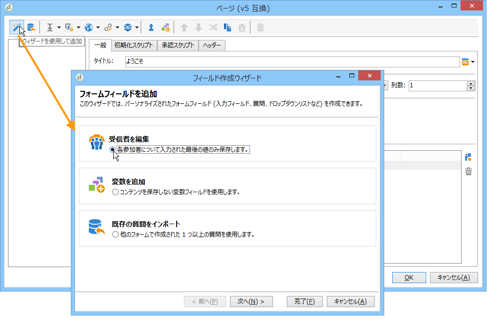</ph></source>
<target xml:lang="en-XX"><ph id="1" ctype="x-IMAGE"></ph></target>
</trans-unit>
<trans-unit id="tu27" xml:space="preserve">
<source xml:lang="en-US">Select the type of field you want to create: you can choose to add a field in the database, a variable or to import a group of fields created in another form and collected in a container.</source>
<target xml:lang="en-XX">作成するフィールドのタイプを選択します。データベースのフィールドを追加する方法、変数を追加する方法、または別のフォームで作成してコンテナに収集されたフィールドグループをインポートする方法から選択できます。</target>
</trans-unit>
<trans-unit id="tu28" xml:space="preserve">
<source xml:lang="en-US">Click <ph id="1" ctype="x-STRONG_EMPHASIS">**[!UICONTROL </ph>Next<ph id="3" ctype="x-LINK_REF">]**</ph> and select the storage field or variable, or the container you want to import.</source>
<target xml:lang="en-XX">「<ph id="1" ctype="x-STRONG_EMPHASIS">**[!UICONTROL </ph>次へ<ph id="3" ctype="x-LINK_REF">]**</ph>」をクリックし、ストレージフィールド、変数、またはインポートするコンテナを選択します。</target>
</trans-unit>
<trans-unit id="tu29" xml:space="preserve">
<source xml:lang="en-US"><ph id="1" ctype="x-IMAGE">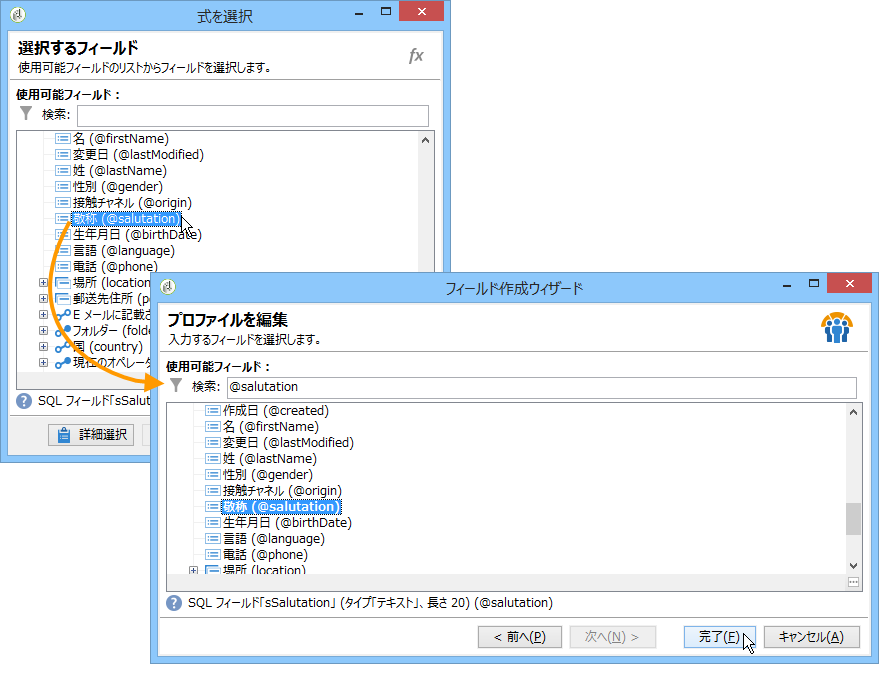</ph></source>
<target xml:lang="en-XX"><ph id="1" ctype="x-IMAGE"></ph></target>
</trans-unit>
<trans-unit id="tu30" xml:space="preserve">
<source xml:lang="en-US">Click <ph id="1" ctype="x-STRONG_EMPHASIS">**[!UICONTROL </ph>Finish<ph id="3" ctype="x-LINK_REF">]**</ph> to insert the selected field into the page.</source>
<target xml:lang="en-XX">「<ph id="1" ctype="x-STRONG_EMPHASIS">**[!UICONTROL </ph>完了<ph id="3" ctype="x-LINK_REF">]**</ph>」をクリックして、選択したフィールドをページに挿入します。</target>
</trans-unit>
<trans-unit id="tu31" xml:space="preserve">
<source xml:lang="en-US"><ph id="1" ctype="x-IMAGE">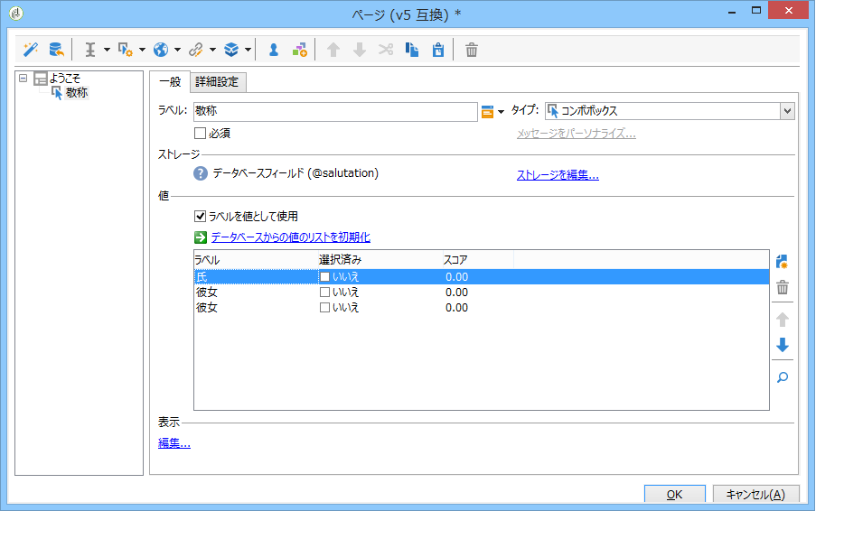</ph></source>
<target xml:lang="en-XX"><ph id="1" ctype="x-IMAGE"></ph></target>
</trans-unit>
<trans-unit id="tu32" xml:space="preserve">
<source xml:lang="en-US">Adding input fields</source>
<target xml:lang="en-XX">入力フィールドの追加</target>
</trans-unit>
<trans-unit id="tu33" xml:space="preserve">
<source xml:lang="en-US">To add an input field, click the <ph id="1" ctype="x-STRONG_EMPHASIS">**[!UICONTROL </ph>Input control<ph id="3" ctype="x-LINK_REF">]**</ph> button and choose the type of field you want to add.</source>
<target xml:lang="en-XX">入力フィールドを追加するには、「<ph id="1" ctype="x-STRONG_EMPHASIS">**[!UICONTROL </ph>入力コントロール<ph id="3" ctype="x-LINK_REF">]**</ph>」ボタンをクリックし、追加するフィールドのタイプを選択します。</target>
</trans-unit>
<trans-unit id="tu34" xml:space="preserve">
<source xml:lang="en-US"><ph id="1" ctype="x-IMAGE">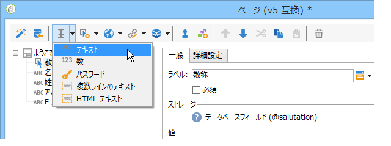</ph></source>
<target xml:lang="en-XX"><ph id="1" ctype="x-IMAGE"></ph></target>
</trans-unit>
<trans-unit id="tu35" xml:space="preserve">
<source xml:lang="en-US">Types of input fields</source>
<target xml:lang="en-XX">入力フィールドのタイプ</target>
</trans-unit>
<trans-unit id="tu36" xml:space="preserve">
<source xml:lang="en-US">Five different types of text fields can be inserted into a form page:</source>
<target xml:lang="en-XX">5 種類のテキストフィールドをフォームページに挿入できます。</target>
</trans-unit>
<trans-unit id="tu37" xml:space="preserve">
<source xml:lang="en-US"><ph id="1" ctype="x-STRONG_EMPHASIS">**</ph>Text<ph id="2" ctype="x-STRONG_EMPHASIS">**</ph>: lets the user enter a text on one line.</source>
<target xml:lang="en-XX"><ph id="1" ctype="x-STRONG_EMPHASIS">**</ph>テキスト<ph id="2" ctype="x-STRONG_EMPHASIS">**</ph>：ユーザーは 1 行にテキストを入力できます。</target>
</trans-unit>
<trans-unit id="tu38" xml:space="preserve">
<source xml:lang="en-US"><ph id="1" ctype="x-IMAGE">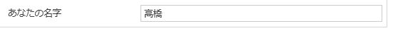</ph></source>
<target xml:lang="en-XX"><ph id="1" ctype="x-IMAGE"></ph></target>
</trans-unit>
<trans-unit id="tu39" xml:space="preserve">
<source xml:lang="en-US"><ph id="1" ctype="x-STRONG_EMPHASIS">**</ph>Number<ph id="2" ctype="x-STRONG_EMPHASIS">**</ph>: lets the user enter a number on one line. for more on this, refer to <ph id="3" ctype="x-LINK">[</ph>Adding numbers<ph id="4" ctype="x-LINK">](#adding-numbers)</ph>.</source>
<target xml:lang="en-XX"><ph id="1" ctype="x-STRONG_EMPHASIS">**</ph>数値<ph id="2" ctype="x-STRONG_EMPHASIS">**</ph>：ユーザーは 1 行に数値を入力できます。 詳しくは、<ph id="3" ctype="x-LINK">[</ph>数値の追加<ph id="4" ctype="x-LINK">](#adding-numbers)</ph>を参照してください。</target>
</trans-unit>
<trans-unit id="tu40" xml:space="preserve">
<source xml:lang="en-US">When the page is approved, field content is checked to make sure the value entered is compatible with the field. For more on this, refer to <ph id="1" ctype="x-LINK">[</ph>Defining control settings<ph id="2" ctype="x-LINK">](form-rendering.md#defining-control-settings)</ph>.</source>
<target xml:lang="en-XX">ページが承認されると、入力された値がフィールドに適合することを確認するために、フィールドコンテンツがチェックされます。 詳しくは、<ph id="1" ctype="x-LINK">[</ph>コントロール設定の定義<ph id="2" ctype="x-LINK">](form-rendering.md#defining-control-settings)</ph>を参照してください。</target>
</trans-unit>
<trans-unit id="tu41" xml:space="preserve">
<source xml:lang="en-US"><ph id="1" ctype="x-STRONG_EMPHASIS">**</ph>Password<ph id="2" ctype="x-STRONG_EMPHASIS">**</ph>: lets the user enter text on a single line. During text entry, the characters are replaced by periods:</source>
<target xml:lang="en-XX"><ph id="1" ctype="x-STRONG_EMPHASIS">**</ph>パスワード<ph id="2" ctype="x-STRONG_EMPHASIS">**</ph>：ユーザーは 1 行にテキストを入力できます。 テキスト入力中、文字はピリオドで置き換えられます。</target>
</trans-unit>
<trans-unit id="tu42" xml:space="preserve">
<source xml:lang="en-US"><ph id="1" ctype="x-IMAGE">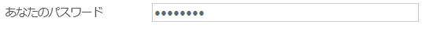</ph></source>
<target xml:lang="en-XX"><ph id="1" ctype="x-IMAGE"></ph></target>
</trans-unit>
<trans-unit id="tu43" xml:space="preserve">
<source xml:lang="en-US"><ph id="1" ctype="x-regxph" equiv-text="&lbrack;!CAUTION">[!CAUTION]</ph></source>
<target xml:lang="en-XX"><ph id="1" ctype="x-regxph" equiv-text="&lbrack;!CAUTION">[!CAUTION]</ph></target>
</trans-unit>
<trans-unit id="tu44" xml:space="preserve">
<source xml:lang="en-US">Passwords are stored unencrypted in the database.</source>
<target xml:lang="en-XX">パスワードは、データベースに暗号化されずに格納されます。</target>
</trans-unit>
<trans-unit id="tu45" xml:space="preserve">
<source xml:lang="en-US"><ph id="1" ctype="x-STRONG_EMPHASIS">**</ph>Multi-line text<ph id="2" ctype="x-STRONG_EMPHASIS">**</ph>: lets the user enter text on several lines.</source>
<target xml:lang="en-XX"><ph id="1" ctype="x-STRONG_EMPHASIS">**</ph>複数ラインテキスト<ph id="2" ctype="x-STRONG_EMPHASIS">**</ph>：ユーザーは複数行にテキストを入力できます。</target>
</trans-unit>
<trans-unit id="tu46" xml:space="preserve">
<source xml:lang="en-US"><ph id="1" ctype="x-IMAGE">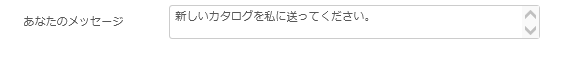</ph></source>
<target xml:lang="en-XX"><ph id="1" ctype="x-IMAGE"></ph></target>
</trans-unit>
<trans-unit id="tu47" xml:space="preserve">
<source xml:lang="en-US"><ph id="1" ctype="x-regxph" equiv-text="&lbrack;!CAUTION">[!CAUTION]</ph></source>
<target xml:lang="en-XX"><ph id="1" ctype="x-regxph" equiv-text="&lbrack;!CAUTION">[!CAUTION]</ph></target>
</trans-unit>
<trans-unit id="tu48" xml:space="preserve">
<source xml:lang="en-US">Multi-line text fields are specific fields that can contain carriage returns. Their storage space must be associated with a field mapped on an XML element, not an XML attribute.</source>
<target xml:lang="en-XX">複数ラインフィールドは、改行を含むことができる特殊なフィールドです。 そのストレージスペースは、XML 属性ではなく、XML 要素にマッピングされたフィールドに関連付けられている必要があります。</target>
</trans-unit>
<trans-unit id="tu49" xml:space="preserve">
<source xml:lang="en-US"><ph id="1" ctype="x-STRONG_EMPHASIS">**</ph>Enriched multi-line text<ph id="2" ctype="x-STRONG_EMPHASIS">**</ph>: lets the user enter text with a layout which will be stored in HTML format.</source>
<target xml:lang="en-XX"><ph id="1" ctype="x-STRONG_EMPHASIS">**</ph>エンリッチメントされた複数ラインテキスト<ph id="2" ctype="x-STRONG_EMPHASIS">**</ph>：ユーザーは HTML 形式で格納されるレイアウトを使用してテキストを入力できます。</target>
</trans-unit>
<trans-unit id="tu50" xml:space="preserve">
<source xml:lang="en-US"><ph id="1" ctype="x-IMAGE">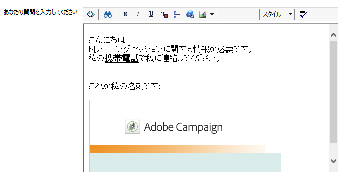</ph></source>
<target xml:lang="en-XX"><ph id="1" ctype="x-IMAGE"></ph></target>
</trans-unit>
<trans-unit id="tu51" xml:space="preserve">
<source xml:lang="en-US">You can select the type of editor offered to users. To do this, use the drop-down box of the <ph id="1" ctype="x-STRONG_EMPHASIS">**[!UICONTROL </ph>HTML editor<ph id="3" ctype="x-LINK_REF">]**</ph> field in the <ph id="5" ctype="x-STRONG_EMPHASIS">**[!UICONTROL </ph>Advanced<ph id="7" ctype="x-LINK_REF">]**</ph> tab.</source>
<target xml:lang="en-XX">ユーザーに提供されるエディターのタイプを選択できます。 これをおこなうには、「<ph id="5" ctype="x-STRONG_EMPHASIS">**[!UICONTROL </ph>詳細設定<ph id="7" ctype="x-LINK_REF">]**</ph>」タブにある「<ph id="1" ctype="x-STRONG_EMPHASIS">**[!UICONTROL </ph>HTML エディター<ph id="3" ctype="x-LINK_REF">]**</ph>」フィールドのドロップダウンボックスを使用します。</target>
</trans-unit>
<trans-unit id="tu52" xml:space="preserve">
<source xml:lang="en-US"><ph id="1" ctype="x-IMAGE">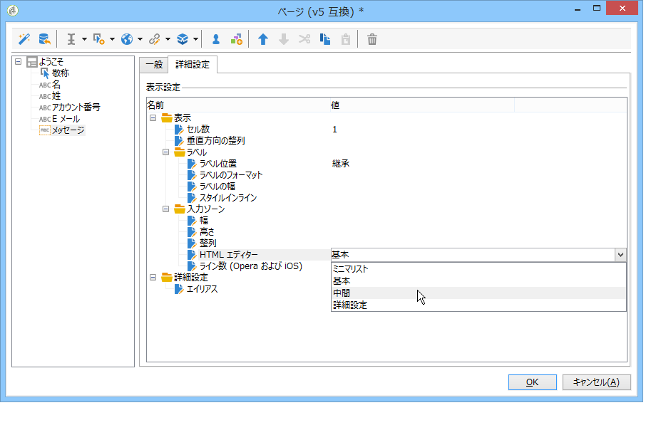</ph></source>
<target xml:lang="en-XX"><ph id="1" ctype="x-IMAGE"></ph></target>
</trans-unit>
<trans-unit id="tu53" xml:space="preserve">
<source xml:lang="en-US">The number of icons displayed varies depending on the type of editor. For an <ph id="1" ctype="x-STRONG_EMPHASIS">**[!UICONTROL </ph>Advanced<ph id="3" ctype="x-LINK_REF">]**</ph> editor, the rendering will be as follows:</source>
<target xml:lang="en-XX">表示されるアイコンの数は、エディターのタイプによって異なります。 <ph id="1" ctype="x-STRONG_EMPHASIS">**[!UICONTROL </ph>詳細設定<ph id="3" ctype="x-LINK_REF">]**</ph>エディターの場合のレンダリングを次に示します。</target>
</trans-unit>
<trans-unit id="tu54" xml:space="preserve">
<source xml:lang="en-US"><ph id="1" ctype="x-IMAGE">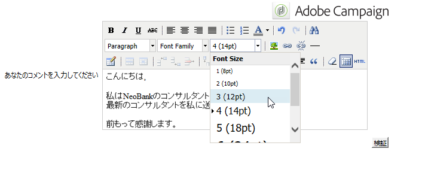</ph></source>
<target xml:lang="en-XX"><ph id="1" ctype="x-IMAGE"></ph></target>
</trans-unit>
<trans-unit id="tu55" xml:space="preserve">
<source xml:lang="en-US">Configure input fields</source>
<target xml:lang="en-XX">入力フィールドの設定</target>
</trans-unit>
<trans-unit id="tu56" xml:space="preserve">
<source xml:lang="en-US">Input fields are all configured based on the same mode, using the following options:</source>
<target xml:lang="en-XX">入力フィールドは、次のオプションを使用して、すべて同じモードに基づいて設定されます。</target>
</trans-unit>
<trans-unit id="tu57" xml:space="preserve">
<source xml:lang="en-US"><ph id="1" ctype="x-IMAGE">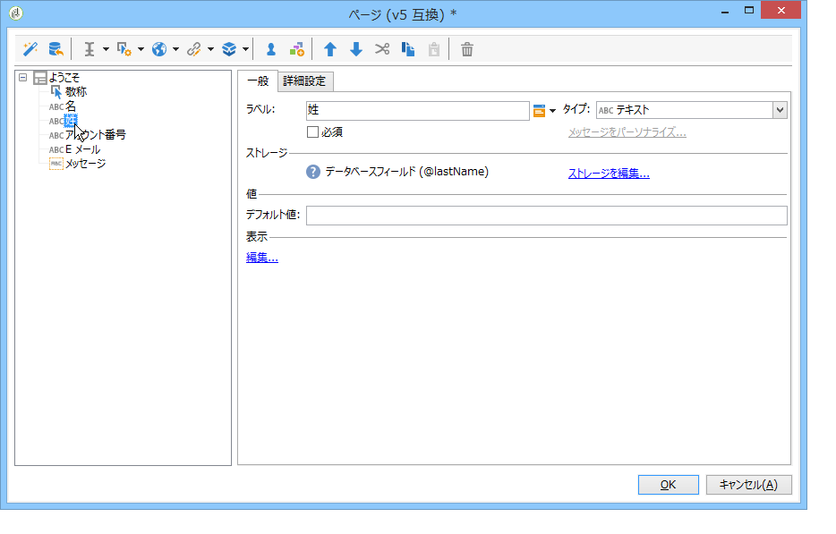</ph></source>
<target xml:lang="en-XX"><ph id="1" ctype="x-IMAGE"></ph></target>
</trans-unit>
<trans-unit id="tu58" xml:space="preserve">
<source xml:lang="en-US">The <ph id="1" ctype="x-STRONG_EMPHASIS">**[!UICONTROL </ph>General<ph id="3" ctype="x-LINK_REF">]**</ph> tab lets you enter the name of the field and attribute a default value to it if necessary.</source>
<target xml:lang="en-XX">「<ph id="1" ctype="x-STRONG_EMPHASIS">**[!UICONTROL </ph>一般<ph id="3" ctype="x-LINK_REF">]**</ph>」タブを使用すると、フィールドの名前を入力でき、必要に応じてデフォルト値にすることができます。</target>
</trans-unit>
<trans-unit id="tu59" xml:space="preserve">
<source xml:lang="en-US">The answer storage mode can be altered via the <ph id="1" ctype="x-STRONG_EMPHASIS">**[!UICONTROL </ph>Edit storage...<ph id="3" ctype="x-LINK_REF">]**</ph> link. Values can be stored in an existing field of the database; or you can choose not to save information in the database (use a local variable).</source>
<target xml:lang="en-XX">回答ストレージモードは、「<ph id="1" ctype="x-STRONG_EMPHASIS">**[!UICONTROL </ph>ストレージを編集<ph id="3" ctype="x-LINK_REF">]**</ph>」リンクを使用して変更できます。 値は、データベースの既存のフィールドに格納されます。または、情報をデータベースに保存しないように選択することもできます（ローカル変数を使用）。</target>
</trans-unit>
<trans-unit id="tu60" xml:space="preserve">
<source xml:lang="en-US"><ph id="1" ctype="x-regxph" equiv-text="&lbrack;!NOTE">[!NOTE]</ph></source>
<target xml:lang="en-XX"><ph id="1" ctype="x-regxph" equiv-text="&lbrack;!NOTE">[!NOTE]</ph></target>
</trans-unit>
<trans-unit id="tu61" xml:space="preserve">
<source xml:lang="en-US">Storage modes are detailed in <ph id="1" ctype="x-LINK">[</ph>Response storage fields<ph id="2" ctype="x-LINK">](web-forms-answers.md#response-storage-fields)</ph></source>
<target xml:lang="en-XX">ストレージモードについて詳しくは、<ph id="1" ctype="x-LINK">[</ph>回答ストレージフィールド<ph id="2" ctype="x-LINK">](web-forms-answers.md#response-storage-fields)</ph>を参照してください。</target>
</trans-unit>
<trans-unit id="tu62" xml:space="preserve">
<source xml:lang="en-US">The <ph id="1" ctype="x-STRONG_EMPHASIS">**[!UICONTROL </ph>Advanced<ph id="3" ctype="x-LINK_REF">]**</ph> tab lets you define display parameters for the field (position of labels, alignment, etc.). See <ph id="5" ctype="x-LINK">[</ph>Defining web forms layout<ph id="6" ctype="x-LINK">](defining-web-forms-layout.md)</ph>.</source>
<target xml:lang="en-XX">「<ph id="1" ctype="x-STRONG_EMPHASIS">**[!UICONTROL </ph>詳細設定<ph id="3" ctype="x-LINK_REF">]**</ph>」タブを使用すると、フィールドの表示パラメーターを定義できます（ラベルの位置、整列など）。 <ph id="5" ctype="x-LINK">[</ph>Web フォームレイアウトの定義<ph id="6" ctype="x-LINK">](defining-web-forms-layout.md)</ph>を参照してください。</target>
</trans-unit>
<trans-unit id="tu63" xml:space="preserve">
<source xml:lang="en-US">Adding drop-down lists</source>
<target xml:lang="en-XX">ドロップダウンリストの追加</target>
</trans-unit>
<trans-unit id="tu64" xml:space="preserve">
<source xml:lang="en-US">You can insert a drop-down list into a survey page. This lets the user select a value from those on offer in a drop-down menu.</source>
<target xml:lang="en-XX">調査ページにドロップダウンリストを挿入できます。 これにより、ユーザーは、ドロップダウンメニューで提供される値を選択できます。</target>
</trans-unit>
<trans-unit id="tu65" xml:space="preserve">
<source xml:lang="en-US"><ph id="1" ctype="x-IMAGE">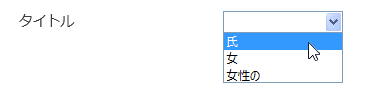</ph></source>
<target xml:lang="en-XX"><ph id="1" ctype="x-IMAGE"></ph></target>
</trans-unit>
<trans-unit id="tu66" xml:space="preserve">
<source xml:lang="en-US">To add a drop-down box to a form page, click the <ph id="1" ctype="x-STRONG_EMPHASIS">**[!UICONTROL </ph>Selection controls > Drop-down list<ph id="3" ctype="x-LINK_REF">]**</ph> button in the toolbar of the page editor.</source>
<target xml:lang="en-XX">ドロップダウンボックスをフォームページに追加するには、ページエディターのツールバーで、<ph id="1" ctype="x-STRONG_EMPHASIS">**[!UICONTROL </ph>選択コントロール／ドロップダウンリスト<ph id="3" ctype="x-LINK_REF">]**</ph>ボタンをクリックします。</target>
</trans-unit>
<trans-unit id="tu67" xml:space="preserve">
<source xml:lang="en-US"><ph id="1" ctype="x-IMAGE">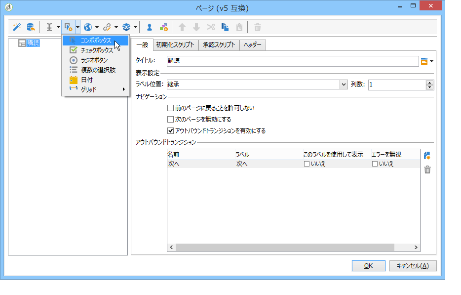</ph></source>
<target xml:lang="en-XX"><ph id="1" ctype="x-IMAGE"></ph></target>
</trans-unit>
<trans-unit id="tu68" xml:space="preserve">
<source xml:lang="en-US">Select the answer storage mode and confirm your choice.</source>
<target xml:lang="en-XX">回答ストレージモードを選択して、選択内容を確認します。</target>
</trans-unit>
<trans-unit id="tu69" xml:space="preserve">
<source xml:lang="en-US">Define the labels and values of the list in the lower section of the <ph id="1" ctype="x-STRONG_EMPHASIS">**[!UICONTROL </ph>General<ph id="3" ctype="x-LINK_REF">]**</ph> tab. If the information is stored in an existing field of the database and it is an enumeration field, you can fill in the values automatically by clicking <ph id="5" ctype="x-STRONG_EMPHASIS">**[!UICONTROL </ph>Initialize the list of values from the database<ph id="7" ctype="x-LINK_REF">]**</ph> , as shown below:</source>
<target xml:lang="en-XX">「<ph id="1" ctype="x-STRONG_EMPHASIS">**[!UICONTROL </ph>一般<ph id="3" ctype="x-LINK_REF">]**</ph>」タブの下のセクションで、リストのラベルおよび値を定義します。 情報がデータベースの既存のフィールドに格納されており、列挙フィールドである場合、次に示すように、「<ph id="5" ctype="x-STRONG_EMPHASIS">**[!UICONTROL </ph>データベースから取得した値のリストを初期化<ph id="7" ctype="x-LINK_REF">]**</ph>」をクリックすることで、値を自動的に入力できます。</target>
</trans-unit>
<trans-unit id="tu70" xml:space="preserve">
<source xml:lang="en-US"><ph id="1" ctype="x-IMAGE">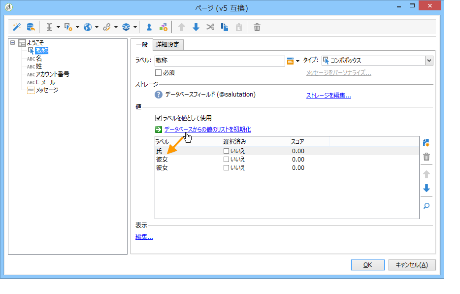</ph></source>
<target xml:lang="en-XX"><ph id="1" ctype="x-IMAGE"></ph></target>
</trans-unit>
<trans-unit id="tu71" xml:space="preserve">
<source xml:lang="en-US"><ph id="1" ctype="x-regxph" equiv-text="&lbrack;!NOTE">[!NOTE]</ph></source>
<target xml:lang="en-XX"><ph id="1" ctype="x-regxph" equiv-text="&lbrack;!NOTE">[!NOTE]</ph></target>
</trans-unit>
<trans-unit id="tu72" xml:space="preserve">
<source xml:lang="en-US">Use the arrows to the right of the list of values to change their sequence.</source>
<target xml:lang="en-XX">値のリストの右側の矢印を使用して、順序を変更します。</target>
</trans-unit>
<trans-unit id="tu73" xml:space="preserve">
<source xml:lang="en-US">If the data is stored in a linked table, you can select the field where the values to be suggested in the list are saved. For example, if you select the table of countries, click <ph id="1" ctype="x-STRONG_EMPHASIS">**[!UICONTROL </ph>Initialize the list of values from the database...<ph id="3" ctype="x-LINK_REF">]**</ph> and select the desired field.</source>
<target xml:lang="en-XX">リンクされたテーブルにデータが格納されている場合、リストに候補として提示される値が保存されたフィールドを選択できます。 例えば、国のテーブルを選択する場合、「<ph id="1" ctype="x-STRONG_EMPHASIS">**[!UICONTROL </ph>データベースから取得した値のリストを初期化<ph id="3" ctype="x-LINK_REF">]**</ph>」をクリックして、目的のフィールドを選択します。</target>
</trans-unit>
<trans-unit id="tu74" xml:space="preserve">
<source xml:lang="en-US"><ph id="1" ctype="x-IMAGE">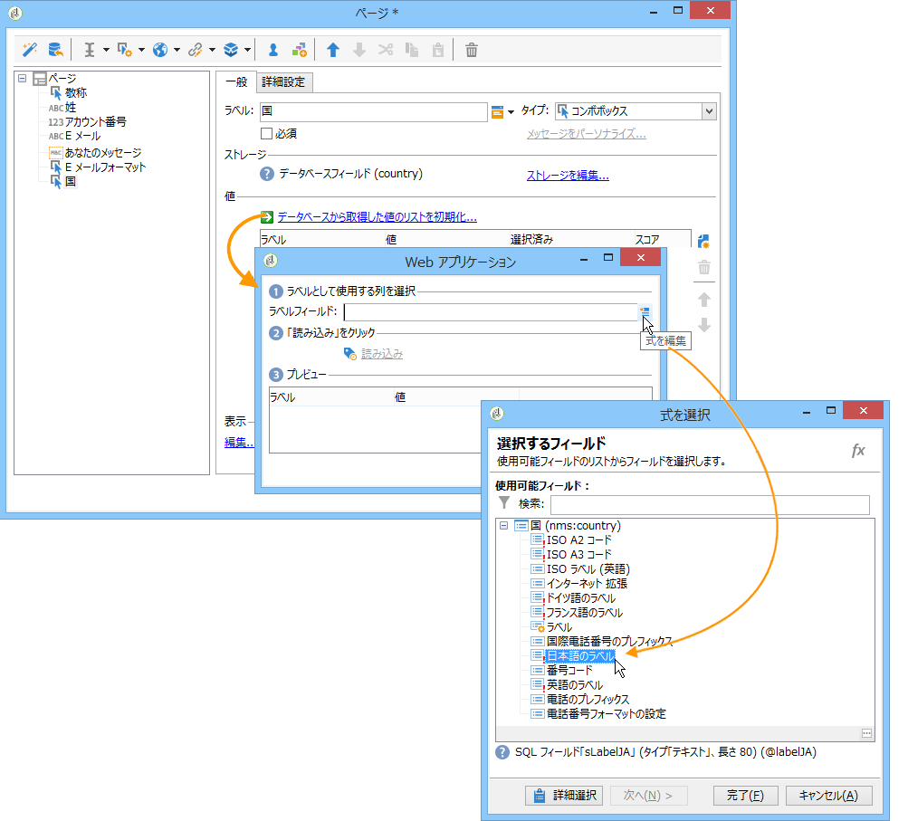</ph></source>
<target xml:lang="en-XX"><ph id="1" ctype="x-IMAGE"></ph></target>
</trans-unit>
<trans-unit id="tu75" xml:space="preserve">
<source xml:lang="en-US">Next, click the <ph id="1" ctype="x-STRONG_EMPHASIS">**[!UICONTROL </ph>Load<ph id="3" ctype="x-LINK_REF">]**</ph> link to retrieve the values:</source>
<target xml:lang="en-XX">次に、「<ph id="1" ctype="x-STRONG_EMPHASIS">**[!UICONTROL </ph>読み込み<ph id="3" ctype="x-LINK_REF">]**</ph>」リンクをクリックして値を取得します。</target>
</trans-unit>
<trans-unit id="tu76" xml:space="preserve">
<source xml:lang="en-US"><ph id="1" ctype="x-IMAGE">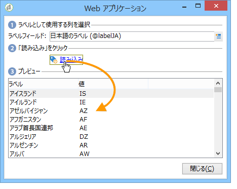</ph></source>
<target xml:lang="en-XX"><ph id="1" ctype="x-IMAGE"></ph></target>
</trans-unit>
<trans-unit id="tu77" xml:space="preserve">
<source xml:lang="en-US"><ph id="1" ctype="x-regxph" equiv-text="&lbrack;!CAUTION">[!CAUTION]</ph></source>
<target xml:lang="en-XX"><ph id="1" ctype="x-regxph" equiv-text="&lbrack;!CAUTION">[!CAUTION]</ph></target>
</trans-unit>
<trans-unit id="tu78" xml:space="preserve">
<source xml:lang="en-US">Repeat this operation whenever the list is updated to refresh the values on offer.</source>
<target xml:lang="en-XX">リストが更新されたら、この操作を繰り返して、オファーの値を更新します。</target>
</trans-unit>
<trans-unit id="tu79" xml:space="preserve">
<source xml:lang="en-US">Adding checkboxes</source>
<target xml:lang="en-XX">チェックボックスの追加</target>
</trans-unit>
<trans-unit id="tu80" xml:space="preserve">
<source xml:lang="en-US">In order for the user to select an option, you need to use a checkbox.</source>
<target xml:lang="en-XX">ユーザーがオプションを選択するには、チェックボックスを使用する必要があります。</target>
</trans-unit>
<trans-unit id="tu81" xml:space="preserve">
<source xml:lang="en-US"><ph id="1" ctype="x-IMAGE">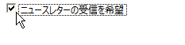</ph></source>
<target xml:lang="en-XX"><ph id="1" ctype="x-IMAGE"></ph></target>
</trans-unit>
<trans-unit id="tu82" xml:space="preserve">
<source xml:lang="en-US">To add a checkbox to a form, click the <ph id="1" ctype="x-STRONG_EMPHASIS">**[!UICONTROL </ph>Selection controls > Checkbox...<ph id="3" ctype="x-LINK_REF">]**</ph> icon in the toolbar of the page editor.</source>
<target xml:lang="en-XX">チェックボックスをフォームに追加するには、ページエディターのツールバーで、<ph id="1" ctype="x-STRONG_EMPHASIS">**[!UICONTROL </ph>選択コントロール／チェックボックス<ph id="3" ctype="x-LINK_REF">]**</ph>アイコンをクリックします。</target>
</trans-unit>
<trans-unit id="tu83" xml:space="preserve">
<source xml:lang="en-US">Select the answer storage mode and confirm your choice.</source>
<target xml:lang="en-XX">回答ストレージモードを選択して、選択内容を確認します。</target>
</trans-unit>
<trans-unit id="tu84" xml:space="preserve">
<source xml:lang="en-US">Enter the label of the box in the <ph id="1" ctype="x-STRONG_EMPHASIS">**[!UICONTROL </ph>Label<ph id="3" ctype="x-LINK_REF">]**</ph> field of the <ph id="5" ctype="x-STRONG_EMPHASIS">**[!UICONTROL </ph>General<ph id="7" ctype="x-LINK_REF">]**</ph> tab.</source>
<target xml:lang="en-XX">「<ph id="5" ctype="x-STRONG_EMPHASIS">**[!UICONTROL </ph>一般<ph id="7" ctype="x-LINK_REF">]**</ph>」タブの「<ph id="1" ctype="x-STRONG_EMPHASIS">**[!UICONTROL </ph>ラベル<ph id="3" ctype="x-LINK_REF">]**</ph>」フィールドにボックスのラベルを入力します。</target>
</trans-unit>
<trans-unit id="tu85" xml:space="preserve">
<source xml:lang="en-US"><ph id="1" ctype="x-IMAGE">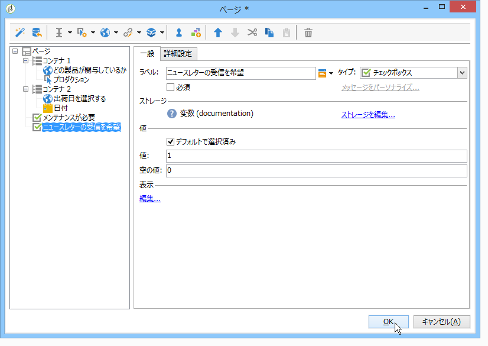</ph></source>
<target xml:lang="en-XX"><ph id="1" ctype="x-IMAGE"></ph></target>
</trans-unit>
<trans-unit id="tu86" xml:space="preserve">
<source xml:lang="en-US">A checkbox lets you assign a value to the storage field (or value) depending on whether or not the box is checked. The <ph id="1" ctype="x-STRONG_EMPHASIS">**[!UICONTROL </ph>Values<ph id="3" ctype="x-LINK_REF">]**</ph> section lets you enter the value to assign if the box is checked (in the <ph id="5" ctype="x-STRONG_EMPHASIS">**[!UICONTROL </ph>Value<ph id="7" ctype="x-LINK_REF">]**</ph> field), and the value to assign if it is not checked (in the <ph id="9" ctype="x-STRONG_EMPHASIS">**[!UICONTROL </ph>Empty value<ph id="11" ctype="x-LINK_REF">]**</ph> field). These values depend on the data storage format.</source>
<target xml:lang="en-XX">チェックボックスを使用すると、ボックスがチェックされているかどうかに応じて、ストレージフィールド（または値）に値を割り当てることができます。 「<ph id="1" ctype="x-STRONG_EMPHASIS">**[!UICONTROL </ph>値<ph id="3" ctype="x-LINK_REF">]**</ph>」セクションを使用すると、ボックスがチェックされている場合に割り当てる値（「<ph id="5" ctype="x-STRONG_EMPHASIS">**[!UICONTROL </ph>値<ph id="7" ctype="x-LINK_REF">]**</ph>」フィールド）と、チェックされていない場合に割り当てる値（「<ph id="9" ctype="x-STRONG_EMPHASIS">**[!UICONTROL </ph>空の値<ph id="11" ctype="x-LINK_REF">]**</ph>」フィールド）を入力できます。 これらの値は、データストレージ形式によって異なります。</target>
</trans-unit>
<trans-unit id="tu87" xml:space="preserve">
<source xml:lang="en-US">If the storage field (or variable) is boolean, the value to assign if the box is not checked will be deduced automatically. In this case, only the <ph id="1" ctype="x-STRONG_EMPHASIS">**[!UICONTROL </ph>Value if checked<ph id="3" ctype="x-LINK_REF">]**</ph> field is offered, as shown below:</source>
<target xml:lang="en-XX">ストレージフィールド（または変数）がブール値の場合、ボックスがチェックされていない場合に割り当てる値は、自動的に推測されます。 この場合、次に示すように、「<ph id="1" ctype="x-STRONG_EMPHASIS">**[!UICONTROL </ph>チェックされている場合の値<ph id="3" ctype="x-LINK_REF">]**</ph>」フィールドのみが提供されます。</target>
</trans-unit>
<trans-unit id="tu88" xml:space="preserve">
<source xml:lang="en-US"><ph id="1" ctype="x-IMAGE">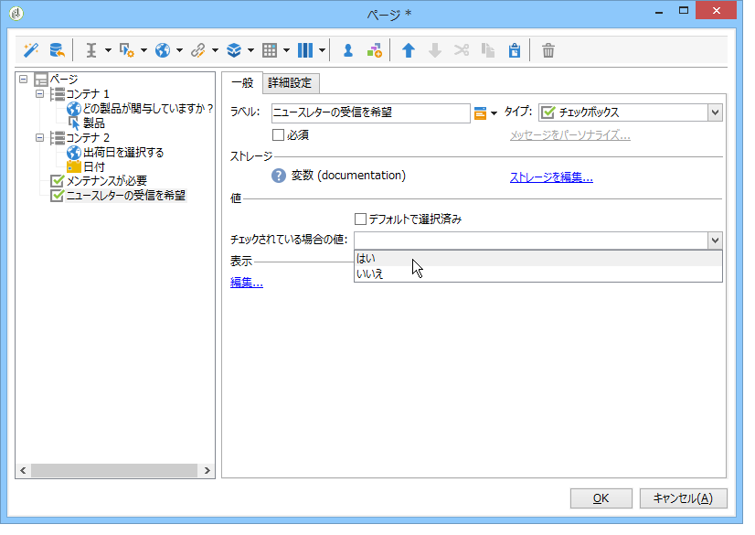</ph></source>
<target xml:lang="en-XX"><ph id="1" ctype="x-IMAGE"></ph></target>
</trans-unit>
<trans-unit id="tu89" xml:space="preserve">
<source xml:lang="en-US">Example: Assign a value to a field if a box is checked</source>
<target xml:lang="en-XX">例：ボックスがチェックされている場合のフィールドへの値の割り当て</target>
</trans-unit>
<trans-unit id="tu90" xml:space="preserve">
<source xml:lang="en-US">We want to insert a checkbox into a form to send a maintenance request, as shown below:</source>
<target xml:lang="en-XX">次に示すように、メンテナンスリクエストを送信するために、フォームにチェックボックスを挿入します。</target>
</trans-unit>
<trans-unit id="tu91" xml:space="preserve">
<source xml:lang="en-US"><ph id="1" ctype="x-IMAGE">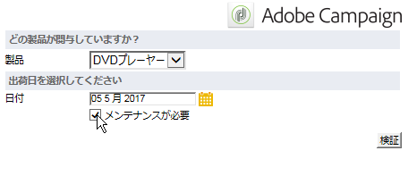</ph></source>
<target xml:lang="en-XX"><ph id="1" ctype="x-IMAGE"></ph></target>
</trans-unit>
<trans-unit id="tu92" xml:space="preserve">
<source xml:lang="en-US">The information will be uploaded to the database and into an existing field (in this case, the <ph id="1" ctype="x-STRONG_EMPHASIS">**[!UICONTROL </ph>Comment<ph id="3" ctype="x-LINK_REF">]**</ph> field):</source>
<target xml:lang="en-XX">データベースおよび既存のフィールドに対して、情報が更新されます（この場合、「<ph id="1" ctype="x-STRONG_EMPHASIS">**[!UICONTROL </ph>コメント<ph id="3" ctype="x-LINK_REF">]**</ph>」フィールド）。</target>
</trans-unit>
<trans-unit id="tu93" xml:space="preserve">
<source xml:lang="en-US"><ph id="1" ctype="x-IMAGE">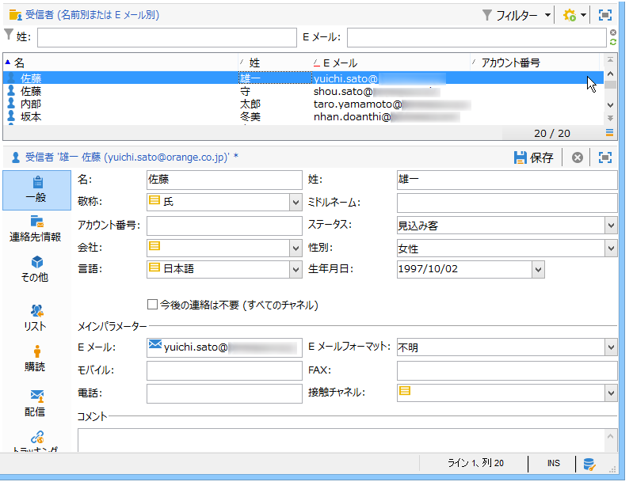</ph></source>
<target xml:lang="en-XX"><ph id="1" ctype="x-IMAGE"></ph></target>
</trans-unit>
<trans-unit id="tu94" xml:space="preserve">
<source xml:lang="en-US">If the "Maintenance required" box is checked, the <ph id="1" ctype="x-STRONG_EMPHASIS">**[!UICONTROL </ph>Comment<ph id="3" ctype="x-LINK_REF">]**</ph> column will contain "Maintenance required". If the box isn't checked, the column will show "Maintenance not required". To obtain this result, apply the following configuration to the checkbox on the form page:</source>
<target xml:lang="en-XX">「メンテナンスが必要」ボックスがチェックされている場合、「<ph id="1" ctype="x-STRONG_EMPHASIS">**[!UICONTROL </ph>コメント<ph id="3" ctype="x-LINK_REF">]**</ph>」列に「メンテナンスが必要」が格納されます ボックスがチェックされていない場合、この列には「メンテナンスは不要」と表示されます。 この結果を得るには、フォームページ上のチェックボックスに対して、次の設定を適用します。</target>
</trans-unit>
<trans-unit id="tu95" xml:space="preserve">
<source xml:lang="en-US"><ph id="1" ctype="x-IMAGE">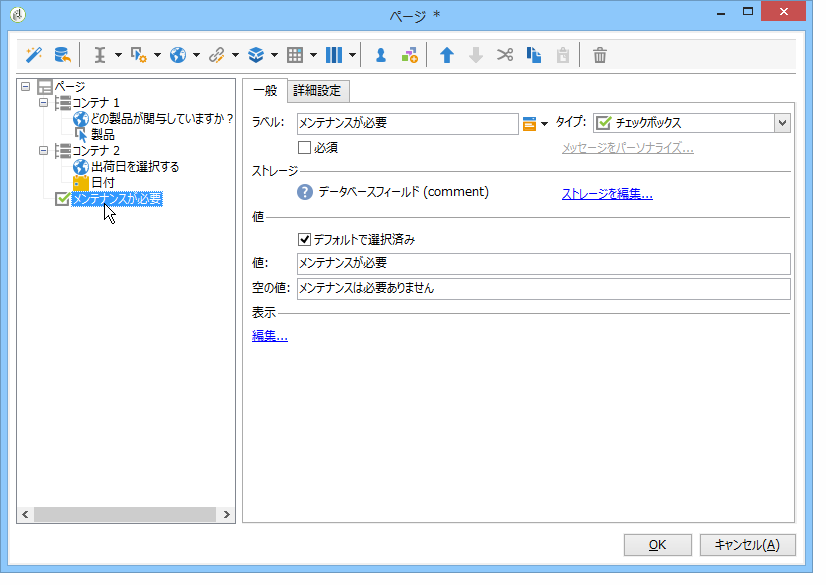</ph></source>
<target xml:lang="en-XX"><ph id="1" ctype="x-IMAGE"></ph></target>
</trans-unit>
<trans-unit id="tu96" xml:space="preserve">
<source xml:lang="en-US">Adding radio buttons</source>
<target xml:lang="en-XX">ラジオボタンの追加</target>
</trans-unit>
<trans-unit id="tu97" xml:space="preserve">
<source xml:lang="en-US">Radio buttons let you offer the user a series of exclusive options to choose from. These are different values for the same field.</source>
<target xml:lang="en-XX">ラジオボタンを使用すると、一連の排他的な選択オプションをユーザーに提供できます。 同じフィールドに異なる値があります。</target>
</trans-unit>
<trans-unit id="tu98" xml:space="preserve">
<source xml:lang="en-US"><ph id="1" ctype="x-IMAGE">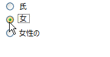</ph></source>
<target xml:lang="en-XX"><ph id="1" ctype="x-IMAGE"></ph></target>
</trans-unit>
<trans-unit id="tu99" xml:space="preserve">
<source xml:lang="en-US">You can create radio buttons individually (unitary buttons) or via a multiple-choice list, but since the point of the radio buttons is to select one option or another, we will always create at least a pair of radio buttons, never just a single button.</source>
<target xml:lang="en-XX">ラジオボタンを個別に作成することも（単一ボタン）、複数選択リストを使用して作成することもできますが、ラジオボタンで重要なのはいずれか 1 つのオプションを選択することなので、単一ボタンのみではなく、常に少なくとも 1 組のラジオボタンを作成します。</target>
</trans-unit>
<trans-unit id="tu100" xml:space="preserve">
<source xml:lang="en-US"><ph id="1" ctype="x-regxph" equiv-text="&lbrack;!CAUTION">[!CAUTION]</ph></source>
<target xml:lang="en-XX"><ph id="1" ctype="x-regxph" equiv-text="&lbrack;!CAUTION">[!CAUTION]</ph></target>
</trans-unit>
<trans-unit id="tu101" xml:space="preserve">
<source xml:lang="en-US">To make selection mandatory, you need to create a multiple choice list.</source>
<target xml:lang="en-XX">選択を必須にするには、複数選択リストを作成する必要があります。</target>
</trans-unit>
<trans-unit id="tu102" xml:space="preserve">
<source xml:lang="en-US">Add single buttons</source>
<target xml:lang="en-XX">単一のボタンの追加</target>
</trans-unit>
<trans-unit id="tu103" xml:space="preserve">
<source xml:lang="en-US">To add a radio button to a form page, go to the <ph id="1" ctype="x-STRONG_EMPHASIS">**[!UICONTROL </ph>Selection controls > Radio button<ph id="3" ctype="x-LINK_REF">]**</ph> menu in the toolbar of the page editor and choose a storage mode.</source>
<target xml:lang="en-XX">ラジオボタンをフォームページに追加するには、ページエディターのツールバーで、<ph id="1" ctype="x-STRONG_EMPHASIS">**[!UICONTROL </ph>選択コントロール／ラジオボタン<ph id="3" ctype="x-LINK_REF">]**</ph>メニューに移動し、ストレージモードを選択します。</target>
</trans-unit>
<trans-unit id="tu104" xml:space="preserve">
<source xml:lang="en-US"><ph id="1" ctype="x-IMAGE">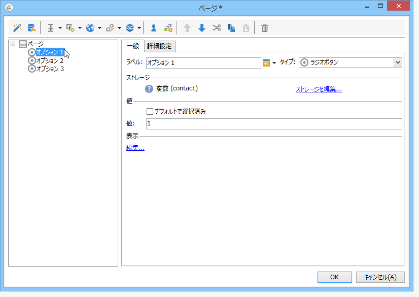</ph></source>
<target xml:lang="en-XX"><ph id="1" ctype="x-IMAGE"></ph></target>
</trans-unit>
<trans-unit id="tu105" xml:space="preserve">
<source xml:lang="en-US">Radio buttons are configured in a similar way to checkboxes (see <ph id="1" ctype="x-LINK">[</ph>Adding checkboxes<ph id="2" ctype="x-LINK">](#adding-checkboxes)</ph>). However, no value is assigned if the option is not selected. In order for several buttons to be interdependent, i.e. selecting one automatically deselects the others, they must be stored in the same field. If they are not stored in the database, the same local variable must be used for temporary storage. See <ph id="3" ctype="x-LINK">[</ph>Response storage fields<ph id="4" ctype="x-LINK">](web-forms-answers.md#response-storage-fields)</ph>.</source>
<target xml:lang="en-XX">ラジオボタンは、チェックボックスと同じ方法で設定されます（<ph id="1" ctype="x-LINK">[</ph>チェックボックスの追加<ph id="2" ctype="x-LINK">](#adding-checkboxes)</ph>を参照）。 ただし、オプションが選択されていない場合、値は割り当てられません。 いくつかのボタンを相互依存させるには、つまり、1 つを選択することでその他を自動的に選択解除するには、同じフィールドに格納する必要があります。 データベースに格納されていない場合、一時的なストレージとして同じローカル変数が使用される必要があります。 <ph id="3" ctype="x-LINK">[</ph>回答ストレージフィールド<ph id="4" ctype="x-LINK">](web-forms-answers.md#response-storage-fields)</ph>を参照してください。</target>
</trans-unit>
<trans-unit id="tu106" xml:space="preserve">
<source xml:lang="en-US">Add a list of buttons</source>
<target xml:lang="en-XX">ボタンのリストの追加</target>
</trans-unit>
<trans-unit id="tu107" xml:space="preserve">
<source xml:lang="en-US">To add radio buttons via a list, go to the <ph id="1" ctype="x-STRONG_EMPHASIS">**[!UICONTROL </ph>Selection controls>Multiple choice<ph id="3" ctype="x-LINK_REF">]**</ph> menu in the toolbar of the page editor.</source>
<target xml:lang="en-XX">リストを使用してラジオボタンを追加するには、ページエディターのツールバーで、<ph id="1" ctype="x-STRONG_EMPHASIS">**[!UICONTROL </ph>選択コントロール／複数選択<ph id="3" ctype="x-LINK_REF">]**</ph>メニューに移動します。</target>
</trans-unit>
<trans-unit id="tu108" xml:space="preserve">
<source xml:lang="en-US"><ph id="1" ctype="x-IMAGE">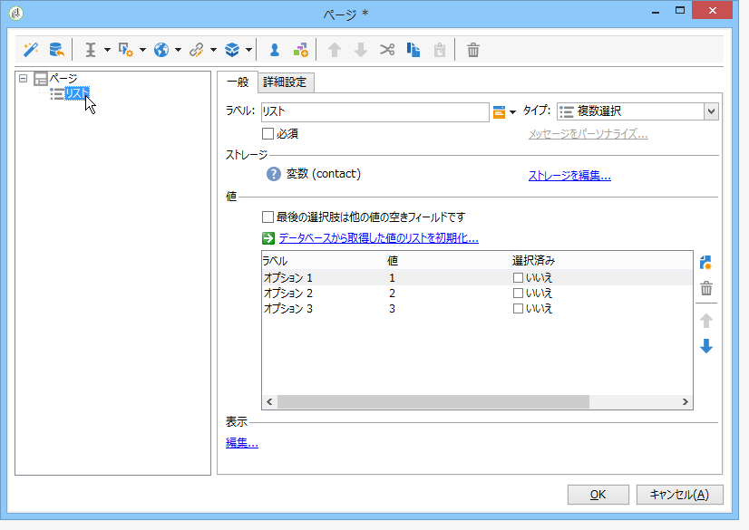</ph></source>
<target xml:lang="en-XX"><ph id="1" ctype="x-IMAGE"></ph></target>
</trans-unit>
<trans-unit id="tu109" xml:space="preserve">
<source xml:lang="en-US">Add as many radio buttons as there are labels. The advantage of this feature is that you can import values from an existing field (in case of an itemized field) and make it for the user to choose one option. However, the layout of buttons is less flexible.</source>
<target xml:lang="en-XX">ラベルと同じ数のラジオボタンを追加します。 この機能の利点は、既存のフィールドから値をインポートできる（項目別フィールドの場合）ことと、ユーザーに 1 つのオプションを選択させることができることです。 ただし、ボタンのレイアウトにはあまり柔軟性がありません。</target>
</trans-unit>
<trans-unit id="tu110" xml:space="preserve">
<source xml:lang="en-US"><ph id="1" ctype="x-regxph" equiv-text="&lbrack;!NOTE">[!NOTE]</ph></source>
<target xml:lang="en-XX"><ph id="1" ctype="x-regxph" equiv-text="&lbrack;!NOTE">[!NOTE]</ph></target>
</trans-unit>
<trans-unit id="tu111" xml:space="preserve">
<source xml:lang="en-US">You cannot enable multi-selection in a web application.
<ph id="1" ctype="x-BLOCK_QUOTE">></ph>It is possible, however, to insert a <ph id="2" ctype="x-STRONG_EMPHASIS">**[!UICONTROL </ph>Multiple choice<ph id="4" ctype="x-LINK_REF">]**</ph> type field into a Web application but this will not enable the user to select several values.</source>
<target xml:lang="en-XX">Web アプリケーションで複数選択を有効にすることはできません。
<ph id="1" ctype="x-BLOCK_QUOTE">></ph>ただし、web アプリケーションに<ph id="2" ctype="x-STRONG_EMPHASIS">**[!UICONTROL </ph>複数選択<ph id="4" ctype="x-LINK_REF">]**</ph>タイプのフィールドを挿入することは可能ですが、この場合、ユーザーは複数の値を選択できません</target>
</trans-unit>
<trans-unit id="tu112" xml:space="preserve">
<source xml:lang="en-US">Adding grids</source>
<target xml:lang="en-XX">グリッドの追加</target>
</trans-unit>
<trans-unit id="tu113" xml:space="preserve">
<source xml:lang="en-US">Grids are used to design voting pages in Web applications. This lets you offer lists of radio buttons for answering survey or assessment type Web forms, as shown below:</source>
<target xml:lang="en-XX">グリッドは、Web アプリケーションの投票ページをデザインするために使用されます。 これにより、次に示すように、調査または評価タイプの Web フォームに回答するためのラジオボタンのリストを提供できます。</target>
</trans-unit>
<trans-unit id="tu114" xml:space="preserve">
<source xml:lang="en-US"><ph id="1" ctype="x-IMAGE">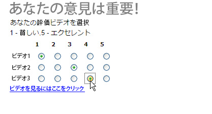</ph></source>
<target xml:lang="en-XX"><ph id="1" ctype="x-IMAGE"></ph></target>
</trans-unit>
<trans-unit id="tu115" xml:space="preserve">
<source xml:lang="en-US">To use this type of element in a form, create a simple grid and add a line for each element to be assessed.</source>
<target xml:lang="en-XX">このタイプの要素をフォームで使用するには、シンプルグリッドを作成して、評価される各要素のための線を追加します。</target>
</trans-unit>
<trans-unit id="tu116" xml:space="preserve">
<source xml:lang="en-US"><ph id="1" ctype="x-IMAGE">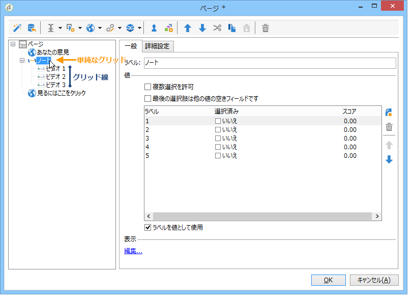</ph></source>
<target xml:lang="en-XX"><ph id="1" ctype="x-IMAGE"></ph></target>
</trans-unit>
<trans-unit id="tu117" xml:space="preserve">
<source xml:lang="en-US">The number of radio buttons in each line of the grid matches the number of values defined in the simple grid.</source>
<target xml:lang="en-XX">グリッドの各線のラジオボタンの数は、シンプルグリッドで定義された値に一致します。</target>
</trans-unit>
<trans-unit id="tu118" xml:space="preserve">
<source xml:lang="en-US"><ph id="1" ctype="x-IMAGE">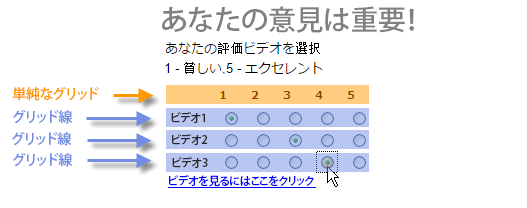</ph></source>
<target xml:lang="en-XX"><ph id="1" ctype="x-IMAGE"></ph></target>
</trans-unit>
<trans-unit id="tu119" xml:space="preserve">
<source xml:lang="en-US">Only one option can be selected per grid line.</source>
<target xml:lang="en-XX">グリッド線あたり 1 つのオプションのみ選択できます。</target>
</trans-unit>
<trans-unit id="tu120" xml:space="preserve">
<source xml:lang="en-US"><ph id="1" ctype="x-regxph" equiv-text="&lbrack;!NOTE">[!NOTE]</ph></source>
<target xml:lang="en-XX"><ph id="1" ctype="x-regxph" equiv-text="&lbrack;!NOTE">[!NOTE]</ph></target>
</trans-unit>
<trans-unit id="tu121" xml:space="preserve">
<source xml:lang="en-US">In our example, the label of the grid is hidden. To do this, go to the <ph id="1" ctype="x-STRONG_EMPHASIS">**[!UICONTROL </ph>Advanced<ph id="3" ctype="x-LINK_REF">]**</ph> tab, the <ph id="5" ctype="x-STRONG_EMPHASIS">**[!UICONTROL </ph>Label position<ph id="7" ctype="x-LINK_REF">]**</ph> display is defined as <ph id="9" ctype="x-STRONG_EMPHASIS">**[!UICONTROL </ph>Hidden<ph id="11" ctype="x-LINK_REF">]**</ph> . See <ph id="13" ctype="x-LINK">[</ph>Defining the position of labels<ph id="14" ctype="x-LINK">](defining-web-forms-layout.md#defining-the-position-of-labels)</ph>.</source>
<target xml:lang="en-XX">この例では、グリッドのラベルは非表示です。 これをおこなうには、「<ph id="1" ctype="x-STRONG_EMPHASIS">**[!UICONTROL </ph>詳細設定<ph id="3" ctype="x-LINK_REF">]**</ph>」タブに移動して、「<ph id="5" ctype="x-STRONG_EMPHASIS">**[!UICONTROL </ph>ラベル位置<ph id="7" ctype="x-LINK_REF">]**</ph>」表示を「<ph id="9" ctype="x-STRONG_EMPHASIS">**[!UICONTROL </ph>非表示<ph id="11" ctype="x-LINK_REF">]**</ph>」として定義します。 <ph id="13" ctype="x-LINK">[</ph>ラベルの位置の定義<ph id="14" ctype="x-LINK">](defining-web-forms-layout.md#defining-the-position-of-labels)</ph>を参照してください。</target>
</trans-unit>
<trans-unit id="tu122" xml:space="preserve">
<source xml:lang="en-US">Adding dates and numbers</source>
<target xml:lang="en-XX">日付と数値の追加</target>
</trans-unit>
<trans-unit id="tu123" xml:space="preserve">
<source xml:lang="en-US">The content of the form fields can be formatted to match the data stored in the database or to satisfy a particular requirement. You can create suitable fields for the entry of numbers and dates.</source>
<target xml:lang="en-XX">フォームフィールドのコンテンツは、データベースに格納されたデータに一致するように書式設定したり、特定の要件を満たすように書式設定したりできます。 数値および日付の入力に適したフィールドを作成できます。</target>
</trans-unit>
<trans-unit id="tu124" xml:space="preserve">
<source xml:lang="en-US">Adding dates</source>
<target xml:lang="en-XX">日付の追加</target>
</trans-unit>
<trans-unit id="tu125" xml:space="preserve">
<source xml:lang="en-US"><ph id="1" ctype="x-IMAGE">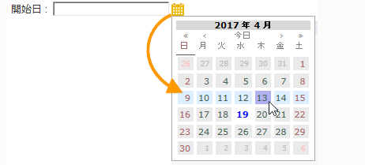</ph></source>
<target xml:lang="en-XX"><ph id="1" ctype="x-IMAGE"></ph></target>
</trans-unit>
<trans-unit id="tu126" xml:space="preserve">
<source xml:lang="en-US">To allow the user to enter a date in a form page, add an input field and select the type <ph id="1" ctype="x-STRONG_EMPHASIS">**[!UICONTROL </ph>Date...<ph id="3" ctype="x-LINK_REF">]**</ph>.</source>
<target xml:lang="en-XX">ユーザーがフォームページに日付を入力できるようにするには、入力フィールドを追加し、「<ph id="1" ctype="x-STRONG_EMPHASIS">**[!UICONTROL </ph>日付<ph id="3" ctype="x-LINK_REF">]**</ph>」タイプを選択します。</target>
</trans-unit>
<trans-unit id="tu127" xml:space="preserve">
<source xml:lang="en-US">Enter a label for the field and configure the data storage mode.</source>
<target xml:lang="en-XX">フィールドのラベルを入力し、データストレージモードを設定します。</target>
</trans-unit>
<trans-unit id="tu128" xml:space="preserve">
<source xml:lang="en-US"><ph id="1" ctype="x-IMAGE">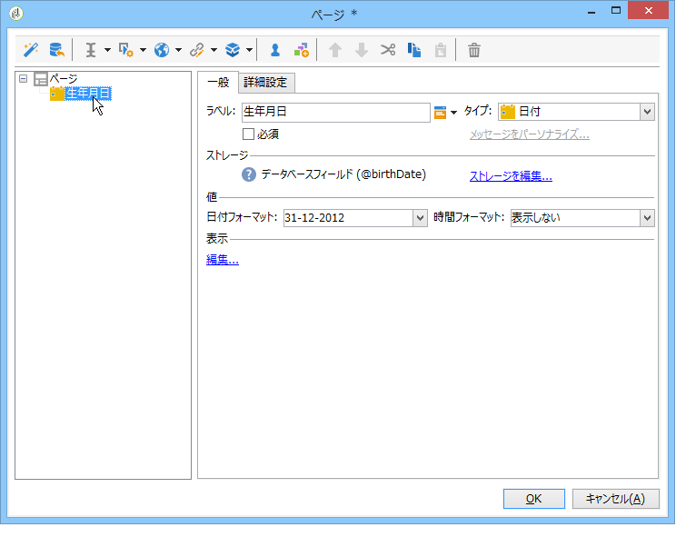</ph></source>
<target xml:lang="en-XX"><ph id="1" ctype="x-IMAGE"></ph></target>
</trans-unit>
<trans-unit id="tu129" xml:space="preserve">
<source xml:lang="en-US">The lower section of the window lets you select the date and time formats for the values stored in this field.</source>
<target xml:lang="en-XX">ウィンドウの下部のセクションでは、このフィールドに格納される値の日付および時間の形式を選択できます。</target>
</trans-unit>
<trans-unit id="tu130" xml:space="preserve">
<source xml:lang="en-US"><ph id="1" ctype="x-IMAGE">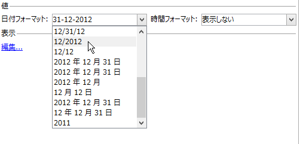</ph></source>
<target xml:lang="en-XX"><ph id="1" ctype="x-IMAGE"></ph></target>
</trans-unit>
<trans-unit id="tu131" xml:space="preserve">
<source xml:lang="en-US">You can also choose not to display the date (or time).</source>
<target xml:lang="en-XX">また、日付（または時間）を表示しないように選択することもできます。</target>
</trans-unit>
<trans-unit id="tu132" xml:space="preserve">
<source xml:lang="en-US">Dates can be selected via a calendar or drop-down boxes. You can also enter them directly in the field, but they need to match the format specified in the screen above.</source>
<target xml:lang="en-XX">日付は、カレンダーまたはドロップダウンボックスを使用して選択できます。 また、フィールドに直接入力することもできますが、上の画面で指定した形式に一致させる必要があります。</target>
</trans-unit>
<trans-unit id="tu133" xml:space="preserve">
<source xml:lang="en-US"><ph id="1" ctype="x-regxph" equiv-text="&lbrack;!NOTE">[!NOTE]</ph></source>
<target xml:lang="en-XX"><ph id="1" ctype="x-regxph" equiv-text="&lbrack;!NOTE">[!NOTE]</ph></target>
</trans-unit>
<trans-unit id="tu134" xml:space="preserve">
<source xml:lang="en-US">By default, dates used in forms are entered via a calendar. For multilingual forms, please check that calendars are available in all the languages used. See <ph id="1" ctype="x-LINK">[</ph>Translating a web form<ph id="2" ctype="x-LINK">](translating-a-web-form.md)</ph>.</source>
<target xml:lang="en-XX">デフォルトでは、フォームで使用される日付は、カレンダーを使用して入力されます。 多言語のフォームの場合、使用するすべての言語でカレンダーが使用できることを確認してください。 <ph id="1" ctype="x-LINK">[</ph>Web フォームの翻訳<ph id="2" ctype="x-LINK">](translating-a-web-form.md)</ph>を参照してください。</target>
</trans-unit>
<trans-unit id="tu135" xml:space="preserve">
<source xml:lang="en-US">However in some cases, (for entering dates of birth, for instance) it may be easier to use drop-down lists.</source>
<target xml:lang="en-XX">ただし、（例えば誕生日の入力など）場合によっては、ドロップダウンリストを使用するほうが簡単なことがあります。</target>
</trans-unit>
<trans-unit id="tu136" xml:space="preserve">
<source xml:lang="en-US"><ph id="1" ctype="x-IMAGE">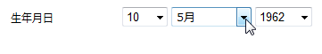</ph></source>
<target xml:lang="en-XX"><ph id="1" ctype="x-IMAGE"></ph></target>
</trans-unit>
<trans-unit id="tu137" xml:space="preserve">
<source xml:lang="en-US">To do this, click the <ph id="1" ctype="x-STRONG_EMPHASIS">**[!UICONTROL </ph>Advanced<ph id="3" ctype="x-LINK_REF">]**</ph> tab and choose the input mode using <ph id="5" ctype="x-STRONG_EMPHASIS">**[!UICONTROL </ph>Drop-down lists<ph id="7" ctype="x-LINK_REF">]**</ph>.</source>
<target xml:lang="en-XX">これをおこなうには、「<ph id="1" ctype="x-STRONG_EMPHASIS">**[!UICONTROL </ph>詳細設定<ph id="3" ctype="x-LINK_REF">]**</ph>」タブをクリックして、<ph id="5" ctype="x-STRONG_EMPHASIS">**[!UICONTROL </ph>ドロップダウンリスト<ph id="7" ctype="x-LINK_REF">]**</ph>を使用する入力モードを選択します。</target>
</trans-unit>
<trans-unit id="tu138" xml:space="preserve">
<source xml:lang="en-US"><ph id="1" ctype="x-IMAGE">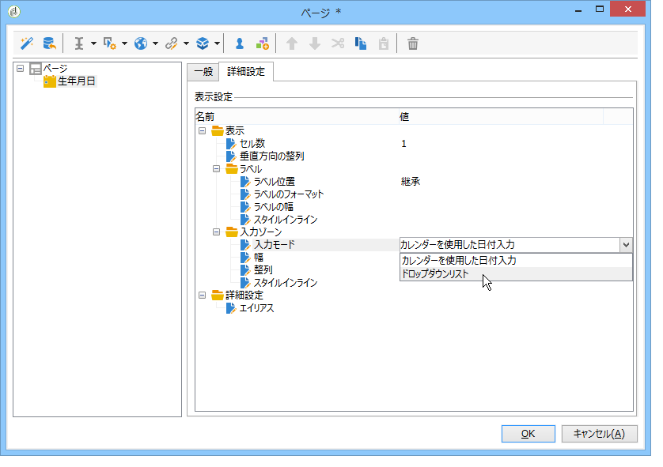</ph></source>
<target xml:lang="en-XX"><ph id="1" ctype="x-IMAGE"></ph></target>
</trans-unit>
<trans-unit id="tu139" xml:space="preserve">
<source xml:lang="en-US">You can then set limits to the values offered in the list.</source>
<target xml:lang="en-XX">次に、リストに提供される値に対する制限を設定できます。</target>
</trans-unit>
<trans-unit id="tu140" xml:space="preserve">
<source xml:lang="en-US"><ph id="1" ctype="x-IMAGE">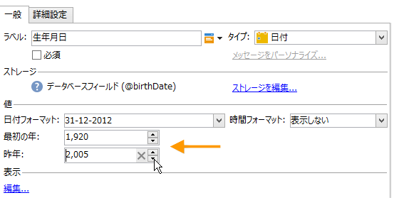</ph></source>
<target xml:lang="en-XX"><ph id="1" ctype="x-IMAGE"></ph></target>
</trans-unit>
<trans-unit id="tu141" xml:space="preserve">
<source xml:lang="en-US">Adding numbers</source>
<target xml:lang="en-XX">数値の追加</target>
</trans-unit>
<trans-unit id="tu142" xml:space="preserve">
<source xml:lang="en-US">You can create suitable fields for the entry of numbers.</source>
<target xml:lang="en-XX">数値の入力に適したフィールドを作成できます。</target>
</trans-unit>
<trans-unit id="tu143" xml:space="preserve">
<source xml:lang="en-US"><ph id="1" ctype="x-IMAGE">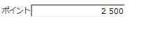</ph></source>
<target xml:lang="en-XX"><ph id="1" ctype="x-IMAGE"></ph></target>
</trans-unit>
<trans-unit id="tu144" xml:space="preserve">
<source xml:lang="en-US">In a numeric field, the user can enter numbers only. Entry control is applied automatically when the page is approved.</source>
<target xml:lang="en-XX">数値フィールドでは、ユーザーは数値のみ入力できます。 ページが承認されると、入力コントロールが自動的に適用されます。</target>
</trans-unit>
<trans-unit id="tu145" xml:space="preserve">
<source xml:lang="en-US">Depending on the field in which data is stored in the database, special formatting or certain restrictions may be applied. You can also specify maximum and minimum values. This type of field is configured as follows:</source>
<target xml:lang="en-XX">データがデータベースに格納されているフィールドに応じて、特別な書式設定または特定の制限が適用されることがあります。 また、最大値および最小値を指定することもできます。 このタイプのフィールドは、次のように設定されます。</target>
</trans-unit>
<trans-unit id="tu146" xml:space="preserve">
<source xml:lang="en-US"><ph id="1" ctype="x-IMAGE">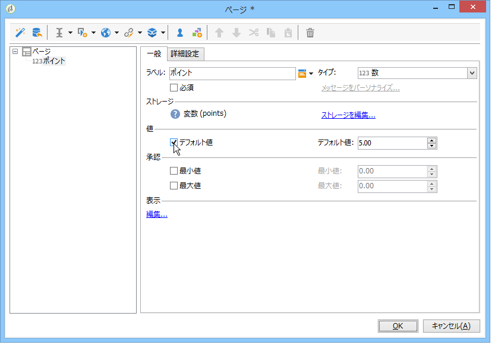</ph></source>
<target xml:lang="en-XX"><ph id="1" ctype="x-IMAGE"></ph></target>
</trans-unit>
<trans-unit id="tu147" xml:space="preserve">
<source xml:lang="en-US">The default value is the value displayed in the field when the form is published. It can be corrected by the user.</source>
<target xml:lang="en-XX">デフォルト値は、フォームがパブリッシュされる際にフィールドに表示される値です。 ユーザーはデフォルト値を変更できます。</target>
</trans-unit>
<trans-unit id="tu148" xml:space="preserve">
<source xml:lang="en-US">You can add a prefix and/or suffix to the numeric field via the <ph id="1" ctype="x-STRONG_EMPHASIS">**[!UICONTROL </ph>Advanced<ph id="3" ctype="x-LINK_REF">]**</ph> tab, as shown below:</source>
<target xml:lang="en-XX">次に示すように、「<ph id="1" ctype="x-STRONG_EMPHASIS">**[!UICONTROL </ph>詳細設定<ph id="3" ctype="x-LINK_REF">]**</ph>」タブを使用して、数値フィールドに接頭辞およびサフィックスを追加できます。</target>
</trans-unit>
<trans-unit id="tu149" xml:space="preserve">
<source xml:lang="en-US"><ph id="1" ctype="x-IMAGE">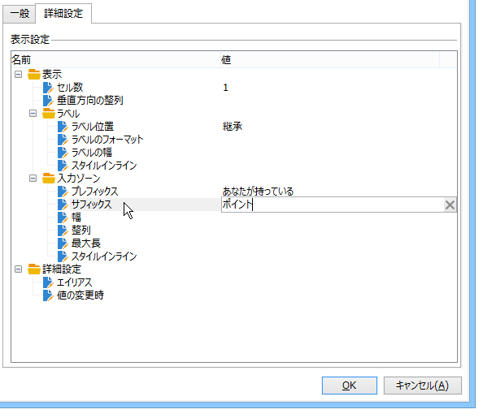</ph></source>
<target xml:lang="en-XX"><ph id="1" ctype="x-IMAGE"></ph></target>
</trans-unit>
<trans-unit id="tu150" xml:space="preserve">
<source xml:lang="en-US">In the form, the rendering will be as follows:</source>
<target xml:lang="en-XX">フォームでは、レンダリングは次のようになります。</target>
</trans-unit>
<trans-unit id="tu151" xml:space="preserve">
<source xml:lang="en-US"><ph id="1" ctype="x-IMAGE">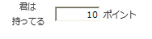</ph></source>
<target xml:lang="en-XX"><ph id="1" ctype="x-IMAGE"></ph></target>
</trans-unit>
<trans-unit id="tu152" xml:space="preserve">
<source xml:lang="en-US">Subscription checkboxes</source>
<target xml:lang="en-XX">購読チェックボックス</target>
</trans-unit>
<trans-unit id="tu153" xml:space="preserve">
<source xml:lang="en-US">You can add controls to allow users to subscribe to or unsubscribe from one or more information services (newsletters, warnings, real-time notifications, etc.). To subscribe, the user checks the corresponding service.</source>
<target xml:lang="en-XX">ユーザーが 1 つまたは複数の情報サービス（ニュースレター、警告、リアルタイム通知など）を購読または購読解除するためのコントロールを追加できます。 購読するには、ユーザーは、対応するサービスをチェックします。</target>
</trans-unit>
<trans-unit id="tu154" xml:space="preserve">
<source xml:lang="en-US">To create a subscription checkbox, click <ph id="1" ctype="x-STRONG_EMPHASIS">**[!UICONTROL </ph>Advanced controls>Subscription<ph id="3" ctype="x-LINK_REF">]**</ph>.</source>
<target xml:lang="en-XX">購読チェックボックスを作成するには、<ph id="1" ctype="x-STRONG_EMPHASIS">**[!UICONTROL </ph>高度なコントロール／購読<ph id="3" ctype="x-LINK_REF">]**</ph>をクリックします。</target>
</trans-unit>
<trans-unit id="tu155" xml:space="preserve">
<source xml:lang="en-US"><ph id="1" ctype="x-IMAGE">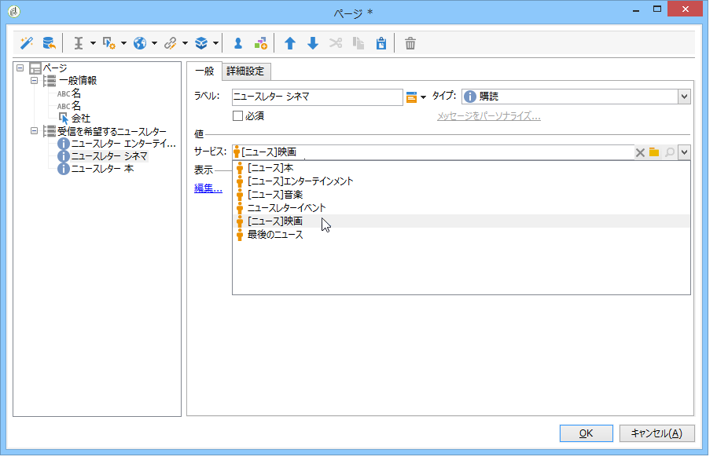</ph></source>
<target xml:lang="en-XX"><ph id="1" ctype="x-IMAGE"></ph></target>
</trans-unit>
<trans-unit id="tu156" xml:space="preserve">
<source xml:lang="en-US">Indicate the label for the checkbox and select the information service concerned using the <ph id="1" ctype="x-STRONG_EMPHASIS">**[!UICONTROL </ph>Service<ph id="3" ctype="x-LINK_REF">]**</ph> drop-down box.</source>
<target xml:lang="en-XX">チェックボックスラベルを示し、<ph id="1" ctype="x-STRONG_EMPHASIS">**[!UICONTROL </ph>サービス<ph id="3" ctype="x-LINK_REF">]**</ph>ドロップダウンボックスを使用して関連する情報サービスを選択します。</target>
</trans-unit>
<trans-unit id="tu157" xml:space="preserve">
<source xml:lang="en-US"><ph id="1" ctype="x-regxph" equiv-text="&lbrack;!NOTE">[!NOTE]</ph></source>
<target xml:lang="en-XX"><ph id="1" ctype="x-regxph" equiv-text="&lbrack;!NOTE">[!NOTE]</ph></target>
</trans-unit>
<trans-unit id="tu158" xml:space="preserve">
<source xml:lang="en-US">Information services are detailed in <ph id="1" ctype="x-LINK">[</ph>this page<ph id="2" ctype="x-LINK">](../../delivery/using/managing-subscriptions.md)</ph>.</source>
<target xml:lang="en-XX">情報サービスについて詳しくは、<ph id="1" ctype="x-LINK">[</ph>このページ<ph id="2" ctype="x-LINK">](../../delivery/using/managing-subscriptions.md)</ph>を参照してください。</target>
</trans-unit>
<trans-unit id="tu159" xml:space="preserve">
<source xml:lang="en-US">The user subscribes to the service by checking the relevant option.</source>
<target xml:lang="en-XX">ユーザーは、関連するオプションをチェックして、サービスを購読します。</target>
</trans-unit>
<trans-unit id="tu160" xml:space="preserve">
<source xml:lang="en-US"><ph id="1" ctype="x-IMAGE">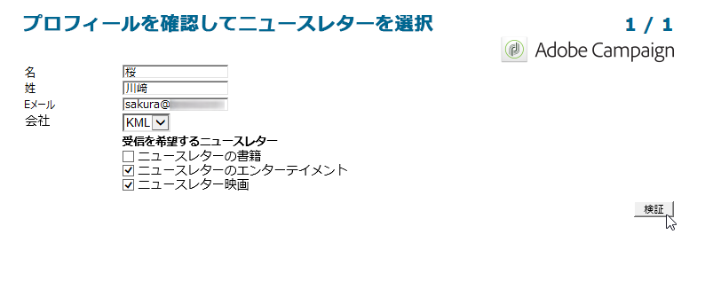</ph></source>
<target xml:lang="en-XX"><ph id="1" ctype="x-IMAGE"></ph></target>
</trans-unit>
<trans-unit id="tu161" xml:space="preserve">
<source xml:lang="en-US"><ph id="1" ctype="x-regxph" equiv-text="&lbrack;!CAUTION">[!CAUTION]</ph></source>
<target xml:lang="en-XX"><ph id="1" ctype="x-regxph" equiv-text="&lbrack;!CAUTION">[!CAUTION]</ph></target>
</trans-unit>
<trans-unit id="tu162" xml:space="preserve">
<source xml:lang="en-US">If the user is already subscribed to an information service and the box linked to this service isn't checked when they approve the form, they will be unsubscribed.</source>
<target xml:lang="en-XX">フォーム承認の際に、ユーザーが既に情報サービスを購読済みで、このサービスにリンクされたボックスがチェックされていない場合、ユーザーは購読解除されます。</target>
</trans-unit>
<trans-unit id="tu163" xml:space="preserve">
<source xml:lang="en-US">Inserting a captcha</source>
<target xml:lang="en-XX">Captcha の挿入</target>
</trans-unit>
<trans-unit id="tu164" xml:space="preserve">
<source xml:lang="en-US">The purpose of <ph id="1" ctype="x-STRONG_EMPHASIS">**</ph>captcha<ph id="2" ctype="x-STRONG_EMPHASIS">**</ph> tests is to prevent fraudulent use of your Web forms.</source>
<target xml:lang="en-XX"><ph id="1" ctype="x-STRONG_EMPHASIS">**</ph>Captcha<ph id="2" ctype="x-STRONG_EMPHASIS">**</ph> テストの目的は、Web フォームの不正使用を防ぐことにあります。</target>
</trans-unit>
<trans-unit id="tu165" xml:space="preserve">
<source xml:lang="en-US"><ph id="1" ctype="x-regxph" equiv-text="&lbrack;!CAUTION">[!CAUTION]</ph></source>
<target xml:lang="en-XX"><ph id="1" ctype="x-regxph" equiv-text="&lbrack;!CAUTION">[!CAUTION]</ph></target>
</trans-unit>
<trans-unit id="tu166" xml:space="preserve">
<source xml:lang="en-US">If your form contains several pages, the Captcha must always be placed on the last page, just before the storage box, to prevent any circumvention of the security measures.</source>
<target xml:lang="en-XX">フォームにいくつかのページが含まれている場合、セキュリティ対策の回避を防ぐために、Captcha は、常に最後のページの、ストレージボックスの直前に配置されている必要があります。</target>
</trans-unit>
<trans-unit id="tu167" xml:space="preserve">
<source xml:lang="en-US">To insert a Captcha into a form, click the first button on the toolbar and Select <ph id="1" ctype="x-STRONG_EMPHASIS">**[!UICONTROL </ph>Advanced controls>Captcha<ph id="3" ctype="x-LINK_REF">]**</ph>.</source>
<target xml:lang="en-XX">Captcha をフォームに挿入するには、ツールバーの最初のボタンをクリックし、<ph id="1" ctype="x-STRONG_EMPHASIS">**[!UICONTROL </ph>高度なコントロール／Captcha<ph id="3" ctype="x-LINK_REF">]**</ph> を選択します。</target>
</trans-unit>
<trans-unit id="tu168" xml:space="preserve">
<source xml:lang="en-US"><ph id="1" ctype="x-IMAGE">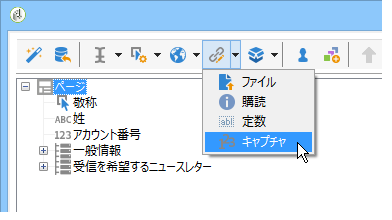</ph></source>
<target xml:lang="en-XX"><ph id="1" ctype="x-IMAGE"></ph></target>
</trans-unit>
<trans-unit id="tu169" xml:space="preserve">
<source xml:lang="en-US">Enter the label of the field. This label will be displayed in front of the Captcha display area. You can change the position of this label in the <ph id="1" ctype="x-STRONG_EMPHASIS">**[!UICONTROL </ph>Advanced<ph id="3" ctype="x-LINK_REF">]**</ph> tab.</source>
<target xml:lang="en-XX">フィールドのラベルを入力します。 このラベルは、Captcha 表示領域の前に表示されます。 「<ph id="1" ctype="x-STRONG_EMPHASIS">**[!UICONTROL </ph>詳細設定<ph id="3" ctype="x-LINK_REF">]**</ph>」タブで、このラベルの位置を変更できます。</target>
</trans-unit>
<trans-unit id="tu170" xml:space="preserve">
<source xml:lang="en-US"><ph id="1" ctype="x-IMAGE">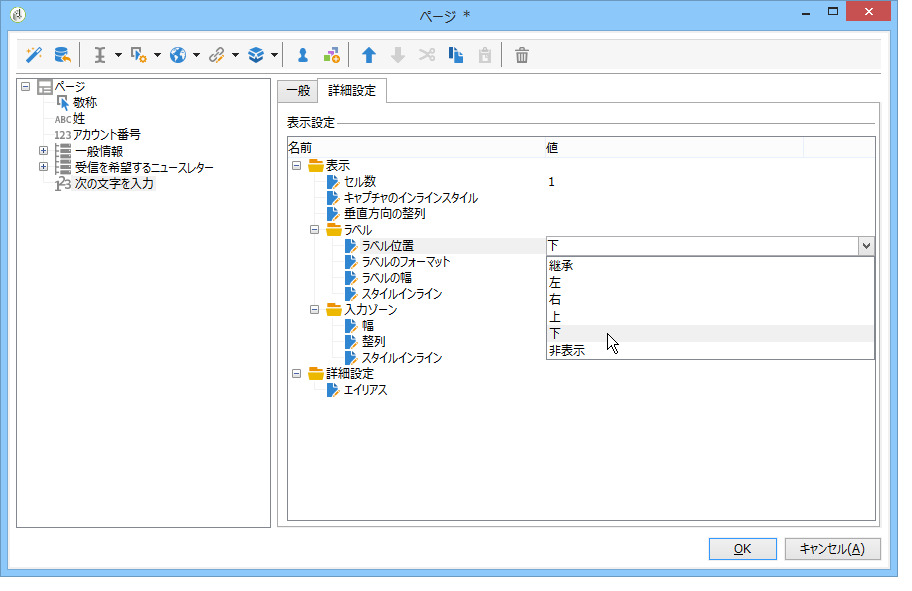</ph></source>
<target xml:lang="en-XX"><ph id="1" ctype="x-IMAGE"></ph></target>
</trans-unit>
<trans-unit id="tu171" xml:space="preserve">
<source xml:lang="en-US"><ph id="1" ctype="x-regxph" equiv-text="&lbrack;!NOTE">[!NOTE]</ph></source>
<target xml:lang="en-XX"><ph id="1" ctype="x-regxph" equiv-text="&lbrack;!NOTE">[!NOTE]</ph></target>
</trans-unit>
<trans-unit id="tu172" xml:space="preserve">
<source xml:lang="en-US">For <ph id="1" ctype="x-STRONG_EMPHASIS">**[!UICONTROL </ph>captcha<ph id="3" ctype="x-LINK_REF">]**</ph> type controls, there is no need to indicate a storage field or variable.</source>
<target xml:lang="en-XX"><ph id="1" ctype="x-STRONG_EMPHASIS">**[!UICONTROL </ph>Captcha<ph id="3" ctype="x-LINK_REF">]**</ph> タイプのコントロールの場合、ストレージフィールドまたは変数を示す必要はありません。</target>
</trans-unit>
<trans-unit id="tu173" xml:space="preserve">
<source xml:lang="en-US">The Captcha is inserted into the page with an input field placed under the visual. These two elements are inseparable and are considered as a single item for the purpose of page layout (they occupy a single cell).</source>
<target xml:lang="en-XX">Captcha は、ビジュアルの下に配置された入力フィールドでページに挿入されます。 これらの 2 つの要素は、分離できず、ページレイアウトのための単一の項目とみなされます（これらは単一のセルを占有します）。</target>
</trans-unit>
<trans-unit id="tu174" xml:space="preserve">
<source xml:lang="en-US"><ph id="1" ctype="x-IMAGE">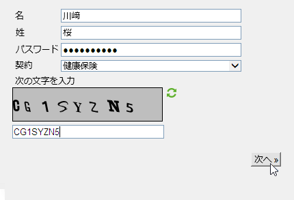</ph></source>
<target xml:lang="en-XX"><ph id="1" ctype="x-IMAGE"></ph></target>
</trans-unit>
<trans-unit id="tu175" xml:space="preserve">
<source xml:lang="en-US">When the page is confirmed, the input field is displayed in red if the content of the Captcha was not entered correctly.</source>
<target xml:lang="en-XX">ページが確認される際に、Captcha のコンテンツが適切に入力されなかった場合、入力フィールドが赤で表示されます。</target>
</trans-unit>
<trans-unit id="tu176" xml:space="preserve">
<source xml:lang="en-US"><ph id="1" ctype="x-IMAGE">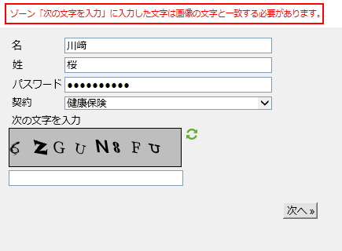</ph></source>
<target xml:lang="en-XX"><ph id="1" ctype="x-IMAGE"></ph></target>
</trans-unit>
<trans-unit id="tu177" xml:space="preserve">
<source xml:lang="en-US">You can create an error message to display. To do that, use the <ph id="1" ctype="x-STRONG_EMPHASIS">**[!UICONTROL </ph>Personalize the message<ph id="3" ctype="x-LINK_REF">]**</ph> link in the <ph id="5" ctype="x-STRONG_EMPHASIS">**[!UICONTROL </ph>General<ph id="7" ctype="x-LINK_REF">]**</ph> tab.</source>
<target xml:lang="en-XX">表示するエラーメッセージを作成できます。 これをおこなうには、「<ph id="5" ctype="x-STRONG_EMPHASIS">**[!UICONTROL </ph>一般<ph id="7" ctype="x-LINK_REF">]**</ph>」タブの「<ph id="1" ctype="x-STRONG_EMPHASIS">**[!UICONTROL </ph>メッセージをパーソナライズ<ph id="3" ctype="x-LINK_REF">]**</ph>」リンクを使用します。</target>
</trans-unit>
<trans-unit id="tu178" xml:space="preserve">
<source xml:lang="en-US"><ph id="1" ctype="x-IMAGE">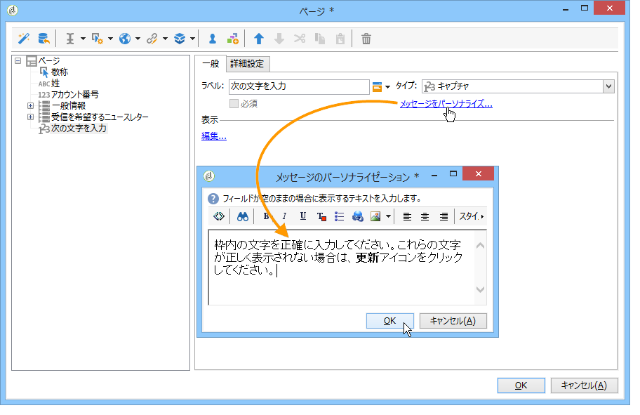</ph></source>
<target xml:lang="en-XX"><ph id="1" ctype="x-IMAGE"></ph></target>
</trans-unit>
<trans-unit id="tu179" xml:space="preserve">
<source xml:lang="en-US"><ph id="1" ctype="x-regxph" equiv-text="&lbrack;!NOTE">[!NOTE]</ph></source>
<target xml:lang="en-XX"><ph id="1" ctype="x-regxph" equiv-text="&lbrack;!NOTE">[!NOTE]</ph></target>
</trans-unit>
<trans-unit id="tu180" xml:space="preserve">
<source xml:lang="en-US">Captchas are always 8 characters long. You cannot modify this value.</source>
<target xml:lang="en-XX">Captcha の長さは常に 8 文字です。 この値は修正できません。</target>
</trans-unit>
<trans-unit id="tu181" xml:space="preserve">
<source xml:lang="en-US">Uploading a file</source>
<target xml:lang="en-XX">ファイルのアップロード</target>
</trans-unit>
<trans-unit id="tu182" xml:space="preserve">
<source xml:lang="en-US">You can add an upload field to a page. This functionality can be useful for intranet file sharing, for instance.</source>
<target xml:lang="en-XX">アップロードフィールドをページに追加できます。 この機能は、イントラネットのファイル共有などに便利です。</target>
</trans-unit>
<trans-unit id="tu183" xml:space="preserve">
<source xml:lang="en-US"><ph id="1" ctype="x-IMAGE">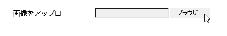</ph></source>
<target xml:lang="en-XX"><ph id="1" ctype="x-IMAGE"></ph></target>
</trans-unit>
<trans-unit id="tu184" xml:space="preserve">
<source xml:lang="en-US">To insert an upload field to a form page, select the <ph id="1" ctype="x-STRONG_EMPHASIS">**[!UICONTROL </ph>Advanced controls > File...<ph id="3" ctype="x-LINK_REF">]**</ph> menu in the toolbar of the page editor.</source>
<target xml:lang="en-XX">アップロードフィールドをフォームページに挿入するには、ページエディターのツールバーで、<ph id="1" ctype="x-STRONG_EMPHASIS">**[!UICONTROL </ph>高度なコントロール／ファイル<ph id="3" ctype="x-LINK_REF">]**</ph>メニューを選択します。</target>
</trans-unit>
<trans-unit id="tu185" xml:space="preserve">
<source xml:lang="en-US">By default, the uploaded files are stored in resource files accessible via the <ph id="1" ctype="x-STRONG_EMPHASIS">**[!UICONTROL </ph>Resources > Online > Public resources<ph id="3" ctype="x-LINK_REF">]**</ph> menu. You can use a script to change this behavior. This script can use the functions defined in <ph id="5" ctype="x-LINK">&lbrack;</ph>Campaign JSAPI documentation<ph id="6" ctype="x-LINK">[#$tu186]</ph>, including those that concern file manipulation.</source>
<target xml:lang="en-XX">デフォルトでは、更新されたファイルは、<ph id="1" ctype="x-STRONG_EMPHASIS">**[!UICONTROL </ph>リソース／オンライン／パブリックリソース<ph id="3" ctype="x-LINK_REF">]**</ph>メニューでアクセスできるリソースファイルに格納されます。 この動作は、スクリプトを使用して変更できます。 このスクリプトは、<ph id="5" ctype="x-LINK">&lbrack;</ph>Campaign JSAPI ドキュメント<ph id="6" ctype="x-LINK">[#$tu186]</ph>で定義された関数を使用できます。これには、ファイル操作に関連する関数が含まれます。</target>
</trans-unit>
<trans-unit id="tu187" xml:space="preserve">
<source xml:lang="en-US">You can store the link to these files in a local variable or in a database field. For example, you can extend the recipient schema to add a link to file-based resources.</source>
<target xml:lang="en-XX">ローカル変数またはデータベースフィールドで、これらのファイルにリンクを格納できます。 例えば、受信者スキーマを拡張して、ファイルベースのリソースにリンクを追加できます。</target>
</trans-unit>
<trans-unit id="tu188" xml:space="preserve">
<source xml:lang="en-US"><ph id="1" ctype="x-regxph" equiv-text="&lbrack;!CAUTION">[!CAUTION]</ph></source>
<target xml:lang="en-XX"><ph id="1" ctype="x-regxph" equiv-text="&lbrack;!CAUTION">[!CAUTION]</ph></target>
</trans-unit>
<trans-unit id="tu189" xml:space="preserve">
<source xml:lang="en-US">This type of file must be reserved for forms with secure access (using credentials).</source>
<target xml:lang="en-XX">このタイプのファイルは、（資格情報を使用した）フォームへの安全なアクセス専用です。</target>
</trans-unit>
<trans-unit id="tu190" xml:space="preserve">
<source xml:lang="en-US">Adobe Campaign does not control the size or the type of resource uploaded: we therefore highly recommend using upload fields for secure type intranet sites only.</source>
<target xml:lang="en-XX">Adobe Campaign は、アップロードされたリソースのサイズまたはタイプを制御しません。そのため、安全なタイプのイントラネットサイトのみのアップロードフィールドを使用することを強くお勧めします。</target>
</trans-unit>
<trans-unit id="tu191" xml:space="preserve">
<source xml:lang="en-US">If several servers are linked to the instance (load balancing architecture), you need to make sure calls to the Web form arrive on the same server.</source>
<target xml:lang="en-XX">いくつかのサーバーがインスタンス（ロードバランシングアーキテクチャ）にリンクされている場合、同じサーバーに到達する Web フォームに対する呼び出しを確認する必要があります。</target>
</trans-unit>
<trans-unit id="tu192" xml:space="preserve">
<source xml:lang="en-US">These implementations require the assistance of the Adobe Campaign Consulting team.</source>
<target xml:lang="en-XX">これらの実装には、Adobe Campaign コンサルティングチームの支援が必要です。</target>
</trans-unit>
<trans-unit id="tu193" xml:space="preserve">
<source xml:lang="en-US">Inserting a hidden constant</source>
<target xml:lang="en-XX">非表示定数の挿入</target>
</trans-unit>
<trans-unit id="tu194" xml:space="preserve">
<source xml:lang="en-US">When the user validates one of the pages of the form, you can set a specific value to a field of their profile or to a variable.</source>
<target xml:lang="en-XX">ユーザーがフォームのページの 1 つを検証する場合、ユーザーのプロファイルのフィールドまたは変数に特定の値を設定できます。</target>
</trans-unit>
<trans-unit id="tu195" xml:space="preserve">
<source xml:lang="en-US">This field is not visible to the user, but can be used to enrich the data in the user profile.</source>
<target xml:lang="en-XX">このフィールドは、ユーザーには表示されませんが、ユーザープロファイルのデータエンリッチメントに使用できます。</target>
</trans-unit>
<trans-unit id="tu196" xml:space="preserve">
<source xml:lang="en-US">To do this, place a <ph id="1" ctype="x-STRONG_EMPHASIS">**</ph>constant<ph id="2" ctype="x-STRONG_EMPHASIS">**</ph> in the page and specify the value and the storage location.</source>
<target xml:lang="en-XX">それには、ページに<ph id="1" ctype="x-STRONG_EMPHASIS">**</ph>定数<ph id="2" ctype="x-STRONG_EMPHASIS">**</ph>を配置し、その値と保存場所を指定します。</target>
</trans-unit>
<trans-unit id="tu197" xml:space="preserve">
<source xml:lang="en-US">In the following example, the <ph id="1" ctype="x-STRONG_EMPHASIS">**</ph>origin<ph id="2" ctype="x-STRONG_EMPHASIS">**</ph> field of the recipient profile is filled in automatically whenever a user approves this page. The constant is not displayed on the page.</source>
<target xml:lang="en-XX">次の例では、ユーザーがこのページを承認するたびに、受信者プロファイルの「<ph id="1" ctype="x-STRONG_EMPHASIS">**</ph>起源<ph id="2" ctype="x-STRONG_EMPHASIS">**</ph>」フィールドに自動的に値が入力されます。 定数は、このページには表示されません。</target>
</trans-unit>
<trans-unit id="tu198" xml:space="preserve">
<source xml:lang="en-US"><ph id="1" ctype="x-IMAGE">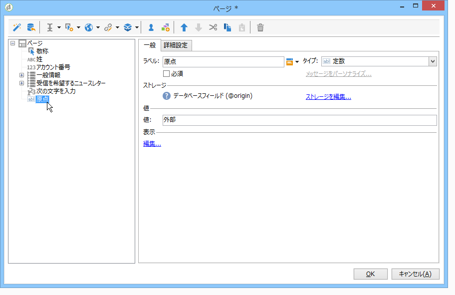</ph></source>
<target xml:lang="en-XX"><ph id="1" ctype="x-IMAGE"></ph></target>
</trans-unit>
</body>
</file>
</xliff>