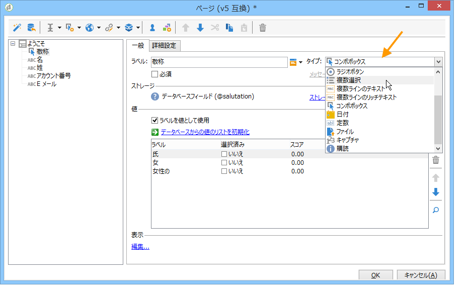
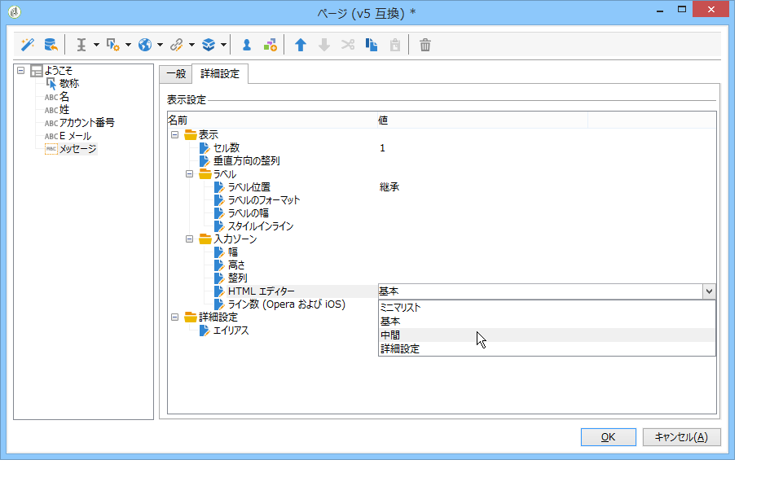

# Web フォームへのフィールドの追加{#adding-fields-to-a-web-form}

Web フォームのフィールドは、ユーザーによる情報の入力とオプションの選択を可能にします。Web フォームにより、入力フィールド、選択フィールド、静的コンテンツおよび高度なコンテンツ（Captcha、購読など）を提供できます。

ウィザードを使用してフィールドを追加する場合、フィールドタイプは、選択したフィールドまたはストレージ変数に基づいて自動的に検出されます。「**[!UICONTROL 一般]**」タブの&#x200B;**[!UICONTROL タイプ]**&#x200B;ドロップダウンボックスを使用して編集できます。

ツールバーのボタンを使用する場合、追加するフィールドのタイプを選択します。

次のフィールドのタイプを使用できます。

* テキスト／数値入力：[入力フィールドの追加](#adding-input-fields)を参照してください。
* ドロップダウンリストの選択：[ドロップダウンリストの追加](#adding-drop-down-lists)を参照してください。
* チェックボックスを使用した複数選択：[チェックボックスの追加](#adding-checkboxes)を参照してください。
* ラジオボタンを使用した排他的な選択：[ラジオボタンの追加](#adding-radio-buttons)を参照してください。
* オプショングリッドでの投票：[グリッドの追加](#adding-grids)を参照してください。
* 数値と日付：[日付と数値の追加](#adding-dates-and-numbers)を参照してください。
* 情報サービスの購読／購読解除：[購読チェックボックス](#subscription-checkboxes)を参照してください。
* キャプチャの検証：[キャプチャの挿入](#inserting-a-captcha)を参照してください。
* ダウンロードボタン：[ファイルのアップロード](#uploading-a-file)を参照してください。
* 非表示の定数：[非表示の定数の挿入](#inserting-a-hidden-constant)を参照してください。

回答ストレージモード（データベースのフィールドを更新する（最後に保存した値のみ格納）か、変数に格納する（回答は格納されない））を指定してください。詳しくは、[回答ストレージフィールド](../../web/using/web-forms-answers.md#response-storage-fields)を参照してください。

>[!NOTE]
>
>デフォルトでは、フィールドは、現在のツリーの下部に挿入されます。ツールバーの矢印を使用して上下に移動します。

## フィールド作成ウィザード {#field-creation-wizard}

フォームの各ページで、ツールバーの最初のボタンを使用してフィールドを追加できます。これをおこなうには、**[!UICONTROL ウィザードを使用して追加]**&#x200B;メニューに移動します。

作成するフィールドのタイプを選択します。データベースのフィールドを追加する方法、変数を追加する方法、または別のフォームで作成してコンテナに収集されたフィールドグループをインポートする方法から選択できます。

「**[!UICONTROL 次へ]**」をクリックし、ストレージフィールド、変数、またはインポートするコンテナを選択します。

「**[!UICONTROL 完了]**」をクリックして、選択したフィールドをページに挿入します。

## 入力フィールドの追加 {#adding-input-fields}

入力フィールドを追加するには、「**[!UICONTROL 入力コントロール]**」ボタンをクリックし、追加するフィールドのタイプを選択します。

### 入力フィールドのタイプ {#types-of-input-fields}

5 種類のテキストフィールドをフォームページに挿入できます。

* **テキスト**：ユーザーは 1 行にテキストを入力できます。

   

* **数値**：ユーザーは 1 行に数値を入力できます。詳しくは、[数値の追加](#adding-numbers)を参照してください。

   ページが承認されると、入力された値がフィールドに適合することを確認するために、フィールドコンテンツがチェックされます。詳しくは、[コントロール設定の定義](../../web/using/form-rendering.md#defining-control-settings)を参照してください。

* **パスワード**：ユーザーは 1 行にテキストを入力できます。テキスト入力中、文字はピリオドで置き換えられます。

   

   >[!CAUTION]
   >
   >パスワードは、データベースに暗号化されずに格納されます。

* **複数ラインテキスト**：ユーザーは複数行にテキストを入力できます。

   

   >[!CAUTION]
   >
   >複数ラインフィールドは、改行を含むことができる特殊なフィールドです。そのストレージスペースは、XML 属性ではなく、XML 要素にマッピングされたフィールドに関連付けられている必要があります。スキーマのデータのタイプについて詳しくは、[この節](../../configuration/using/about-schema-reference.md)の「スキーマリファレンス」の章を参照してください。
   >   
   >**調査**&#x200B;モジュールを使用している場合、このタイプのフィールドを、アーカイブされたフィールドに格納できます。アーカイブされたフィールドは、自動的にその形式に適応します。詳しくは、[この節](../../web/using/about-surveys.md)を参照してください。

* **エンリッチメントされた複数ラインテキスト**：ユーザーは HTML 形式で格納されるレイアウトを使用してテキストを入力できます。

   

   ユーザーに提供されるエディターのタイプを選択できます。これをおこなうには、「**[!UICONTROL 詳細設定]**」タブにある「**[!UICONTROL HTML エディター]**」フィールドのドロップダウンボックスを使用します。

   

   表示されるアイコンの数は、エディターのタイプによって異なります。**[!UICONTROL 詳細設定]**&#x200B;エディターの場合のレンダリングを次に示します。

   

### 入力フィールドの設定 {#configure-input-fields}

入力フィールドは、次のオプションを使用して、すべて同じモードに基づいて設定されます。

「**[!UICONTROL 一般]**」タブを使用すると、フィールドの名前を入力でき、必要に応じてデフォルト値にすることができます。

回答ストレージモードは、「**[!UICONTROL ストレージを編集]**」リンクを使用して変更できます。値は、データベースの既存のフィールドに格納されます。または、情報をデータベースに保存しないように選択することもできます（ローカル変数を使用）。

>[!NOTE]
>
>ストレージモードについて詳しくは、[回答ストレージフィールド](../../web/using/web-forms-answers.md#response-storage-fields)を参照してください。

「**[!UICONTROL 詳細設定]**」タブを使用すると、フィールドの表示パラメーターを定義できます（ラベルの位置、整列など）。[Web フォームレイアウトの定義](../../web/using/defining-web-forms-layout.md)を参照してください。

## ドロップダウンリストの追加 {#adding-drop-down-lists}

調査ページにドロップダウンリストを挿入できます。これにより、ユーザーは、ドロップダウンメニューで提供される値を選択できます。

ドロップダウンボックスをフォームページに追加するには、ページエディターのツールバーで、**[!UICONTROL 選択コントロール／ドロップダウンリスト]**&#x200B;ボタンをクリックします。

回答ストレージモードを選択して、選択内容を確認します。

「**[!UICONTROL 一般]**」タブの下のセクションで、リストのラベルおよび値を定義します。情報がデータベースの既存のフィールドに格納されており、列挙フィールドである場合、次に示すように、「**[!UICONTROL データベースから取得した値のリストを初期化]**」をクリックすることで、値を自動的に入力できます。

>[!NOTE]
>
>値のリストの右側の矢印を使用して、順序を変更します。

リンクされたテーブルにデータが格納されている場合、リストに候補として提示される値が保存されたフィールドを選択できます。例えば、国のテーブルを選択する場合、「**[!UICONTROL データベースから取得した値のリストを初期化]**」をクリックして、目的のフィールドを選択します。

次に、「**[!UICONTROL 読み込み]**」リンクをクリックして値を取得します。

>[!CAUTION]
>
>リストが更新されたら、この操作を繰り返して、オファーの値を更新します。

## チェックボックスの追加 {#adding-checkboxes}

ユーザーがオプションを選択するには、チェックボックスを使用する必要があります。

チェックボックスをフォームに追加するには、ページエディターのツールバーで、**[!UICONTROL 選択コントロール／チェックボックス]**&#x200B;アイコンをクリックします。

回答ストレージモードを選択して、選択内容を確認します。

「**[!UICONTROL 一般]**」タブの「**[!UICONTROL ラベル]**」フィールドにボックスのラベルを入力します。

チェックボックスを使用すると、ボックスがチェックされているかどうかに応じて、ストレージフィールド（または値）に値を割り当てることができます。「**[!UICONTROL 値]**」セクションを使用すると、ボックスがチェックされている場合に割り当てる値（「**[!UICONTROL 値]**」フィールド）と、チェックされていない場合に割り当てる値（「**[!UICONTROL 空の値]**」フィールド）を入力できます。これらの値は、データストレージ形式によって異なります。

ストレージフィールド（または変数）がブール値の場合、ボックスがチェックされていない場合に割り当てる値は、自動的に推測されます。この場合、次に示すように、「**[!UICONTROL チェックされている場合の値]**」フィールドのみが提供されます。

## 例：ボックスがチェックされている場合のフィールドへの値の割り当て {#example--assign-a-value-to-a-field-if-a-box-is-checked}

次に示すように、メンテナンスリクエストを送信するために、フォームにチェックボックスを挿入します。

データベースおよび既存のフィールドに対して、情報が更新されます（この場合、「**[!UICONTROL コメント]**」フィールド）。

「メンテナンスが必要」ボックスがチェックされている場合、「**[!UICONTROL コメント]**」列に「メンテナンスが必要」が格納されますボックスがチェックされていない場合、この列には「メンテナンスは不要」と表示されます。この結果を得るには、フォームページ上のチェックボックスに対して、次の設定を適用します。

## ラジオボタンの追加 {#adding-radio-buttons}

ラジオボタンを使用すると、一連の排他的な選択オプションをユーザーに提供できます。同じフィールドに異なる値があります。

ラジオボタンを個別に作成（ユニットボタン）したり、複数選択リストを使用して作成できますが、ラジオボタンの要点はいずれか 1 つのオプションを選択することなので、単一のボタンのみではなく、常に少なくとも 2 つのラジオボタンを作成します。

>[!CAUTION]
>
>強制的に選択するには、複数選択リストを作成する必要があります。

### 単一のボタンの追加 {#add-single-buttons}

ラジオボタンをフォームページに追加するには、ページエディターのツールバーで、**[!UICONTROL 選択コントロール／ラジオボタン]**&#x200B;メニューに移動し、ストレージモードを選択します。

ラジオボタンは、チェックボックスと同じ方法で設定されます（[チェックボックスの追加](#adding-checkboxes)を参照）。ただし、オプションが選択されていない場合、値は割り当てられません。いくつかのボタンを相互依存させるには、つまり、1 つを選択することでその他を自動的に選択解除するには、同じフィールドに格納する必要があります。データベースに格納されていない場合、一時的なストレージとして同じローカル変数が使用される必要があります。[回答ストレージフィールド](../../web/using/web-forms-answers.md#response-storage-fields)を参照してください。

### ボタンのリストの追加 {#add-a-list-of-buttons}

リストを使用してラジオボタンを追加するには、ページエディターのツールバーで、**[!UICONTROL 選択コントロール／複数選択]**&#x200B;メニューに移動します。

ラベルと同じ数のラジオボタンを追加します。この機能の利点は、既存のフィールドから値をインポートできる（項目別フィールドの場合）ことと、ユーザーに 1 つのオプションを選択させることができることです。ただし、ボタンのレイアウトにはあまり柔軟性がありません。

>[!NOTE]
>
>Web フォームは、いくつかの値の選択を承認しません。複数選択は、**調査**&#x200B;タイプのフォームでのみ有効化できます。詳しくは、[この節](../../web/using/about-surveys.md)を参照してください。\
>確かに、**[!UICONTROL 複数選択]**&#x200B;タイプのフィールドを Web アプリケーションに挿入することはできますが、いくつかの値の選択は承認されません（提供されたオプションは、ラジオボタンを使用して選択できます）。

## グリッドの追加 {#adding-grids}

グリッドは、Web アプリケーションの投票ページをデザインするために使用されます。これにより、次に示すように、調査または評価タイプの Web フォームに回答するためのラジオボタンのリストを提供できます。

このタイプの要素をフォームで使用するには、シンプルグリッドを作成して、評価される各要素のための線を追加します。

グリッドの各線のラジオボタンの数は、シンプルグリッドで定義された値に一致します。

グリッド線あたり 1 つのオプションのみ選択できます。

>[!NOTE]
>
>この例では、グリッドのラベルは非表示です。これをおこなうには、「**[!UICONTROL 詳細設定]**」タブに移動して、「**[!UICONTROL ラベル位置]**」表示を「**[!UICONTROL 非表示]**」として定義します。[ラベルの位置の定義](../../web/using/defining-web-forms-layout.md#defining-the-position-of-labels)を参照してください。

## 日付と数値の追加 {#adding-dates-and-numbers}

フォームフィールドのコンテンツは、データベースに格納されたデータに一致するように書式設定したり、特定の要件を満たすように書式設定したりできます。数値および日付の入力に適したフィールドを作成できます。

### 日付の追加 {#adding-dates}

ユーザーがフォームページに日付を入力できるようにするには、ページエディターのツールバーで、**[!UICONTROL 入力フィールドを追加／日付]**&#x200B;を選択します。

フィールドのラベルを入力し、データストレージモードを設定します。

ウィンドウの下部のセクションでは、このフィールドに格納される値の日付および時間の形式を選択できます。

また、日付（または時間）を表示しないように選択することもできます。

日付は、カレンダーまたはドロップダウンボックスを使用して選択できます。また、フィールドに直接入力することもできますが、上の画面で指定した形式に一致させる必要があります。

>[!NOTE]
>
>デフォルトでは、フォームで使用される日付は、カレンダーを使用して入力されます。多言語のフォームの場合、使用するすべての言語でカレンダーが使用できることを確認してください。[Web フォームの翻訳](../../web/using/translating-a-web-form.md)を参照してください。

ただし、（例えば誕生日の入力など）場合によっては、ドロップダウンリストを使用するほうが簡単なことがあります。

これをおこなうには、「**[!UICONTROL 詳細設定]**」タブをクリックして、**[!UICONTROL ドロップダウンリスト]**&#x200B;を使用する入力モードを選択します。

次に、リストに提供される値に対する制限を設定できます。

### 数値の追加 {#adding-numbers}

数値の入力に適したフィールドを作成できます。

数値フィールドでは、ユーザーは数値のみ入力できます。ページが承認されると、入力コントロールが自動的に適用されます。

データがデータベースに格納されているフィールドに応じて、特別な書式設定または特定の制限が適用されることがあります。また、最大値および最小値を指定することもできます。このタイプのフィールドは、次のように設定されます。

デフォルト値は、フォームがパブリッシュされる際にフィールドに表示される値です。ユーザーはデフォルト値を変更できます。

次に示すように、「**[!UICONTROL 詳細設定]**」タブを使用して、数値フィールドにプレフィックスおよびサフィックスを追加できます。

フォームでは、レンダリングは次のようになります。

## 購読チェックボックス {#subscription-checkboxes}

ユーザーが 1 つまたは複数の情報サービス（ニュースレター、警告、リアルタイム通知など）を購読または購読解除するためのコントロールを追加できます。購読するには、ユーザーは、対応するサービスをチェックします。

購読チェックボックスを作成するには、**[!UICONTROL 高度なコントロール／購読]**&#x200B;をクリックします。

チェックボックスラベルを示し、**[!UICONTROL サービス]**&#x200B;ドロップダウンボックスを使用して関連する情報サービスを選択します。

>[!NOTE]
>
>情報サービスについて詳しくは、[このページ](../../delivery/using/managing-subscriptions.md)を参照してください。

ユーザーは、関連するオプションをチェックして、サービスを購読します。

>[!CAUTION]
>
>フォーム承認の際に、ユーザーが既に情報サービスを購読済みで、このサービスにリンクされたボックスがチェックされていない場合、ユーザーは購読解除されます。

購読と紹介の例については、[この節](../../web/using/about-surveys.md)を参照してください。

## Captcha の挿入 {#inserting-a-captcha}

**Captcha** テストの目的は、Web フォームの不正使用を防ぐことにあります。

>[!CAUTION]
>
>フォームにいくつかのページが含まれている場合、セキュリティ対策の回避を防ぐために、Captcha は、常に最後のページの、ストレージボックスの直前に配置されている必要があります。

Captcha をフォームに挿入するには、ツールバーの最初のボタンをクリックし、**[!UICONTROL 高度なコントロール／Captcha]** を選択します。

フィールドのラベルを入力します。このラベルは、Captcha 表示領域の前に表示されます。「**[!UICONTROL 詳細設定]**」タブで、このラベルの位置を変更できます。

>[!NOTE]
>
>**[!UICONTROL Captcha]** タイプのコントロールの場合、ストレージフィールドまたは変数を示す必要はありません。

Captcha は、ビジュアルの下に配置された入力フィールドでページに挿入されます。これらの 2 つの要素は、分離できず、ページレイアウトのための単一の項目とみなされます（これらは単一のセルを占有します）。

ページが確認される際に、Captcha のコンテンツが適切に入力されなかった場合、入力フィールドが赤で表示されます。

表示するエラーメッセージを作成できます。これをおこなうには、「**[!UICONTROL 一般]**」タブの「**[!UICONTROL メッセージをパーソナライズ]**」リンクを使用します。

>[!NOTE]
>
>Captcha の長さは常に 8 文字です。この値は修正できません。

## ファイルのアップロード {#uploading-a-file}

アップロードフィールドをページに追加できます。この機能は、イントラネットのファイル共有などに便利です。

アップロードフィールドをフォームページに挿入するには、ページエディターのツールバーで、**[!UICONTROL 高度なコントロール／ファイル]**&#x200B;メニューを選択します。

デフォルトでは、更新されたファイルは、**[!UICONTROL リソース／オンライン／パブリックリソース]**&#x200B;メニューでアクセスできるリソースファイルに格納されます。この動作は、スクリプトを使用して変更できます。このスクリプトは、[Campaign JSAPI ドキュメント](https://docs.adobe.com/content/help/en/campaign-classic/technicalresources/api/index.html)で定義された関数を使用できます。これには、ファイル操作に関連する関数が含まれます。

ローカル変数またはデータベースフィールドで、これらのファイルにリンクを格納できます。例えば、受信者スキーマを拡張して、ファイルベースのリソースにリンクを追加できます。

>[!CAUTION]
>
>* このタイプのファイルは、（資格情報を使用した）フォームへの安全なアクセス専用です。
>* Adobe Campaign は、アップロードされたリソースのサイズまたはタイプを制御しません。そのため、安全なタイプのイントラネットサイトのみのアップロードフィールドを使用することを強くお勧めします。
>* いくつかのサーバーがインスタンス（ロードバランシングアーキテクチャ）にリンクされている場合、同じサーバーに到達する Web フォームに対する呼び出しを確認する必要があります。
>* これらの実装には、Adobe Campaign コンサルティングチームの支援が必要です。

>

## 非表示の定数の挿入 {#inserting-a-hidden-constant}

ユーザーがフォームのいずれかのページに移動する際にフィールドをハイライトできます。これをおこなうには、ページに定数を配置し、値とストレージの場所を指定します。

このフィールドは、ユーザーには表示されませんが、ユーザープロファイルのデータをエンリッチメントするために使用できます。

次の例では、ユーザーがこのページを承認するといつでも、受信者プロファイルの **origin** ファイルに自動的に入力されます。定数は、このページには表示されません。

