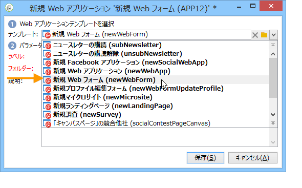

# 調査の構築{#building-a-survey}

## 新しい調査の作成 {#creating-a-new-survey}

ここでは、Adobe Campaign を使用した&#x200B;**調査**&#x200B;タイプのフォームのデザインと、利用可能なオプションおよび設定について説明します。Adobe Campaign を使用して、作成した調査をユーザーが利用できるようにし、回答を収集してデータベースにアーカイブします。

Web フォームは、ツリーの&#x200B;**[!UICONTROL リソース／オンライン／Web アプリケーション]**&#x200B;ノードからアクセスできます。調査を作成するには、アプリケーションのリストの上にある「**[!UICONTROL 新規]**」ボタンをクリックするか、リストを右クリックして、「**[!UICONTROL 新規]**」を選択します。

調査テンプレートを選択します（デフォルトは **[!UICONTROL newSurvey]**）。

フォームのページは、入力ゾーン（テキスト）、選択フィールド（リスト、チェックボックスなど）および静的要素（画像、HTML コンテンツなど）を定義および設定できる、特別なエディターで作成されます。フォームのページは、「コンテナ」に収集でき、要件に応じてレイアウトできます（[質問の追加](#adding-questions)を参照）。

>[!NOTE]
>
>Web フォームのコンテンツの定義方法および画面レイアウトの作成方法について詳しくは、[この節](../../web/using/about-web-forms.md)を参照してください。

## フィールドの追加 {#adding-fields}

フォームのフィールドは、ユーザーによる情報の入力とオプションの選択を可能にします。フォームの各ページでは、ツールバーの最初のボタンから&#x200B;**[!UICONTROL ウィザードを使用して追加]**&#x200B;メニューを使用して作成されます。

>[!NOTE]
>
>右クリックを使用して入力ゾーンを挿入することもできます。デフォルトでは、ゾーンは、選択したツリーの最後に挿入されます。ツールバーの矢印を使用して移動します。

### フィールドのタイプ {#types-of-fields}

調査にフィールドを追加する場合、タイプを選択する必要があります。次のオプションを使用できます。

1. **[!UICONTROL 質問に回答]**：このオプションを使用すると、新しいフィールド（「アーカイブされたフィールド」）を宣言して、回答を格納できます。この場合、参加者が複数回フォームに入力した場合を含め、収集したすべての値が保存されます。このストレージモードは、**調査**&#x200B;でのみ使用できます。[収集した回答の格納](../../web/using/managing-answers.md#storing-collected-answers)を参照してください。
1. **[!UICONTROL 受信者を編集]**：このオプションを使用すると、データベースのフィールドを選択できます。この場合、ユーザーの回答は、このフィールドに格納されます。各参加者では、保存した最後の値のみが保持され、プロファイルデータに追加されます。
1. **[!UICONTROL 変数を追加]**：このオプションを使用すると、情報がデータベースに格納されないように、セットアップを作成できます。ローカル変数はアップストリームを宣言できます。また、フィールドを作成する際に、直接追加できます。
1. **[!UICONTROL 既存の質問をインポート]**：このオプションを使用すると、他の調査で作成した既存の質問をインポートできます。

   >[!NOTE]
   >
   >ストレージモードとフィールドインポートについて詳しくは、「[収集した回答の格納](../../web/using/managing-answers.md#storing-collected-answers)」を参照してください。

追加するフィールドの特性（ドロップダウンリスト、テキストフィールド、チェックボックスなど）は、選択したストレージモードに適応されます。「**[!UICONTROL 一般]**」タブの「**[!UICONTROL タイプ]**」フィールドを使用してフィールドの特性を変更できますが、データタイプの整合性を維持するようにしてください。

利用可能なフィールドの様々なタイプについて詳しくは、[この節](../../web/using/about-web-forms.md)を参照してください。

## 調査に特有の要素 {#survey-specific-elements}

オンライン調査では Web アプリケーションの機能を使用します。ここでは、調査フィールドに特有の機能について説明します。

### 複数選択 {#multiple-choice}

**[!UICONTROL 複数選択]**&#x200B;タイプのコントロールについて、選択肢の最小数および最大数を定義できます。例えば、このオプションを使用すると、利用可能なオプションから、少なくとも **2** つの値、最大でも **4** つの値の選択を強制できます。

選択肢の数が多すぎるか少なすぎる場合、適切なメッセージが表示されます。

>[!NOTE]
>
>この場合、オプションは、チェックボックスを使用して選択されます。1 つのオプションのみ有効な場合、ラジオボタンが使用されます。

対応する設定は次のようになります。

さらに、この入力フィールドのストレージの場所は、**[!UICONTROL 複数値]**&#x200B;タイプの&#x200B;**アーカイブされたフィールド**&#x200B;である必要があります。

>[!CAUTION]
>
>* この機能は、**調査**&#x200B;タイプのフォームでのみ使用できます。
>* このオプションは、ランダムな質問の表示とは互換性がありません。詳しくは、[質問の追加](#adding-questions)を参照してください。

### 質問の追加 {#adding-questions}

標準および質問の 2 つのタイプのコンテナがあります。標準コンテナは、ページレイアウトおよびページの条件付き表示を設定するために使用されます。詳しくは、[この節](../../web/using/about-web-forms.md)を参照してください。

**質問**&#x200B;コンテナを使用して、質問をページに追加したり、考えられる回答を階層の下に挿入したりします。このタイプのコンテナに配置された質問に対するユーザーの回答は、レポートで分析できます。

>[!CAUTION]
>
>**質問**&#x200B;コンテナを別の&#x200B;**質問**&#x200B;コンテナの下の階層に挿入しないでください。

質問のラベルは、ラベルフィールドに入力されます。この場合、フォームのスタイルシートからのスタイルが適用されます。「**[!UICONTROL HTML 形式でタイトルを入力]**」オプションを選択してパーソナライズします。これにより、HTML エディターにアクセスできるようになります。

>[!NOTE]
>
>HTML エディターの使用について詳しくは、[この節](../../web/using/about-web-forms.md)を参照してください。

次に例を示します。

上記の例では、レンダリングは次のようになります。

>[!NOTE]
>
>すべての質問は、**質問**&#x200B;タイプのコンテナを持ちます。

Adobe Campaign による質問のランダムな抽選を有効にできます。次に、設定ウィンドウの下部にあるフィールドに、ページに表示される質問の数を指定します。

レンダリングは、次のようになります。

ページが更新されると、表示される質問は異なります。

>[!CAUTION]
>
>質問をランダムに表示する（ページの「**[!UICONTROL ランダムに表示]**」オプションがチェックされている）場合、1 つ以上の選択肢が必須となる複数選択の質問を使用しないように注意してください。

